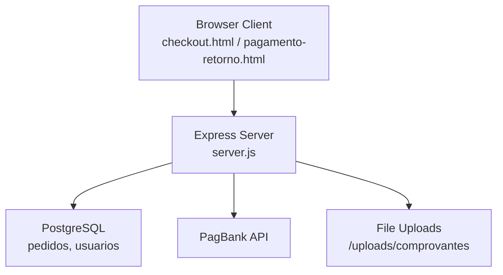
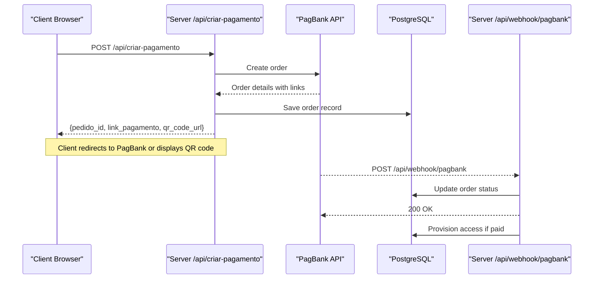
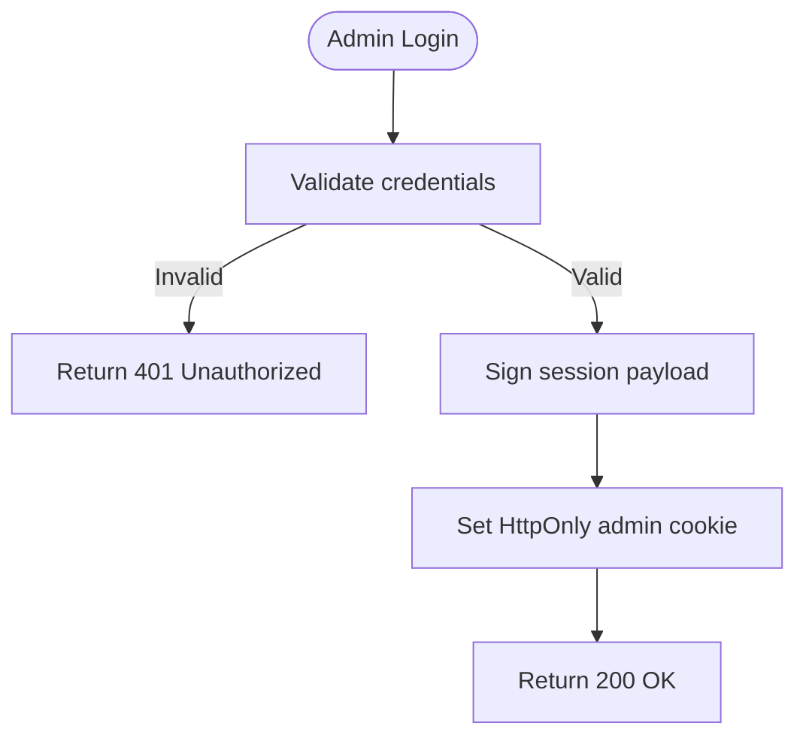
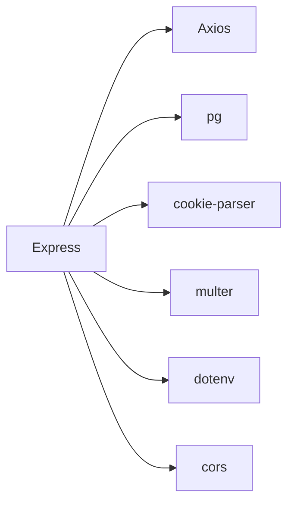
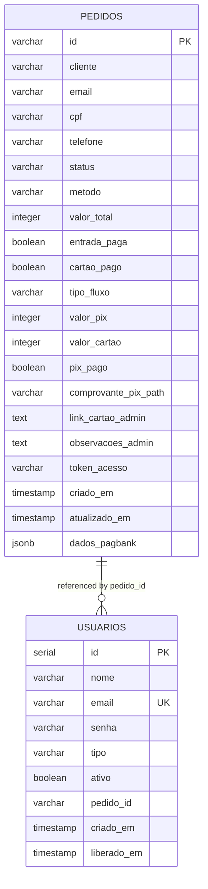

# Backend API Reference

<cite>
**Referenced Files in This Document**
- [server.js](file://server.js)
- [package.json](file://package.json)
- [database.sql](file://database.sql)
- [init-db.sql](file://init-db.sql)
- [checkout.html](file://checkout.html)
- [pagamento-retorno.html](file://pagamento-retorno.html)
- [PAGAMENTO-README.md](file://PAGAMENTO-README.md)
</cite>

## Table of Contents
1. [Introduction](#introduction)
2. [Project Structure](#project-structure)
3. [Core Components](#core-components)
4. [Architecture Overview](#architecture-overview)
5. [Detailed Component Analysis](#detailed-component-analysis)
6. [Dependency Analysis](#dependency-analysis)
7. [Performance Considerations](#performance-considerations)
8. [Troubleshooting Guide](#troubleshooting-guide)
9. [Conclusion](#conclusion)
10. [Appendices](#appendices)

## Introduction
This document provides comprehensive API documentation for the backend payment system. It covers all HTTP endpoints, request/response schemas, authentication requirements, error handling, and integration patterns for frontend consumption. The system integrates with PagBank for payment processing and manages order lifecycle, including webhook notifications and access provisioning.

## Project Structure
The backend is implemented as a Node.js/Express server with PostgreSQL persistence. Key components:
- Express server with CORS, JSON parsing, cookies, and static file serving
- Payment orchestration via PagBank API
- Order lifecycle management with database persistence
- Admin panel with session-based authentication
- Frontend pages for checkout and payment status

**Diagram sources**
- [server.js:12-27](file://server.js#L12-L27)
- [database.sql:13-36](file://database.sql#L13-L36)

**Section sources**
- [server.js:12-27](file://server.js#L12-L27)
- [package.json:11-18](file://package.json#L11-L18)
- [database.sql:13-36](file://database.sql#L13-L36)

## Core Components
- Express server with middleware stack
- Payment creation endpoint for PagBank orders
- Webhook endpoint for PagBank notifications
- Order status and listing endpoints
- Admin authentication and order management
- Manual payment flow (PIX + Card) with upload support

**Section sources**
- [server.js:82-280](file://server.js#L82-L280)
- [server.js:285-378](file://server.js#L285-L378)
- [server.js:388-487](file://server.js#L388-L487)
- [server.js:539-671](file://server.js#L539-L671)
- [server.js:703-736](file://server.js#L703-L736)

## Architecture Overview
The system follows a request-response model with asynchronous payment processing. Payments are initiated via PagBank, with webhook callbacks updating order status and triggering access provisioning.

**Diagram sources**
- [server.js:82-280](file://server.js#L82-L280)
- [server.js:285-345](file://server.js#L285-L345)
- [database.sql:13-36](file://database.sql#L13-L36)

## Detailed Component Analysis

### Authentication and Security
- Admin authentication uses signed cookies with HMAC-SHA256 and expiration
- Session cookie is HttpOnly, SameSite lax, and Secure in production
- No global rate limiting is implemented in the current code

**Diagram sources**
- [server.js:713-730](file://server.js#L713-L730)
- [server.js:703-710](file://server.js#L703-L710)

**Section sources**
- [server.js:703-730](file://server.js#L703-L730)

### Payment Creation: POST /api/criar-pagamento
Creates a PagBank order and returns payment links or QR code.

- Request body parameters:
  - cliente: string, required
  - email: string, required
  - telefone: string, required (digits only)
  - cpf: string, required (digits only)
  - metodo: string, optional, one of avista, entrada, cartao
- Response fields:
  - sucesso: boolean
  - pedido_id: string
  - metodo: string
  - valor_total: number (BRL)
  - link_pagamento: string|null
  - qr_code_url: string|null
  - pix_codigo: string|null

Error handling:
- 400 Bad Request: missing required fields
- 500 Internal Server Error: token missing, external service errors, database errors

Example request (paths only):
- [POST /api/criar-pagamento:82-280](file://server.js#L82-L280)

Example response (paths only):
- [Response shape:227-235](file://server.js#L227-L235)

Frontend integration (paths only):
- [Checkout page calling this endpoint:497-535](file://checkout.html#L497-L535)

**Section sources**
- [server.js:82-280](file://server.js#L82-L280)
- [checkout.html:497-535](file://checkout.html#L497-L535)

### Payment Status: GET /api/pedido/:id
Retrieves order details by PagBank order ID.

- Path parameter:
  - id: string, PagBank order ID
- Response fields:
  - id: string
  - status: string
  - metodo: string
  - cliente: string
  - email: string
  - valor_total: integer (cents)
  - valor_pix: integer (cents)
  - valor_restante: integer (cents)
  - entrada_paga: boolean
  - cartao_pago: boolean
  - criado_em: timestamp

Error handling:
- 404 Not Found: order not found

Frontend integration (paths only):
- [Checkout polling:544-581](file://checkout.html#L544-L581)
- [Payment return page polling:121-152](file://pagamento-retorno.html#L121-L152)

**Section sources**
- [server.js:350-370](file://server.js#L350-L370)
- [checkout.html:544-581](file://checkout.html#L544-L581)
- [pagamento-retorno.html:121-152](file://pagamento-retorno.html#L121-L152)

### Order Listing: GET /api/pedidos
Lists all orders from the database.

- Response: array of order objects with fields:
  - id, cliente, email, cpf, telefone, status, metodo, valor_total, entrada_paga, cartao_pago, criado_em, atualizado_em

**Section sources**
- [server.js:375-378](file://server.js#L375-L378)

### Webhook: POST /api/webhook/pagbank
Handles PagBank notifications to update order status and provision access.

- Request body: PagBank webhook payload (id, status, reference_id)
- Behavior:
  - Updates order status based on payment method
  - For avista: marks paid immediately
  - For parcelado: transitions through ENTRADA_PAID to PAID
  - Provisions client access upon full payment

Error handling:
- 500 Internal Server Error on failures

**Section sources**
- [server.js:285-345](file://server.js#L285-L345)

### Manual Payment Flow
Supports manual PIX + Card payments with admin-managed card link.

Endpoints:
- POST /api/manual/criar-pedido
- POST /api/manual/upload-comprovante/:token
- GET /api/manual/pedido/:token

Key behaviors:
- Validates total equals R$ 6.000.00 (600000 cents)
- Generates unique token for client access
- Uploads PIX proof of payment
- Sanitizes sensitive data in public responses

**Section sources**
- [server.js:539-671](file://server.js#L539-L671)

### Admin Panel
- POST /api/admin/login: creates admin session cookie
- POST /api/admin/logout: clears admin cookie
- GET /api/admin/pedidos: lists orders with optional status filter
- POST /api/admin/pedido/:id/confirmar-pix: confirms PIX payment for manual orders

**Section sources**
- [server.js:713-736](file://server.js#L713-L736)
- [server.js:739-778](file://server.js#L739-L778)
- [server.js:780-799](file://server.js#L780-L799)

## Dependency Analysis
External dependencies and integrations:
- Express for HTTP routing
- Axios for PagBank API calls
- pg for PostgreSQL connectivity
- cookie-parser for session cookies
- multer for file uploads
- dotenv for environment variables

**Diagram sources**
- [package.json:11-18](file://package.json#L11-L18)

**Section sources**
- [package.json:11-18](file://package.json#L11-L18)

## Performance Considerations
- Database queries use prepared statements and indexing on email/status/token
- Webhook processing updates orders asynchronously
- No built-in rate limiting; consider adding middleware for production deployments
- File uploads limited to 5MB with MIME type validation

**Section sources**
- [database.sql:39-43](file://database.sql#L39-L43)
- [server.js:37-45](file://server.js#L37-L45)

## Troubleshooting Guide
Common issues and resolutions:
- PagBank token not configured: returns 500 with token error message
- Invalid or expired PagBank token: returns 401 error
- Missing required fields in payment creation: returns 400 with field presence info
- Database connection errors: surfaced as 500 with debug info
- Webhook failures: server logs error and responds 500

Debugging tips:
- Enable logging in development mode
- Verify webhook URL in PagBank dashboard
- Check database connectivity and table existence
- Validate environment variables (PAGBANK_TOKEN, DATABASE_URL)

**Section sources**
- [server.js:239-279](file://server.js#L239-L279)
- [server.js:285-345](file://server.js#L285-L345)
- [PAGAMENTO-README.md:89-97](file://PAGAMENTO-README.md#L89-L97)

## Conclusion
The backend provides a robust payment processing pipeline integrated with PagBank, supporting both immediate and staged payment flows. It includes comprehensive order management, admin controls, and frontend integration points. For production, consider adding rate limiting, input sanitization, and monitoring.

## Appendices

### Database Schema
Order table structure and indices for efficient queries.

**Diagram sources**
- [database.sql:13-58](file://database.sql#L13-L58)

**Section sources**
- [database.sql:13-58](file://database.sql#L13-L58)

### API Reference Summary
- POST /api/criar-pagamento: Create PagBank order
- POST /api/webhook/pagbank: Receive PagBank notifications
- GET /api/pedido/:id: Check order status
- GET /api/pedidos: List all orders
- POST /api/manual/criar-pedido: Manual PIX + Card flow
- POST /api/manual/upload-comprovante/:token: Upload PIX proof
- GET /api/manual/pedido/:token: Public order details
- POST /api/admin/login: Admin login
- POST /api/admin/logout: Admin logout
- GET /api/admin/pedidos: Admin order listing
- POST /api/admin/pedido/:id/confirmar-pix: Confirm PIX for manual orders

**Section sources**
- [server.js:82-280](file://server.js#L82-L280)
- [server.js:285-378](file://server.js#L285-L378)
- [server.js:539-671](file://server.js#L539-L671)
- [server.js:703-799](file://server.js#L703-L799)