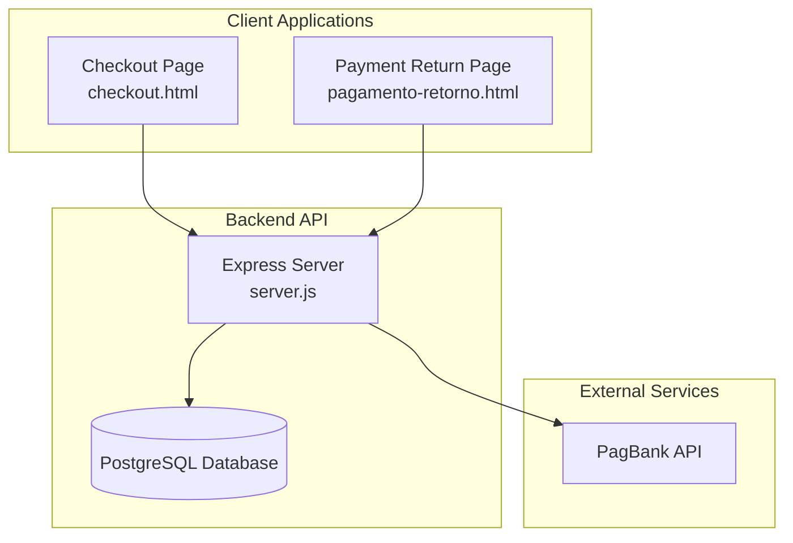
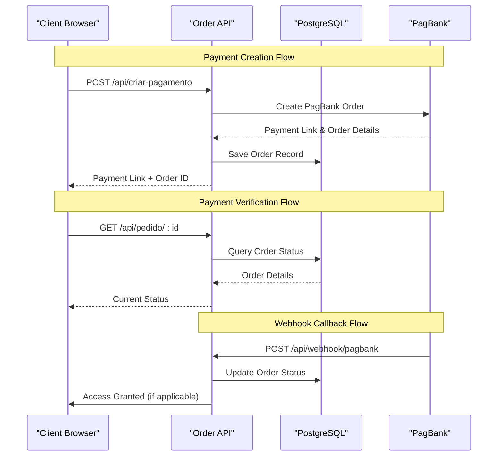
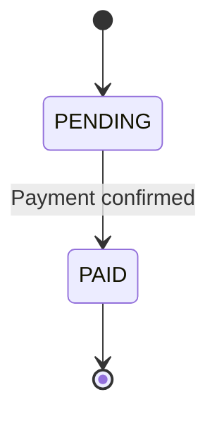
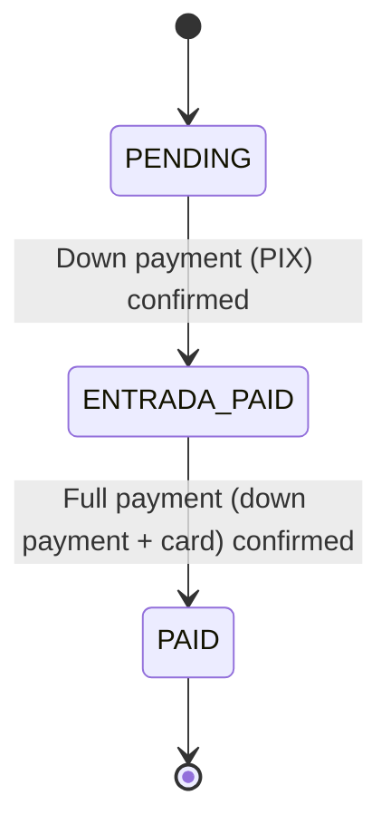
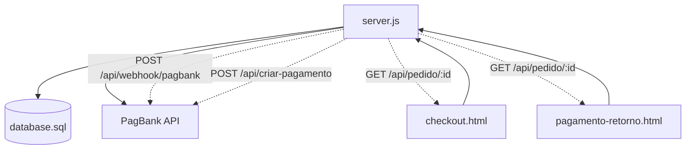

# Order Management Endpoints

<cite>
**Referenced Files in This Document**
- [server.js](file://server.js)
- [database.sql](file://database.sql)
- [checkout.html](file://checkout.html)
- [pagamento-retorno.html](file://pagamento-retorno.html)
- [PAGAMENTO-README.md](file://PAGAMENTO-README.md)
</cite>

## Table of Contents
1. [Introduction](#introduction)
2. [Project Structure](#project-structure)
3. [Core Components](#core-components)
4. [Architecture Overview](#architecture-overview)
5. [Detailed Component Analysis](#detailed-component-analysis)
6. [Dependency Analysis](#dependency-analysis)
7. [Performance Considerations](#performance-considerations)
8. [Troubleshooting Guide](#troubleshooting-guide)
9. [Conclusion](#conclusion)

## Introduction
This document provides comprehensive API documentation for order management endpoints in the qretiquetas.com system. It covers:
- GET /api/pedido/:id for individual order status checking
- GET /api/pedidos for admin access to list all orders
- Request parameters, response schemas, and error handling
- Order status lifecycle (PENDING, PAID, ENTRADA_PAID)
- Payment webhook updates and authentication requirements for admin endpoints

## Project Structure
The order management system consists of:
- Express.js backend with PostgreSQL persistence
- Client-side checkout and payment return pages
- Payment webhook integration with PagBank
- Administrative endpoints for order management



**Diagram sources**
- [server.js:12-80](file://server.js#L12-L80)
- [checkout.html:1-50](file://checkout.html#L1-L50)
- [pagamento-retorno.html:1-50](file://pagamento-retorno.html#L1-L50)

**Section sources**
- [server.js:12-80](file://server.js#L12-L80)
- [PAGAMENTO-README.md:79-87](file://PAGAMENTO-README.md#L79-L87)

## Core Components
The order management system comprises:
- Order creation and payment initiation
- Real-time order status monitoring
- Payment webhook processing
- Administrative order listing and filtering
- Database schema supporting multiple payment flows

Key implementation patterns:
- RESTful API design with clear HTTP status codes
- Asynchronous payment processing with webhook callbacks
- Client-side polling for payment completion verification
- Administrative authentication via signed cookies

**Section sources**
- [server.js:82-280](file://server.js#L82-L280)
- [server.js:347-378](file://server.js#L347-L378)
- [server.js:738-778](file://server.js#L738-L778)
- [database.sql:13-36](file://database.sql#L13-L36)

## Architecture Overview
The order management architecture follows a client-server model with external payment processing:



**Diagram sources**
- [server.js:82-280](file://server.js#L82-L280)
- [server.js:347-378](file://server.js#L347-L378)
- [server.js:285-345](file://server.js#L285-L345)

## Detailed Component Analysis

### Individual Order Status Endpoint
GET /api/pedido/:id retrieves order details for status checking.

#### Request Parameters
- Path Parameter: id (string) - Unique order identifier from PagBank

#### Response Schema
The endpoint returns a structured order object containing:
- id: Order identifier
- status: Current order status (PENDING, PAID, ENTRADA_PAID)
- metodo: Payment method (avista, entrada, cartao)
- cliente: Customer name
- email: Customer email
- valor_total: Total amount in cents
- valor_pix: PIX payment amount in cents
- valor_restante: Remaining amount in cents
- entrada_paga: Boolean indicating if down payment was paid
- cartao_pago: Boolean indicating if card payment was processed
- criado_em: Creation timestamp

#### Error Handling
- 404 Not Found: When order ID does not exist in database
- 500 Internal Server Error: Database or system errors

#### Request/Response Examples

Example Request:
```
GET /api/pedido/PEDIDO-123456789
```

Example Response (Successful):
```json
{
  "id": "PEDIDO-123456789",
  "status": "PAID",
  "metodo": "avista",
  "cliente": "João Silva",
  "email": "joao@example.com",
  "valor_total": 540000,
  "valor_pix": 540000,
  "valor_restante": 0,
  "entrada_paga": true,
  "cartao_pago": true,
  "criado_em": "2024-01-15T10:30:00Z"
}
```

Example Response (Not Found):
```json
{
  "erro": "Pedido não encontrado"
}
```

**Section sources**
- [server.js:347-370](file://server.js#L347-L370)
- [database.sql:13-36](file://database.sql#L13-L36)

### Admin Order Listing Endpoint
GET /api/pedidos provides administrative access to list all orders with filtering capabilities.

#### Authentication Requirements
- Requires admin authentication via signed session cookie
- Session cookie name: qadmin_session
- Cookie validation uses HMAC signature verification
- Session expires after 12 hours

#### Request Parameters
- Query Parameter: status (string, optional) - Filter orders by status
  - Values: pending, paid, entrada_paid, or "todos" (default)
  - "todos" returns all orders regardless of status

#### Response Schema
Returns an array of order objects with:
- id: Order identifier
- cliente: Customer name
- email: Customer email
- cpf: Customer CPF (masked for privacy)
- telefone: Customer phone number
- status: Current order status
- tipo_fluxo: Payment flow type (pagbank, manual)
- metodo: Payment method
- valor_total: Total amount in cents
- valor_pix: PIX payment amount in cents
- valor_cartao: Card payment amount in cents
- pix_pago: Boolean indicating PIX payment status
- cartao_pago: Boolean indicating card payment status
- comprovante_url: Upload path for PIX receipt
- link_cartao: Admin-generated card payment link
- observacoes: Admin notes
- token_acesso: Client access token
- criado_em: Creation timestamp
- atualizado_em: Last update timestamp

#### Pagination and Sorting
- Results are sorted by creation date (newest first)
- Maximum 500 records returned per request
- No explicit pagination parameters provided

#### Request/Response Examples

Example Request:
```
GET /api/pedidos?status=paid
Authorization: Bearer <admin-session-cookie>
```

Example Response:
```json
[
  {
    "id": "PEDIDO-123456789",
    "cliente": "Maria Oliveira",
    "email": "maria@example.com",
    "cpf": "123.***.***-**",
    "telefone": "11987654321",
    "status": "PAID",
    "tipo_fluxo": "pagbank",
    "metodo": "avista",
    "valor_total": 540000,
    "valor_pix": 540000,
    "valor_cartao": 0,
    "pix_pago": true,
    "cartao_pago": true,
    "comprovante_url": null,
    "link_cartao": null,
    "observacoes": null,
    "token_acesso": "abc123def456",
    "criado_em": "2024-01-15T10:30:00Z",
    "atualizado_em": "2024-01-15T11:15:00Z"
  }
]
```

**Section sources**
- [server.js:375-378](file://server.js#L375-L378)
- [server.js:738-778](file://server.js#L738-L778)
- [server.js:703-710](file://server.js#L703-L710)

### Order Status Lifecycle
The system supports two primary payment flows with distinct status lifecycles:

#### À Vista (Avista) Payment Flow


#### Parcelado (Installment) Payment Flow


#### Status Definitions
- PENDING: Initial state awaiting payment confirmation
- ENTRADA_PAID: Down payment (PIX) confirmed, awaiting card payment
- PAID: Complete payment processed, access granted

#### Payment Webhook Processing
The webhook endpoint (/api/webhook/pagbank) handles PagBank notifications:
- Updates order status based on payment method
- For avista: immediately grants access upon PAID
- For parcelado: transitions through ENTRADA_PAID then PAID
- Triggers client access granting when appropriate

**Section sources**
- [server.js:285-345](file://server.js#L285-L345)
- [checkout.html:727-764](file://checkout.html#L727-L764)
- [database.sql:19](file://database.sql#L19)

### Client-Side Integration
The checkout and payment return pages integrate with the order management API:

#### Checkout Flow
- Client selects payment method (à vista, entrada, cartão, manual)
- System calls /api/criar-pagamento
- Redirects to PagBank payment interface
- Polls /api/pedido/:id every 5 seconds for status updates

#### Payment Return Flow
- Payment return page queries /api/pedido/:id
- Displays appropriate status message based on order state
- Provides navigation links for successful payments

**Section sources**
- [checkout.html:626-718](file://checkout.html#L626-L718)
- [pagamento-retorno.html:121-152](file://pagamento-retorno.html#L121-L152)

## Dependency Analysis



**Diagram sources**
- [server.js:82-280](file://server.js#L82-L280)
- [server.js:347-378](file://server.js#L347-L378)
- [server.js:285-345](file://server.js#L285-L345)

### External Dependencies
- Express.js for HTTP server framework
- PostgreSQL for persistent data storage
- Axios for HTTP communication with PagBank
- Multer for file uploads (PIX receipts)
- Crypto for session signing and validation

### Internal Dependencies
- Database connection pooling for concurrent requests
- Session middleware for admin authentication
- File system operations for uploaded receipts
- Environment variable configuration for external services

**Section sources**
- [server.js:1-10](file://server.js#L1-L10)
- [server.js:64-67](file://server.js#L64-L67)

## Performance Considerations
- Database queries use indexed columns (email, status) for efficient filtering
- Webhook processing is asynchronous to prevent blocking payment flows
- Client-side polling intervals (5 seconds) balance responsiveness with server load
- File upload size limits (5MB) prevent resource exhaustion
- Session cookie expiration prevents long-lived unauthorized access

## Troubleshooting Guide

### Common Issues and Solutions

#### Order Not Found (404)
**Symptoms**: GET /api/pedido/:id returns error
**Causes**: Invalid order ID, order expired, database corruption
**Solutions**: Verify order ID format, check database connectivity, review webhook processing logs

#### Payment Status Stuck in PENDING
**Symptoms**: Order remains PENDING despite customer payment
**Causes**: Webhook not received, PagBank service issues, network connectivity problems
**Solutions**: Check webhook URL configuration, verify PagBank credentials, monitor server logs for webhook errors

#### Admin Authentication Failure (401)
**Symptoms**: /api/pedidos returns unauthorized error
**Causes**: Invalid or expired admin session cookie
**Solutions**: Re-authenticate via /api/admin/login, verify cookie settings, check server-side session validation

#### Database Connection Errors
**Symptoms**: 500 errors on order operations
**Causes**: PostgreSQL unreachable, invalid credentials, table schema mismatch
**Solutions**: Verify DATABASE_URL configuration, check PostgreSQL service status, run database.sql migration

**Section sources**
- [server.js:353-355](file://server.js#L353-L355)
- [server.js:703-710](file://server.js#L703-L710)
- [server.js:69-77](file://server.js#L69-L77)

## Conclusion
The order management system provides a robust, scalable solution for handling multiple payment flows with clear status tracking and administrative oversight. The RESTful API design, combined with webhook-driven updates and comprehensive client-side integration, ensures reliable payment processing and user experience. The administrative endpoints offer essential filtering and monitoring capabilities while maintaining security through session-based authentication.

Key strengths include:
- Clear separation between client and admin APIs
- Comprehensive status tracking across payment methods
- Secure administrative access with session management
- Scalable database schema supporting future enhancements
- Client-side polling for reliable payment verification

Future enhancements could include:
- Pagination parameters for large order lists
- Advanced filtering options (date ranges, customer criteria)
- Enhanced error reporting and logging
- Webhook retry mechanisms for failed notifications