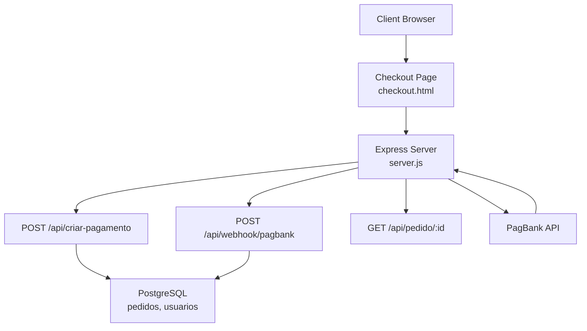
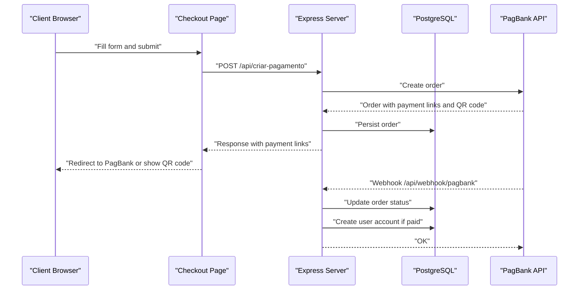
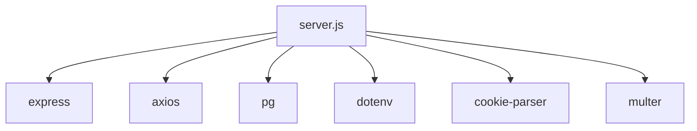

# Payment Endpoints

<cite>
**Referenced Files in This Document**
- [server.js](file://server.js)
- [checkout.html](file://checkout.html)
- [pagamento-retorno.html](file://pagamento-retorno.html)
- [PAGAMENTO-README.md](file://PAGAMENTO-README.md)
- [database.sql](file://database.sql)
- [package.json](file://package.json)
</cite>

## Table of Contents
1. [Introduction](#introduction)
2. [Project Structure](#project-structure)
3. [Core Components](#core-components)
4. [Architecture Overview](#architecture-overview)
5. [Detailed Component Analysis](#detailed-component-analysis)
6. [Dependency Analysis](#dependency-analysis)
7. [Performance Considerations](#performance-considerations)
8. [Troubleshooting Guide](#troubleshooting-guide)
9. [Conclusion](#conclusion)

## Introduction
This document provides comprehensive API documentation for payment-related endpoints, focusing on the payment order creation endpoint POST /api/criar-pagamento. It explains request parameters, response format, supported payment methods, integration with PagBank API, webhook configuration, payment status tracking, and automatic user account creation upon payment confirmation.

## Project Structure
The payment system consists of:
- An Express server exposing REST endpoints for payment creation, status checking, and webhook handling
- A PostgreSQL-backed persistence layer for orders and users
- Frontend pages for checkout and payment return flow
- Configuration for PagBank integration and environment variables

**Diagram sources**
- [server.js:82-280](file://server.js#L82-L280)
- [checkout.html:679-718](file://checkout.html#L679-L718)
- [pagamento-retorno.html:108-152](file://pagamento-retorno.html#L108-L152)

**Section sources**
- [server.js:12-27](file://server.js#L12-L27)
- [package.json:11-19](file://package.json#L11-L19)

## Core Components
- Payment creation endpoint: POST /api/criar-pagamento
- Webhook endpoint: POST /api/webhook/pagbank
- Order status endpoint: GET /api/pedido/:id
- Admin endpoints for order management (not covered in detail here)

Key responsibilities:
- Validate incoming payment requests and construct a standardized order payload
- Integrate with PagBank to create orders and receive payment links and QR code URLs
- Persist order state in PostgreSQL
- Update order status based on webhook events
- Automatically create user accounts upon payment confirmation

**Section sources**
- [server.js:82-280](file://server.js#L82-L280)
- [database.sql:13-36](file://database.sql#L13-L36)

## Architecture Overview
The payment flow integrates the frontend checkout with the backend server and PagBank, then updates internal state and optionally creates user accounts.

**Diagram sources**
- [server.js:82-280](file://server.js#L82-L280)
- [checkout.html:679-718](file://checkout.html#L679-L718)
- [pagamento-retorno.html:108-152](file://pagamento-retorno.html#L108-L152)

## Detailed Component Analysis

### POST /api/criar-pagamento
Purpose: Create a payment order and return payment links and QR code URLs.

- Method: POST
- Path: /api/criar-pagamento
- Content-Type: application/json

Request parameters
- cliente: string, required
- email: string, required
- telefone: string, required
- cpf: string, required
- metodo: string, optional, accepted values: "avista", "entrada", "cartão". Defaults to "avista".

Supported payment methods and values
- À vista (avista): total value 540000 cents (R$ 5.400,00)
- Entrada (entrada): total value 100000 cents (R$ 1.000,00)
- Cartão (cartão): total value 600000 cents (R$ 6.000,00)

Response format (on success)
- sucesso: boolean
- pedido_id: string
- metodo: string
- valor_total: number (converted from cents to BRL)
- link_pagamento: string|null (payment link)
- qr_code_url: string|null (QR code image URL)
- pix_codigo: string|null (PIX code text)

Error handling
- 400 Bad Request: Missing required fields
- 500 Internal Server Error: Token not configured, connection errors, invalid data, database errors
- Debug information included in response for diagnostics

Integration with PagBank
- Authorization header: Bearer <PAGBANK_TOKEN>
- Base URL: https://api.pagbank.com
- Endpoint: POST /orders
- Redirect URLs: success, failure, pending pointing to the payment return page
- Notification URL: /api/webhook/pagbank

Automatic user account creation
- Occurs when payment status transitions to paid (for à vista) or after both stages are paid (for entrada + cartão)
- Creates a user record with temporary password and marks as active

Example request
- POST /api/criar-pagamento
- Body:
  - cliente: "Maria Silva"
  - email: "maria@example.com"
  - telefone: "11987654321"
  - cpf: "12345678901"
  - metodo: "avista"

Example successful response
- {
  "sucesso": true,
  "pedido_id": "ORDER-123456789",
  "metodo": "avista",
  "valor_total": 5400.00,
  "link_pagamento": "https://example.com/pay",
  "qr_code_url": "https://example.com/qr.png",
  "pix_codigo": "123456789"
}

Example error response
- {
  "sucesso": false,
  "erro": "Token PagBank não configurado"
}

**Section sources**
- [server.js:82-280](file://server.js#L82-L280)
- [server.js:47-51](file://server.js#L47-L51)
- [checkout.html:679-718](file://checkout.html#L679-L718)
- [pagamento-retorno.html:108-152](file://pagamento-retorno.html#L108-L152)

### Webhook: POST /api/webhook/pagbank
Purpose: Receive payment confirmation events from PagBank and update order status.

Behavior
- Parses incoming event payload
- Loads order by order ID
- Updates status based on payment method:
  - À vista: set to PAID when status is PAID
  - Entrada + cartão: first stage sets ENTRADA_PAID; second stage sets PAID and creates user account
- On PAID status, automatically creates a user account for the customer

Response
- 200 OK on success

**Section sources**
- [server.js:285-345](file://server.js#L285-L345)
- [server.js:458-487](file://server.js#L458-L487)

### Order Status: GET /api/pedido/:id
Purpose: Retrieve current status and details of a payment order.

Response fields
- id, status, metodo, cliente, email, valor_total, valor_pix, valor_restante, entrada_paga, cartao_pago, criado_em

**Section sources**
- [server.js:350-370](file://server.js#L350-L370)

### Payment Methods Details
- À vista (avista): Single full payment via PIX
- Entrada (entrada): First stage partial payment via PIX; second stage full payment via card link (admin-managed)
- Cartão (cartão): Full payment via card link (admin-managed)

Values in cents
- À vista: 540000
- Entrada: 100000
- Cartão: 600000

**Section sources**
- [server.js:98-113](file://server.js#L98-L113)

### Frontend Integration Notes
- The checkout page submits payment details to /api/criar-pagamento
- If a payment link is returned, the browser is redirected to PagBank
- If QR code is returned, the page displays QR code and starts polling order status
- The payment return page checks order status and informs the user

**Section sources**
- [checkout.html:679-718](file://checkout.html#L679-L718)
- [checkout.html:727-764](file://checkout.html#L727-L764)
- [pagamento-retorno.html:108-152](file://pagamento-retorno.html#L108-L152)

## Dependency Analysis
External integrations and libraries
- Express: Web framework
- Axios: HTTP client to PagBank
- pg: PostgreSQL driver
- cookie-parser, cors, dotenv, multer: Supporting middleware and utilities

Environment configuration
- PAGBANK_TOKEN: PagBank API bearer token
- DATABASE_URL: PostgreSQL connection string
- ADMIN_*: Admin credentials and session secret
- PIX_*: Manual PIX configuration (when applicable)

**Diagram sources**
- [package.json:11-19](file://package.json#L11-L19)
- [server.js:1-10](file://server.js#L1-L10)

**Section sources**
- [server.js:47-61](file://server.js#L47-L61)
- [package.json:11-19](file://package.json#L11-L19)

## Performance Considerations
- Minimize synchronous operations in request handlers
- Use connection pooling for PostgreSQL
- Cache frequently accessed configuration values
- Keep webhook handlers lightweight and delegate heavy work to background tasks if needed

## Troubleshooting Guide
Common issues and resolutions
- Missing required fields: Ensure cliente, email, telefone, and cpf are provided
- Token not configured: Set PAGBANK_TOKEN in environment variables
- Connection refused to PagBank: Verify network connectivity and token validity
- Invalid data sent to PagBank: Validate request body against documented schema
- Database errors: Check PostgreSQL connectivity and table permissions

Debugging tips
- Inspect server logs for detailed error messages
- Use GET /api/pedido/:id to monitor order status
- Verify webhook URL configuration in PagBank dashboard

**Section sources**
- [server.js:239-279](file://server.js#L239-L279)
- [PAGAMENTO-README.md:88-98](file://PAGAMENTO-README.md#L88-L98)

## Conclusion
The payment system provides a robust integration with PagBank for creating payment orders, handling redirects and QR codes, and updating order statuses via webhooks. It supports multiple payment methods and automatically creates user accounts upon payment confirmation. Proper configuration of environment variables and webhook endpoints is essential for reliable operation.