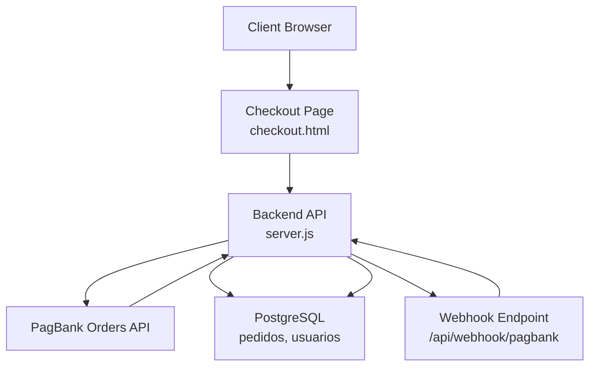
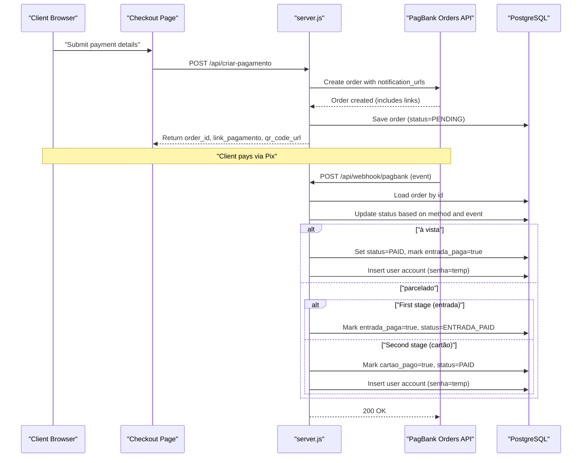
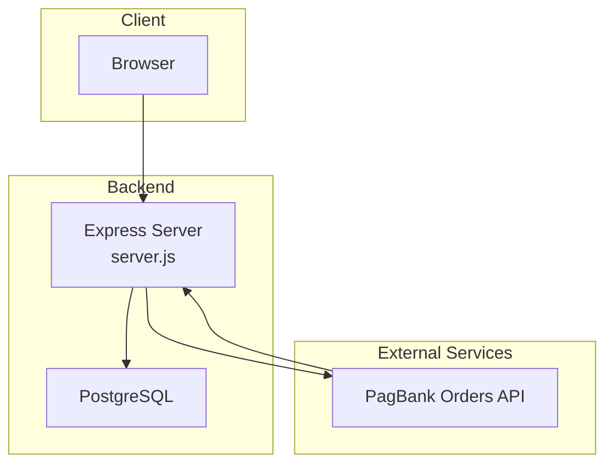
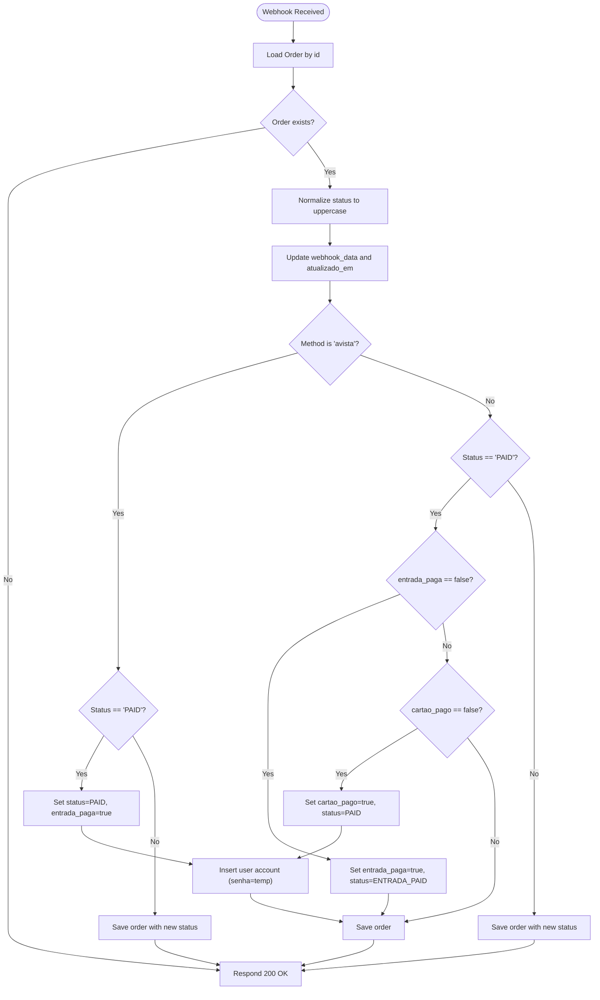
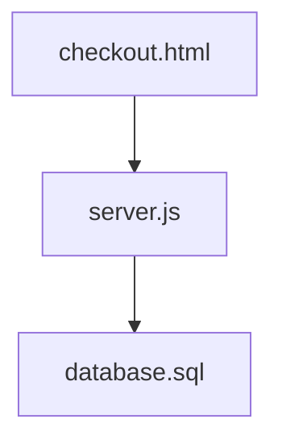

# Webhook Integration

<cite>
**Referenced Files in This Document**
- [server.js](file://server.js)
- [checkout.html](file://checkout.html)
- [database.sql](file://database.sql)
- [init-db.sql](file://init-db.sql)
- [PAGAMENTO-README.md](file://PAGAMENTO-README.md)
- [README.md](file://README.md)
- [index.html](file://index.html)
- [admin.html](file://admin.html)
- [admin-login.html](file://admin-login.html)
- [pedido-status.html](file://pedido-status.html)
- [pagamento-retorno.html](file://pagamento-retorno.html)
- [cadastro.html](file://cadastro.html)
- [checkout.html](file://checkout.html)
</cite>

## Table of Contents
1. [Introduction](#introduction)
2. [Project Structure](#project-structure)
3. [Core Components](#core-components)
4. [Architecture Overview](#architecture-overview)
5. [Detailed Component Analysis](#detailed-component-analysis)
6. [Dependency Analysis](#dependency-analysis)
7. [Performance Considerations](#performance-considerations)
8. [Troubleshooting Guide](#troubleshooting-guide)
9. [Conclusion](#conclusion)
10. [Appendices](#appendices)

## Introduction
This document explains the PagBank webhook integration for the "Sistema Alimentares" payment system. It covers the POST /api/webhook/pagbank endpoint, webhook payload structure, event processing logic, and status update mechanisms. It also documents payment status handling for different payment methods (à vista vs parcelado), the automatic user account creation triggered by successful payments, password generation, and database insertion. Additionally, it provides webhook testing strategies, debugging techniques, security considerations, signature verification, and retry mechanisms.

## Project Structure
The payment system consists of:
- A Node.js/Express backend that integrates with PagBank via REST APIs and handles webhooks.
- A checkout frontend that initiates payments and displays QR/Pix payment details.
- A PostgreSQL database storing orders and user accounts.
- Static HTML pages for checkout, payment return, and admin panels.

**Diagram sources**
- [server.js](file://server.js)
- [checkout.html](file://checkout.html)
- [database.sql](file://database.sql)

**Section sources**
- [server.js](file://server.js)
- [checkout.html](file://checkout.html)
- [database.sql](file://database.sql)

## Core Components
- Payment creation endpoint: POST /api/criar-pagamento
- Webhook endpoint: POST /api/webhook/pagbank
- Order status endpoint: GET /api/pedido/:id
- Admin endpoints: GET /api/pedidos, admin login/logout, admin panel pages
- Database schema: pedidos and usuarios tables

Key responsibilities:
- Create PagBank orders with notification URLs pointing to the webhook.
- Receive and process webhook events to update order status.
- Automatically create user accounts upon successful payment.
- Provide order status polling for fallback verification.

**Section sources**
- [server.js](file://server.js)
- [database.sql](file://database.sql)

## Architecture Overview
The webhook-driven payment flow:
1. Client submits payment details on checkout.html.
2. Backend creates a PagBank order and sets notification_urls to /api/webhook/pagbank.
3. Client pays via Pix; PagBank sends a webhook to /api/webhook/pagbank.
4. Backend updates order status and, for paid orders, creates a user account.
5. Client can poll /api/pedido/:id for status updates.

**Diagram sources**
- [server.js](file://server.js)
- [checkout.html](file://checkout.html)

## Detailed Component Analysis

### Webhook Endpoint: POST /api/webhook/pagbank
Purpose:
- Receive payment events from PagBank.
- Update order status in the database.
- Trigger automatic user account creation for paid orders.

Processing logic:
- Extract id, status, reference_id from the webhook body.
- Load order by id from the database.
- Normalize status to uppercase.
- Update webhook_data and atualizado_em.
- Apply method-specific status transitions:
  - À vista: set status=PAID and entrada_paga=true when status becomes PAID; then create user account.
  - Parcelado: handle two stages:
    - First stage: entrada_paga=true, status=ENTRADA_PAID when status becomes PAID and entrada_paga=false.
    - Second stage: cartao_pago=true, status=PAID when status becomes PAID and cartao_pago=false; then create user account.
- Save updated order to the database.
- Respond with HTTP 200 OK.

Response requirements:
- Always respond with 200 OK after processing.
- Do not send large payloads; keep response minimal.

Security considerations:
- The current implementation does not verify the webhook signature.
- Configure HTTPS and enforce signature verification in production.

Testing:
- Use ngrok to expose the webhook endpoint during development.
- Send test events from PagBank dashboard or logs.

**Section sources**
- [server.js](file://server.js)
- [PAGAMENTO-README.md](file://PAGAMENTO-README.md)

### Payment Creation: POST /api/criar-pagamento
Purpose:
- Build and submit a PagBank order with payment details.
- Configure notification_urls to point to /api/webhook/pagbank.
- Persist order in the database with status=PENDING.

Payload structure:
- Required fields: cliente, email, telefone, cpf.
- Optional field: metodo (avista, entrada, cartao).
- The endpoint selects valor_total and description based on metodo.

Response structure:
- sucesso: boolean
- pedido_id: string
- metodo: string
- valor_total: number
- link_pagamento: string|null
- qr_code_url: string|null
- pix_codigo: string|null

Error handling:
- Validates presence of required fields.
- Returns 400 for missing data.
- Returns 500 for external service errors (e.g., invalid token, connection refused).

**Section sources**
- [server.js](file://server.js)

### Order Status Endpoint: GET /api/pedido/:id
Purpose:
- Allow clients to poll for order status updates.

Response fields:
- id, status, metodo, cliente, email, valor_total, valor_pix, valor_restante, entrada_paga, cartao_pago, criado_em.

**Section sources**
- [server.js](file://server.js)

### Automatic User Account Creation
Trigger:
- When an order reaches PAID status (à vista) or second stage (parcelado), a user account is inserted into the usuarios table.

Behavior:
- Generates a random temporary password.
- Sets ativo=true and registers liberado_em.
- Uses pedido_id to link the user to the order.

Database insertion:
- Inserts into usuarios with nome, email, senha, tipo='cliente', ativo=true, pedido_id, liberado_em.

**Section sources**
- [server.js](file://server.js)
- [database.sql](file://database.sql)

### Payment Methods and Status Handling

#### À Vista (à vista)
- Single payment via Pix.
- On receiving status=PAID, immediately set order status=PAID and entrada_paga=true.
- Create user account automatically.

#### Parcelado (entrada + cartão)
- Two-stage process:
  - Stage 1: Entrada paga → status=ENTRADA_PAID, entrada_paga=true.
  - Stage 2: Cartão paga → status=PAID, cartao_pago=true.
- User account is created only after the second stage completes.

Frontend polling:
- The checkout page polls /api/pedido/:id every 5 seconds.
- For à vista, success is shown when status=PAID.
- For parcelado, a dedicated step appears after stage 1 and final success after stage 2.

**Section sources**
- [server.js](file://server.js)
- [checkout.html](file://checkout.html)

### Database Schema
Tables:
- pedidos: stores order metadata, payment amounts, flags (entrada_paga, cartao_pago), timestamps, and PagBank data.
- usuarios: stores user credentials, type, activation flag, and linking to orders.

Indexes:
- Pedidos: email, status, unique token index.
- Usuarios: email, tipo, ativo.

**Section sources**
- [database.sql](file://database.sql)
- [init-db.sql](file://init-db.sql)

## Architecture Overview

**Diagram sources**
- [server.js](file://server.js)
- [database.sql](file://database.sql)

## Detailed Component Analysis

### Webhook Payload Structure
Expected fields:
- id: PagBank order identifier.
- status: Event status (e.g., PAID).
- reference_id: Reference identifier (optional).

Processing:
- The backend loads the order by id, normalizes status, and applies method-specific transitions.

**Section sources**
- [server.js](file://server.js)

### Webhook Verification and Security
Current state:
- No signature verification is implemented in the webhook handler.

Recommended improvements:
- Verify PagBank webhook signatures using the configured secret.
- Enforce HTTPS for the webhook endpoint.
- Implement idempotency checks to prevent duplicate processing.
- Add retry and dead-letter queue handling for transient failures.

Operational notes:
- Configure the webhook URL in PagBank to point to https://{your-domain}/api/webhook/pagbank.
- Use ngrok for local development with HTTPS tunneling.

**Section sources**
- [PAGAMENTO-README.md](file://PAGAMENTO-README.md)
- [server.js](file://server.js)

### Request Validation and Error Handling
Validation:
- Payment creation validates presence of cliente, email, telefone, cpf.
- Payment creation validates PAGBANK_TOKEN presence before calling PagBank.

Error handling:
- Returns structured error responses with relevant HTTP status codes.
- Logs detailed error information for debugging.

**Section sources**
- [server.js](file://server.js)

### Step-by-Step Payment Completion Workflow

**Diagram sources**
- [server.js](file://server.js)

## Dependency Analysis

**Diagram sources**
- [server.js](file://server.js)
- [checkout.html](file://checkout.html)
- [database.sql](file://database.sql)

**Section sources**
- [server.js](file://server.js)
- [checkout.html](file://checkout.html)
- [database.sql](file://database.sql)

## Performance Considerations
- Webhook handler performs a single database read and write per event; keep payloads minimal.
- Use asynchronous processing for heavy tasks (e.g., email notifications) outside the webhook path.
- Monitor database queries and add indexes if needed (already indexed by email/status).

## Troubleshooting Guide
Common issues and resolutions:
- Webhook not received:
  - Verify HTTPS configuration and webhook URL in PagBank.
  - Use ngrok for local testing and ensure the URL matches the configured webhook.
- Invalid token or connection errors:
  - Confirm PAGBANK_TOKEN is set and valid.
  - Check network connectivity and PagBank API availability.
- Order not updating:
  - Ensure the order id in the webhook matches an existing record.
  - Check method-specific transitions (à vista vs parcelado).
- User account not created:
  - Confirm the order reached PAID status.
  - Verify the usuarios table insert logic executed.

Debugging tips:
- Enable verbose logging in the webhook handler.
- Inspect database rows for pedidos and usuarios after events.
- Use GET /api/pedido/:id to verify status transitions.

**Section sources**
- [server.js](file://server.js)
- [PAGAMENTO-README.md](file://PAGAMENTO-README.md)

## Conclusion
The PagBank webhook integration provides a robust mechanism to process payments, update order statuses, and automatically create user accounts upon successful payment. While the current implementation focuses on functionality, production readiness requires adding signature verification, HTTPS enforcement, and improved error handling/retry logic.

## Appendices

### Webhook Testing Strategies
- Use ngrok to expose your local server securely.
- Configure the webhook URL in PagBank to the ngrok HTTPS URL.
- Simulate events from PagBank dashboard or logs.
- Validate order status updates via GET /api/pedido/:id.

**Section sources**
- [PAGAMENTO-README.md](file://PAGAMENTO-README.md)

### Security Best Practices
- Enforce HTTPS for all endpoints.
- Implement signature verification for incoming webhooks.
- Use strong secrets and rotate them periodically.
- Limit webhook retries and implement dead-letter queues.

**Section sources**
- [PAGAMENTO-README.md](file://PAGAMENTO-README.md)
- [server.js](file://server.js)