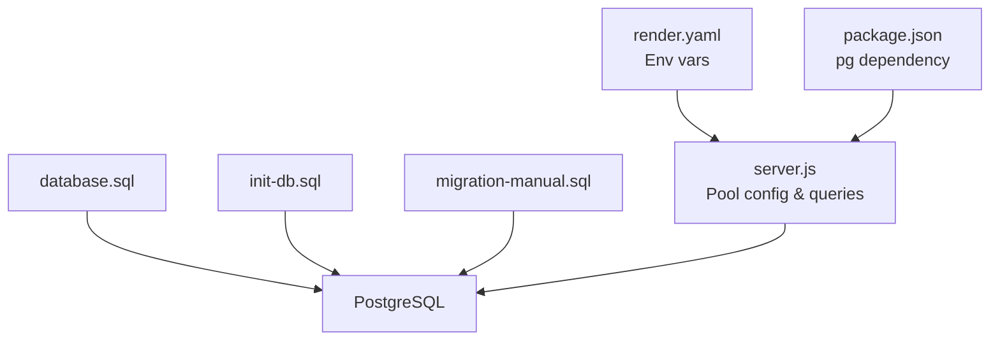
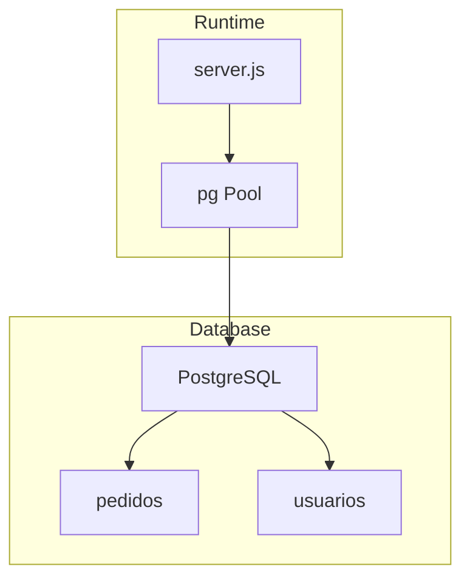
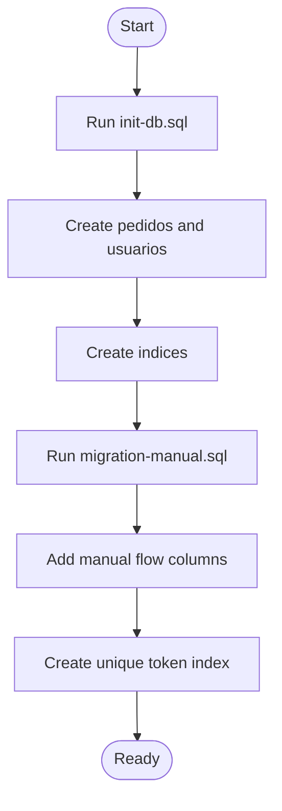
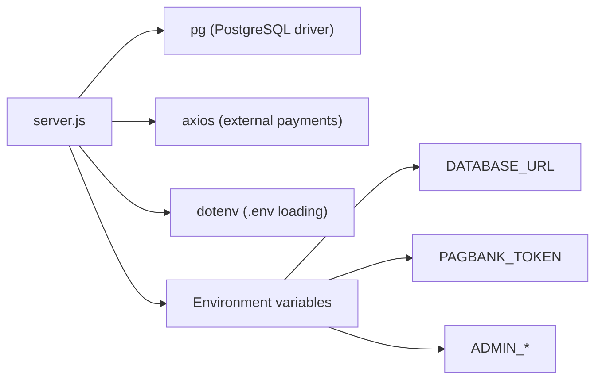

# Data Migration and Initialization

<cite>
**Referenced Files in This Document**
- [database.sql](file://database.sql)
- [init-db.sql](file://init-db.sql)
- [migration-manual.sql](file://migration-manual.sql)
- [server.js](file://server.js)
- [package.json](file://package.json)
- [render.yaml](file://render.yaml)
- [README.md](file://README.md)
</cite>

## Table of Contents
1. [Introduction](#introduction)
2. [Project Structure](#project-structure)
3. [Core Components](#core-components)
4. [Architecture Overview](#architecture-overview)
5. [Detailed Component Analysis](#detailed-component-analysis)
6. [Dependency Analysis](#dependency-analysis)
7. [Performance Considerations](#performance-considerations)
8. [Troubleshooting Guide](#troubleshooting-guide)
9. [Conclusion](#conclusion)
10. [Appendices](#appendices)

## Introduction
This document explains how to initialize and evolve the database for the project, covering schema creation, indexing, initial data, connection pooling, environment configuration, migration strategy, backup/restore, and disaster recovery. It also documents the initialization scripts and their execution order, and provides troubleshooting guidance for common setup and connectivity issues.

## Project Structure
The database-related assets and runtime configuration are organized as follows:
- Schema initialization scripts define tables and indices.
- A migration script adds manual payment flow support to existing deployments.
- Runtime configuration defines environment variables consumed by the backend.
- The backend uses a PostgreSQL connection pool to manage database connections.

**Diagram sources**
- [database.sql:1-92](file://database.sql#L1-L92)
- [init-db.sql:1-42](file://init-db.sql#L1-L42)
- [migration-manual.sql:1-39](file://migration-manual.sql#L1-L39)
- [server.js:63-77](file://server.js#L63-L77)
- [render.yaml:1-14](file://render.yaml#L1-L14)
- [package.json:11-18](file://package.json#L11-L18)

**Section sources**
- [database.sql:1-92](file://database.sql#L1-L92)
- [init-db.sql:1-42](file://init-db.sql#L1-L42)
- [migration-manual.sql:1-39](file://migration-manual.sql#L1-L39)
- [server.js:63-77](file://server.js#L63-L77)
- [render.yaml:1-14](file://render.yaml#L1-L14)
- [package.json:11-18](file://package.json#L11-L18)

## Core Components
- PostgreSQL schema definition with two primary tables and supporting indices.
- Manual payment flow migration to extend the orders table with new columns and indices.
- Backend connection pool configuration and test connection.
- Environment variables for database connectivity and third-party integrations.

Key elements:
- Tables: orders and users.
- Indices: on email, status, and unique token for orders; on user email, type, and active flag.
- Manual flow columns: type of flow, split amounts, payment flags, token, and admin fields.
- Connection pool: configured via DATABASE_URL or fallback to host/port/user/password/name.

**Section sources**
- [database.sql:10-92](file://database.sql#L10-L92)
- [migration-manual.sql:9-28](file://migration-manual.sql#L9-L28)
- [server.js:63-77](file://server.js#L63-L77)
- [package.json:11-18](file://package.json#L11-L18)

## Architecture Overview
The backend connects to PostgreSQL using a connection pool. On startup, it attempts a connection to validate configuration. Database operations are performed through prepared statements and upsert logic.

**Diagram sources**
- [server.js:63-77](file://server.js#L63-L77)
- [server.js:388-487](file://server.js#L388-L487)
- [database.sql:10-92](file://database.sql#L10-L92)

## Detailed Component Analysis

### Database Schema Initialization
- The schema creates two tables: orders and users.
- Orders table includes metadata, payment flags, timestamps, and JSONB for external payment data.
- Users table includes credentials, role, activation flag, and foreign key to orders.
- Indices are created for efficient lookups and uniqueness constraints.

Execution order:
1. Run the initialization script to create base tables and indices.
2. Apply the manual payment migration to add new columns and indices.

**Diagram sources**
- [init-db.sql:4-30](file://init-db.sql#L4-L30)
- [database.sql:10-92](file://database.sql#L10-L92)
- [migration-manual.sql:9-28](file://migration-manual.sql#L9-L28)

**Section sources**
- [init-db.sql:1-42](file://init-db.sql#L1-L42)
- [database.sql:10-92](file://database.sql#L10-L92)
- [migration-manual.sql:1-39](file://migration-manual.sql#L1-L39)

### Manual Payment Flow Migration
- Adds columns to support manual payment: split amounts, payment flags, token, admin fields, and unique token index.
- Designed to be idempotent and safe to re-run.

Migration steps:
- Add flow type column with default.
- Add PIX and card amount columns.
- Add payment flags and admin fields.
- Add unique token column and index.

**Section sources**
- [migration-manual.sql:9-28](file://migration-manual.sql#L9-L28)

### Connection Pooling and Environment Configuration
- The backend creates a PostgreSQL connection pool using DATABASE_URL or fallback parameters.
- On startup, it tests the connection and logs success or error.
- Environment variables include database URL, PagBank token, admin credentials, and optional Pix keys.

Environment variables:
- DATABASE_URL: primary connection string.
- DB_USER, DB_PASSWORD, DB_HOST, DB_PORT, DB_NAME: fallback parameters.
- PAGBANK_TOKEN: required for payment processing.
- ADMIN_*: admin credentials and secret.
- NODE_ENV: affects cookie security.

**Section sources**
- [server.js:63-77](file://server.js#L63-L77)
- [server.js:47-61](file://server.js#L47-L61)
- [render.yaml:7-13](file://render.yaml#L7-L13)
- [package.json:11-18](file://package.json#L11-L18)

### Data Access Patterns and Upserts
- Insert/upsert logic for orders and users ensures idempotent updates and avoids duplicates.
- Queries use parameterized statements and JSON serialization for payment data.

Key operations:
- Save order with upsert on id.
- Save user with upsert on email.
- Retrieve orders and users, list orders ordered by creation date.

**Section sources**
- [server.js:388-487](file://server.js#L388-L487)
- [server.js:452-456](file://server.js#L452-L456)
- [server.js:446-450](file://server.js#L446-L450)

### Backup and Restore Procedures
Recommended approach:
- Use logical backups with a PostgreSQL-compatible tool to export schema and data.
- Store backups securely and retain rotation policies.
- For restore, apply schema first, then data, ensuring indices are intact.

Note: The repository does not include explicit backup/restore scripts. The above outlines a standard procedure aligned with the schema and tables defined.

[No sources needed since this section provides general guidance]

### Disaster Recovery Planning
- Maintain offsite backups and test restoration regularly.
- Monitor database health and replication (if applicable).
- Keep environment variables and secrets management in sync with deployment targets.

[No sources needed since this section provides general guidance]

### Version Management for Schema Evolution
- Treat migrations as idempotent scripts applied in order.
- Document each migration’s purpose and dependencies.
- Use unique identifiers for migration runs and maintain a changelog.

[No sources needed since this section provides general guidance]

## Dependency Analysis
The backend depends on the PostgreSQL driver and consumes environment variables for connectivity and third-party integrations.

**Diagram sources**
- [server.js:1-10](file://server.js#L1-L10)
- [package.json:11-18](file://package.json#L11-L18)
- [render.yaml:7-13](file://render.yaml#L7-L13)

**Section sources**
- [server.js:1-10](file://server.js#L1-L10)
- [package.json:11-18](file://package.json#L11-L18)
- [render.yaml:7-13](file://render.yaml#L7-L13)

## Performance Considerations
- Use indices on frequently queried columns (email, status, token) to improve lookup performance.
- Prefer upsert logic to avoid duplicate inserts and reduce write conflicts.
- Keep JSONB payloads minimal to reduce storage and transfer overhead.

[No sources needed since this section provides general guidance]

## Troubleshooting Guide
Common issues and resolutions:
- Database connection errors:
  - Verify DATABASE_URL or fallback DB_* variables.
  - Ensure the database is reachable and credentials are correct.
  - Check network policies and firewall rules.
- Missing or incorrect environment variables:
  - Confirm PAGBANK_TOKEN, ADMIN_USUARIO, ADMIN_SENHA, ADMIN_SECRET are set.
  - For production, ensure NODE_ENV is set appropriately to enable secure cookies.
- Migration failures:
  - Re-run the manual migration script; it is designed to be idempotent.
  - Ensure the orders table exists before applying the migration.
- Permission errors:
  - Ensure the database user has privileges to create tables, indices, and modify schema.

**Section sources**
- [server.js:63-77](file://server.js#L63-L77)
- [server.js:47-61](file://server.js#L47-L61)
- [migration-manual.sql:5-6](file://migration-manual.sql#L5-L6)
- [render.yaml:7-13](file://render.yaml#L7-L13)

## Conclusion
The project’s database setup relies on straightforward SQL scripts for schema creation and a migration for manual payment support. The backend uses a PostgreSQL connection pool and environment-driven configuration. By following the documented initialization order, verifying environment variables, and applying migrations carefully, teams can reliably deploy and operate the system. Regular backups, monitoring, and disciplined migration practices will support long-term stability and disaster recovery readiness.

[No sources needed since this section summarizes without analyzing specific files]

## Appendices

### Execution Order Summary
- Initialize base schema: run the initialization script to create tables and indices.
- Apply manual flow migration: run the migration script to add new columns and indices.
- Start the backend: ensure environment variables are configured and the database is reachable.

**Section sources**
- [init-db.sql:1-42](file://init-db.sql#L1-L42)
- [migration-manual.sql:1-39](file://migration-manual.sql#L1-L39)
- [server.js:63-77](file://server.js#L63-L77)

### Environment Variables Reference
- DATABASE_URL: primary database connection string.
- DB_USER, DB_PASSWORD, DB_HOST, DB_PORT, DB_NAME: fallback connection parameters.
- PAGBANK_TOKEN: required for payment processing.
- ADMIN_USUARIO, ADMIN_SENHA, ADMIN_SECRET: admin authentication and session signing.
- NODE_ENV: affects cookie security and logging behavior.

**Section sources**
- [server.js:47-61](file://server.js#L47-L61)
- [render.yaml:7-13](file://render.yaml#L7-L13)