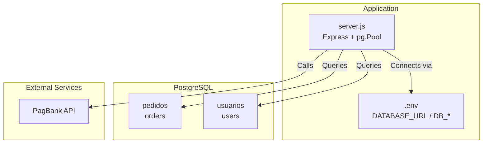
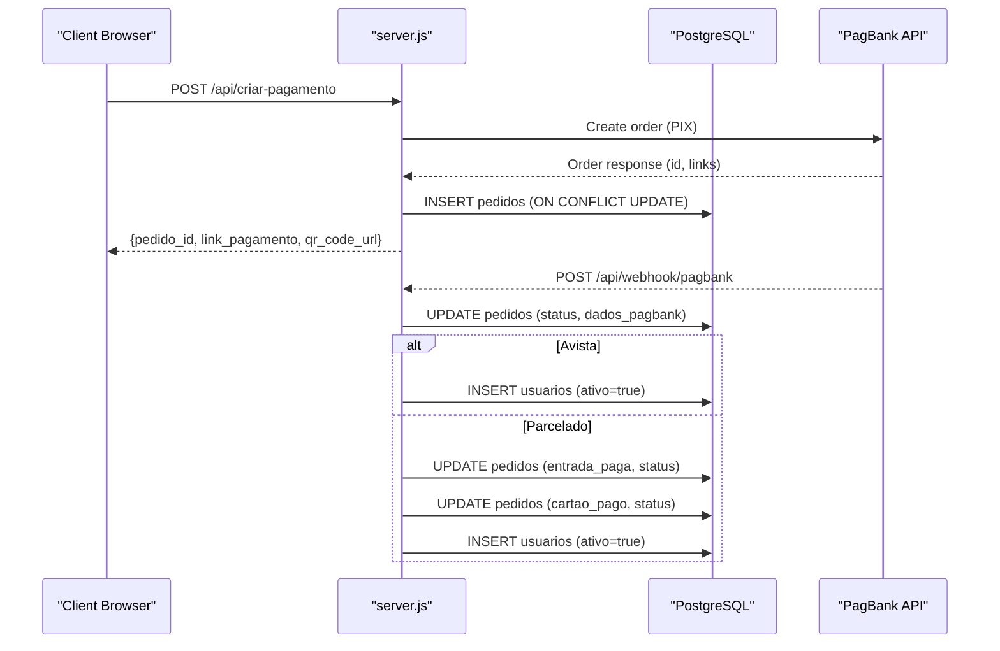
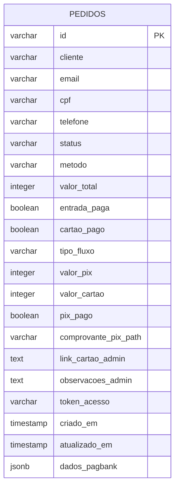
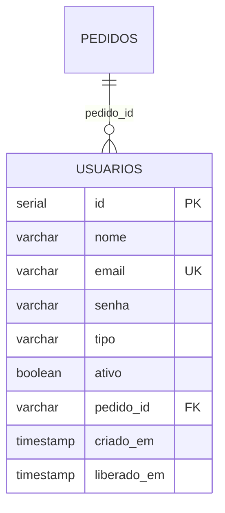
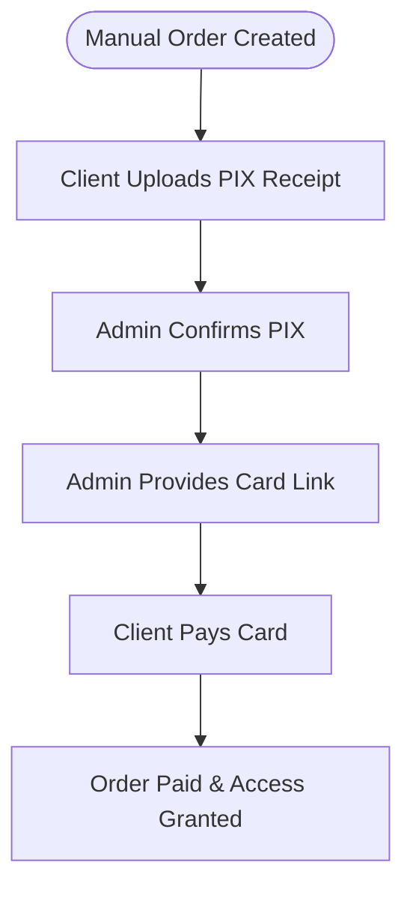
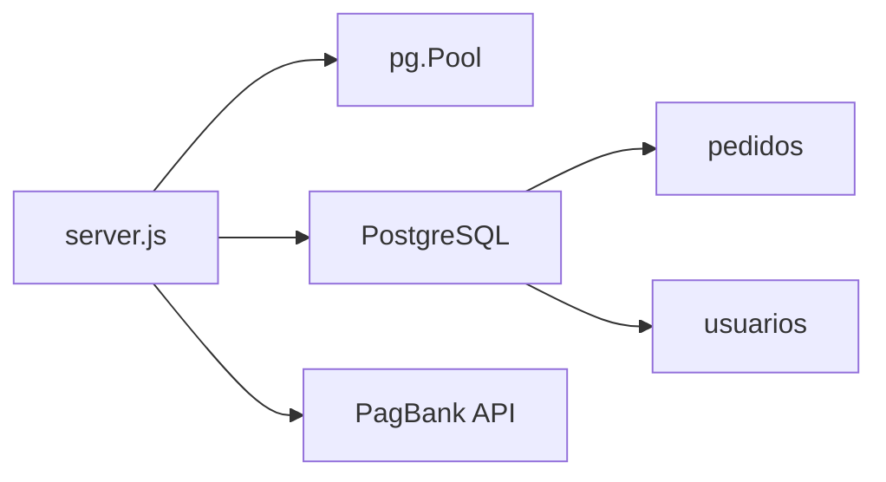

# Database Design

<cite>
**Referenced Files in This Document**
- [database.sql](file://database.sql)
- [init-db.sql](file://init-db.sql)
- [migration-manual.sql](file://migration-manual.sql)
- [server.js](file://server.js)
- [package.json](file://package.json)
- [README.md](file://README.md)
- [PAGAMENTO-README.md](file://PAGAMENTO-README.md)
- [dados/etiquetas.json](file://dados/etiquetas.json)
- [dados/usuarios.json](file://dados/usuarios.json)
</cite>

## Table of Contents
1. [Introduction](#introduction)
2. [Project Structure](#project-structure)
3. [Core Components](#core-components)
4. [Architecture Overview](#architecture-overview)
5. [Detailed Component Analysis](#detailed-component-analysis)
6. [Dependency Analysis](#dependency-analysis)
7. [Performance Considerations](#performance-considerations)
8. [Troubleshooting Guide](#troubleshooting-guide)
9. [Conclusion](#conclusion)
10. [Appendices](#appendices)

## Introduction
This document describes the PostgreSQL database design and data models used by the payment and user management system. It covers the schema for orders (payment tracking), users (authentication and authorization), and the manual payment flow extension. It also documents connection pooling configuration, indexing strategies, query optimization, data lifecycle management, backup procedures, and migration strategies. Sample data structures from the provided JSON files are included to clarify expected formats.

## Project Structure
The database schema is defined in SQL scripts and initialized via Node.js server code. Environment variables configure PostgreSQL connectivity. Payment flows integrate with PagBank and support both automated and manual payment modes.

**Diagram sources**
- [server.js:63-77](file://server.js#L63-L77)
- [package.json:11-18](file://package.json#L11-L18)

**Section sources**
- [PAGAMENTO-README.md:33-46](file://PAGAMENTO-README.md#L33-L46)
- [server.js:63-77](file://server.js#L63-L77)

## Core Components
- Orders table (pedidos): Tracks payment requests, statuses, and payment split for manual mode.
- Users table (usuarios): Manages authentication and authorization for clients and admins.
- Manual payment flow: Adds support for “PIX with fixed key + card link” with tokenized access and admin controls.

Key implementation references:
- Schema creation and indices: [database.sql:11-63](file://database.sql#L11-L63), [init-db.sql:4-30](file://init-db.sql#L4-L30)
- Migration for manual flow: [migration-manual.sql:9-28](file://migration-manual.sql#L9-L28)
- Connection pooling and queries: [server.js:63-77](file://server.js#L63-L77), [server.js:388-487](file://server.js#L388-L487), [server.js:501-537](file://server.js#L501-L537)

**Section sources**
- [database.sql:11-63](file://database.sql#L11-L63)
- [init-db.sql:4-30](file://init-db.sql#L4-L30)
- [migration-manual.sql:9-28](file://migration-manual.sql#L9-L28)
- [server.js:63-77](file://server.js#L63-L77)
- [server.js:388-487](file://server.js#L388-L487)
- [server.js:501-537](file://server.js#L501-L537)

## Architecture Overview
The backend uses a PostgreSQL connection pool to manage database connections. Payment creation integrates with PagBank; webhooks update order status and trigger user access provisioning. Manual payment mode stores partial payment data and admin-managed links.

**Diagram sources**
- [server.js:82-280](file://server.js#L82-L280)
- [server.js:285-345](file://server.js#L285-L345)
- [server.js:388-487](file://server.js#L388-L487)

## Detailed Component Analysis

### Orders (pedidos) Table
Purpose: Track payment requests, payment method, totals, and payment flow states.

Fields and constraints:
- id: Primary key (VARCHAR)
- cliente, email, cpf, telefone: Customer contact info
- status: Enum-like (PENDING, ENTRADA_PAID, PAID, PENDING_PIX, PIX_ENVIADO, PIX_CONFIRMADO_AGUARDA_CARTAO, LINK_CARTAO_ENVIADO, CANCELADO)
- metodo: Payment method (avista, entrada, manual)
- valor_total: Integer in cents (e.g., 600000 = R$6000.00)
- entrada_paga, cartao_pago: Boolean flags for staged payments
- tipo_fluxo: 'pagbank' or 'manual'
- valor_pix, valor_cartao: Split amounts in cents
- pix_pago: Boolean flag for manual PIX confirmation
- comprovante_pix_path: Path to uploaded PIX receipt
- link_cartao_admin: Admin-provided card payment link
- observacoes_admin: Admin notes
- token_acesso: Unique token for public order view
- criado_em, atualizado_em: Timestamps
- dados_pagbank: JSONB for PagBank response

Indices:
- idx_pedidos_email
- idx_pedidos_status
- idx_pedidos_token_acesso (unique where not null)

Constraints:
- Unique token_acesso where not null
- Default values for numeric and boolean fields

References:
- Schema definition: [database.sql:13-36](file://database.sql#L13-L36), [init-db.sql:4-18](file://init-db.sql#L4-L18)
- Migration additions: [migration-manual.sql:9-23](file://migration-manual.sql#L9-L23)
- Queries: [server.js:388-456](file://server.js#L388-L456), [server.js:501-504](file://server.js#L501-L504)

**Diagram sources**
- [database.sql:13-36](file://database.sql#L13-L36)
- [init-db.sql:4-18](file://init-db.sql#L4-L18)
- [migration-manual.sql:9-23](file://migration-manual.sql#L9-L23)

**Section sources**
- [database.sql:13-36](file://database.sql#L13-L36)
- [init-db.sql:4-18](file://init-db.sql#L4-L18)
- [migration-manual.sql:9-28](file://migration-manual.sql#L9-L28)
- [server.js:388-456](file://server.js#L388-L456)
- [server.js:501-504](file://server.js#L501-L504)

### Users (usuarios) Table
Purpose: Authentication and authorization for clients and admins.

Fields and constraints:
- id: Serial primary key
- nome, email: Non-null, email unique
- senha: Non-null
- tipo: Enum-like ('admin' or 'cliente')
- ativo: Boolean flag
- pedido_id: Foreign key to pedidos.id (optional)
- criado_em, liberado_em: Timestamps

Indices:
- idx_usuarios_email
- idx_usuarios_tipo
- idx_usuarios_ativo

Constraints:
- Unique email
- Default tipo 'cliente'
- Default ativo false

References:
- Schema definition: [database.sql:48-58](file://database.sql#L48-L58), [init-db.sql:20-30](file://init-db.sql#L20-L30)
- Queries: [server.js:458-487](file://server.js#L458-L487)

**Diagram sources**
- [database.sql:48-58](file://database.sql#L48-L58)
- [init-db.sql:20-30](file://init-db.sql#L20-L30)

**Section sources**
- [database.sql:48-58](file://database.sql#L48-L58)
- [init-db.sql:20-30](file://init-db.sql#L20-L30)
- [server.js:458-487](file://server.js#L458-L487)

### Manual Payment Flow Extension
Adds support for “PIX with fixed key + card link”:
- New columns in pedidos: tipo_fluxo, valor_pix, valor_cartao, pix_pago, comprovante_pix_path, link_cartao_admin, observacoes_admin, token_acesso
- Unique index on token_acesso where not null
- Admin endpoints to confirm PIX, set card link, and finalize payments

References:
- Migration: [migration-manual.sql:9-28](file://migration-manual.sql#L9-L28)
- Endpoints: [server.js:539-671](file://server.js#L539-L671), [server.js:780-799](file://server.js#L780-L799)

**Diagram sources**
- [migration-manual.sql:30-38](file://migration-manual.sql#L30-L38)
- [server.js:539-671](file://server.js#L539-L671)
- [server.js:780-799](file://server.js#L780-L799)

**Section sources**
- [migration-manual.sql:9-28](file://migration-manual.sql#L9-L28)
- [server.js:539-671](file://server.js#L539-L671)
- [server.js:780-799](file://server.js#L780-L799)

### Sample Data Structures
- etiquetas.json: Empty list with metadata fields for versioning and counters.
- usuarios.json: Single admin user record with fields for name, credentials, role, and activation status.

References:
- [dados/etiquetas.json:1-9](file://dados/etiquetas.json#L1-L9)
- [dados/usuarios.json:1-19](file://dados/usuarios.json#L1-L19)

**Section sources**
- [dados/etiquetas.json:1-9](file://dados/etiquetas.json#L1-L9)
- [dados/usuarios.json:1-19](file://dados/usuarios.json#L1-L19)

## Dependency Analysis
- server.js depends on the pg module for connection pooling and executes queries against pedidos and usuarios.
- Environment variables configure connection string resolution.
- Manual flow relies on additional pedidos columns and admin endpoints.

**Diagram sources**
- [package.json:11-18](file://package.json#L11-L18)
- [server.js:63-77](file://server.js#L63-L77)

**Section sources**
- [package.json:11-18](file://package.json#L11-L18)
- [server.js:63-77](file://server.js#L63-L77)

## Performance Considerations
- Connection pooling: The application uses a single Pool configured with DATABASE_URL or DB_* environment variables. This centralizes connection reuse and reduces overhead.
- Indexes: Email and status indexes on pedidos improve filtering and reporting. A unique partial index on token_acesso ensures fast lookups while preventing duplicates.
- Query patterns: Frequent queries include fetching orders by id, listing recent orders, and updating status. Consider adding composite indexes if filters by status+created_at become common.
- JSONB storage: dados_pagbank allows flexible storage of PagBank responses; consider archiving old payloads if size grows significantly.
- Manual flow: Additional columns increase row width; monitor I/O and consider partitioning or separate audit tables if volume grows.

[No sources needed since this section provides general guidance]

## Troubleshooting Guide
- Connection failures: Verify DATABASE_URL and DB_* environment variables. The pool attempts a connect on startup and logs errors.
- Missing PagBank token: Payment creation requires a configured token; errors are returned with actionable messages.
- Webhook updates: Ensure HTTPS and correct webhook URL are configured in PagBank; verify endpoint availability and logs.
- Manual flow issues: Confirm token_acesso uniqueness and that admin endpoints are used for confirming PIX and setting card links.

**Section sources**
- [server.js:63-77](file://server.js#L63-L77)
- [server.js:120-128](file://server.js#L120-L128)
- [server.js:285-345](file://server.js#L285-L345)
- [PAGAMENTO-README.md:88-97](file://PAGAMENTO-README.md#L88-L97)

## Conclusion
The database schema supports a robust payment system with automated and manual flows. Connection pooling, targeted indexes, and clear constraints enable reliable operation. The manual payment extension adds flexibility for mixed payment scenarios. Proper environment configuration, monitoring, and maintenance practices ensure long-term stability.

[No sources needed since this section summarizes without analyzing specific files]

## Appendices

### A. Connection Pooling Configuration
- Pool created from DATABASE_URL or DB_* environment variables.
- Tests connection on startup and logs success/error.

References:
- [server.js:63-77](file://server.js#L63-L77)
- [PAGAMENTO-README.md:33-46](file://PAGAMENTO-README.md#L33-L46)

**Section sources**
- [server.js:63-77](file://server.js#L63-L77)
- [PAGAMENTO-README.md:33-46](file://PAGAMENTO-README.md#L33-L46)

### B. Query Optimization Strategies
- Use existing indexes on pedidos.email, pedidos.status, and pedidos.token_acesso.
- Prefer parameterized queries (as implemented) to prevent SQL injection and improve plan reuse.
- Limit admin listing queries with pagination or date-range filters if growth continues.

References:
- [database.sql:38-43](file://database.sql#L38-L43)
- [server.js:388-456](file://server.js#L388-L456)
- [server.js:739-778](file://server.js#L739-L778)

**Section sources**
- [database.sql:38-43](file://database.sql#L38-L43)
- [server.js:388-456](file://server.js#L388-L456)
- [server.js:739-778](file://server.js#L739-L778)

### C. Data Lifecycle Management and Backup
- Backups: Use standard PostgreSQL tools (e.g., pg_dump) to export schema and data regularly.
- Retention: Define policies for pedidos rows (e.g., archive after 1 year) and clean up old JSONB payloads if needed.
- Migrations: Apply migration-manual.sql idempotently to existing databases.

References:
- [migration-manual.sql:1-7](file://migration-manual.sql#L1-L7)
- [PAGAMENTO-README.md:113-119](file://PAGAMENTO-README.md#L113-L119)

**Section sources**
- [migration-manual.sql:1-7](file://migration-manual.sql#L1-L7)
- [PAGAMENTO-README.md:113-119](file://PAGAMENTO-README.md#L113-L119)

### D. Migration Strategies
- Initial schema: Run init-db.sql or database.sql to create tables.
- Manual flow: Apply migration-manual.sql to add new columns and unique index.
- Idempotency: All commands include IF NOT EXISTS checks.

References:
- [init-db.sql:1-32](file://init-db.sql#L1-L32)
- [database.sql:1-10](file://database.sql#L1-L10)
- [migration-manual.sql:1-7](file://migration-manual.sql#L1-L7)

**Section sources**
- [init-db.sql:1-32](file://init-db.sql#L1-L32)
- [database.sql:1-10](file://database.sql#L1-L10)
- [migration-manual.sql:1-7](file://migration-manual.sql#L1-L7)