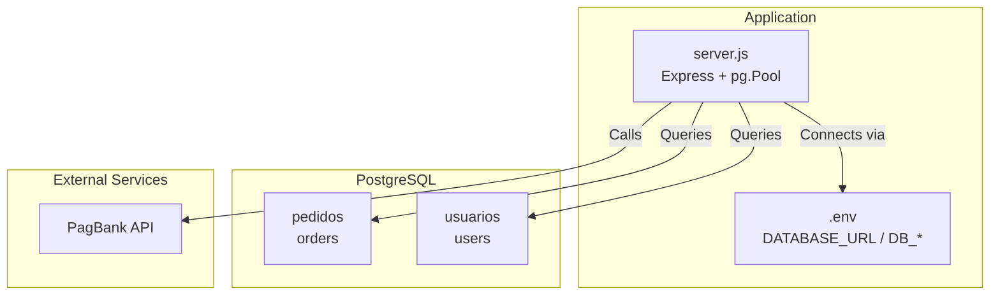
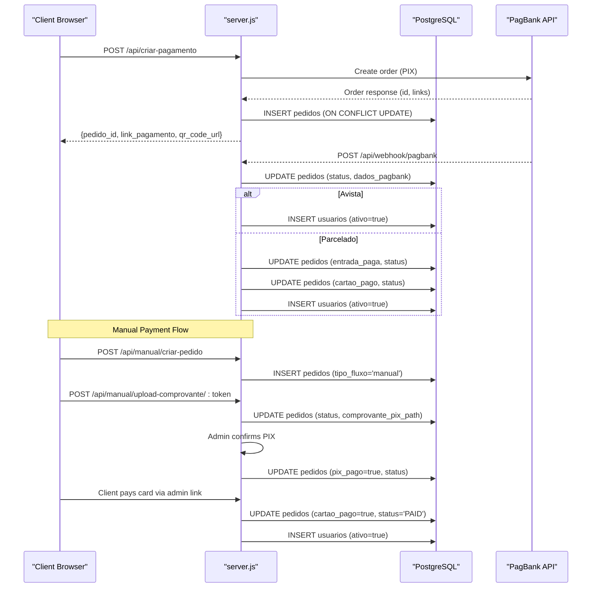
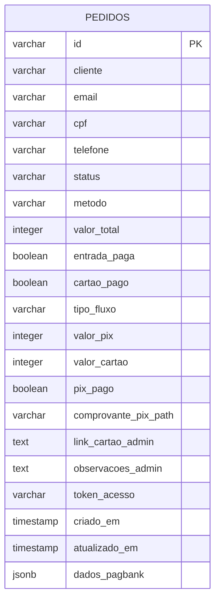
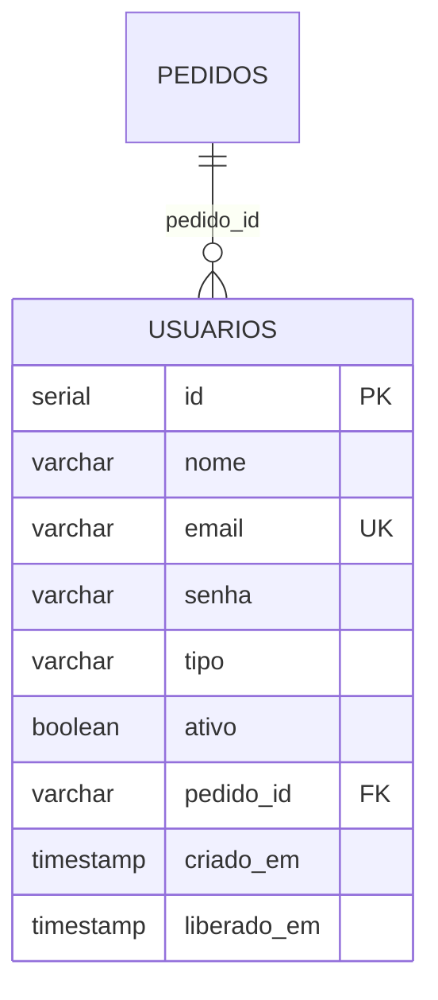
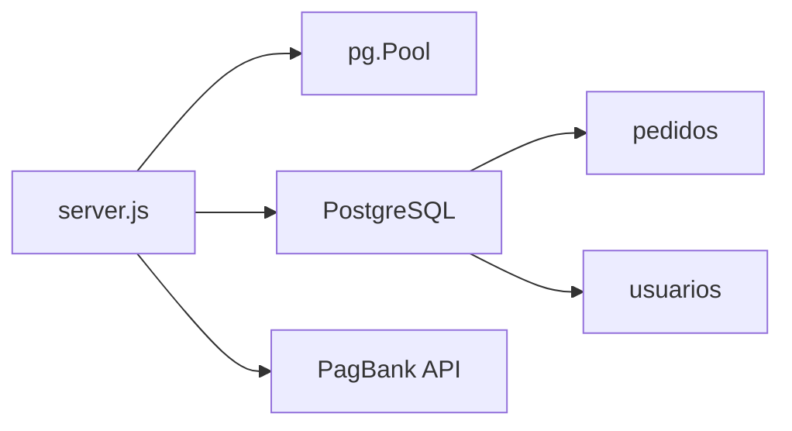

# Database Design

<cite>
**Referenced Files in This Document**
- [database.sql](file://database.sql)
- [init-db.sql](file://init-db.sql)
- [migration-manual.sql](file://migration-manual.sql)
- [server.js](file://server.js)
- [package.json](file://package.json)
- [README.md](file://README.md)
- [PAGAMENTO-README.md](file://PAGAMENTO-README.md)
- [dados/etiquetas.json](file://dados/etiquetas.json)
- [dados/usuarios.json](file://dados/usuarios.json)
</cite>

## Update Summary
**Changes Made**
- Updated Orders table documentation to include new manual payment flow fields
- Added comprehensive documentation for manual payment system with new status flow
- Enhanced index documentation to reflect unique token_acesso constraint
- Updated manual payment endpoints documentation with complete API coverage
- Expanded payment flow diagrams to show manual payment process

## Table of Contents
1. [Introduction](#introduction)
2. [Project Structure](#project-structure)
3. [Core Components](#core-components)
4. [Architecture Overview](#architecture-overview)
5. [Detailed Component Analysis](#detailed-component-analysis)
6. [Dependency Analysis](#dependency-analysis)
7. [Performance Considerations](#performance-considerations)
8. [Troubleshooting Guide](#troubleshooting-guide)
9. [Conclusion](#conclusion)
10. [Appendices](#appendices)

## Introduction
This document describes the PostgreSQL database design and data models used by the payment and user management system. It covers the schema for orders (payment tracking), users (authentication and authorization), and the expanded manual payment flow system. The manual payment flow supports "PIX with fixed key + card link" payments with admin oversight and tokenized access control. It also documents connection pooling configuration, indexing strategies, query optimization, data lifecycle management, backup procedures, and migration strategies. Sample data structures from the provided JSON files are included to clarify expected formats.

## Project Structure
The database schema is defined in SQL scripts and initialized via Node.js server code. Environment variables configure PostgreSQL connectivity. Payment flows integrate with PagBank for automated processing and support manual payment modes with admin controls.



**Diagram sources**
- [server.js:63-77](file://server.js#L63-L77)
- [package.json:11-18](file://package.json#L11-L18)

**Section sources**
- [PAGAMENTO-README.md:33-46](file://PAGAMENTO-README.md#L33-L46)
- [server.js:63-77](file://server.js#L63-L77)

## Core Components
- **Orders table (pedidos)**: Tracks payment requests, statuses, and payment split for both automated and manual payment modes
- **Users table (usuarios)**: Manages authentication and authorization for clients and admins
- **Manual payment flow**: Adds support for "PIX with fixed key + card link" with tokenized access and admin controls
- **Payment tracking**: Enhanced with split payment capabilities and admin oversight

Key implementation references:
- Schema creation and indices: [database.sql:11-63](file://database.sql#L11-L63), [init-db.sql:4-30](file://init-db.sql#L4-L30)
- Migration for manual flow: [migration-manual.sql:9-28](file://migration-manual.sql#L9-L28)
- Connection pooling and queries: [server.js:63-77](file://server.js#L63-L77), [server.js:388-487](file://server.js#L388-L487), [server.js:501-537](file://server.js#L501-L537)

**Section sources**
- [database.sql:11-63](file://database.sql#L11-L63)
- [init-db.sql:4-30](file://init-db.sql#L4-L30)
- [migration-manual.sql:9-28](file://migration-manual.sql#L9-L28)
- [server.js:63-77](file://server.js#L63-L77)
- [server.js:388-487](file://server.js#L388-L487)
- [server.js:501-537](file://server.js#L501-L537)

## Architecture Overview
The backend uses a PostgreSQL connection pool to manage database connections. Payment creation integrates with PagBank for automated processing; manual payment mode stores partial payment data and admin-managed links. The system supports both legacy PagBank flow and new manual payment flow with comprehensive admin oversight.



**Diagram sources**
- [server.js:82-280](file://server.js#L82-L280)
- [server.js:285-345](file://server.js#L285-L345)
- [server.js:388-487](file://server.js#L388-L487)
- [server.js:539-671](file://server.js#L539-L671)
- [server.js:780-799](file://server.js#L780-L799)

## Detailed Component Analysis

### Orders (pedidos) Table
**Updated** Enhanced with manual payment flow support and split payment tracking.

Purpose: Track payment requests, payment method, totals, and payment flow states for both automated and manual payment modes.

Fields and constraints:
- **id**: Primary key (VARCHAR) - Unique order identifier
- **cliente, email, cpf, telefone**: Customer contact information
- **status**: Enum-like (PENDING, ENTRADA_PAID, PAID, PENDING_PIX, PIX_ENVIADO, PIX_CONFIRMADO_AGUARDA_CARTAO, LINK_CARTAO_ENVIADO, CANCELADO)
- **metodo**: Payment method (avista, entrada, manual)
- **valor_total**: Integer in cents (e.g., 600000 = R$6000.00)
- **entrada_paga, cartao_pago**: Boolean flags for staged payments
- **tipo_fluxo**: 'pagbank' or 'manual' - Payment flow type indicator
- **valor_pix, valor_cartao**: Split amounts in cents for manual payments
- **pix_pago**: Boolean flag for manual PIX confirmation
- **comprovante_pix_path**: Path to uploaded PIX receipt
- **link_cartao_admin**: Admin-provided card payment link
- **observacoes_admin**: Admin notes for payment tracking
- **token_acesso**: Unique token for public order view
- **criado_em, atualizado_em**: Timestamps
- **dados_pagbank**: JSONB for PagBank response

Indices:
- **idx_pedidos_email**: Index on email for customer lookups
- **idx_pedidos_status**: Index on status for payment state filtering
- **idx_pedidos_token_acesso**: Unique partial index on token_acesso (only where not null)

Constraints:
- Unique token_acesso where not null
- Default values for numeric and boolean fields
- Manual payment validation ensures pix + cartao = valor_total

References:
- Schema definition: [database.sql:13-36](file://database.sql#L13-L36), [init-db.sql:4-18](file://init-db.sql#L4-L18)
- Migration additions: [migration-manual.sql:9-23](file://migration-manual.sql#L9-L23)
- Queries: [server.js:388-456](file://server.js#L388-L456), [server.js:501-504](file://server.js#L501-L504)



**Diagram sources**
- [database.sql:13-36](file://database.sql#L13-L36)
- [init-db.sql:4-18](file://init-db.sql#L4-L18)
- [migration-manual.sql:9-23](file://migration-manual.sql#L9-L23)

**Section sources**
- [database.sql:13-36](file://database.sql#L13-L36)
- [init-db.sql:4-18](file://init-db.sql#L4-L18)
- [migration-manual.sql:9-28](file://migration-manual.sql#L9-L28)
- [server.js:388-456](file://server.js#L388-L456)
- [server.js:501-504](file://server.js#L501-L504)

### Users (usuarios) Table
Purpose: Authentication and authorization for clients and admins.

Fields and constraints:
- **id**: Serial primary key
- **nome, email**: Non-null, email unique
- **senha**: Non-null
- **tipo**: Enum-like ('admin' or 'cliente')
- **ativo**: Boolean flag
- **pedido_id**: Foreign key to pedidos.id (optional)
- **criado_em, liberado_em**: Timestamps

Indices:
- **idx_usuarios_email**: Index on email for authentication
- **idx_usuarios_tipo**: Index on tipo for role filtering
- **idx_usuarios_ativo**: Index on ativo for access control

Constraints:
- Unique email
- Default tipo 'cliente'
- Default ativo false

References:
- Schema definition: [database.sql:48-58](file://database.sql#L48-L58), [init-db.sql:20-30](file://init-db.sql#L20-L30)
- Queries: [server.js:458-487](file://server.js#L458-L487)



**Diagram sources**
- [database.sql:48-58](file://database.sql#L48-L58)
- [init-db.sql:20-30](file://init-db.sql#L20-L30)

**Section sources**
- [database.sql:48-58](file://database.sql#L48-L58)
- [init-db.sql:20-30](file://init-db.sql#L20-L30)
- [server.js:458-487](file://server.js#L458-L487)

### Manual Payment Flow System
**New** Comprehensive manual payment system supporting "PIX with fixed key + card link" payments.

#### Payment Flow Process
1. **Order Creation**: Client creates manual order with PIX and card amounts
2. **PIX Payment**: Client pays PIX to fixed key and uploads receipt
3. **Admin Review**: Admin confirms PIX payment and provides card link
4. **Card Payment**: Client pays remaining amount via admin-provided link
5. **Access Provision**: System grants access upon full payment completion

#### New Database Fields
- **tipo_fluxo**: 'manual' - Identifies manual payment orders
- **valor_pix, valor_cartao**: Split payment amounts in cents
- **pix_pago**: Boolean flag for PIX confirmation
- **comprovante_pix_path**: File path for uploaded PIX receipts
- **link_cartao_admin**: Admin-provided card payment link
- **observacoes_admin**: Admin notes for payment tracking
- **token_acesso**: Unique token for public order tracking

#### Admin Endpoints
- **POST /api/admin/pedido/:id/confirmar-pix**: Admin confirms PIX payment
- **POST /api/admin/pedido/:id/enviar-link-cartao**: Admin provides card payment link
- **POST /api/admin/pedido/:id/confirmar-pagamento**: Admin confirms full payment
- **POST /api/admin/pedido/:id/cancelar**: Admin cancels order

#### Client Endpoints
- **POST /api/manual/criar-pedido**: Creates manual payment order
- **POST /api/manual/upload-comprovante/:token**: Uploads PIX receipt
- **GET /api/manual/pedido/:token**: Retrieves public order information
- **GET /pedido/:token**: Public order tracking page

```mermaid
flowchart TD
Start(["Manual Order Created"]) --> Validate["Client Uploads PIX Receipt"]
Validate --> AdminReview["Admin Confirms PIX Payment"]
AdminReview --> AdminLink["Admin Provides Card Payment Link"]
AdminLink --> ClientPay["Client Pays Remaining Amount"]
ClientPay --> Complete["Order Paid & Access Granted"]
Complete --> AdminConfirm["Admin Confirms Full Payment"]
AdminConfirm --> UserAccess["User Access Granted"]
Style Start fill:#e1f5fe
Style Complete fill:#c8e6c9
Style AdminConfirm fill:#c8e6c9
```

**Diagram sources**
- [migration-manual.sql:30-38](file://migration-manual.sql#L30-L38)
- [server.js:539-671](file://server.js#L539-L671)
- [server.js:780-799](file://server.js#L780-L799)

**Section sources**
- [migration-manual.sql:9-28](file://migration-manual.sql#L9-L28)
- [server.js:539-671](file://server.js#L539-L671)
- [server.js:780-799](file://server.js#L780-L799)

### Sample Data Structures
- **etiquetas.json**: Empty list with metadata fields for versioning and counters.
- **usuarios.json**: Single admin user record with fields for name, credentials, role, and activation status.

References:
- [dados/etiquetas.json:1-9](file://dados/etiquetas.json#L1-L9)
- [dados/usuarios.json:1-19](file://dados/usuarios.json#L1-L19)

**Section sources**
- [dados/etiquetas.json:1-9](file://dados/etiquetas.json#L1-L9)
- [dados/usuarios.json:1-19](file://dados/usuarios.json#L1-L19)

## Dependency Analysis
- server.js depends on the pg module for connection pooling and executes queries against pedidos and usuarios.
- Environment variables configure connection string resolution.
- Manual flow relies on additional pedidos columns and admin endpoints.
- Payment flow integration supports both PagBank API and manual payment processing.



**Diagram sources**
- [package.json:11-18](file://package.json#L11-L18)
- [server.js:63-77](file://server.js#L63-L77)

**Section sources**
- [package.json:11-18](file://package.json#L11-L18)
- [server.js:63-77](file://server.js#L63-L77)

## Performance Considerations
- **Connection pooling**: The application uses a single Pool configured with DATABASE_URL or DB_* environment variables. This centralizes connection reuse and reduces overhead.
- **Indexes**: Email and status indexes on pedidos improve filtering and reporting. A unique partial index on token_acesso ensures fast lookups while preventing duplicates.
- **Query patterns**: Frequent queries include fetching orders by id, listing recent orders, and updating status. Consider adding composite indexes if filters by status+created_at become common.
- **JSONB storage**: dados_pagbank allows flexible storage of PagBank responses; consider archiving old payloads if size grows significantly.
- **Manual flow**: Additional columns increase row width; monitor I/O and consider partitioning or separate audit tables if volume grows.
- **File storage**: comprovante_pix_path stores file paths; ensure proper cleanup of orphaned files during order deletion.

## Troubleshooting Guide
- **Connection failures**: Verify DATABASE_URL and DB_* environment variables. The pool attempts a connect on startup and logs errors.
- **Missing PagBank token**: Payment creation requires a configured token; errors are returned with actionable messages.
- **Webhook updates**: Ensure HTTPS and correct webhook URL are configured in PagBank; verify endpoint availability and logs.
- **Manual flow issues**: Confirm token_acesso uniqueness and that admin endpoints are used for confirming PIX and setting card links.
- **File upload problems**: Verify upload directory permissions and file size limits for PIX receipt uploads.
- **Status synchronization**: Manual payment status updates require proper admin authentication and validation.

**Section sources**
- [server.js:63-77](file://server.js#L63-L77)
- [server.js:120-128](file://server.js#L120-L128)
- [server.js:285-345](file://server.js#L285-L345)
- [PAGAMENTO-README.md:88-97](file://PAGAMENTO-README.md#L88-L97)

## Conclusion
The database schema supports a robust payment system with both automated and manual payment flows. The expanded manual payment system adds flexibility for mixed payment scenarios with comprehensive admin oversight and tokenized access control. Connection pooling, targeted indexes, and clear constraints enable reliable operation. Proper environment configuration, monitoring, and maintenance practices ensure long-term stability.

## Appendices

### A. Connection Pooling Configuration
- Pool created from DATABASE_URL or DB_* environment variables.
- Tests connection on startup and logs success/error.

References:
- [server.js:63-77](file://server.js#L63-L77)
- [PAGAMENTO-README.md:33-46](file://PAGAMENTO-README.md#L33-L46)

**Section sources**
- [server.js:63-77](file://server.js#L63-L77)
- [PAGAMENTO-README.md:33-46](file://PAGAMENTO-README.md#L33-L46)

### B. Query Optimization Strategies
- Use existing indexes on pedidos.email, pedidos.status, and pedidos.token_acesso.
- Prefer parameterized queries (as implemented) to prevent SQL injection and improve plan reuse.
- Limit admin listing queries with pagination or date-range filters if growth continues.
- Consider adding composite indexes for frequent manual payment queries (status+tipo_fluxo).

References:
- [database.sql:38-43](file://database.sql#L38-L43)
- [server.js:388-456](file://server.js#L388-L456)
- [server.js:739-778](file://server.js#L739-L778)

**Section sources**
- [database.sql:38-43](file://database.sql#L38-L43)
- [server.js:388-456](file://server.js#L388-L456)
- [server.js:739-778](file://server.js#L739-L778)

### C. Data Lifecycle Management and Backup
- **Backups**: Use standard PostgreSQL tools (e.g., pg_dump) to export schema and data regularly.
- **Retention**: Define policies for pedidos rows (e.g., archive after 1 year) and clean up old JSONB payloads if needed.
- **File cleanup**: Implement cleanup procedures for orphaned PIX receipt files in uploads/comprovantes/
- **Migrations**: Apply migration-manual.sql idempotently to existing databases.

References:
- [migration-manual.sql:1-7](file://migration-manual.sql#L1-L7)
- [PAGAMENTO-README.md:113-119](file://PAGAMENTO-README.md#L113-L119)

**Section sources**
- [migration-manual.sql:1-7](file://migration-manual.sql#L1-L7)
- [PAGAMENTO-README.md:113-119](file://PAGAMENTO-README.md#L113-L119)

### D. Migration Strategies
- **Initial schema**: Run init-db.sql or database.sql to create tables.
- **Manual flow**: Apply migration-manual.sql to add new columns and unique index.
- **Idempotency**: All commands include IF NOT EXISTS checks.
- **Data validation**: Manual payment orders require pix + cartao = valor_total validation.

References:
- [init-db.sql:1-32](file://init-db.sql#L1-L32)
- [database.sql:1-10](file://database.sql#L1-L10)
- [migration-manual.sql:1-7](file://migration-manual.sql#L1-L7)

**Section sources**
- [init-db.sql:1-32](file://init-db.sql#L1-L32)
- [database.sql:1-10](file://database.sql#L1-L10)
- [migration-manual.sql:1-7](file://migration-manual.sql#L1-L7)

### E. Manual Payment Status Flow
**New** Complete status flow for manual payment processing.

| Status | Description | Trigger |
|--------|-------------|---------|
| PENDING_PIX | Waiting for client to pay PIX and upload receipt | Order created |
| PIX_ENVIADO | Client uploaded PIX receipt, waiting for admin review | Receipt uploaded |
| PIX_CONFIRMADO_AGUARDA_CARTAO | Admin confirmed PIX, waiting for card link | Admin confirms PIX |
| LINK_CARTAO_ENVIADO | Admin provided card payment link, waiting for client payment | Admin sends card link |
| PAID | Full payment received, access granted | Client pays card |
| CANCELADO | Order cancelled by admin | Admin cancels |

**Section sources**
- [migration-manual.sql:30-38](file://migration-manual.sql#L30-L38)
- [server.js:805-871](file://server.js#L805-L871)