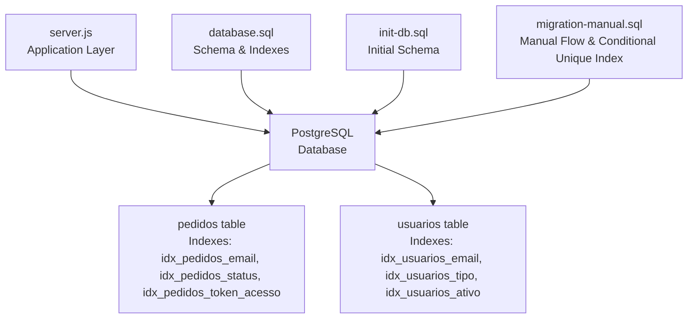
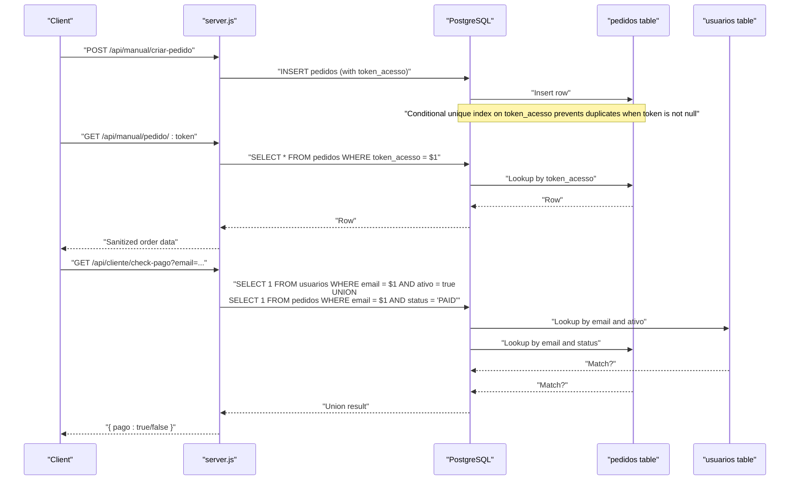
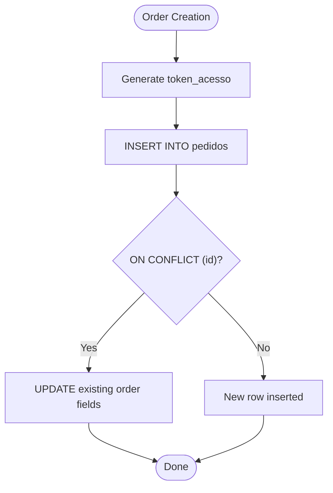
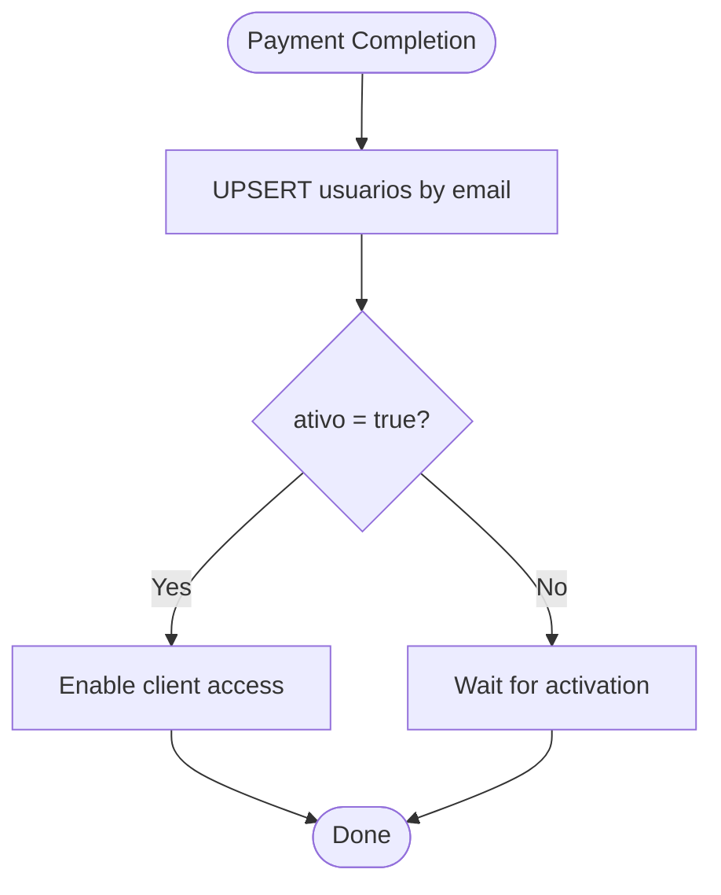
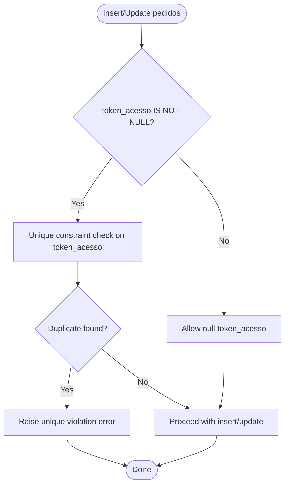
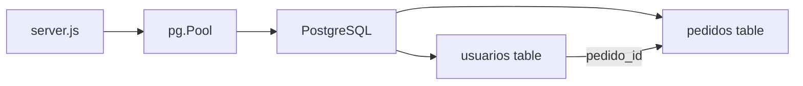

# Indexes and Constraints

<cite>
**Referenced Files in This Document**
- [database.sql](file://database.sql)
- [init-db.sql](file://init-db.sql)
- [migration-manual.sql](file://migration-manual.sql)
- [server.js](file://server.js)
</cite>

## Table of Contents
1. [Introduction](#introduction)
2. [Project Structure](#project-structure)
3. [Core Components](#core-components)
4. [Architecture Overview](#architecture-overview)
5. [Detailed Component Analysis](#detailed-component-analysis)
6. [Dependency Analysis](#dependency-analysis)
7. [Performance Considerations](#performance-considerations)
8. [Troubleshooting Guide](#troubleshooting-guide)
9. [Conclusion](#conclusion)

## Introduction
This document analyzes the database indexing strategy and constraint definitions for optimal performance and data integrity in the qretiquetas.com project. It focuses on:
- Indexes on the pedidos table: idx_pedidos_email, idx_pedidos_status, and a conditional unique index on token_acesso
- Indexes on the usuarios table: on email, tipo, and ativo fields
- Primary keys, unique constraints, and foreign key relationships
- Performance implications of each index and query optimization strategies
- Guidance on query patterns that benefit from existing indexes and recommendations for additional indexes

## Project Structure
The database schema and indexes are defined in SQL files, while the application logic interacts with PostgreSQL through server-side endpoints. The relevant files are:
- database.sql: Defines tables, indexes, and comments for typical usage
- init-db.sql: Initial table creation without indexes
- migration-manual.sql: Adds manual payment flow columns and conditional unique index on token_acesso
- server.js: Implements database operations and query patterns used in production

**Diagram sources**
- [server.js:388-487](file://server.js#L388-L487)
- [database.sql:11-58](file://database.sql#L11-L58)
- [init-db.sql:4-30](file://init-db.sql#L4-L30)
- [migration-manual.sql:25-28](file://migration-manual.sql#L25-L28)

**Section sources**
- [database.sql:11-58](file://database.sql#L11-L58)
- [init-db.sql:4-30](file://init-db.sql#L4-L30)
- [migration-manual.sql:25-28](file://migration-manual.sql#L25-L28)
- [server.js:388-487](file://server.js#L388-L487)

## Core Components
- pedidos table
  - Primary key: id (VARCHAR)
  - Non-unique indexes:
    - idx_pedidos_email on email
    - idx_pedidos_status on status
  - Conditional unique index:
    - idx_pedidos_token_acesso on token_acesso where token_acesso IS NOT NULL
- usuarios table
  - Primary key: id (SERIAL)
  - Unique constraint: email (UNIQUE)
  - Non-unique indexes:
    - idx_usuarios_email on email
    - idx_usuarios_tipo on tipo
    - idx_usuarios_ativo on ativo
- Foreign key relationships
  - usuarios.pedido_id references pedidos.id (not explicitly defined in provided files; see Dependency Analysis)

**Section sources**
- [database.sql:13-36](file://database.sql#L13-L36)
- [database.sql:48-58](file://database.sql#L48-L58)
- [database.sql:39-43](file://database.sql#L39-L43)
- [database.sql:61-63](file://database.sql#L61-L63)
- [init-db.sql:4-18](file://init-db.sql#L4-L18)
- [init-db.sql:20-30](file://init-db.sql#L20-L30)
- [migration-manual.sql:25-28](file://migration-manual.sql#L25-L28)

## Architecture Overview
The application uses PostgreSQL for persistence. The server.js module executes queries against the pedidos and usuarios tables. The database.sql file defines the schema and indexes, while migration-manual.sql adds manual payment flow columns and a conditional unique index on token_acesso.

**Diagram sources**
- [server.js:540-617](file://server.js#L540-L617)
- [server.js:662-671](file://server.js#L662-L671)
- [server.js:682-700](file://server.js#L682-L700)
- [database.sql:39-43](file://database.sql#L39-L43)

## Detailed Component Analysis

### pedidos table indexes and constraints
- Primary key: id (VARCHAR)
- Non-unique indexes:
  - idx_pedidos_email on email
  - idx_pedidos_status on status
- Conditional unique index:
  - idx_pedidos_token_acesso on token_acesso where token_acesso IS NOT NULL
- Typical operations:
  - Insert/update orders with ON CONFLICT handling
  - Lookup by id
  - Filter by status
  - Filter by email
  - Lookup by token_acesso for public order page

**Diagram sources**
- [server.js:388-444](file://server.js#L388-L444)
- [server.js:493-499](file://server.js#L493-L499)

**Section sources**
- [database.sql:13-36](file://database.sql#L13-L36)
- [database.sql:39-43](file://database.sql#L39-L43)
- [server.js:388-444](file://server.js#L388-L444)
- [server.js:501-504](file://server.js#L501-L504)

### usuarios table indexes and constraints
- Primary key: id (SERIAL)
- Unique constraint: email (UNIQUE)
- Non-unique indexes:
  - idx_usuarios_email on email
  - idx_usuarios_tipo on tipo
  - idx_usuarios_ativo on ativo
- Typical operations:
  - Upsert by email on payment completion
  - Filter by ativo for active users
  - Filter by tipo for role-based access

**Diagram sources**
- [server.js:458-487](file://server.js#L458-L487)

**Section sources**
- [database.sql:48-58](file://database.sql#L48-L58)
- [server.js:458-487](file://server.js#L458-L487)

### Conditional unique index on token_acesso
- Purpose: Ensure uniqueness of token_acesso across rows where token_acesso is not null
- Behavior: Allows multiple rows with null token_acesso; enforces uniqueness when token_acesso is present
- Impact: Prevents accidental reuse of the same token for different orders; supports fast lookup by token

**Diagram sources**
- [migration-manual.sql:25-28](file://migration-manual.sql#L25-L28)
- [database.sql:41-43](file://database.sql#L41-L43)

**Section sources**
- [migration-manual.sql:25-28](file://migration-manual.sql#L25-L28)
- [database.sql:41-43](file://database.sql#L41-L43)

### Query patterns and index usage
- Public order lookup by token:
  - Query: SELECT * FROM pedidos WHERE token_acesso = $1
  - Benefit: Uses idx_pedidos_token_acesso for efficient lookup
- Admin order listing by status:
  - Query: SELECT * FROM pedidos WHERE status = $1 ORDER BY criado_em DESC LIMIT 500
  - Benefit: Uses idx_pedidos_status for filtering; ORDER BY criado_em may benefit from an index on criado_em if frequently queried
- Customer payment verification:
  - Query: SELECT 1 FROM usuarios WHERE LOWER(email) = $1 AND ativo = true UNION SELECT 1 FROM pedidos WHERE LOWER(email) = $1 AND status = 'PAID' LIMIT 1
  - Benefits: Uses idx_usuarios_email for usuarios filter; idx_pedidos_email for pedidos filter; LOWER() prevents index usage on email; consider storing normalized email in lowercase to leverage index
- Upsert by email on payment completion:
  - Query: INSERT INTO usuarios ... ON CONFLICT (email) DO UPDATE ...
  - Benefit: Uses unique constraint on email for conflict resolution

**Section sources**
- [server.js:501-504](file://server.js#L501-L504)
- [server.js:762-802](file://server.js#L762-L802)
- [server.js:682-700](file://server.js#L682-L700)
- [server.js:458-487](file://server.js#L458-L487)

## Dependency Analysis
- Internal dependencies:
  - server.js depends on database.sql-defined schema and indexes
  - server.js uses pg.Pool for database operations
- External dependencies:
  - PostgreSQL for persistence
  - Express for HTTP routing
- Foreign key relationships:
  - usuarios.pedido_id references pedidos.id (not explicitly defined in provided files; inferred from usage patterns)

**Diagram sources**
- [server.js:64-67](file://server.js#L64-L67)
- [server.js:458-487](file://server.js#L458-L487)

**Section sources**
- [server.js:64-67](file://server.js#L64-L67)
- [server.js:458-487](file://server.js#L458-L487)

## Performance Considerations
- Index selection rationale:
  - idx_pedidos_email: Supports email-based lookups for order verification and customer checks
  - idx_pedidos_status: Supports admin filtering by status and reporting
  - idx_pedidos_token_acesso (conditional unique): Ensures unique access tokens and enables fast token-based lookup
  - idx_usuarios_email: Supports upsert by email and customer checks
  - idx_usuarios_tipo: Supports role-based queries
  - idx_usuarios_ativo: Supports filtering active users
- Potential improvements:
  - Consider adding an index on pedidos.criado_em if frequent ORDER BY queries are executed
  - Normalize email storage to lowercase to enable index usage with LOWER() filters
  - Evaluate composite indexes for common query patterns (e.g., pedidos(email, status), usuarios(email, ativo))
- Cost vs. benefit:
  - Additional indexes improve read performance but add write overhead during INSERT/UPDATE/DELETE
  - Conditional unique index reduces duplication risk with minimal cost when token is null

[No sources needed since this section provides general guidance]

## Troubleshooting Guide
- Unique constraint violation on token_acesso:
  - Cause: Attempting to insert/update a row with an existing non-null token_acesso
  - Resolution: Ensure token generation produces unique values or handle conflicts gracefully
- Slow queries on usuarios by email:
  - Cause: Using LOWER(email) prevents index usage
  - Resolution: Store normalized lowercase email or adjust query to match stored case
- Missing foreign key enforcement:
  - Observation: No explicit foreign key constraint defined for usuarios.pedido_id
  - Impact: Data integrity risk if orphaned records appear
  - Recommendation: Add foreign key constraint to enforce referential integrity

**Section sources**
- [migration-manual.sql:25-28](file://migration-manual.sql#L25-L28)
- [server.js:682-700](file://server.js#L682-L700)
- [server.js:458-487](file://server.js#L458-L487)

## Conclusion
The qretiquetas.com database employs targeted indexes to support core operational queries:
- pedidos: email, status, and conditional unique token_acesso indexes
- usuarios: email, tipo, and ativo indexes with a unique constraint on email
These indexes align with observed query patterns and provide strong performance for order management and user access control. Consider normalization of email storage and evaluation of composite indexes for further optimization. Adding a foreign key constraint for usuarios.pedido_id would strengthen referential integrity.