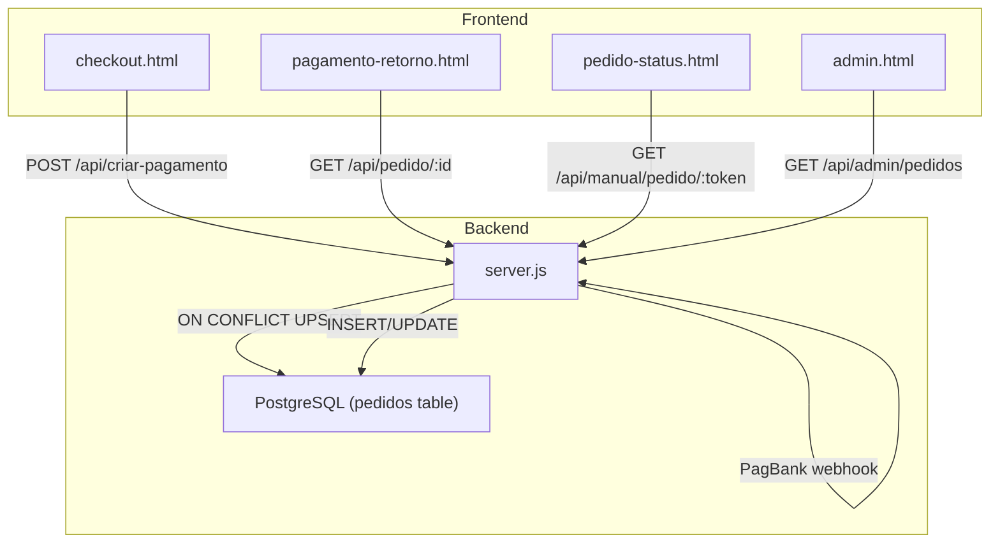
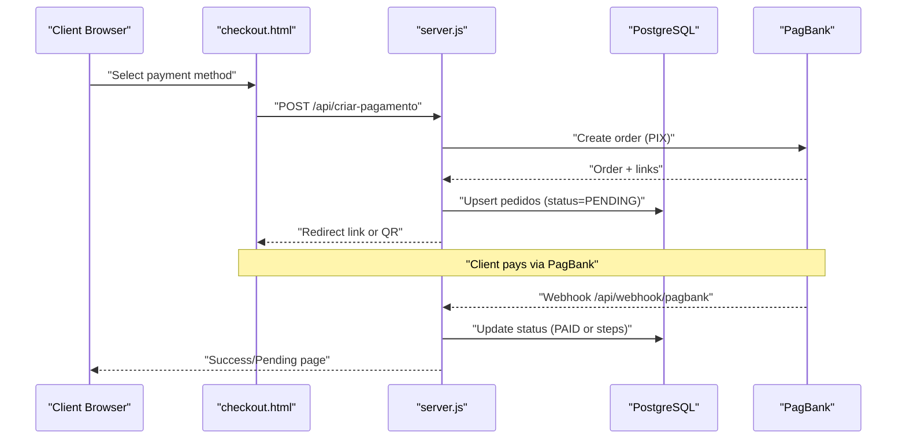
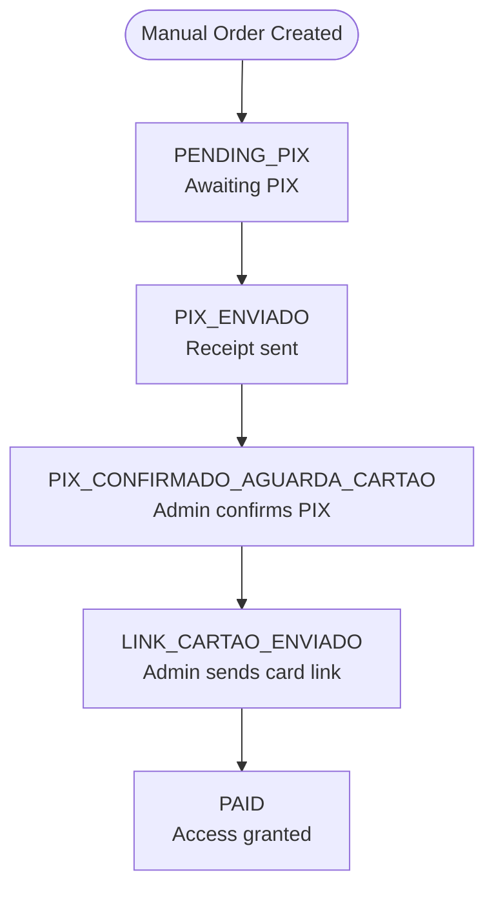
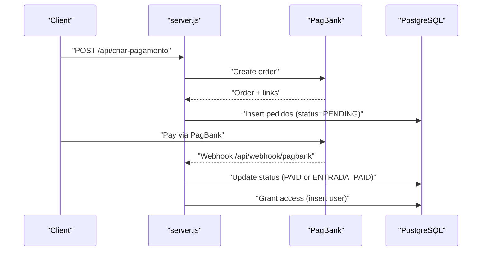
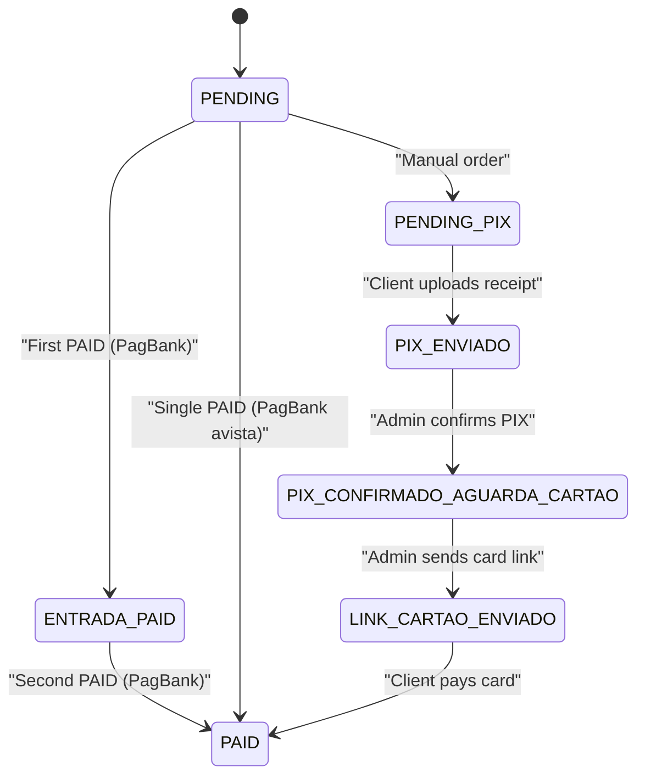
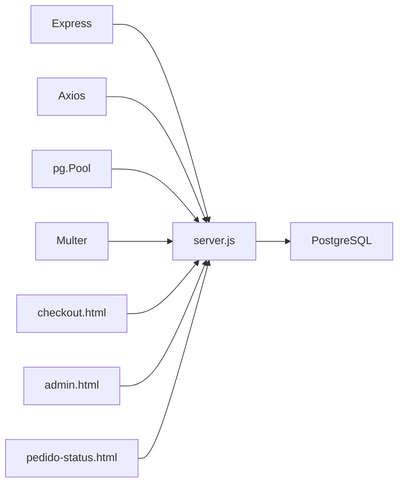

# Pedidos Table

<cite>
**Referenced Files in This Document**
- [database.sql](file://database.sql)
- [init-db.sql](file://init-db.sql)
- [server.js](file://server.js)
- [checkout.html](file://checkout.html)
- [admin.html](file://admin.html)
- [pedido-status.html](file://pedido-status.html)
- [pagamento-retorno.html](file://pagamento-retorno.html)
- [PAGAMENTO-README.md](file://PAGAMENTO-README.md)
</cite>

## Table of Contents
1. [Introduction](#introduction)
2. [Project Structure](#project-structure)
3. [Core Components](#core-components)
4. [Architecture Overview](#architecture-overview)
5. [Detailed Component Analysis](#detailed-component-analysis)
6. [Dependency Analysis](#dependency-analysis)
7. [Performance Considerations](#performance-considerations)
8. [Troubleshooting Guide](#troubleshooting-guide)
9. [Conclusion](#conclusion)

## Introduction
This document describes the pedidos table structure and payment lifecycle for the Alimentares system. It covers all fields, defaults, constraints, and validation rules, and explains two payment flows:
- Manual flow: client pays a configurable PIX portion and the remainder via a card link sent by an administrator.
- PagBank integration flow: automated payments via the external provider with webhooks.

It also documents status transitions from PENDING to PAID, the role of the JSONB dados_pagbank field, and typical order lifecycles.

## Project Structure
The payment system spans backend endpoints, frontend pages, and database schema:
- Backend: Express server with endpoints for creating payments, receiving webhooks, and managing manual orders.
- Frontend: Checkout, payment-return, and customer/admin pages for order tracking and actions.
- Database: PostgreSQL schema defining the pedidos table and related indices.

**Diagram sources**
- [server.js:82-280](file://server.js#L82-L280)
- [checkout.html:626-718](file://checkout.html#L626-L718)
- [pagamento-retorno.html:108-152](file://pagamento-retorno.html#L108-L152)
- [pedido-status.html:172-191](file://pedido-status.html#L172-L191)
- [admin.html:137-150](file://admin.html#L137-L150)

**Section sources**
- [PAGAMENTO-README.md:69-98](file://PAGAMENTO-README.md#L69-L98)
- [server.js:63-77](file://server.js#L63-L77)

## Core Components
- pedidos table: stores order metadata, payment amounts, status, and provider data.
- Payment flows:
  - PagBank: automatic creation and webhook-driven updates.
  - Manual: client-defined split, admin verification and card link delivery.

Key responsibilities:
- server.js: payment creation, webhook handling, manual order management, admin actions.
- checkout.html: payment selection and initiation.
- admin.html: order monitoring and manual flow controls.
- pedido-status.html: customer view of manual order progress.
- pagamento-retorno.html: PagBank redirect status page.

**Section sources**
- [database.sql:13-43](file://database.sql#L13-L43)
- [server.js:82-280](file://server.js#L82-L280)
- [checkout.html:350-376](file://checkout.html#L350-L376)
- [admin.html:96-104](file://admin.html#L96-L104)
- [pedido-status.html:193-302](file://pedido-status.html#L193-L302)
- [pagamento-retorno.html:108-152](file://pagamento-retorno.html#L108-L152)

## Architecture Overview
The payment architecture integrates client-side forms, backend APIs, and external provider webhooks.

**Diagram sources**
- [server.js:82-280](file://server.js#L82-L280)
- [checkout.html:679-718](file://checkout.html#L679-L718)
- [pagamento-retorno.html:108-152](file://pagamento-retorno.html#L108-L152)

## Detailed Component Analysis

### Pedidos Table Schema and Fields
The pedidos table captures order metadata, payment amounts, status, and provider data. Values are stored in cents for precision and currency consistency.

Field definitions and defaults:
- id: primary key (VARCHAR)
- cliente: buyer name (NOT NULL)
- email: buyer email (NOT NULL)
- cpf: buyer tax id (optional)
- telefone: phone number (optional)
- status: order status (DEFAULT 'PENDING')
- metodo: payment mode (DEFAULT 'avista'): 'avista', 'entrada', 'cartao', 'manual'
- valor_total: total amount in cents (DEFAULT 600000)
- entrada_paga: boolean flag for first installment (DEFAULT false)
- cartao_pago: boolean flag for card payment (DEFAULT false)
- tipo_fluxo: flow type (DEFAULT 'pagbank'): 'pagbank' or 'manual'
- valor_pix: PIX portion in cents (DEFAULT 0)
- valor_cartao: card portion in cents (DEFAULT 0)
- pix_pago: PIX confirmed by admin (DEFAULT false)
- comprovante_pix_path: uploaded receipt path (optional)
- link_cartao_admin: admin-sent card payment link (TEXT)
- observacoes_admin: admin notes (TEXT)
- token_acesso: unique token for manual orders (optional)
- criado_em/atualizado_em: timestamps (DEFAULT CURRENT_TIMESTAMP)
- dados_pagbank: JSONB provider payload (DEFAULT '{}')

Constraints and indexes:
- Unique constraint on token_acesso when present.
- Indexes on email, status, and token_acesso.

Validation rules:
- Required fields for creation: cliente, email, telefone, cpf.
- Manual flow requires: valor_pix and valor_cartao both ≥ 100 cents, and their sum equals 600000.
- PagBank flow sets status to PENDING initially; webhook updates to PAID or intermediate statuses.

**Section sources**
- [database.sql:13-43](file://database.sql#L13-L43)
- [init-db.sql:4-18](file://init-db.sql#L4-L18)
- [server.js:89-96](file://server.js#L89-L96)
- [server.js:544-565](file://server.js#L544-L565)
- [server.js:388-444](file://server.js#L388-L444)

### Payment Flow Tracking: Manual Mode
Manual mode allows clients to define a custom split between PIX and card. The flow proceeds through several explicit states managed by the admin panel.

States and transitions:
- PENDING_PIX: order created with custom split.
- PIX_ENVIADO: client uploaded PIX receipt.
- PIX_CONFIRMADO_AGUARDA_CARTAO: admin confirms PIX and awaits card link.
- LINK_CARTAO_ENVIADO: admin sends card payment link to client.
- PAID: client completes card payment; access is granted.

Admin actions:
- Confirm PIX receipt.
- Send card payment link.
- Confirm total payment and grant access.

Customer actions:
- Pay PIX to configured key.
- Upload receipt.
- Receive and pay card link.

**Diagram sources**
- [server.js:540-617](file://server.js#L540-L617)
- [server.js:619-671](file://server.js#L619-L671)
- [server.js:780-799](file://server.js#L780-L799)
- [admin.html:96-104](file://admin.html#L96-L104)
- [pedido-status.html:208-290](file://pedido-status.html#L208-L290)

**Section sources**
- [server.js:540-617](file://server.js#L540-L617)
- [server.js:619-671](file://server.js#L619-L671)
- [server.js:780-799](file://server.js#L780-L799)
- [admin.html:186-215](file://admin.html#L186-L215)
- [pedido-status.html:208-290](file://pedido-status.html#L208-L290)

### Payment Flow Tracking: PagBank Integration Mode
PagBank integration automates payment creation and status updates via webhooks.

Creation:
- Client selects a method (avista, entrada, cartao).
- Backend creates a PagBank order and redirects the client to pay.
- Backend persists order with status PENDING and provider data in dados_pagbank.

Webhook handling:
- On PAID (or paid), update status to PAID and grant access.
- For entrada method, first PAID sets entrada_paga=true and status to ENTRADA_PAID; second PAID sets cartao_pago=true and status to PAID.

**Diagram sources**
- [server.js:82-280](file://server.js#L82-L280)
- [server.js:285-345](file://server.js#L285-L345)
- [server.js:458-487](file://server.js#L458-L487)

**Section sources**
- [server.js:82-280](file://server.js#L82-L280)
- [server.js:285-345](file://server.js#L285-L345)
- [checkout.html:727-764](file://checkout.html#L727-L764)
- [pagamento-retorno.html:121-152](file://pagamento-retorno.html#L121-L152)

### Status Management Workflow
- PENDING: initial state after order creation.
- ENTRADA_PAID: first stage paid (entry) in parcelado flow.
- PAID: final state granting access.

For PagBank:
- avista: single PAID grants access immediately.
- entrada/cartao: first webhook sets ENTRADA_PAID; second webhook sets PAID.

For Manual:
- Admin confirms PIX → ENTRADA_PAID-like state.
- Admin sends card link → LINK_CARTAO_ENVIADO.
- Client completes card payment → PAID.

**Diagram sources**
- [server.js:303-337](file://server.js#L303-L337)
- [server.js:576-590](file://server.js#L576-L590)
- [server.js:783-790](file://server.js#L783-L790)

**Section sources**
- [server.js:303-337](file://server.js#L303-L337)
- [server.js:576-590](file://server.js#L576-L590)

### JSONB Field: dados_pagbank
- Purpose: stores the raw provider payload received from PagBank during order creation.
- Default: empty JSON object.
- Usage: persisted on insert/update and can be queried as JSON for diagnostics or reporting.

**Section sources**
- [database.sql:35-35](file://database.sql#L35-L35)
- [server.js:191-204](file://server.js#L191-L204)
- [server.js:388-444](file://server.js#L388-L444)

### Typical Order Records and Lifecycle Examples
Example A: PagBank avista
- Fields: id, cliente, email, cpf, telefone, status=PENDING, metodo='avista', valor_total=540000, dados_pagbank populated.
- Lifecycle: webhook PAID → access granted.

Example B: PagBank entrada (2-step)
- Initial: status=PENDING, valor_total=600000.
- First webhook: status=ENTRADA_PAID, entrada_paga=true.
- Second webhook: status=PAID, cartao_pago=true.

Example C: Manual split
- Initial: status=PENDING_PIX, valor_total=600000, valor_pix=100000, valor_cartao=500000.
- Client uploads receipt: status=PIX_ENVIADO.
- Admin confirms PIX: status=PIX_CONFIRMADO_AGUARDA_CARTAO.
- Admin sends card link: status=LINK_CARTAO_ENVIADO.
- Client pays card: status=PAID.

**Section sources**
- [server.js:103-113](file://server.js#L103-L113)
- [server.js:303-337](file://server.js#L303-L337)
- [server.js:576-590](file://server.js#L576-L590)
- [server.js:619-671](file://server.js#L619-L671)

## Dependency Analysis
- server.js depends on:
  - Express for routing and middleware.
  - Axios for PagBank API calls.
  - pg.Pool for database operations.
  - Multer for manual receipt uploads.
  - Environment variables for credentials.
- checkout.html and admin.html drive user interactions and call server endpoints.
- Database schema defines pedidos and related indices.

**Diagram sources**
- [server.js:1-10](file://server.js#L1-L10)
- [package.json:11-19](file://package.json#L11-L19)

**Section sources**
- [package.json:11-19](file://package.json#L11-L19)
- [server.js:63-77](file://server.js#L63-L77)

## Performance Considerations
- Database:
  - Use indexes on frequently filtered columns (email, status, token_acesso) to speed up queries.
  - Prefer batch operations for admin listings when scaling.
- Backend:
  - Avoid long-running synchronous operations in request handlers.
  - Cache provider configuration values if reused often.
- Frontend:
  - Polling intervals for status checks should be tuned (currently ~5–10 seconds) to balance responsiveness and load.

## Troubleshooting Guide
Common issues and resolutions:
- Missing PAGBANK_TOKEN:
  - Symptom: 500 response indicating token not configured.
  - Action: Set PAGBANK_TOKEN in environment variables.
- ECONNREFUSED or 401/400 errors from PagBank:
  - Symptom: Payment creation fails.
  - Action: Verify token validity and request payload; check logs for error details.
- Manual order validation failures:
  - Symptom: 400 errors for invalid values or totals not equal to 600000.
  - Action: Ensure both values are ≥ 100 cents and sum to 600000.
- Webhook not updating status:
  - Symptom: Orders remain PENDING despite client payment.
  - Action: Verify webhook URL is configured in PagBank and server is reachable with HTTPS.

**Section sources**
- [server.js:120-128](file://server.js#L120-L128)
- [server.js:259-278](file://server.js#L259-L278)
- [server.js:551-565](file://server.js#L551-L565)
- [PAGAMENTO-README.md:88-98](file://PAGAMENTO-README.md#L88-L98)

## Conclusion
The pedidos table centralizes order and payment state across both manual and PagBank flows. Clear defaults, validation rules, and webhook-driven updates ensure predictable status transitions from PENDING to PAID. The manual flow adds flexibility for split payments while maintaining admin oversight. Proper indexing and environment configuration are essential for reliable operation.