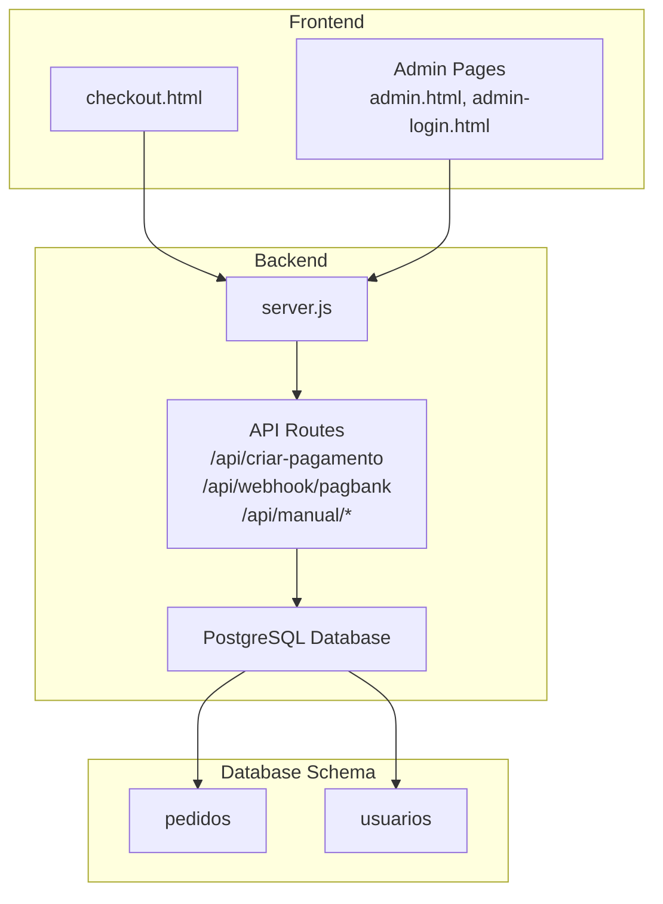
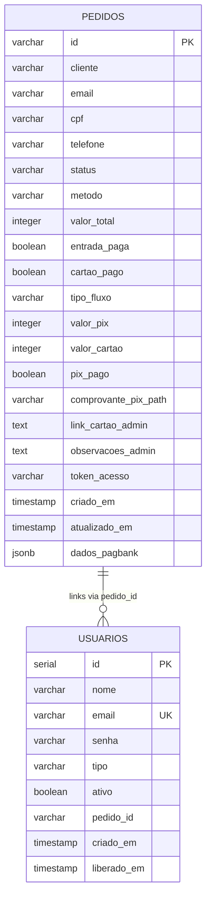
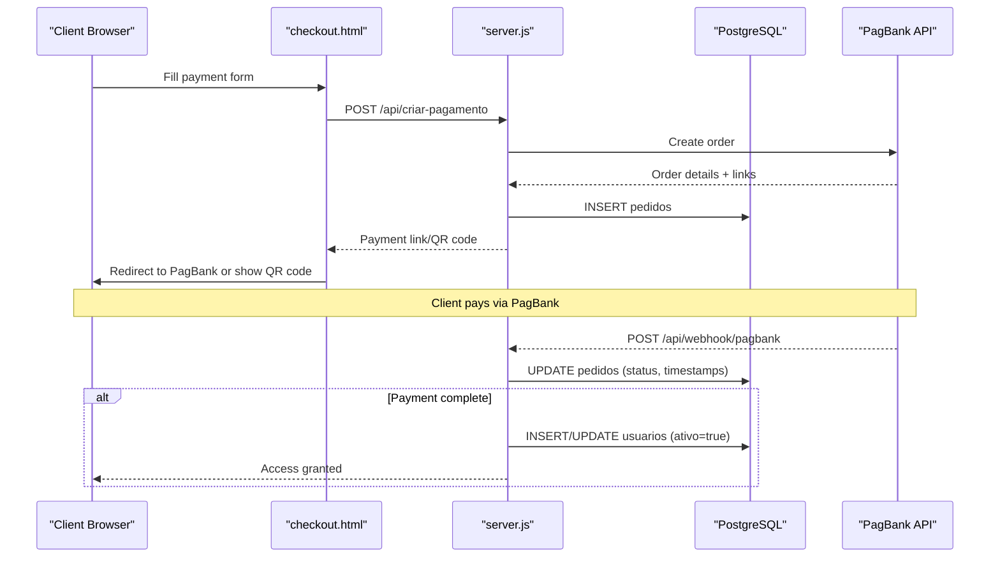
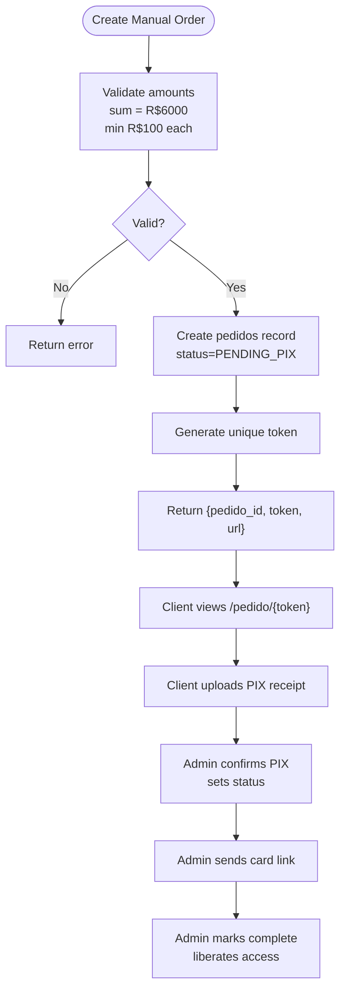
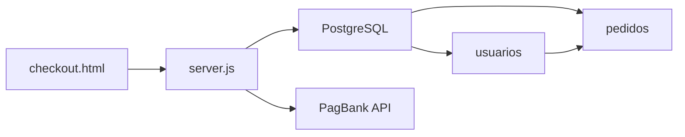

# Schema Overview

<cite>
**Referenced Files in This Document**
- [database.sql](file://database.sql)
- [init-db.sql](file://init-db.sql)
- [server.js](file://server.js)
- [checkout.html](file://checkout.html)
- [PAGAMENTO-README.md](file://PAGAMENTO-README.md)
- [README.md](file://README.md)
- [dados/usuarios.json](file://dados/usuarios.json)
- [dados/etiquetas.json](file://dados/etiquetas.json)
</cite>

## Table of Contents
1. [Introduction](#introduction)
2. [Project Structure](#project-structure)
3. [Core Components](#core-components)
4. [Architecture Overview](#architecture-overview)
5. [Detailed Component Analysis](#detailed-component-analysis)
6. [Dependency Analysis](#dependency-analysis)
7. [Performance Considerations](#performance-considerations)
8. [Troubleshooting Guide](#troubleshooting-guide)
9. [Conclusion](#conclusion)

## Introduction
This document provides a comprehensive schema overview for the PostgreSQL database design powering two integrated systems:
- Payment processing for access to the label management system
- Label management system for internal and external product labeling

The database schema supports both a modern payment flow via PagBank and a dual-purpose design that enables both payment processing and label management. It enforces business rules through carefully chosen data types, constraints, and indexes while maintaining flexibility for future enhancements.

## Project Structure
The project is organized into:
- Database initialization scripts defining the schema and indexes
- Backend server (Node.js/Express) connecting to PostgreSQL and orchestrating payment flows
- Frontend pages for checkout and label management
- Example data files for users and labels (primarily for development and demonstration)

**Diagram sources**
- [checkout.html](file://checkout.html)
- [server.js](file://server.js)
- [database.sql](file://database.sql)

**Section sources**
- [database.sql](file://database.sql)
- [init-db.sql](file://init-db.sql)
- [server.js](file://server.js)

## Core Components
The schema consists of two primary tables:

- pedidos: Central to payment processing, storing order metadata, payment status, and integration data with PagBank.
- usuarios: Supports the label management system by managing user accounts and linking them to orders.

Key design principles:
- Monetary amounts stored in cents (integer) to avoid floating-point precision issues
- Status fields enforce business rules for payment stages
- JSONB field stores external provider data for auditability
- Indexes optimize frequent queries by email, status, and token

**Section sources**
- [database.sql](file://database.sql)
- [init-db.sql](file://init-db.sql)

## Architecture Overview
The system architecture integrates payment processing with label management through a unified database schema. Payment flows update order records, which trigger user account creation and activation for access to the label management system.

**Diagram sources**
- [database.sql](file://database.sql)

## Detailed Component Analysis

### Table: pedidos
Purpose:
- Track payment orders, payment methods, and status transitions
- Store integration data from PagBank for auditability
- Enable both automated (PagBank) and manual (PIX + Cartão) payment flows

Key attributes and constraints:
- id: Primary key, unique order identifier
- cliente, email, cpf, telefone: Customer contact and identification
- status: Enumerated state machine (PENDING, ENTRADA_PAID, PAID, etc.)
- metodo: Payment method (avista, entrada, cartao, manual)
- valor_total: Stored in cents (integer) for precise accounting
- entrada_paga, cartao_pago: Boolean flags for staged payments
- tipo_fluxo: Payment flow type (pagbank or manual)
- valor_pix, valor_cartao: Split amounts for manual flow
- pix_pago: Manual flow confirmation flag
- comprovante_pix_path: Upload path for PIX receipt
- link_cartao_admin: Admin-generated link for card payment
- observacoes_admin: Administrative notes
- token_acesso: Unique token for manual flow public access
- dados_pagbank: JSONB snapshot of external provider data
- timestamps: Automatic creation and update tracking

Indexing strategy:
- email: Optimizes customer lookups and reporting
- status: Accelerates status-based filtering and reporting
- token_acesso: Unique index with WHERE clause to support manual flow access

Business rule enforcement:
- Monetary values stored as integers in cents
- Status transitions enforced by backend logic
- Manual flow validates sum equals fixed total and minimum thresholds
- Unique token ensures single-use access links

**Section sources**
- [database.sql](file://database.sql)
- [init-db.sql](file://init-db.sql)
- [server.js](file://server.js)

### Table: usuarios
Purpose:
- Manage user accounts for the label management system
- Track user roles (admin/cliente) and activation status
- Link users to specific orders for access control

Key attributes and constraints:
- id: Auto-incrementing primary key
- nome, email, senha: User credentials and profile
- tipo: Role classification (admin or cliente)
- ativo: Activation flag for access control
- pedido_id: Foreign key linking to pedidos
- timestamps: Creation and activation tracking

Indexing strategy:
- email: Unique constraint plus index for fast authentication
- tipo: Index to support role-based queries
- ativo: Index to accelerate active user filtering

Business rule enforcement:
- Unique email constraint prevents duplicates
- Role-based access control enforced by tipo field
- Activation gating via ativo flag
- Order linkage ensures access is tied to paid orders

**Section sources**
- [database.sql](file://database.sql)
- [init-db.sql](file://init-db.sql)
- [server.js](file://server.js)

### Payment Flow Orchestration
The backend server coordinates payment processing and user provisioning:

**Diagram sources**
- [checkout.html](file://checkout.html)
- [server.js](file://server.js)
- [PAGAMENTO-README.md](file://PAGAMENTO-README.md)

**Section sources**
- [server.js](file://server.js)
- [checkout.html](file://checkout.html)
- [PAGAMENTO-README.md](file://PAGAMENTO-README.md)

### Manual Payment Flow
The manual flow supports PIX + Cartão combinations with administrative oversight:

**Diagram sources**
- [server.js](file://server.js)

**Section sources**
- [server.js](file://server.js)

## Dependency Analysis
The system exhibits clear separation of concerns with explicit dependencies:

**Diagram sources**
- [checkout.html](file://checkout.html)
- [server.js](file://server.js)
- [database.sql](file://database.sql)

Key observations:
- Frontend depends on backend APIs for payment orchestration
- Backend depends on PostgreSQL for persistence and PagBank for payment processing
- No circular dependencies exist between modules
- Clear separation between payment flow and label management data

**Section sources**
- [server.js](file://server.js)
- [database.sql](file://database.sql)

## Performance Considerations
Indexing strategy rationale:
- pedidos.email: High-selectivity for customer lookups and reporting
- pedidos.status: Essential for payment monitoring and batch operations
- pedidos.token_acesso: Unique index with WHERE clause optimizes manual flow access
- usuarios.email: Unique constraint plus index for authentication and user management
- usuarios.tipo and usuarios.ativo: Support role-based and active-user queries

Data modeling optimizations:
- Integer cents representation eliminates floating-point errors
- JSONB storage for external provider data enables flexible auditing
- Timestamps enable efficient time-based queries and audit trails
- Minimal denormalization reduces joins while maintaining data integrity

Scalability considerations:
- Current design supports moderate transaction volumes
- Indexes optimized for typical query patterns
- JSONB allows schema evolution without migration overhead
- Consider partitioning by date for large-scale reporting

**Section sources**
- [database.sql](file://database.sql)
- [server.js](file://server.js)

## Troubleshooting Guide
Common issues and resolutions:

Database connectivity:
- Verify PostgreSQL connection string in environment variables
- Ensure database exists and user has appropriate permissions
- Check network connectivity to hosted database service

Payment flow issues:
- Validate PagBank token configuration
- Confirm webhook URL registration with PagBank
- Monitor backend logs for API response errors

Manual flow problems:
- Verify token uniqueness and expiration handling
- Check file upload permissions for PIX receipts
- Ensure administrative session cookies are properly set

Data integrity concerns:
- Monitor for duplicate email entries in usuarios table
- Verify monetary amount calculations in cents
- Check status transition logic for payment stages

**Section sources**
- [PAGAMENTO-README.md](file://PAGAMENTO-README.md)
- [server.js](file://server.js)

## Conclusion
The PostgreSQL schema design successfully integrates payment processing with label management through a clean, normalized structure. The dual-purpose design supports both automated PagBank integration and manual payment flows, while robust indexing and business rule enforcement ensure reliable operation. The schema's JSONB storage and integer-based monetary representation provide flexibility and precision, making it suitable for production deployment with appropriate monitoring and scaling considerations.