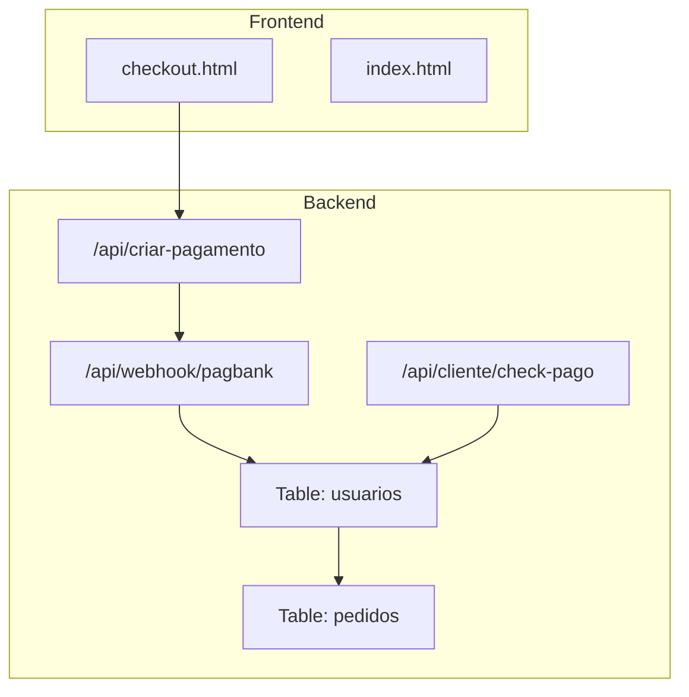
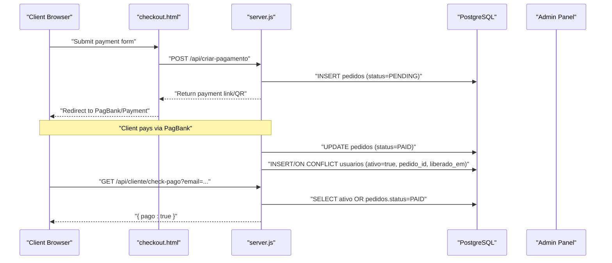
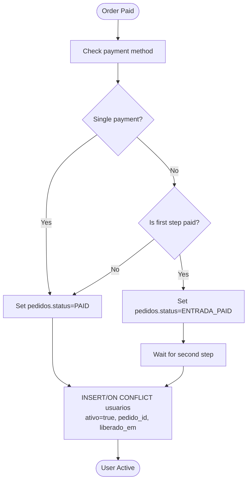
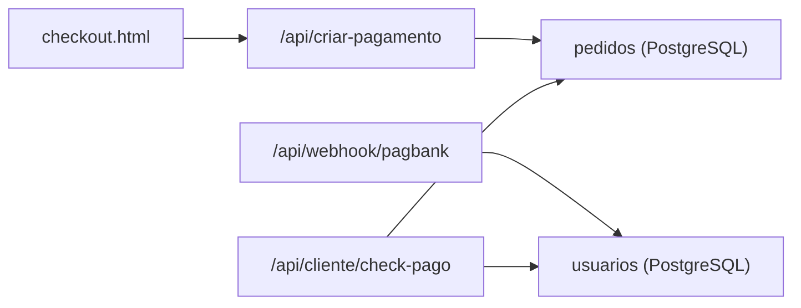

# Usuarios Table

<cite>
**Referenced Files in This Document**
- [database.sql](file://database.sql)
- [init-db.sql](file://init-db.sql)
- [server.js](file://server.js)
- [checkout.html](file://checkout.html)
- [PAGAMENTO-README.md](file://PAGAMENTO-README.md)
- [README.md](file://README.md)
</cite>

## Table of Contents
1. [Introduction](#introduction)
2. [Project Structure](#project-structure)
3. [Core Components](#core-components)
4. [Architecture Overview](#architecture-overview)
5. [Detailed Component Analysis](#detailed-component-analysis)
6. [Dependency Analysis](#dependency-analysis)
7. [Performance Considerations](#performance-considerations)
8. [Troubleshooting Guide](#troubleshooting-guide)
9. [Conclusion](#conclusion)

## Introduction
This document describes the usuarios table structure and user management functionality used by the system. It explains the database schema, field definitions, role-based access control, user activation workflow, and the connection to payment orders via the pedido_id foreign key. It also covers timestamp fields, password security considerations, email uniqueness constraints, and user status tracking. Finally, it provides examples of admin and client user records and their privileges.

## Project Structure
The user management system spans both frontend and backend components:
- Frontend pages handle user registration, login, and admin user creation.
- Backend APIs manage payment flows and user activation upon successful payment.
- Database schema defines the usuarios table and related indices.

**Diagram sources**
- [checkout.html](file://checkout.html)
- [server.js](file://server.js)
- [database.sql](file://database.sql)

**Section sources**
- [PAGAMENTO-README.md](file://PAGAMENTO-README.md)
- [README.md](file://README.md)

## Core Components
- usuarios table: stores user credentials, roles, activation status, and links to payment orders.
- pedidos table: tracks payment orders and statuses; used to trigger user activation.
- Payment flow: creates a pedidos record, then activates a user when the order reaches a paid state.
- Admin-only user creation: restricted to administrators.

Key points:
- Role-based access control: tipo field distinguishes admin and client.
- Activation: ativo flag becomes true when a payment order is confirmed.
- Foreign key: pedido_id links a user to the payment order that activated them.
- Timestamps: criado_em defaults to current timestamp; liberado_em is set when activation occurs.

**Section sources**
- [database.sql](file://database.sql)
- [server.js](file://server.js)

## Architecture Overview
The user activation workflow connects payment completion to user account creation and activation.

**Diagram sources**
- [server.js](file://server.js)
- [database.sql](file://database.sql)

## Detailed Component Analysis

### Usuarios Table Schema
The usuarios table defines the user model with the following fields:
- id: serial primary key
- nome: user display name
- email: unique, not null
- senha: stored credential
- tipo: role ('admin' or 'cliente')
- ativo: boolean activation flag
- pedido_id: foreign key to pedidos.id
- criado_em: timestamp when user was created
- liberado_em: timestamp when user was activated

Indices:
- email, tipo, ativo for efficient filtering and lookups

Constraints:
- email is unique
- ativo defaults to false
- tipo defaults to 'cliente'

**Section sources**
- [database.sql](file://database.sql)
- [init-db.sql](file://init-db.sql)

### Role-Based Access Control (RBAC)
- admin users: can create and delete other users; gain administrative UI elements.
- client users: can generate labels and view history; cannot manage users.

Privileges:
- Admin-only actions are gated by checking tipo in frontend and backend admin endpoints.

**Section sources**
- [README.md](file://README.md)
- [server.js](file://server.js)

### User Activation Workflow
Activation occurs when a payment order transitions to a paid state:
- On webhook receipt, the system updates pedidos status.
- If status indicates paid, the system inserts or updates a usuarios record with ativo=true and sets liberado_em.
- The inserted usuarios record references the pedidos.id via pedido_id.

**Diagram sources**
- [server.js](file://server.js)
- [database.sql](file://database.sql)

**Section sources**
- [server.js](file://server.js)

### Payment Order Relationship (pedido_id)
- Each user record can reference a pedidos record via pedido_id.
- The relationship is established during user activation triggered by payment confirmation.
- This enables auditability and linking user access to a specific order.

**Section sources**
- [server.js](file://server.js)
- [database.sql](file://database.sql)

### Timestamp Fields and Lifecycle Tracking
- criado_em: default timestamp when the user record is created.
- liberado_em: set when the user is activated (on successful payment).
- These timestamps support lifecycle tracking and reporting.

**Section sources**
- [database.sql](file://database.sql)

### Password Security Considerations
- Current implementation stores passwords in plain text within the frontend user registry.
- Recommendation: migrate to hashed passwords and secure session management for production environments.

**Section sources**
- [README.md](file://README.md)

### Email Uniqueness Constraints
- The email field is unique in the usuarios table, preventing duplicate accounts.
- Validation is enforced at the database level.

**Section sources**
- [database.sql](file://database.sql)

### User Status Tracking
- ativo flag indicates whether a user is currently active.
- The system considers a user paid if either:
  - usuarios.ativo is true, or
  - pedidos.status equals 'PAID' for the given email.

**Section sources**
- [server.js](file://server.js)

### Examples: Admin and Client User Records
- Admin user:
  - tipo: 'admin'
  - ativo: true (after activation)
  - Permissions: create/delete users, access admin panel
- Client user:
  - tipo: 'cliente'
  - ativo: true (after payment)
  - Permissions: generate labels, view history

Access patterns:
- Admin login triggers admin UI elements and user management actions.
- Client login grants access to label generation and history.

**Section sources**
- [README.md](file://README.md)
- [server.js](file://server.js)

## Dependency Analysis
The user management system depends on:
- PostgreSQL tables: usuarios and pedidos
- Backend endpoints: payment creation, webhook handling, and user check endpoint
- Frontend pages: checkout and admin UI

**Diagram sources**
- [server.js](file://server.js)
- [database.sql](file://database.sql)

**Section sources**
- [server.js](file://server.js)
- [database.sql](file://database.sql)

## Performance Considerations
- Indices on usuarios.email, usuarios.tipo, and usuarios.ativo improve query performance for filtering and lookups.
- Consider adding an index on usuarios.pedido_id for faster joins with pedidos.
- Minimize repeated checks by caching paid status results where appropriate.

[No sources needed since this section provides general guidance]

## Troubleshooting Guide
Common issues and resolutions:
- User not activating after payment:
  - Verify webhook delivery and pedidos status updates.
  - Confirm that the payment reached PAID status.
- Duplicate email errors:
  - Ensure email uniqueness is respected; check for existing records before insertion.
- Admin user creation failing:
  - Confirm current user has tipo=admin and is authenticated.
- Plain-text passwords:
  - Migrate to hashed passwords and secure sessions before production deployment.

**Section sources**
- [server.js](file://server.js)
- [database.sql](file://database.sql)
- [README.md](file://README.md)

## Conclusion
The usuarios table and associated payment flow provide a clear, auditable mechanism for user activation linked to payment completion. The RBAC model restricts sensitive operations to administrators, while the timestamp fields enable lifecycle tracking. For production readiness, prioritize secure password storage and robust session management.