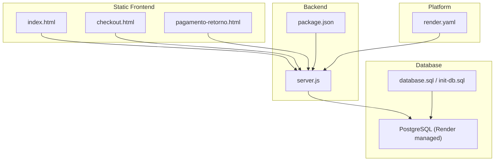
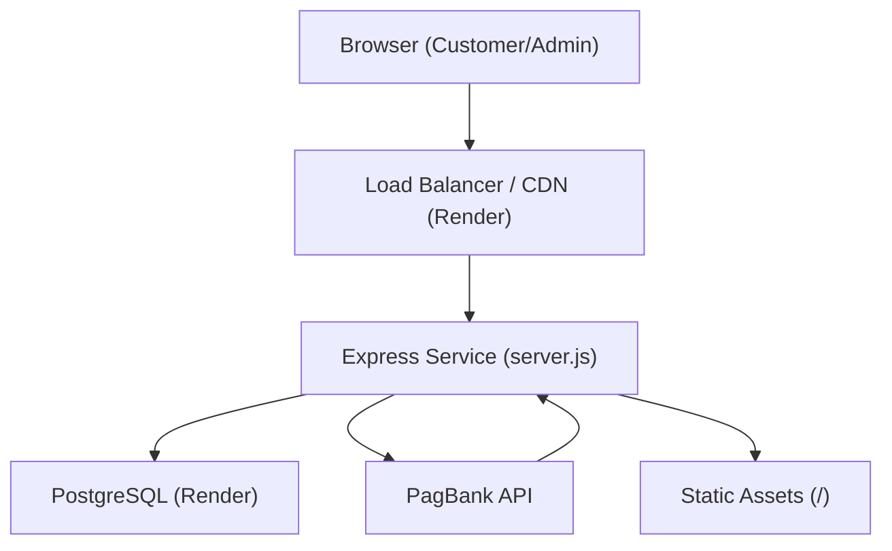
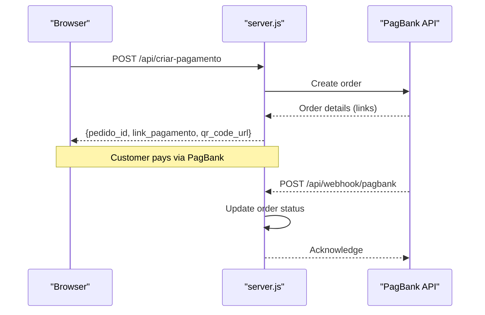
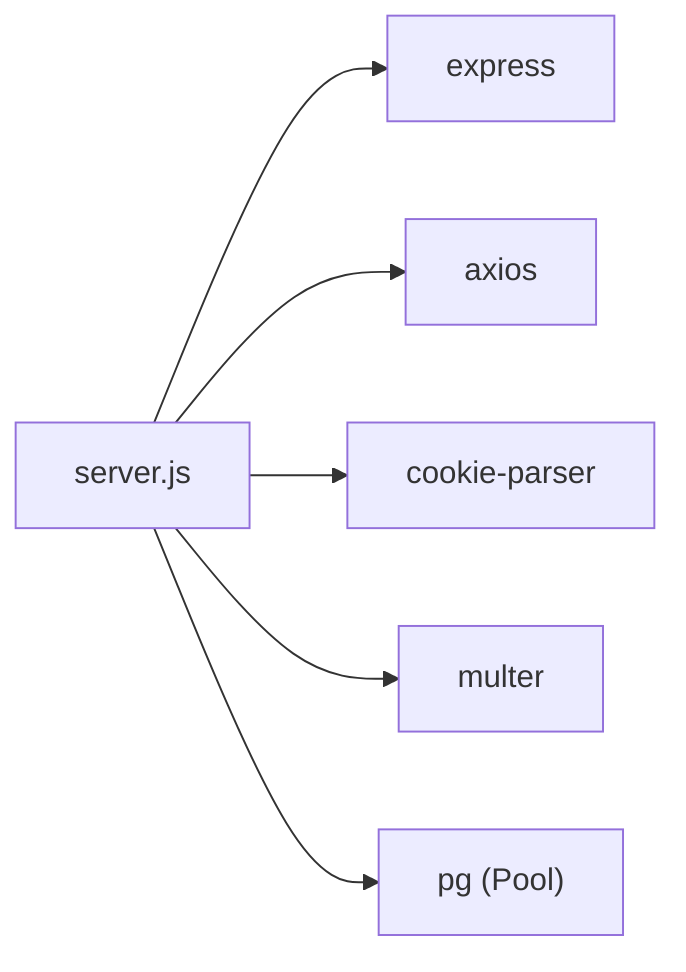

# Deployment Guide

<cite>
**Referenced Files in This Document**
- [render.yaml](file://render.yaml)
- [package.json](file://package.json)
- [server.js](file://server.js)
- [database.sql](file://database.sql)
- [init-db.sql](file://init-db.sql)
- [checkout.html](file://checkout.html)
- [index.html](file://index.html)
- [pagamento-retorno.html](file://pagamento-retorno.html)
- [README.md](file://README.md)
- [PAGAMENTO-README.md](file://PAGAMENTO-README.md)
</cite>

## Table of Contents
1. [Introduction](#introduction)
2. [Project Structure](#project-structure)
3. [Core Components](#core-components)
4. [Architecture Overview](#architecture-overview)
5. [Detailed Component Analysis](#detailed-component-analysis)
6. [Dependency Analysis](#dependency-analysis)
7. [Performance Considerations](#performance-considerations)
8. [Troubleshooting Guide](#troubleshooting-guide)
9. [Conclusion](#conclusion)
10. [Appendices](#appendices)

## Introduction
This guide provides end-to-end deployment instructions for production environments, focusing on the Render platform while also covering alternative deployment targets, environment configuration, database setup, monitoring/logging, security, backups, and operational procedures. It translates the repository’s configuration and code into actionable steps for reliable, secure, and scalable production operation.

## Project Structure
The project is a Node.js/Express backend with static HTML pages for checkout and landing. It integrates with PagBank for payments and PostgreSQL for persistence. Render is configured via a declarative YAML file.

**Diagram sources**
- [server.js](file://server.js)
- [render.yaml](file://render.yaml)
- [package.json](file://package.json)
- [database.sql](file://database.sql)
- [init-db.sql](file://init-db.sql)
- [index.html](file://index.html)
- [checkout.html](file://checkout.html)
- [pagamento-retorno.html](file://pagamento-retorno.html)

**Section sources**
- [server.js](file://server.js)
- [render.yaml](file://render.yaml)
- [package.json](file://package.json)
- [database.sql](file://database.sql)
- [init-db.sql](file://init-db.sql)
- [index.html](file://index.html)
- [checkout.html](file://checkout.html)
- [pagamento-retorno.html](file://pagamento-retorno.html)

## Core Components
- Backend service: Express server exposing payment APIs, admin endpoints, and static asset serving.
- Payment integration: Calls PagBank to create orders and receive webhooks.
- Database: PostgreSQL schema for orders and users; connection via DATABASE_URL.
- Static assets: Landing, checkout, and payment-return pages served by the backend.
- Platform configuration: Render YAML defines build/start commands and environment variables.

Key production configuration touchpoints:
- Environment variables consumed by the backend (e.g., database URL, payment token, admin credentials).
- Build and start commands for Render.
- Static asset serving for frontend pages.

**Section sources**
- [server.js](file://server.js)
- [render.yaml](file://render.yaml)
- [package.json](file://package.json)
- [database.sql](file://database.sql)
- [init-db.sql](file://init-db.sql)

## Architecture Overview
The production architecture centers on a single Render web service that serves both static pages and backend APIs. Payments flow through PagBank, with webhooks updating order statuses and triggering access grants.

**Diagram sources**
- [server.js](file://server.js)
- [render.yaml](file://render.yaml)

**Section sources**
- [server.js](file://server.js)
- [render.yaml](file://render.yaml)

## Detailed Component Analysis

### Render Platform Deployment
- Service type: Web service.
- Runtime: Node.js.
- Build command: Install dependencies.
- Start command: Launch the Node.js server.
- Environment variables:
  - NODE_ENV set to production.
  - PAGBANK_TOKEN for PagBank API access.
  - DATABASE_URL pointing to a PostgreSQL instance.

Operational notes:
- Render manages PostgreSQL connectivity; ensure DATABASE_URL points to the Render-managed database.
- Keep PAGBANK_TOKEN secret and avoid committing it to repositories.
- Use Render’s environment variable management for secrets.

**Section sources**
- [render.yaml](file://render.yaml)

### Environment Variables and Secrets
Critical variables used by the backend:
- DATABASE_URL: Connection string to PostgreSQL.
- PAGBANK_TOKEN: PagBank bearer token for API calls.
- ADMIN_*: Admin credentials and session signing secret.
- Optional: PIX_* keys for manual payment flow.
- Optional: PORT for overriding port binding.

Recommendations:
- Store secrets in Render’s dashboard, not in version control.
- Rotate tokens regularly and enforce least privilege.
- Use strong random values for ADMIN_SECRET.

**Section sources**
- [server.js](file://server.js)
- [render.yaml](file://render.yaml)

### Build and Runtime Commands
- Build: Install dependencies.
- Start: Run the Node.js server.

Ensure the start script matches the deployed environment (Render sets PORT automatically).

**Section sources**
- [render.yaml](file://render.yaml)
- [package.json](file://package.json)

### Database Setup and Migration
Two schema definitions are provided:
- database.sql: Full schema with indices and comments.
- init-db.sql: Minimal schema for quick setup.

Steps:
1. Provision a PostgreSQL database on Render.
2. Apply the chosen schema to create tables and indexes.
3. Verify connectivity via DATABASE_URL.

Notes:
- The backend attempts a connection on startup and logs success/failure.
- Indexes are defined for efficient queries on emails, statuses, and tokens.

**Section sources**
- [database.sql](file://database.sql)
- [init-db.sql](file://init-db.sql)
- [server.js](file://server.js)

### Payment Workflow and Webhooks
- Checkout page collects customer info and selection (à vista, entrada, cartão, manual).
- Backend creates a PagBank order and persists the record.
- Redirect URLs and webhook endpoint are constructed dynamically from incoming requests.
- Webhook updates order status and, for manual flow, triggers admin actions.

**Diagram sources**
- [server.js](file://server.js)
- [checkout.html](file://checkout.html)
- [pagamento-retorno.html](file://pagamento-retorno.html)

**Section sources**
- [server.js](file://server.js)
- [checkout.html](file://checkout.html)
- [pagamento-retorno.html](file://pagamento-retorno.html)

### Admin Panel and Access Control
- Admin login signs a cookie with HMAC and expiration.
- Cookie flags include httpOnly, sameSite, and secure in production.
- Admin endpoints list orders and manage manual flow confirmations.

Security considerations:
- Use HTTPS in production to enable secure cookies.
- Protect ADMIN_SECRET and rotate credentials.

**Section sources**
- [server.js](file://server.js)

### Static Asset Serving
- The backend serves static files from the project root and uploads directory.
- Ensure uploads directory exists and is writable by the service.

**Section sources**
- [server.js](file://server.js)

### Alternative Deployment Platforms
While Render is configured, the same backend can run on:
- Generic Node.js hosts (Heroku, Railway, Vercel Functions + external DB).
- Kubernetes with a Postgres sidecar or external managed DB.
- Docker-based deployments (see Containerization section).

Key requirements remain the same: DATABASE_URL, PAGBANK_TOKEN, and proper HTTPS for webhooks and admin cookies.

[No sources needed since this section provides general guidance]

## Dependency Analysis
Runtime dependencies include Express, CORS, Axios, cookie-parser, multer, and pg. These are declared in package.json and installed during the build phase.

**Diagram sources**
- [server.js](file://server.js)
- [package.json](file://package.json)

**Section sources**
- [package.json](file://package.json)
- [server.js](file://server.js)

## Performance Considerations
- Scale horizontally: Deploy multiple instances behind Render’s load balancer.
- Optimize database:
  - Use Render’s managed PostgreSQL tier appropriate for workload.
  - Monitor slow queries and consider adding missing indexes if needed.
- CDN/static delivery: Render serves static assets; keep frontend lean.
- Connection pooling: The backend uses a pooled PostgreSQL connection; tune pool size as needed.
- Request limits: Multer enforces file size limits; adjust as required.
- Health checks: Add a lightweight GET endpoint for platform health probes.

[No sources needed since this section provides general guidance]

## Troubleshooting Guide
Common production issues and resolutions:

- Database connection failures
  - Symptom: Startup logs show connection errors.
  - Actions: Verify DATABASE_URL, network access, and PostgreSQL availability on Render.

- Missing or invalid PAGBANK_TOKEN
  - Symptom: Payment creation fails with authorization errors.
  - Actions: Confirm token in Render environment variables and regenerate if expired.

- Webhook not received
  - Symptom: Orders remain pending after payment.
  - Actions: Ensure webhook URL is configured in PagBank; verify HTTPS and domain routing.

- Admin cookie not secure
  - Symptom: Admin login fails or cookie rejected.
  - Actions: Enable HTTPS and ensure NODE_ENV=production so secure flag is set.

- Upload failures
  - Symptom: Comprovante PIX upload errors.
  - Actions: Check uploads directory permissions and disk space.

- Port binding issues
  - Symptom: Service does not start or binds to unexpected port.
  - Actions: Allow Render to set PORT; do not hardcode port in production.

**Section sources**
- [server.js](file://server.js)
- [render.yaml](file://render.yaml)

## Conclusion
This guide outlines a production-ready deployment for the payment and labeling system using Render. By securing environment variables, provisioning PostgreSQL, configuring webhooks, and following the operational recommendations herein, you can achieve a robust, scalable, and maintainable setup.

[No sources needed since this section summarizes without analyzing specific files]

## Appendices

### A. Production Checklist
- [ ] Set NODE_ENV=production in Render.
- [ ] Configure DATABASE_URL to Render-managed PostgreSQL.
- [ ] Add PAGBANK_TOKEN securely in Render.
- [ ] Verify webhook URL in PagBank points to the deployed domain.
- [ ] Confirm HTTPS termination at the platform level.
- [ ] Review and apply database schema.
- [ ] Set up monitoring and logging.
- [ ] Plan backups and disaster recovery.
- [ ] Define maintenance windows and rollback procedures.

[No sources needed since this section provides general guidance]

### B. Monitoring and Logging
- Use Render’s built-in logs for application and platform events.
- For structured logs, integrate a logger library and export to stdout/stderr.
- Set up alerts for:
  - High error rates on payment endpoints.
  - Database connection failures.
  - Webhook latency or downtime.

[No sources needed since this section provides general guidance]

### C. Security Hardening
- TLS/SSL: Enforce HTTPS for all endpoints; configure platform certificates.
- Headers: Add security middleware (e.g., helmet) to set CSP, HSTS, etc.
- Secrets: Never commit tokens or passwords; use platform secret stores.
- Network: Restrict inbound ports; rely on platform firewalls.
- Admin access: Use strong ADMIN_SECRET and rotate credentials.

[No sources needed since this section provides general guidance]

### D. Backup and Disaster Recovery
- Database backups: Use Render-managed snapshots or export SQL periodically.
- Artifacts: Back up uploads directory if applicable.
- DR plan: Automate restore verification and failover testing.

[No sources needed since this section provides general guidance]

### E. Maintenance Schedule
- Weekly: Review logs, monitor database health.
- Monthly: Rotate secrets, update dependencies, test backups.
- Quarterly: Audit access controls and security posture.

[No sources needed since this section provides general guidance]

### F. Containerization Considerations
- Base image: Use a minimal Node.js runtime.
- Entrypoint: Use the start script defined in package.json.
- Environment: Mirror Render variables (DATABASE_URL, PAGBANK_TOKEN, NODE_ENV).
- Persistence: Mount persistent volumes for uploads if needed.
- Health checks: Add a simple GET endpoint for readiness/liveness.

[No sources needed since this section provides general guidance]