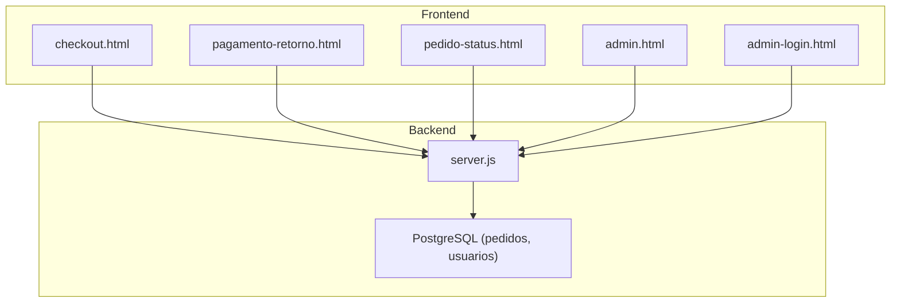
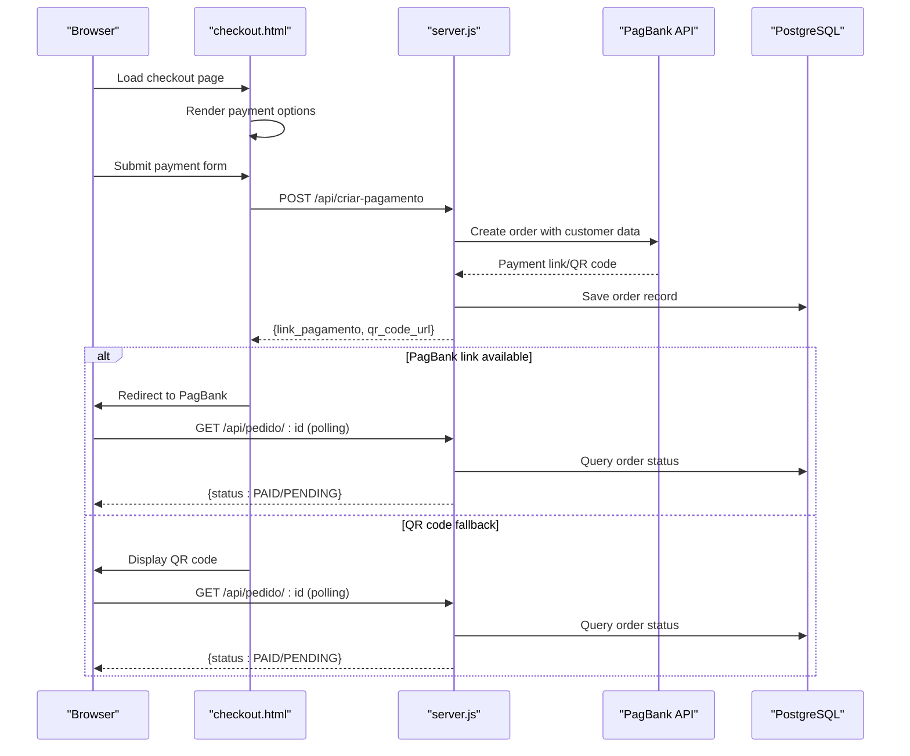
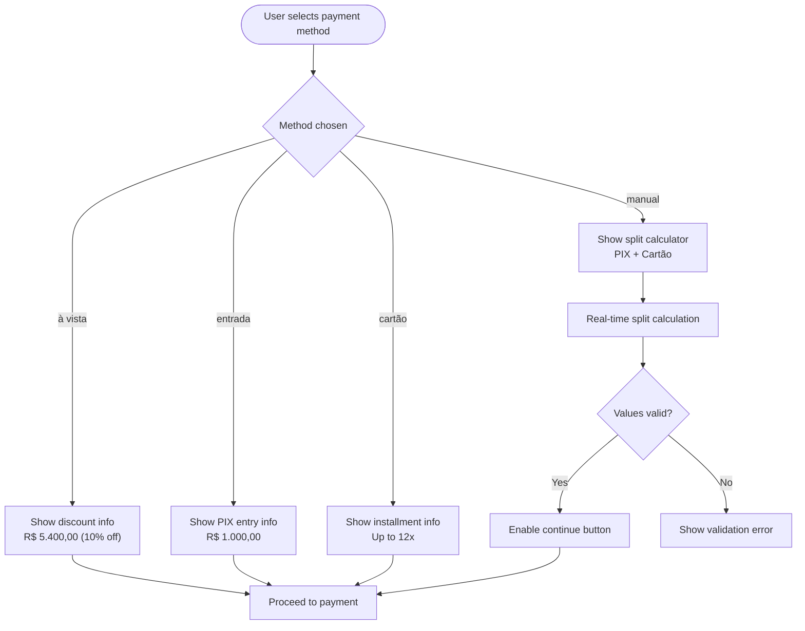
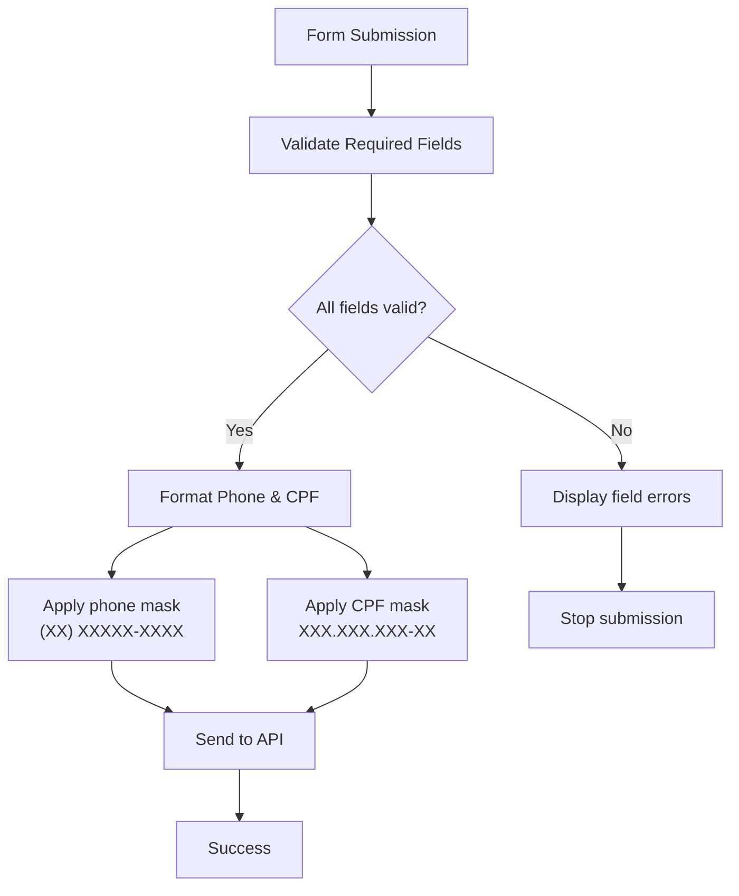
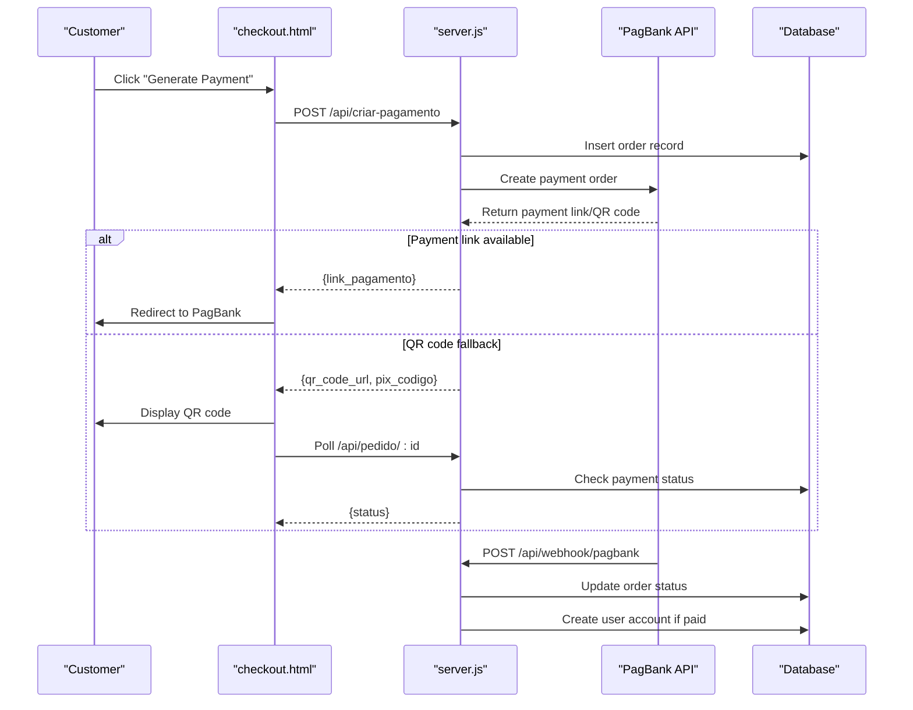
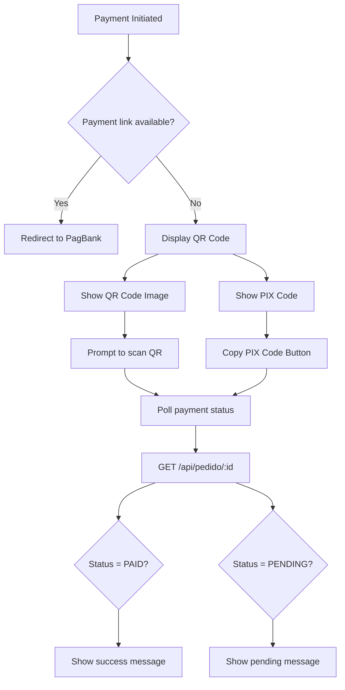
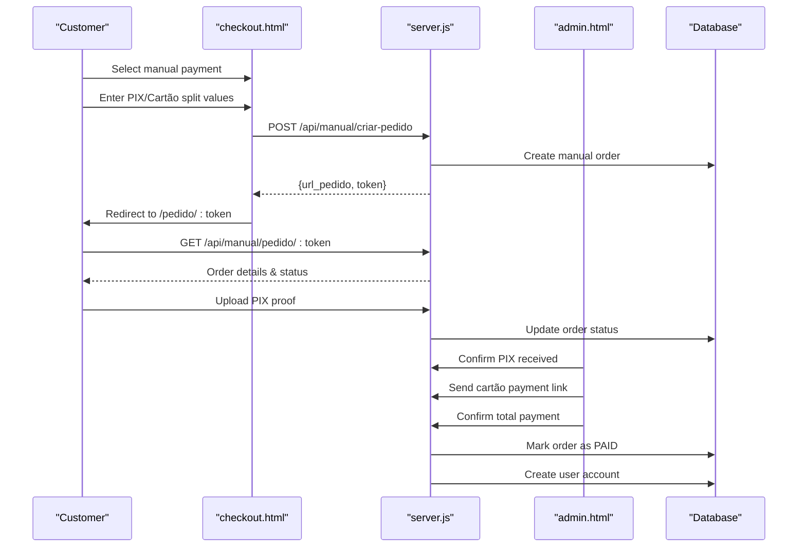
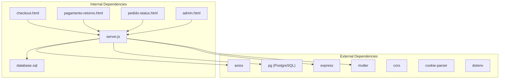

# Checkout Interface (checkout.html)

<cite>
**Referenced Files in This Document**
- [checkout.html](file://checkout.html)
- [server.js](file://server.js)
- [pagamento-retorno.html](file://pagamento-retorno.html)
- [pedido-status.html](file://pedido-status.html)
- [admin.html](file://admin.html)
- [admin-login.html](file://admin-login.html)
- [database.sql](file://database.sql)
- [package.json](file://package.json)
- [PAGAMENTO-README.md](file://PAGAMENTO-README.md)
</cite>

## Table of Contents
1. [Introduction](#introduction)
2. [Project Structure](#project-structure)
3. [Core Components](#core-components)
4. [Architecture Overview](#architecture-overview)
5. [Detailed Component Analysis](#detailed-component-analysis)
6. [Dependency Analysis](#dependency-analysis)
7. [Performance Considerations](#performance-considerations)
8. [Troubleshooting Guide](#troubleshooting-guide)
9. [Conclusion](#conclusion)

## Introduction
This document provides comprehensive technical documentation for the checkout interface component (checkout.html), focusing on the payment selection interface, form validation, payment processing workflow, QR code display, and integration with the backend payment controller. It explains how the system integrates with PagBank for payment processing, handles customer information collection, manages payment states, and coordinates with the admin panel for manual payment flows.

## Project Structure
The checkout interface is part of a larger Node.js/Express application that provides payment processing capabilities with two primary payment flows:
- Standard PagBank integration for instant payment initiation
- Manual payment flow combining PIX and credit card with administrative oversight

**Diagram sources**
- [checkout.html](file://checkout.html)
- [server.js](file://server.js)
- [database.sql](file://database.sql)

**Section sources**
- [checkout.html](file://checkout.html)
- [server.js](file://server.js)
- [database.sql](file://database.sql)

## Core Components
The checkout interface consists of several interconnected components:

### Payment Selection Interface
- Four payment method options: à vista (discounted), entrada (PIX deposit), cartão (credit card), and manual (PIX + Cartão combination)
- Dynamic selection highlighting and details panels
- Real-time price calculations and discount displays

### Customer Information Form
- Required fields: name, email, CPF, and WhatsApp phone number
- Input masks for CPF and phone number formatting
- Real-time validation and error feedback

### Payment Processing Engine
- API integration with PagBank for instant payment initiation
- QR code fallback display for PIX payments
- Status polling mechanism for payment verification
- Redirect handling for payment completion

### Manual Payment Flow
- Split-value calculation for PIX vs. Cartão division
- Quick suggestions for common PIX amounts
- Administrative approval workflow for manual payments

**Section sources**
- [checkout.html](file://checkout.html)
- [server.js](file://server.js)

## Architecture Overview
The checkout system follows a client-server architecture with asynchronous payment processing:

**Diagram sources**
- [checkout.html](file://checkout.html)
- [server.js](file://server.js)

## Detailed Component Analysis

### Payment Selection Interface
The payment selection system provides four distinct payment methods with dynamic UI updates:

**Diagram sources**
- [checkout.html](file://checkout.html)

Key features:
- Real-time price calculations with discount display
- Dynamic details panels showing payment specifics
- Input validation for manual payment split
- Quick PIX amount suggestions

**Section sources**
- [checkout.html](file://checkout.html)

### Form Validation System
The form validation system ensures data integrity and provides immediate feedback:

Validation rules:
- All fields are required (name, email, CPF, phone)
- CPF formatted as XXX.XXX.XXX-XX
- Phone formatted as (XX) XXXXX-XXXX
- Manual payment split validates minimum amounts and exact totals

**Diagram sources**
- [checkout.html](file://checkout.html)

**Section sources**
- [checkout.html](file://checkout.html)

### Payment Processing Workflow
The payment processing workflow integrates with PagBank and handles multiple scenarios:

**Diagram sources**
- [checkout.html](file://checkout.html)
- [server.js](file://server.js)

**Section sources**
- [checkout.html](file://checkout.html)
- [server.js](file://server.js)

### QR Code Display and Payment Initiation
The QR code display system provides multiple payment initiation methods:

**Diagram sources**
- [checkout.html](file://checkout.html)

**Section sources**
- [checkout.html](file://checkout.html)

### Manual Payment Flow (PIX + Cartão)
The manual payment flow provides administrative oversight for combined payment methods:

**Diagram sources**
- [checkout.html](file://checkout.html)
- [server.js](file://server.js)
- [pedido-status.html](file://pedido-status.html)
- [admin.html](file://admin.html)

**Section sources**
- [checkout.html](file://checkout.html)
- [server.js](file://server.js)
- [pedido-status.html](file://pedido-status.html)
- [admin.html](file://admin.html)

## Dependency Analysis
The checkout system has the following key dependencies:

**Diagram sources**
- [package.json](file://package.json)
- [server.js](file://server.js)

**Section sources**
- [package.json](file://package.json)
- [server.js](file://server.js)

## Performance Considerations
- **Status Polling**: The frontend polls the backend every 5 seconds for payment status updates. This interval can be adjusted based on performance requirements.
- **Database Queries**: PostgreSQL indexing on email and status fields optimizes order lookups.
- **Memory Usage**: QR code images are loaded dynamically; consider caching for high-traffic scenarios.
- **API Response Times**: PagBank API latency affects overall payment processing time.

## Troubleshooting Guide

### Common Issues and Solutions

**Payment Creation Failures**
- Verify PagBank token configuration in environment variables
- Check network connectivity to PagBank API
- Review server logs for detailed error messages

**QR Code Display Problems**
- Ensure HTTPS deployment for QR code scanning compatibility
- Verify image loading permissions
- Check browser camera/QR scanner permissions

**Manual Payment Flow Issues**
- Confirm administrative approval steps are completed
- Verify file upload restrictions (JPG, PNG, PDF, ≤5MB)
- Check administrative session authentication

**Database Connection Problems**
- Verify PostgreSQL credentials and connection string
- Check database schema initialization
- Monitor connection pool limits

**Section sources**
- [server.js](file://server.js)
- [PAGAMENTO-README.md](file://PAGAMENTO-README.md)

## Conclusion
The checkout interface provides a robust payment processing solution with dual integration approaches. The PagBank integration offers seamless instant payments, while the manual flow accommodates complex payment arrangements requiring administrative oversight. The system's modular design, comprehensive validation, and clear error handling make it suitable for production deployment with proper security configurations and monitoring.