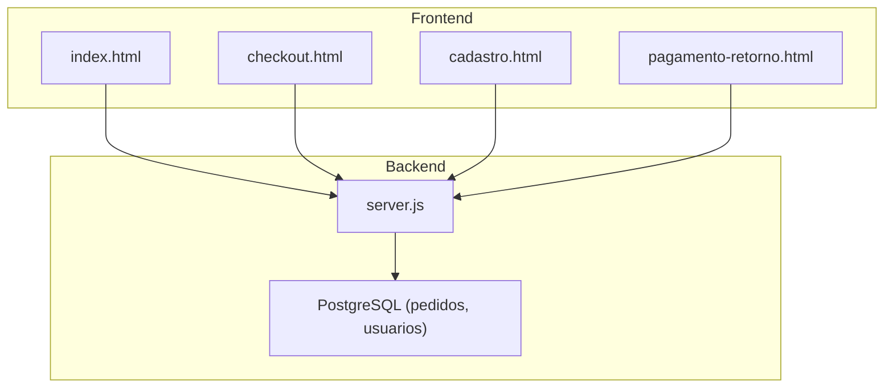
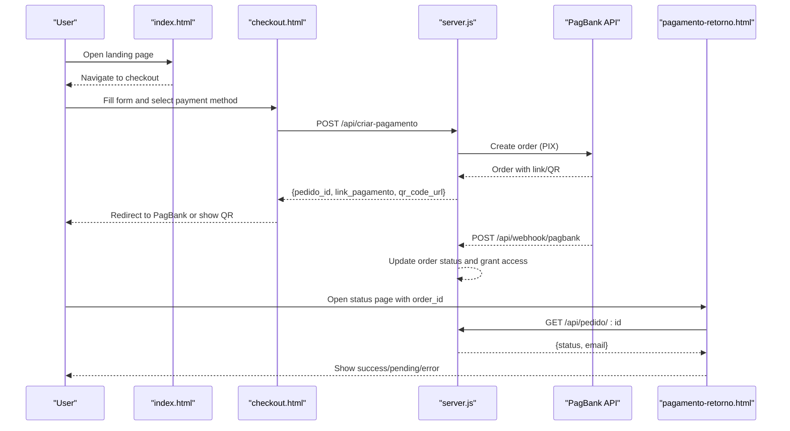
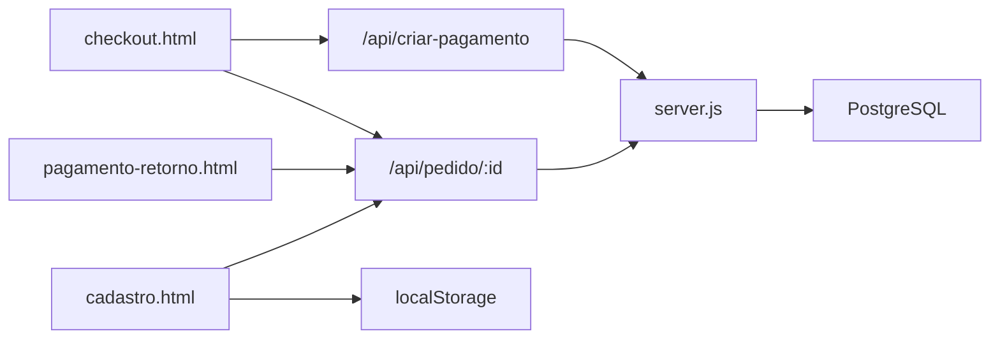

# Frontend Components

<cite>
**Referenced Files in This Document**
- [index.html](file://index.html)
- [checkout.html](file://checkout.html)
- [cadastro.html](file://cadastro.html)
- [pagamento-retorno.html](file://pagamento-retorno.html)
- [server.js](file://server.js)
- [database.sql](file://database.sql)
- [README.md](file://README.md)
- [PAGAMENTO-README.md](file://PAGAMENTO-README.md)
</cite>

## Table of Contents
1. [Introduction](#introduction)
2. [Project Structure](#project-structure)
3. [Core Components](#core-components)
4. [Architecture Overview](#architecture-overview)
5. [Detailed Component Analysis](#detailed-component-analysis)
6. [Dependency Analysis](#dependency-analysis)
7. [Performance Considerations](#performance-considerations)
8. [Troubleshooting Guide](#troubleshooting-guide)
9. [Conclusion](#conclusion)
10. [Appendices](#appendices)

## Introduction
This document provides comprehensive frontend documentation for the qretiquetas.com project, focusing on the HTML interface components and their integration with the backend. It covers:
- Landing page (index.html) navigation, pricing display, and user access controls
- Checkout interface (checkout.html) with payment method selection, form validation, and PagBank integration
- Label generation interface (cadastro.html) including QR code creation, template selection, and print functionality
- Payment status page (pagamento-retorno.html) for displaying payment results and redirect handling
- Responsive design considerations, browser compatibility, and offline functionality
- Frontend-backend communication patterns and data handling using localStorage
- User experience considerations and accessibility features

## Project Structure
The frontend is composed of four primary HTML pages and a Node.js/Express backend:
- index.html: Marketing and navigation hub
- checkout.html: Payment initiation and Pix flow
- cadastro.html: Label generation, user management, and history
- pagamento-retorno.html: Payment verification and status display
- server.js: Backend API for payment orchestration and database persistence
- database.sql: PostgreSQL schema for orders and users

**Diagram sources**
- [index.html](file://index.html)
- [checkout.html](file://checkout.html)
- [cadastro.html](file://cadastro.html)
- [pagamento-retorno.html](file://pagamento-retorno.html)
- [server.js](file://server.js)
- [database.sql](file://database.sql)

**Section sources**
- [README.md](file://README.md)
- [PAGAMENTO-README.md](file://PAGAMENTO-README.md)

## Core Components
- Landing Page (index.html): Provides navigation to checkout, pricing display, feature highlights, and usage instructions.
- Checkout (checkout.html): Handles payment method selection, form validation, Pix QR generation, and status polling.
- Label Generator (cadastro.html): Manages user authentication, label creation, QR code rendering, and printing.
- Payment Status (pagamento-retorno.html): Displays payment outcomes and redirects based on PagBank callbacks.

**Section sources**
- [index.html](file://index.html)
- [checkout.html](file://checkout.html)
- [cadastro.html](file://cadastro.html)
- [pagamento-retorno.html](file://pagamento-retorno.html)

## Architecture Overview
The frontend communicates with the backend via REST endpoints. Payments are initiated from checkout, redirected to PagBank, and confirmed via webhooks. The label generator stores data locally and integrates with the backend for user authentication and order status checks.

**Diagram sources**
- [checkout.html](file://checkout.html)
- [server.js](file://server.js)
- [pagamento-retorno.html](file://pagamento-retorno.html)

## Detailed Component Analysis

### Landing Page (index.html)
- Navigation: Fixed header with logo and title; links to “How to Use” and “Price” sections.
- Pricing Display: Prominent price card showing investment and benefits.
- Features Grid: Six feature cards highlighting QR code, internal/external labels, printing, history, access control, and company data.
- Instructions: Video tutorial and step-by-step guide.
- Call-to-Action: Links to checkout and promotional messaging.
- Responsive Design: Media queries adjust layout for smaller screens.

Key UX and accessibility considerations:
- Semantic headings and lists improve screen reader support.
- Clear focus states and hover effects for interactive elements.
- Mobile-first grid layouts for feature and instruction sections.

**Section sources**
- [index.html](file://index.html)
- [README.md](file://README.md)

### Checkout Interface (checkout.html)
- Payment Method Selection: Three options (à vista, entrada via Pix, cartão) with visual indicators and details panels.
- Form Validation: Required fields for name, email, CPF, and phone; masks applied to CPF and phone inputs.
- Payment Initiation: On submit, frontend posts customer data to /api/criar-pagamento and handles responses.
- Pix Flow: If a link is provided, the browser redirects to PagBank; otherwise, QR code and copyable Pix code are shown.
- Status Polling: Periodic polling of /api/pedido/:id to update UI based on status (PAID, ENTRADA_PAID, etc.).
- Redirect Handling: After confirmation, the page displays success or pending states and links to the label generator.

Frontend-backend communication patterns:
- POST /api/criar-pagamento with customer and method data.
- GET /api/pedido/:id for status updates.
- Uses fetch for asynchronous requests and localStorage for temporary state.

Offline and compatibility:
- Works offline after initial load; QR code fallback ensures Pix can be shown even if redirect fails.
- Responsive layout adapts to mobile devices.

Accessibility:
- Focus management during form submission and modal-like status containers.
- Clear status messages and icons for success/pending/error states.

**Section sources**
- [checkout.html](file://checkout.html)
- [server.js](file://server.js)
- [PAGAMENTO-README.md](file://PAGAMENTO-README.md)

### Label Generation Interface (cadastro.html)
- Authentication: Login/register tabs with session persistence via sessionStorage.
- Navigation Tabs: Labels, History, Admin (admin-only).
- Label Creation:
  - Inputs for product, lot, expiry, quantity, color, and type (internal/external).
  - External fields conditionally shown (weight, price, color, company, CNPJ, ingredients, manufacturer).
  - Generates label previews with QR codes using the QRious library.
- Printing: Print styles optimize labels for thermal printers.
- History: Lists generated labels with actions to reprint or delete.
- Admin Panel: QR position configuration (vertical/horizontal), user creation/exclusion.

Data handling:
- Uses localStorage keys: alimentares_users, alimentares_labels, alimentares_currentUser, alimentares_config.
- DataManager module encapsulates CRUD operations for users, labels, and configuration.

User experience:
- Real-time preview updates as users change inputs.
- Color pickers and masked inputs improve usability.
- Tabbed interface organizes functionality clearly.

Accessibility:
- Proper labels and ARIA-friendly buttons.
- Focus-visible indicators and keyboard navigation support.

**Section sources**
- [cadastro.html](file://cadastro.html)
- [database.sql](file://database.sql)
- [README.md](file://README.md)

### Payment Status Page (pagamento-retorno.html)
- Dynamic Status Display: Spinner while verifying, success, pending, or error states.
- Query Parameter Handling: Extracts order_id from URL and calls /api/pedido/:id.
- Outcome Handling:
  - PAID/COMPLETO: Success with order and email details.
  - ENTRADA_PAID: Pending with instructions to pay the remainder via card.
  - Other: Pending with order ID.

Integration:
- Calls backend endpoint to fetch order status.
- Redirects to label generator upon successful payment.

**Section sources**
- [pagamento-retorno.html](file://pagamento-retorno.html)
- [server.js](file://server.js)

## Dependency Analysis
- Frontend-to-Backend Dependencies:
  - checkout.html depends on server.js endpoints for payment creation and status polling.
  - cadastro.html relies on localStorage for offline operation and server.js for user management and order status checks.
  - pagamento-retorno.html depends on server.js for order verification.
- Backend-to-Database Dependencies:
  - server.js writes and reads order and user data to/from PostgreSQL tables defined in database.sql.

**Diagram sources**
- [checkout.html](file://checkout.html)
- [pagamento-retorno.html](file://pagamento-retorno.html)
- [cadastro.html](file://cadastro.html)
- [server.js](file://server.js)
- [database.sql](file://database.sql)

**Section sources**
- [server.js](file://server.js)
- [database.sql](file://database.sql)

## Performance Considerations
- Offline Operation: The label generator works offline after initial load; data is stored in localStorage.
- Minimal External Dependencies: QR code generation uses a CDN-hosted library, reducing bundle size.
- Efficient Printing: Print styles minimize layout overhead for thermal printers.
- Status Polling: Checkout polls every 5 seconds; consider throttling or WebSocket alternatives for production.

## Troubleshooting Guide
Common issues and resolutions:
- Payment Redirection Failures:
  - Symptom: No redirect to PagBank; QR not shown.
  - Resolution: Verify /api/criar-pagamento response includes link or QR; ensure PAGBANK_TOKEN is configured.
- Status Verification Errors:
  - Symptom: Status page shows error or blank.
  - Resolution: Confirm order_id parameter is present; check /api/pedido/:id availability.
- Label Printing Problems:
  - Symptom: Labels misaligned or missing QR codes.
  - Resolution: Adjust QR position setting (vertical/horizontal) in Admin; verify print dialog settings.
- Authentication Issues:
  - Symptom: Login fails or session lost.
  - Resolution: Ensure sessionStorage is enabled; verify credentials match those in DataManager.

**Section sources**
- [checkout.html](file://checkout.html)
- [pagamento-retorno.html](file://pagamento-retorno.html)
- [cadastro.html](file://cadastro.html)
- [server.js](file://server.js)

## Conclusion
The frontend components deliver a cohesive, user-friendly experience for marketing, payment, and label generation. They leverage localStorage for offline capability, integrate with PagBank for secure payments, and provide robust printing workflows. The architecture cleanly separates concerns between frontend UI and backend APIs, enabling scalability and maintainability.

## Appendices

### Responsive Design and Browser Compatibility
- Responsive Layouts: Media queries and CSS Grid/Flexbox adapt content for mobile and tablet.
- Browser Support: Tested on Chrome, Edge, Firefox, Safari, and mobile browsers; offline functionality verified post-initial load.

**Section sources**
- [index.html](file://index.html)
- [checkout.html](file://checkout.html)
- [cadastro.html](file://cadastro.html)
- [README.md](file://README.md)

### Offline Functionality Implementation
- Local Data Storage: Users, labels, and configuration persisted in localStorage.
- Session Persistence: Current user stored in sessionStorage for session continuity.
- Print Optimization: Dedicated print media queries ensure consistent label output.

**Section sources**
- [cadastro.html](file://cadastro.html)
- [README.md](file://README.md)

### Frontend-Backend Communication Patterns
- REST Endpoints Used:
  - POST /api/criar-pagamento: Initiates payment with customer data and method.
  - GET /api/pedido/:id: Checks order status for UI updates.
  - POST /api/webhook/pagbank: Receives PagBank notifications to update order state.
- Data Flow:
  - Frontend collects user inputs and sends them to backend.
  - Backend interacts with PagBank and persists order state.
  - Frontend polls status and renders results.

**Section sources**
- [checkout.html](file://checkout.html)
- [pagamento-retorno.html](file://pagamento-retorno.html)
- [server.js](file://server.js)