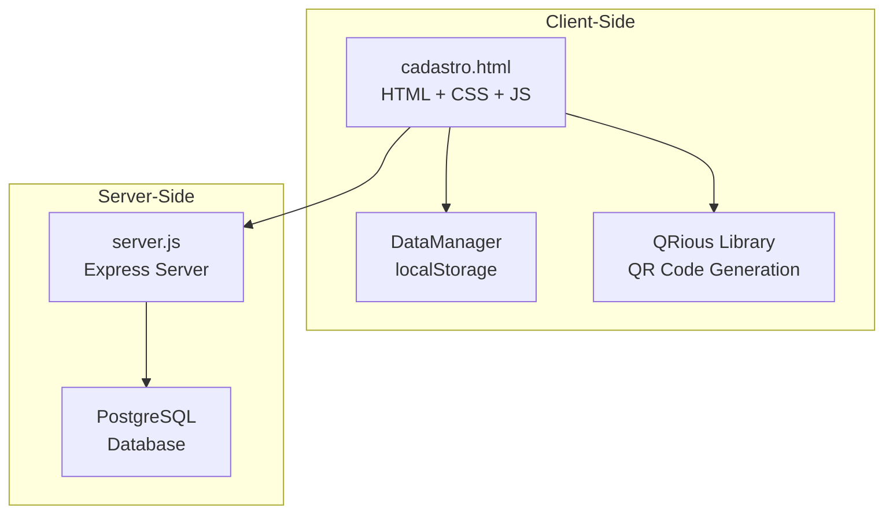
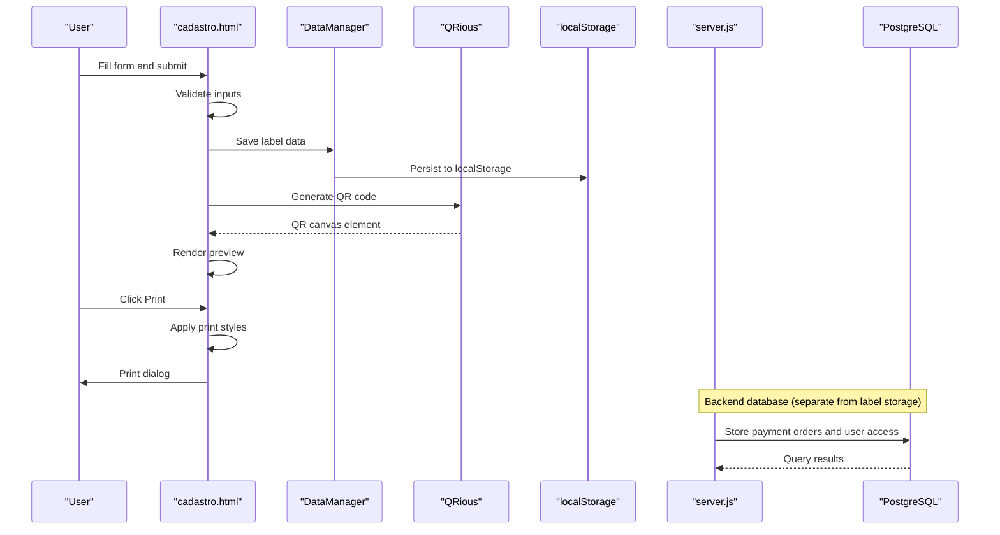
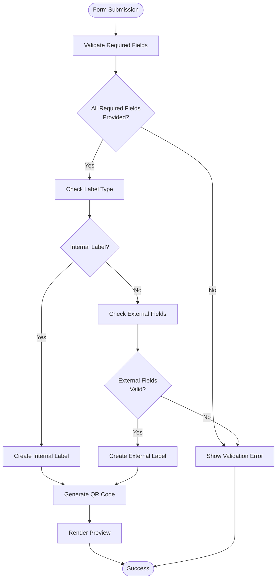
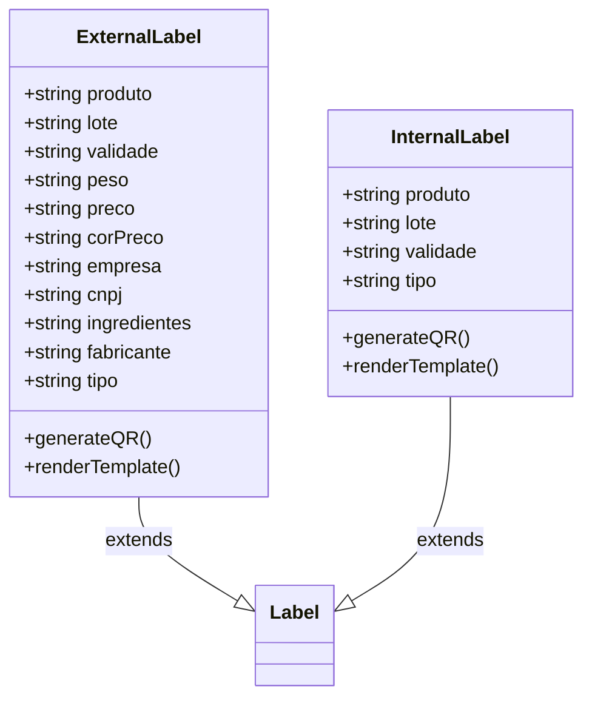
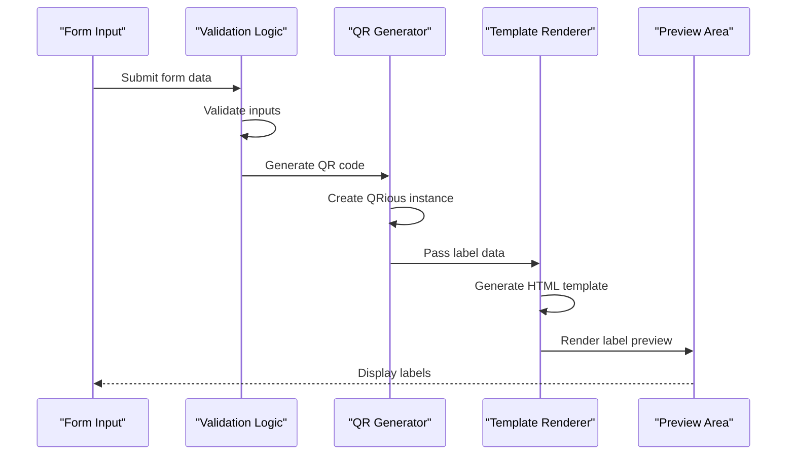
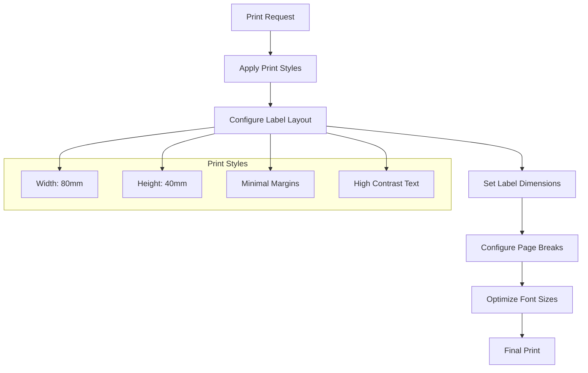
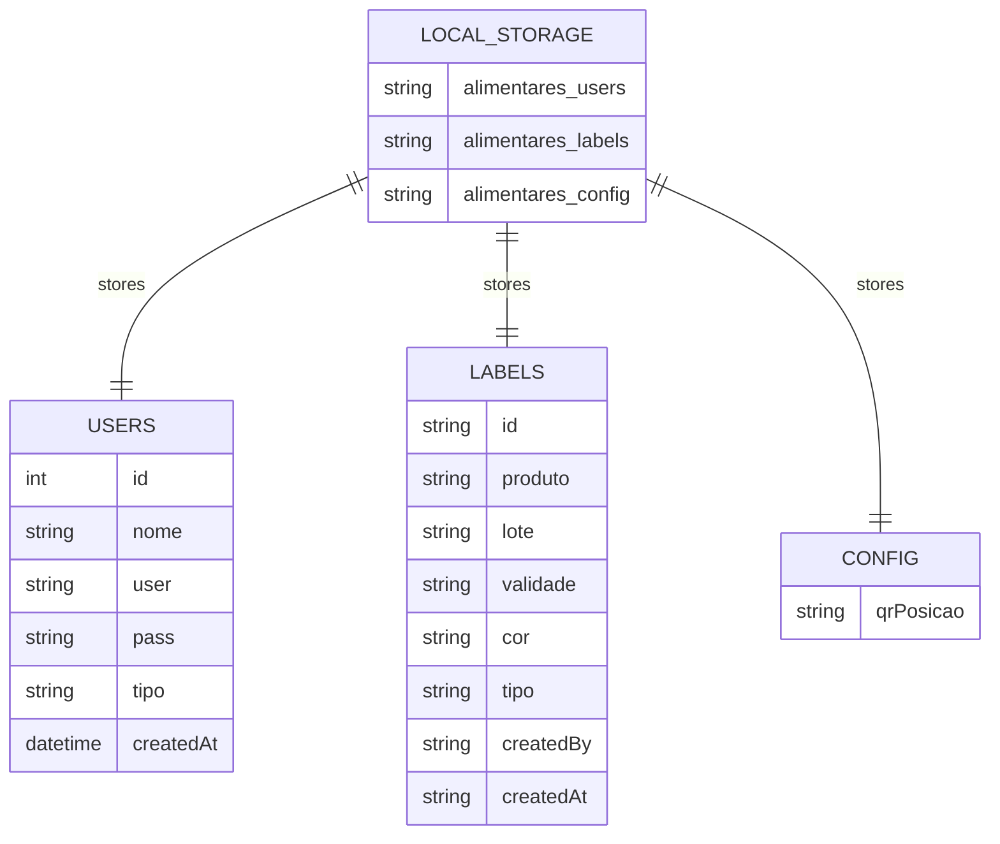
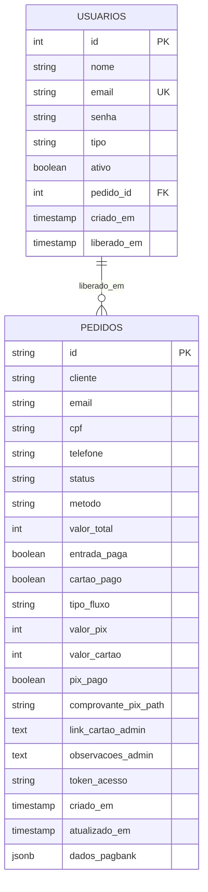
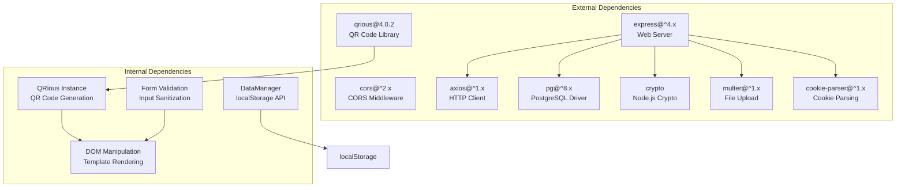

# Label Generation Interface (cadastro.html)

<cite>
**Referenced Files in This Document**
- [cadastro.html](file://cadastro.html)
- [server.js](file://server.js)
- [database.sql](file://database.sql)
- [init-db.sql](file://init-db.sql)
- [dados/etiquetas.json](file://dados/etiquetas.json)
- [dados/usuarios.json](file://dados/usuarios.json)
</cite>

## Table of Contents
1. [Introduction](#introduction)
2. [Project Structure](#project-structure)
3. [Core Components](#core-components)
4. [Architecture Overview](#architecture-overview)
5. [Detailed Component Analysis](#detailed-component-analysis)
6. [Dependency Analysis](#dependency-analysis)
7. [Performance Considerations](#performance-considerations)
8. [Troubleshooting Guide](#troubleshooting-guide)
9. [Conclusion](#conclusion)

## Introduction
This document provides comprehensive documentation for the label generation interface component (cadastro.html). It covers the product registration form, label type selection, external label configuration, QR code generation, label preview system, print optimization, data persistence with localStorage, template rendering, and form validation. It also explains the integration with the backend database for storing generated labels and user access control for label management.

## Project Structure
The label generation interface is implemented as a single-page application within cadastro.html. It includes:
- Authentication and user management
- Label creation form with internal and external label options
- Dynamic preview and printing
- Local data persistence using localStorage
- Admin panel for configuration and user management

**Diagram sources**
- [cadastro.html](file://cadastro.html)
- [server.js](file://server.js)

**Section sources**
- [cadastro.html](file://cadastro.html)
- [server.js](file://server.js)

## Core Components
The label generation interface consists of several core components:

### Authentication System
- Login and registration forms for users
- Session management using sessionStorage
- Role-based access control (admin/client)
- User data stored in localStorage

### Label Creation Form
- Product registration with name, batch number, expiration date, and quantity
- Color picker for label background
- Label type selection between internal (stock) and external (commercial) labels
- External label configuration including price, color selection, optional weight, company CNPJ, and manufacturer information

### Template Rendering System
- Dynamic label preview generation
- Support for two QR code positions (vertical/horizontal)
- Responsive label templates for different label types

### QR Code Generation
- Integration with QRious library for QR code creation
- Dynamic QR code generation based on label data
- Configurable QR code positioning

### Print Optimization
- Media-specific CSS for print layout
- Optimized label sizing for thermal printers
- Page break configuration for label sheets

**Section sources**
- [cadastro.html](file://cadastro.html)

## Architecture Overview
The system follows a client-server architecture with local data persistence:

**Diagram sources**
- [cadastro.html](file://cadastro.html)
- [server.js](file://server.js)

## Detailed Component Analysis

### Product Registration Form
The form collects essential product information:

**Diagram sources**
- [cadastro.html](file://cadastro.html)

Key form fields and validation:
- Product name: Required for all label types
- Batch number: Required for all label types  
- Expiration date: Required for all label types
- Quantity: Numeric, minimum 1
- Color: Hex color picker for label background
- Label type: Dropdown selection (internal/external)

**Section sources**
- [cadastro.html](file://cadastro.html)

### Label Type Selection
The system supports two distinct label types with different data requirements:

#### Internal Labels (Stock Control)
- Minimal data requirements
- Focus on identification and inventory tracking
- QR code contains basic product information

#### External Labels (Commercial)
- Enhanced data requirements for commercial sale
- Additional fields for pricing and company information
- QR code contains complete product information

**Section sources**
- [cadastro.html](file://cadastro.html)

### External Label Configuration
External labels support comprehensive commercial information:

**Diagram sources**
- [cadastro.html](file://cadastro.html)

External label fields:
- Weight specification (optional)
- Price input with currency formatting
- Color selection for price display
- Company name and CNPJ
- Ingredient list
- Manufacturer information

**Section sources**
- [cadastro.html](file://cadastro.html)

### QR Code Generation and Label Preview
The system generates QR codes dynamically using the QRious library:

**Diagram sources**
- [cadastro.html](file://cadastro.html)

QR code features:
- Dynamic content based on label type and data
- Configurable QR code positioning (vertical/horizontal)
- Error correction level set to high
- Size optimization for label printing

**Section sources**
- [cadastro.html](file://cadastro.html)

### Print Optimization Features
The system includes comprehensive print optimization:

**Diagram sources**
- [cadastro.html](file://cadastro.html)

Print optimizations:
- Fixed label dimensions (80mm x 40mm)
- Optimized font sizes for thermal printers
- High contrast color schemes
- Page break configuration for label sheets
- Minimal margins for maximum label density

**Section sources**
- [cadastro.html](file://cadastro.html)

### Data Persistence and Storage
The system uses localStorage for data persistence:

**Diagram sources**
- [cadastro.html](file://cadastro.html)

Data storage structure:
- User accounts and credentials
- Generated label history
- System configuration (QR position)
- Automatic backup and restoration

**Section sources**
- [cadastro.html](file://cadastro.html)

### Backend Database Integration
While label data is stored locally, the system integrates with a PostgreSQL backend for user access control and payment processing:

**Diagram sources**
- [database.sql](file://database.sql)
- [server.js](file://server.js)

Backend capabilities:
- User authentication and authorization
- Payment processing integration
- Order management system
- Access control based on payment status

**Section sources**
- [server.js](file://server.js)
- [database.sql](file://database.sql)

## Dependency Analysis
The system has minimal external dependencies:

**Diagram sources**
- [cadastro.html](file://cadastro.html)
- [server.js](file://server.js)

**Section sources**
- [cadastro.html](file://cadastro.html)
- [server.js](file://server.js)

## Performance Considerations
The system is optimized for performance through several mechanisms:

- **Client-side rendering**: All label generation occurs in the browser, reducing server load
- **Efficient localStorage usage**: Data is stored locally to minimize network requests
- **Optimized QR code generation**: QR codes are generated asynchronously to prevent UI blocking
- **Responsive design**: CSS media queries optimize printing performance
- **Minimal dependencies**: Only essential libraries are included

## Troubleshooting Guide

### Common Issues and Solutions

#### Form Validation Errors
- **Problem**: Required fields not filled
- **Solution**: Ensure product name, batch number, and expiration date are provided
- **Prevention**: Use built-in HTML5 validation attributes

#### QR Code Generation Failures
- **Problem**: QR codes not displaying
- **Solution**: Check browser compatibility and ensure QRious library loads correctly
- **Debugging**: Verify label data format and QR code size settings

#### Print Quality Issues
- **Problem**: Labels print blurry or misaligned
- **Solution**: Adjust printer settings and ensure proper paper loading
- **Optimization**: Use high-quality thermal paper and correct print density settings

#### Data Persistence Problems
- **Problem**: Lost label history after refresh
- **Solution**: Verify localStorage is enabled in the browser
- **Recovery**: Check browser storage quotas and clear cache if necessary

**Section sources**
- [cadastro.html](file://cadastro.html)

## Conclusion
The label generation interface provides a comprehensive solution for creating product labels with both internal and external configurations. Its architecture balances simplicity with functionality, offering robust features including dynamic QR code generation, print optimization, and user-friendly form validation. The separation of concerns between client-side label generation and server-side user management creates a scalable foundation for future enhancements while maintaining ease of deployment and maintenance.