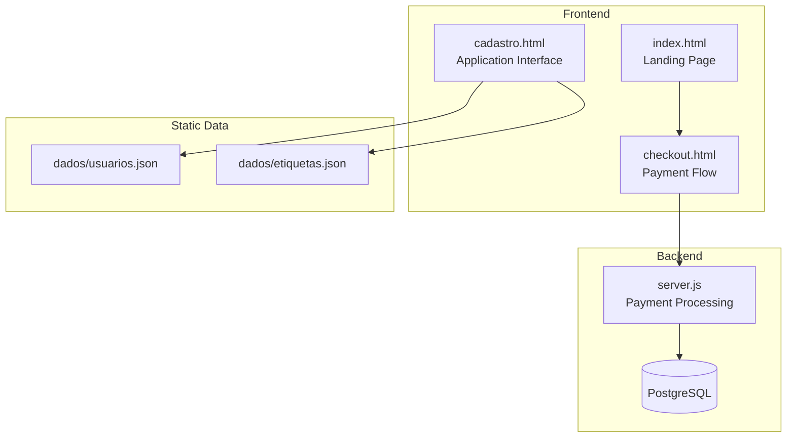
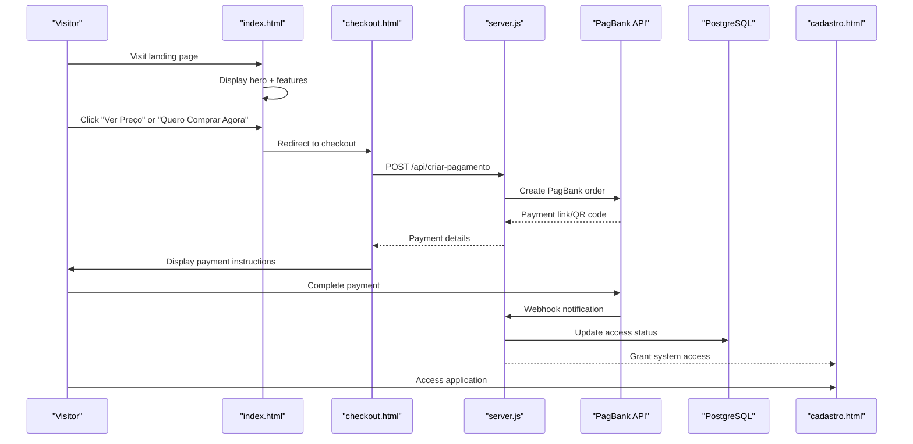
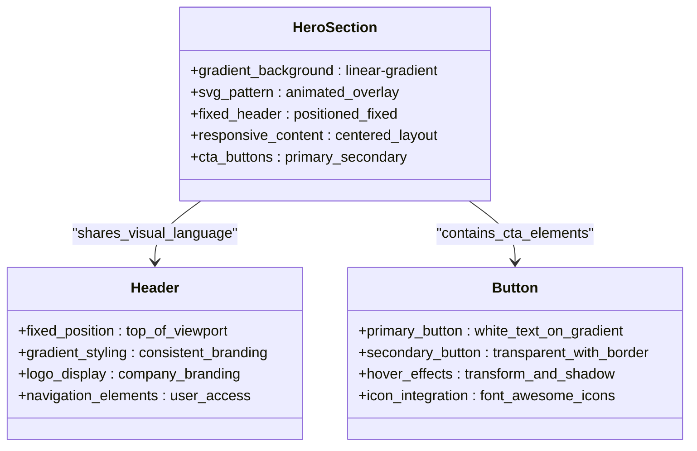
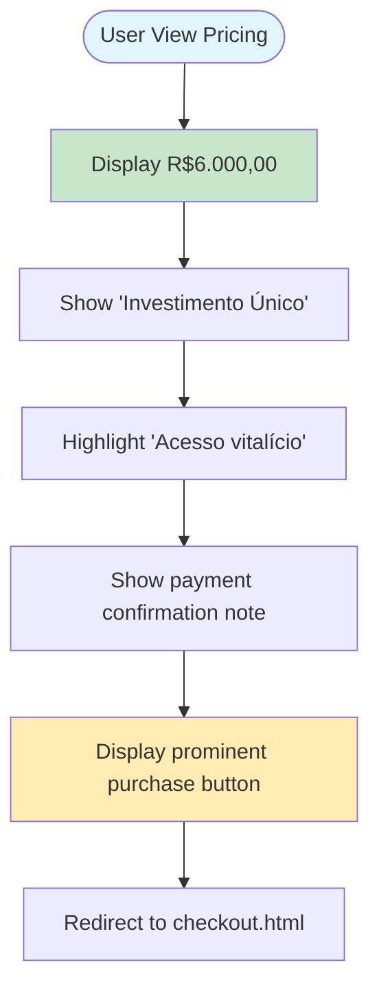
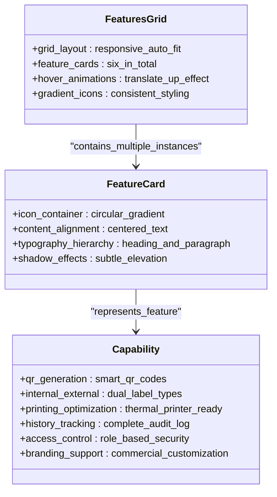
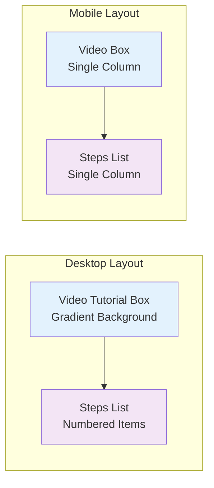
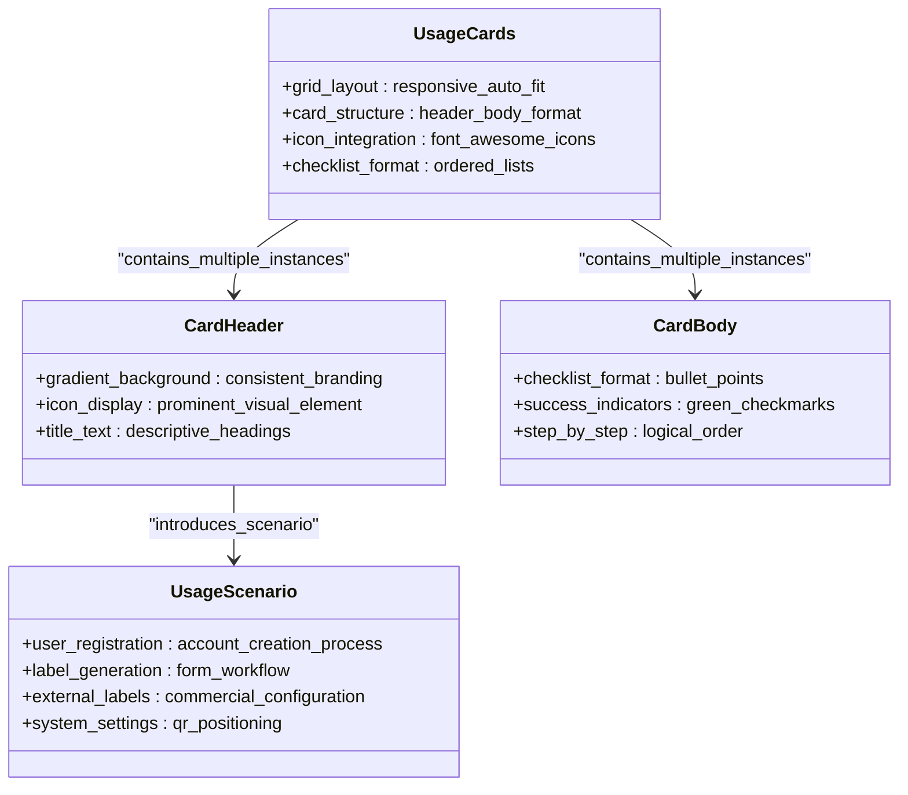
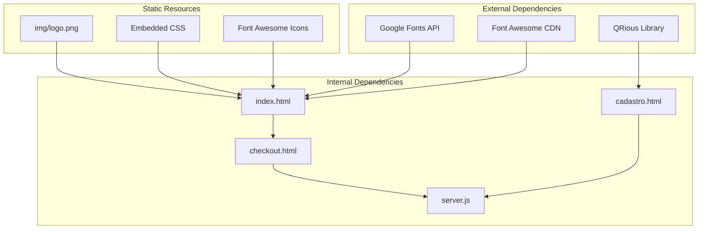

# Landing Page (index.html)

<cite>
**Referenced Files in This Document**
- [index.html](file://index.html)
- [README.md](file://README.md)
- [checkout.html](file://checkout.html)
- [cadastro.html](file://cadastro.html)
- [server.js](file://server.js)
- [dados/etiquetas.json](file://dados/etiquetas.json)
- [dados/usuarios.json](file://dados/usuarios.json)
</cite>

## Table of Contents
1. [Introduction](#introduction)
2. [Project Structure](#project-structure)
3. [Core Components](#core-components)
4. [Architecture Overview](#architecture-overview)
5. [Detailed Component Analysis](#detailed-component-analysis)
6. [Dependency Analysis](#dependency-analysis)
7. [Performance Considerations](#performance-considerations)
8. [Troubleshooting Guide](#troubleshooting-guide)
9. [Conclusion](#conclusion)

## Introduction
This document provides comprehensive documentation for the landing page component (index.html), focusing on the complete user journey from awareness to purchase and system access. The landing page serves as the primary conversion surface for the Alimentares QR code labeling system, featuring a professional hero section, pricing presentation, feature showcase, step-by-step instructions, and detailed usage guidance. It integrates seamlessly with the checkout flow and backend payment processing infrastructure.

The landing page emphasizes:
- Professional hero section with gradient background and call-to-action buttons
- Clear pricing presentation with promotional messaging
- Feature showcase highlighting six key capabilities
- Step-by-step instructions with video tutorial integration
- Detailed usage cards for user registration, label generation, external labels configuration, and system settings
- Responsive design implementation with modern CSS patterns
- Integration with Font Awesome icons and Google Fonts typography
- Fixed header positioning and scroll-based navigation

## Project Structure
The landing page is part of a larger system that includes:
- Frontend landing page (index.html) with integrated styling
- Checkout flow (checkout.html) for payment processing
- Application interface (cadastro.html) for label generation
- Backend payment processing (server.js) with PostgreSQL integration
- Static data files (JSON) for demonstration

**Diagram sources**
- [index.html](file://index.html)
- [checkout.html](file://checkout.html)
- [cadastro.html](file://cadastro.html)
- [server.js](file://server.js)
- [dados/usuarios.json](file://dados/usuarios.json)
- [dados/etiquetas.json](file://dados/etiquetas.json)

**Section sources**
- [index.html](file://index.html)
- [README.md](file://README.md)

## Core Components
The landing page consists of several interconnected sections, each serving a specific purpose in the user conversion funnel:

### Hero Section
The hero section establishes brand presence and drives immediate action through:
- Gradient background with animated SVG pattern overlay
- Professional logo display with fixed header integration
- Prominent call-to-action buttons linking to instructions and pricing
- Responsive typography with Poppins font family
- Modern card-based design with backdrop blur effects

### Pricing Section
The pricing presentation emphasizes the investment approach with:
- Prominent display of R$6.000,00 price point
- Investment-focused messaging ("Acesso vitalício")
- Clear promotional note about immediate access upon payment confirmation
- Consistent gradient styling matching the overall design language

### Features Section
Six key capabilities are showcased through:
- Icon-based feature cards with hover animations
- QR code generation for digital product tracking
- Internal/external label support for inventory and commercial use
- Printing optimization for thermal printers
- Complete history tracking with reprint capability
- Access control with administrative privileges
- Company branding for commercial applications

### Instructions Section
Step-by-step guidance delivered through:
- Video tutorial integration with YouTube embed
- Numbered instruction steps with clear descriptions
- Responsive two-column layout on desktop, single column on mobile
- Consistent styling with gradient accents

### Detailed Usage Cards
Four comprehensive usage scenarios:
- User registration process for new clients
- Label generation workflow with form fields
- External label configuration with commercial data
- System settings including QR code positioning

### Call-to-Action Section
Final conversion element featuring:
- Reinforced pricing presentation
- Prominent purchase button linking to checkout
- Additional informational messaging
- Consistent visual treatment

**Section sources**
- [index.html](file://index.html)

## Architecture Overview
The landing page integrates with the broader system architecture through multiple touchpoints:

**Diagram sources**
- [index.html](file://index.html)
- [checkout.html](file://checkout.html)
- [server.js](file://server.js)

The architecture demonstrates a clear separation of concerns:
- Frontend presentation layer (HTML/CSS/JavaScript)
- Payment processing layer (Node.js/Express)
- Database persistence (PostgreSQL)
- Third-party payment integration (PagBank)

## Detailed Component Analysis

### Hero Section Implementation
The hero section employs advanced CSS techniques for visual impact:

**Diagram sources**
- [index.html](file://index.html)

Key implementation features:
- Fixed header positioning with z-index management
- Gradient background with animated SVG pattern overlay
- Responsive content centering using Flexbox
- Hover animations with transform and shadow effects
- Font Awesome icon integration for visual enhancement

### Pricing Section Analysis
The pricing presentation follows conversion optimization principles:

**Diagram sources**
- [index.html](file://index.html)
- [checkout.html](file://checkout.html)

### Features Grid Implementation
The six-feature showcase utilizes CSS Grid for responsive layout:

**Diagram sources**
- [index.html](file://index.html)

Responsive design characteristics:
- CSS Grid with automatic column sizing
- Minimum width constraints for optimal readability
- Flexible gap spacing adapting to screen size
- Mobile-first approach with media queries

### Instructions Section Layout
The instructions section combines video content with step-by-step guidance:

**Diagram sources**
- [index.html](file://index.html)

### Usage Cards System
The four detailed usage cards provide comprehensive guidance:

**Diagram sources**
- [index.html](file://index.html)

**Section sources**
- [index.html](file://index.html)

## Dependency Analysis
The landing page relies on several external resources and internal dependencies:

**Diagram sources**
- [index.html](file://index.html)
- [checkout.html](file://checkout.html)
- [cadastro.html](file://cadastro.html)
- [server.js](file://server.js)

Key dependency relationships:
- Google Fonts integration for typography consistency
- Font Awesome CDN for iconography
- Embedded CSS for styling independence
- External QRious library for QR code generation
- Static logo asset for brand recognition

**Section sources**
- [index.html](file://index.html)
- [checkout.html](file://checkout.html)
- [cadastro.html](file://cadastro.html)
- [server.js](file://server.js)

## Performance Considerations
The landing page implements several performance optimization strategies:

### CSS Optimization
- Single embedded stylesheet reduces HTTP requests
- Efficient gradient backgrounds using CSS
- Minimal JavaScript footprint
- Optimized font loading with fallbacks

### Asset Management
- SVG pattern background embedded as data URI
- CDN-hosted external libraries for caching benefits
- Static logo asset for quick loading
- Responsive image handling

### Mobile Responsiveness
- CSS Grid for efficient layout calculations
- Flexible typography scaling
- Touch-friendly button sizing
- Adaptive content stacking

## Troubleshooting Guide

### Common Issues and Solutions

#### Payment Integration Problems
- **Issue**: Payment links not generated
- **Solution**: Verify PagBank token configuration in environment variables
- **Debug**: Check server logs for API errors

#### Checkout Flow Issues
- **Issue**: Redirect loops in checkout
- **Solution**: Validate redirect URLs in payment configuration
- **Debug**: Inspect network tab for failed API requests

#### Styling Problems
- **Issue**: Fonts not loading
- **Solution**: Check CDN connectivity and CORS policies
- **Debug**: Verify Google Fonts availability

#### Mobile Display Issues
- **Issue**: Content overlapping on small screens
- **Solution**: Review media query breakpoints
- **Debug**: Test on various device sizes

**Section sources**
- [server.js](file://server.js)
- [checkout.html](file://checkout.html)
- [index.html](file://index.html)

## Conclusion
The landing page (index.html) represents a professionally designed conversion surface that effectively communicates the value proposition of the Alimentares QR code labeling system. Through strategic use of visual design, clear messaging, and seamless integration with the payment and application systems, it provides an optimal user experience from initial awareness to system access.

Key strengths of the implementation include:
- Cohesive visual design language throughout all sections
- Strategic placement of call-to-action elements
- Comprehensive feature showcase with clear benefit communication
- Responsive design that works across all device types
- Integration with robust backend payment processing
- Professional typography and iconography

The landing page successfully transforms visitors into paying customers while maintaining technical excellence and user experience standards. Its modular structure allows for easy maintenance and future enhancements while preserving the core conversion-focused design philosophy.