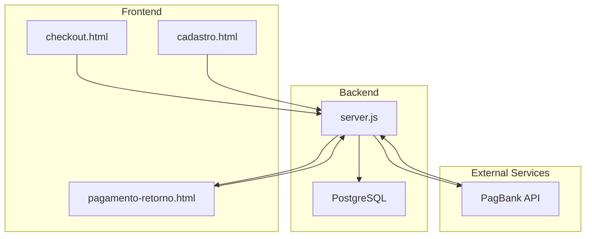
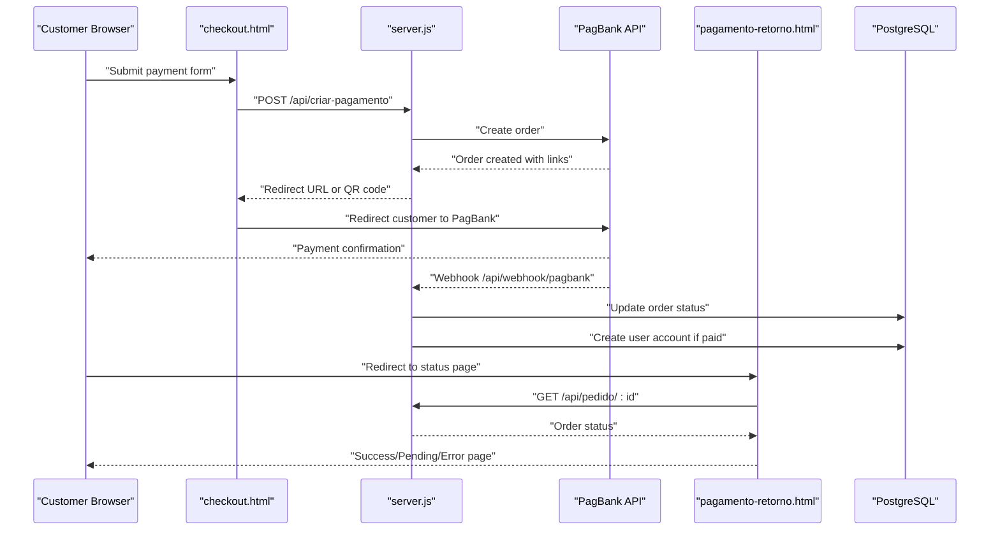
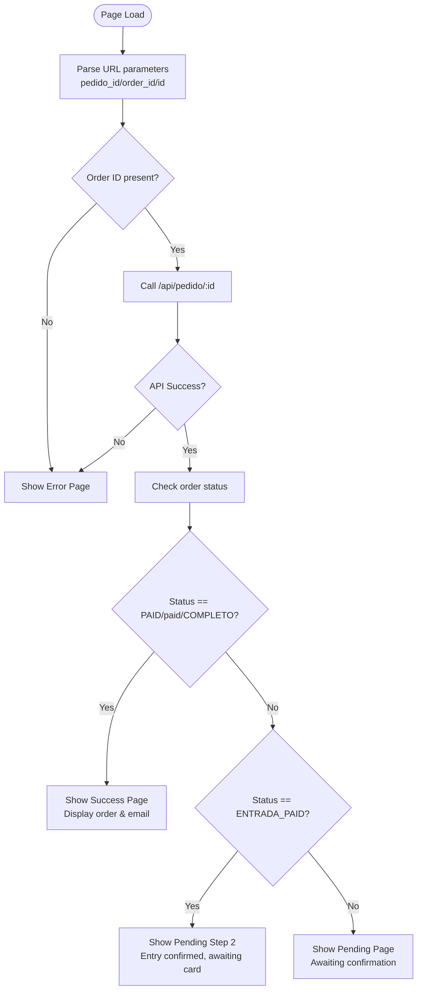
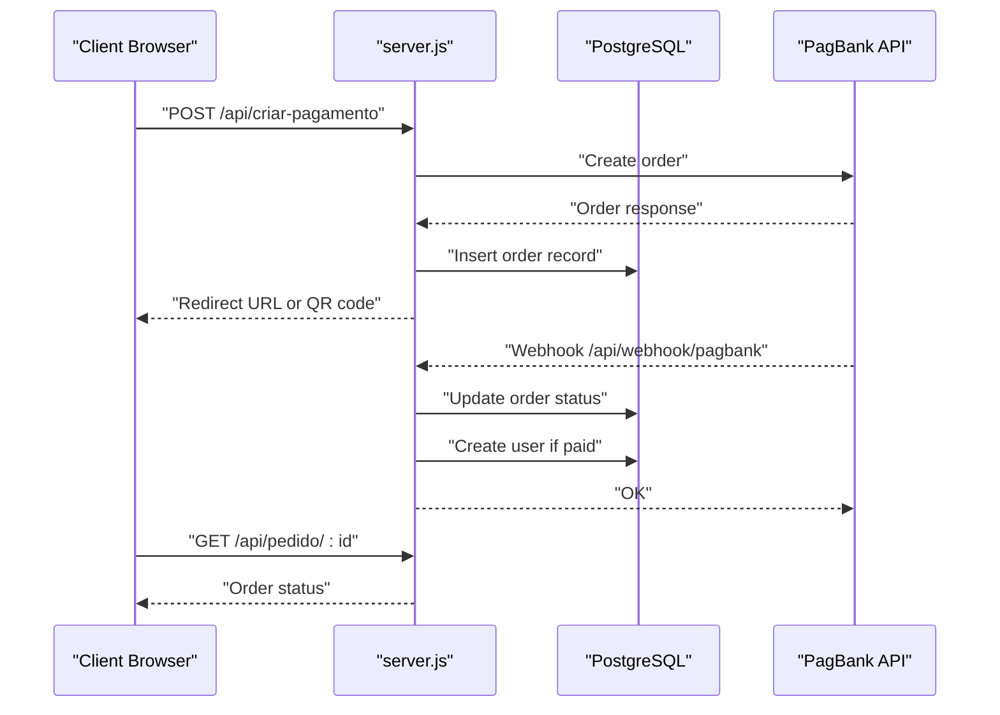
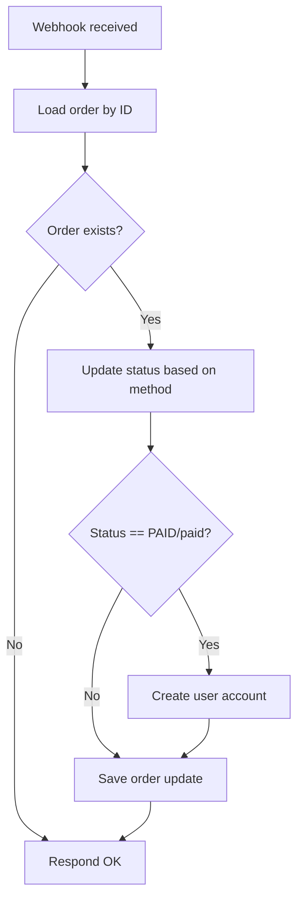
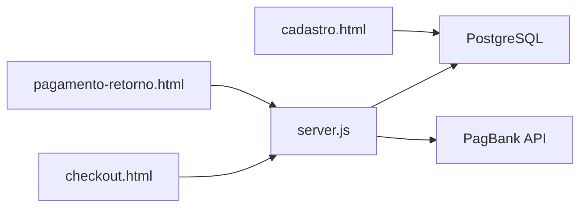

# Payment Status Page (pagamento-retorno.html)

<cite>
**Referenced Files in This Document**
- [pagamento-retorno.html](file://pagamento-retorno.html)
- [server.js](file://server.js)
- [checkout.html](file://checkout.html)
- [database.sql](file://database.sql)
- [PAGAMENTO-README.md](file://PAGAMENTO-README.md)
- [README.md](file://README.md)
</cite>

## Table of Contents
1. [Introduction](#introduction)
2. [Project Structure](#project-structure)
3. [Core Components](#core-components)
4. [Architecture Overview](#architecture-overview)
5. [Detailed Component Analysis](#detailed-component-analysis)
6. [Dependency Analysis](#dependency-analysis)
7. [Performance Considerations](#performance-considerations)
8. [Troubleshooting Guide](#troubleshooting-guide)
9. [Conclusion](#conclusion)

## Introduction
This document provides comprehensive technical documentation for the payment status page component (pagamento-retorno.html) and the broader payment system. It explains how the payment result display works, including success confirmation, failure notifications, and error handling. It covers the redirect flow from the payment provider back to the application, parameter parsing for payment status verification, integration with the backend webhook system (/api/webhook/pagbank), user account creation triggered by successful payments, session management, and access granting procedures. It also details fallback mechanisms, retry logic, manual status checking via the order status API (/api/pedido/:id), and the integration with the label generation system for providing access to registered users.

## Project Structure
The payment system spans both frontend and backend components:
- Frontend pages: checkout.html, pagamento-retorno.html, cadastro.html
- Backend server: server.js (Express + PostgreSQL)
- Database schema: database.sql
- Documentation: PAGAMENTO-README.md, README.md

**Diagram sources**
- [checkout.html](file://checkout.html)
- [pagamento-retorno.html](file://pagamento-retorno.html)
- [server.js](file://server.js)
- [database.sql](file://database.sql)

**Section sources**
- [PAGAMENTO-README.md](file://PAGAMENTO-README.md)
- [README.md](file://README.md)

## Core Components
- Payment Status Page (pagamento-retorno.html): Handles payment result display, redirects from payment provider, parameter parsing, and fallback status checks.
- Backend Payment API (server.js): Creates orders, handles webhooks, manages order status, and creates user accounts upon successful payment.
- Order Status API (/api/pedido/:id): Provides real-time order status for manual verification and fallback scenarios.
- Webhook Integration (/api/webhook/pagbank): Real-time payment status updates from PagBank.
- User Account Creation: Automatic user creation and access granting upon payment completion.

**Section sources**
- [pagamento-retorno.html](file://pagamento-retorno.html)
- [server.js](file://server.js)
- [database.sql](file://database.sql)

## Architecture Overview
The payment system follows a provider-agnostic flow:
1. Customer initiates payment via checkout.html.
2. Backend creates a payment order with PagBank and redirects the customer to PagBank.
3. After payment, PagBank redirects the customer to pagamento-retorno.html with order parameters.
4. Frontend parses parameters and queries /api/pedido/:id for status.
5. Alternatively, backend receives webhook updates from PagBank and updates order status and user access.
6. Successful payment triggers user account creation and access granting.

**Diagram sources**
- [checkout.html](file://checkout.html)
- [pagamento-retorno.html](file://pagamento-retorno.html)
- [server.js](file://server.js)
- [database.sql](file://database.sql)

## Detailed Component Analysis

### Payment Status Page (pagamento-retorno.html)
The payment status page displays payment results and guides users through next steps. It supports three primary outcomes:
- Success: Confirms payment and provides access to the system.
- Pending: Indicates payment is being processed.
- Error: Shows payment failure and provides retry options.

Key behaviors:
- Parameter parsing: Extracts order ID from URL parameters (pedido_id, order_id, id).
- Redirect handling: Uses redirect URLs configured in the backend to receive status updates.
- Status verification: Queries /api/pedido/:id to determine current order status.
- Fallback mechanisms: Displays error page if order ID is missing or if API calls fail.

**Diagram sources**
- [pagamento-retorno.html](file://pagamento-retorno.html)

**Section sources**
- [pagamento-retorno.html](file://pagamento-retorno.html)

### Backend Payment API (server.js)
The backend manages the complete payment lifecycle:
- Order creation: Builds order payload for PagBank, saves order to database, and returns redirect URL or QR code.
- Webhook handling: Processes incoming updates from PagBank, updates order status, and triggers user account creation for paid orders.
- Order status endpoint: Returns sanitized order details for frontend verification.
- User account creation: Inserts or updates user records upon successful payment.

Important endpoints and flows:
- POST /api/criar-pagamento: Creates payment order with PagBank and persists order data.
- POST /api/webhook/pagbank: Receives PagBank webhook updates and updates order/user status accordingly.
- GET /api/pedido/:id: Returns order status for frontend verification.
- POST /api/admin/pedido/:id/confirmar-pagamento: Manual confirmation for manual payment flows.

**Diagram sources**
- [server.js](file://server.js)
- [database.sql](file://database.sql)

**Section sources**
- [server.js](file://server.js)
- [database.sql](file://database.sql)

### Order Status API (/api/pedido/:id)
The order status API serves as a fallback mechanism for payment verification:
- Retrieves order by ID from the database.
- Returns sanitized order details including status, payment amounts, and timestamps.
- Used by both frontend and admin panels for real-time status checks.

Integration points:
- Frontend fallback: When webhooks are delayed, the status page queries this endpoint.
- Admin panel: Used to monitor and manage orders.

**Section sources**
- [server.js](file://server.js)

### Webhook Integration (/api/webhook/pagbank)
Real-time payment updates are handled via webhooks:
- Receives status updates from PagBank.
- Updates order status in the database.
- Triggers user account creation for paid orders.
- Supports both single-payment and two-stage payment flows (entry + card).

**Diagram sources**
- [server.js](file://server.js)

**Section sources**
- [server.js](file://server.js)

### User Account Creation and Access Granting
Upon successful payment, the system automatically creates a user account and grants access:
- Generates a temporary password and inserts a new user record.
- Marks the user as active and associates with the order.
- Logs access creation for auditing.

Integration with label generation system:
- Access granted via user account creation.
- Users can navigate to cadastro.html to access the label generation system.

**Section sources**
- [server.js](file://server.js)
- [database.sql](file://database.sql)

### Redirect Flow from Payment Provider
The redirect flow ensures customers return to the application after payment:
- Backend configures redirect URLs with placeholders for order IDs.
- Payment provider redirects to the status page with order parameters.
- Frontend parses parameters and verifies status via the order status API.

**Section sources**
- [server.js](file://server.js)
- [checkout.html](file://checkout.html)
- [pagamento-retorno.html](file://pagamento-retorno.html)

### Fallback Mechanisms and Retry Logic
Fallback mechanisms include:
- Manual status checking via /api/pedido/:id when webhooks are delayed.
- Error handling in the status page to gracefully handle missing parameters or API failures.
- Retry logic in checkout.html for polling order status during QR code payments.

**Section sources**
- [pagamento-retorno.html](file://pagamento-retorno.html)
- [checkout.html](file://checkout.html)
- [server.js](file://server.js)

## Dependency Analysis
The payment system exhibits clear separation of concerns:
- Frontend depends on backend APIs for order creation, status checks, and user access.
- Backend depends on external payment provider APIs and database persistence.
- Database schema supports order tracking and user management.

**Diagram sources**
- [checkout.html](file://checkout.html)
- [pagamento-retorno.html](file://pagamento-retorno.html)
- [server.js](file://server.js)
- [database.sql](file://database.sql)

**Section sources**
- [checkout.html](file://checkout.html)
- [pagamento-retorno.html](file://pagamento-retorno.html)
- [server.js](file://server.js)
- [database.sql](file://database.sql)

## Performance Considerations
- Webhook processing: Ensure webhook endpoints are highly available and idempotent to handle retries.
- Database queries: Indexes on email and status improve order lookup performance.
- Frontend polling: Use appropriate intervals to balance responsiveness and server load.
- Caching: Consider caching frequently accessed order statuses for improved user experience.

## Troubleshooting Guide
Common issues and resolutions:
- Missing order ID: Verify redirect URLs are correctly configured and order IDs are passed through redirects.
- Webhook delays: Use /api/pedido/:id as a fallback to check order status.
- Payment not reflected: Check webhook logs and database updates for discrepancies.
- User account not created: Verify webhook processing and user creation logic.
- Database connectivity: Ensure PostgreSQL connection settings are correct and database is initialized.

**Section sources**
- [PAGAMENTO-README.md](file://PAGAMENTO-README.md)
- [server.js](file://server.js)
- [database.sql](file://database.sql)

## Conclusion
The payment status page (pagamento-retorno.html) integrates seamlessly with the backend payment system to provide a robust payment experience. It handles success, pending, and error states, supports fallback mechanisms, and integrates with the webhook-driven order management system. Upon successful payment, user accounts are automatically created and access is granted, enabling immediate use of the label generation system.