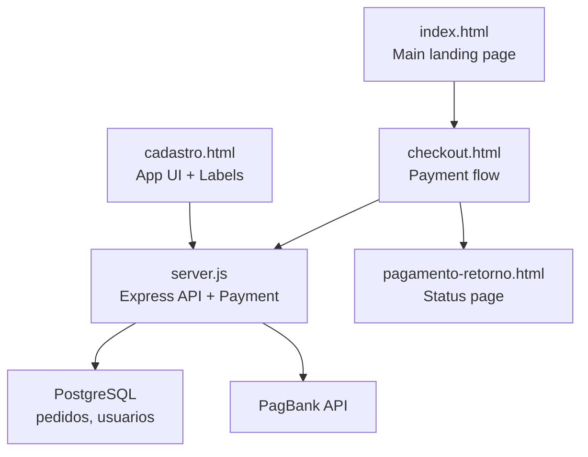
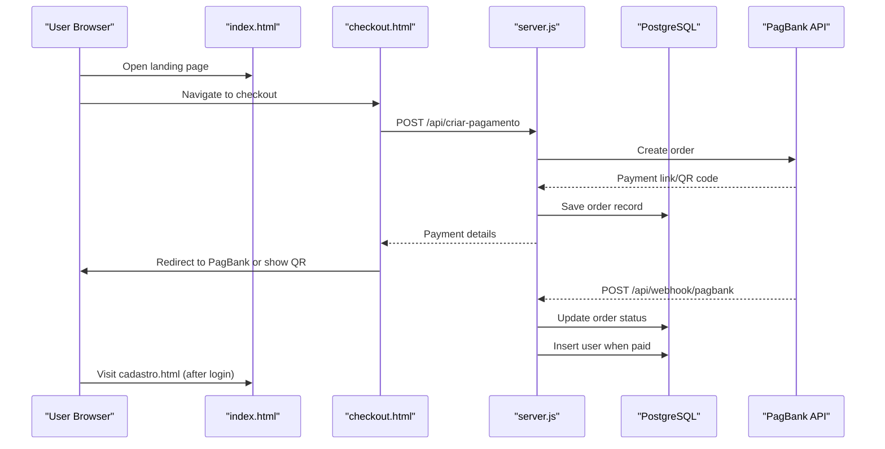
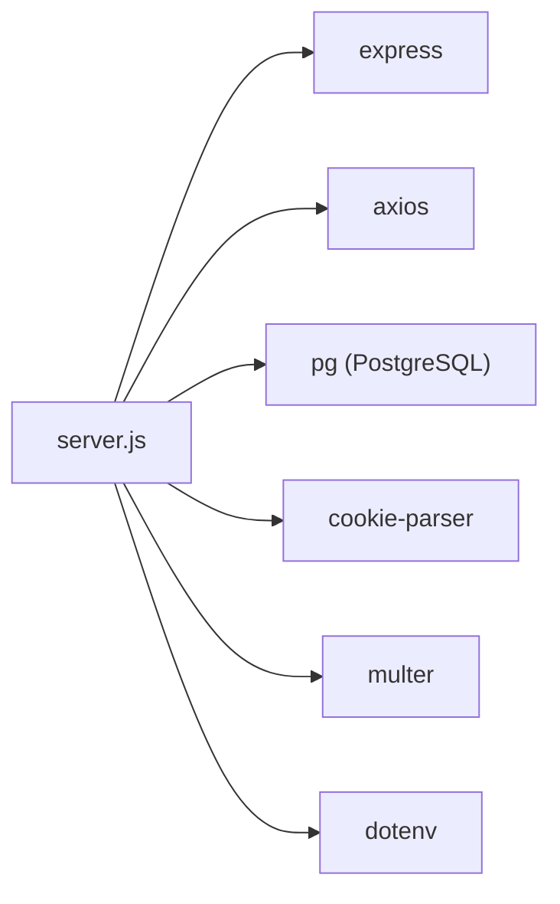

# Getting Started

<cite>
**Referenced Files in This Document**
- [README.md](file://README.md)
- [package.json](file://package.json)
- [server.js](file://server.js)
- [render.yaml](file://render.yaml)
- [database.sql](file://database.sql)
- [init-db.sql](file://init-db.sql)
- [PAGAMENTO-README.md](file://PAGAMENTO-README.md)
- [index.html](file://index.html)
- [checkout.html](file://checkout.html)
- [pagamento-retorno.html](file://pagamento-retorno.html)
- [cadastro.html](file://cadastro.html)
</cite>

## Table of Contents
1. [Introduction](#introduction)
2. [Project Structure](#project-structure)
3. [Core Components](#core-components)
4. [Architecture Overview](#architecture-overview)
5. [Detailed Component Analysis](#detailed-component-analysis)
6. [Dependency Analysis](#dependency-analysis)
7. [Performance Considerations](#performance-considerations)
8. [Troubleshooting Guide](#troubleshooting-guide)
9. [Conclusion](#conclusion)
10. [Appendices](#appendices)

## Introduction
This guide helps you install, configure, and run QrEtiquetas.com locally and prepare it for deployment. It covers:
- Environment prerequisites
- Database setup with PostgreSQL
- Application installation and configuration
- Running the server locally
- Accessing the main interface
- Environment variables and deployment preparation
- Default administrator credentials and security recommendations
- Troubleshooting common setup issues

## Project Structure
QrEtiquetas.com is a frontend-first application with a small backend focused on payment processing and database-backed order management. The key files and roles:
- Frontend pages: index.html, checkout.html, pagamento-retorno.html, cadastro.html
- Backend server: server.js (Node.js + Express)
- Database scripts: database.sql, init-db.sql
- Package and deployment: package.json, render.yaml

**Diagram sources**
- [index.html](file://index.html)
- [checkout.html](file://checkout.html)
- [pagamento-retorno.html](file://pagamento-retorno.html)
- [server.js](file://server.js)
- [database.sql](file://database.sql)

**Section sources**
- [README.md](file://README.md)
- [package.json](file://package.json)
- [server.js](file://server.js)
- [database.sql](file://database.sql)

## Core Components
- Frontend pages:
  - index.html: Landing page and feature overview
  - checkout.html: Payment selection and checkout flow
  - pagamento-retorno.html: Payment status verification
  - cadastro.html: Main application UI for labels, history, and admin
- Backend server:
  - server.js: Express server exposing payment endpoints, serving static files, and managing PostgreSQL connection
- Database:
  - database.sql: Schema definition for orders and users
  - init-db.sql: Alternative initialization script for Render’s PostgreSQL

Key runtime behaviors:
- Static assets are served from the repository root
- Payment requests are sent to PagBank via server.js
- Order status updates are persisted to PostgreSQL
- Admin-only features are gated in cadastro.html

**Section sources**
- [index.html](file://index.html)
- [checkout.html](file://checkout.html)
- [pagamento-retorno.html](file://pagamento-retorno.html)
- [cadastro.html](file://cadastro.html)
- [server.js](file://server.js)
- [database.sql](file://database.sql)
- [init-db.sql](file://init-db.sql)

## Architecture Overview
High-level flow for payments and application access:

**Diagram sources**
- [checkout.html](file://checkout.html)
- [server.js](file://server.js)
- [database.sql](file://database.sql)

**Section sources**
- [checkout.html](file://checkout.html)
- [server.js](file://server.js)
- [database.sql](file://database.sql)

## Detailed Component Analysis

### Installation and Environment Setup
- Prerequisites:
  - Node.js (see package.json scripts and dependencies)
  - PostgreSQL (see database.sql and server.js connection)
- Steps:
  1) Install Node.js and npm
  2) Install dependencies: npm install
  3) Configure PostgreSQL and create the database and tables (see Database Setup)
  4) Start the server: npm start or npm run dev

Notes:
- The project includes a render.yaml for deployment, but local development uses a PostgreSQL connection string configured via environment variables.

**Section sources**
- [package.json](file://package.json)
- [server.js](file://server.js)
- [PAGAMENTO-README.md](file://PAGAMENTO-README.md)

### Database Setup
Two approaches are provided:

Option A: Use database.sql
- Create the database and connect to it
- Run the SQL script to create tables and indexes
- Example commands are documented in PAGAMENTO-README.md

Option B: Use init-db.sql (Render)
- Initialize tables in Render’s PostgreSQL using the provided script
- This script defines pedidos and usuarios tables

After creating tables, the server connects to PostgreSQL using either:
- DATABASE_URL (Render)
- Individual DB_* variables (local)

**Section sources**
- [database.sql](file://database.sql)
- [init-db.sql](file://init-db.sql)
- [PAGAMENTO-README.md](file://PAGAMENTO-README.md)
- [server.js](file://server.js)

### Environment Variables
Configure the following environment variables for the backend:
- PORT: Server port (defaults to 3000)
- DATABASE_URL: PostgreSQL connection string (Render)
- DB_HOST, DB_PORT, DB_NAME, DB_USER, DB_PASSWORD: PostgreSQL connection details (local)
- PAGBANK_TOKEN: PagBank API token
- ADMIN_EMAIL: Email for notifications
- PIX_CHAVE, PIX_TITULAR, PIX_BANCO: Manual PIX configuration
- ADMIN_USUARIO, ADMIN_SENHA, ADMIN_SECRET: Admin credentials and session secret
- NODE_ENV: production or development

render.yaml sets NODE_ENV and DATABASE_URL for Render deployments.

**Section sources**
- [server.js](file://server.js)
- [render.yaml](file://render.yaml)

### Running Locally
- Start the server:
  - Production: npm start
  - Development (auto-reload): npm run dev
- Access:
  - Landing page: http://localhost:PORT/index.html
  - Checkout: http://localhost:PORT/checkout.html
  - App: http://localhost:PORT/cadastro.html

The server logs the URLs on startup.

**Section sources**
- [server.js](file://server.js)
- [PAGAMENTO-README.md](file://PAGAMENTO-README.md)

### Accessing the Main Interface
- After successful payment, users are directed to cadastro.html
- First-time admin credentials are documented in README.md:
  - Username: admin
  - Password: admin123
- Change the default admin password immediately after first login.

**Section sources**
- [README.md](file://README.md)
- [index.html](file://index.html)
- [cadastro.html](file://cadastro.html)

### Payment Flow and Endpoints
- Endpoints exposed by server.js:
  - POST /api/criar-pagamento: Creates a PagBank order and persists the record
  - POST /api/webhook/pagbank: Receives PagBank notifications and updates order status
  - GET /api/pedido/:id: Retrieves order status
  - GET /api/pedidos: Lists all orders (admin)
- checkout.html submits payment data and handles redirects or QR code display
- pagamento-retorno.html checks order status after redirection

**Section sources**
- [server.js](file://server.js)
- [checkout.html](file://checkout.html)
- [pagamento-retorno.html](file://pagamento-retorno.html)

### Deployment Preparation (Render)
- render.yaml configures:
  - Type: web
  - Env: Node
  - Build command: npm install
  - Start command: npm start
  - Environment variables: NODE_ENV, PAGBANK_TOKEN, DATABASE_URL
- Ensure DATABASE_URL points to a PostgreSQL database
- Configure webhook URL in PagBank to match your deployed domain plus /api/webhook/pagbank

**Section sources**
- [render.yaml](file://render.yaml)
- [server.js](file://server.js)

## Dependency Analysis
Runtime dependencies (from package.json):
- express, cors, cookie-parser, dotenv, pg, axios, multer
- Development: nodemon

**Diagram sources**
- [package.json](file://package.json)
- [server.js](file://server.js)

**Section sources**
- [package.json](file://package.json)
- [server.js](file://server.js)

## Performance Considerations
- Use production mode (NODE_ENV=production) for deployment
- Keep PostgreSQL indexes defined in database.sql for efficient queries
- Minimize unnecessary logging in production
- Ensure adequate database connection pooling and monitoring

[No sources needed since this section provides general guidance]

## Troubleshooting Guide

Common issues and resolutions:

- Database connectivity errors
  - Verify DATABASE_URL or individual DB_* variables
  - Confirm PostgreSQL is running and accessible
  - Ensure tables were created using database.sql or init-db.sql
  - Check server logs for “Erro ao conectar no PostgreSQL”

- Port conflicts
  - Change PORT environment variable if 3000 is in use
  - Restart the server after changing the port

- Payment failures
  - Confirm PAGBANK_TOKEN is set
  - Check webhook URL configuration in PagBank
  - Review server logs for error details

- Admin login problems
  - Default credentials: admin/admin123
  - Change the default admin password immediately after first login

- Static assets not loading
  - Ensure server serves files from the repository root
  - Verify browser cache and network tab for 404 errors

**Section sources**
- [server.js](file://server.js)
- [PAGAMENTO-README.md](file://PAGAMENTO-README.md)
- [README.md](file://README.md)

## Conclusion
You now have the steps to install QrEtiquetas.com locally, configure PostgreSQL, run the server, and access the application. For deployment, use render.yaml to provision a Node.js service with PostgreSQL and configure environment variables accordingly. Always change default admin credentials and secure sensitive tokens.

[No sources needed since this section summarizes without analyzing specific files]

## Appendices

### Default Administrator Credentials
- Username: admin
- Password: admin123
- Action: Change immediately after first login

**Section sources**
- [README.md](file://README.md)

### Initial Security Recommendations
- Change admin password after first login
- Store PAGBANK_TOKEN securely and never commit it to repositories
- Use HTTPS in production environments
- Limit access to administrative features

**Section sources**
- [README.md](file://README.md)
- [server.js](file://server.js)