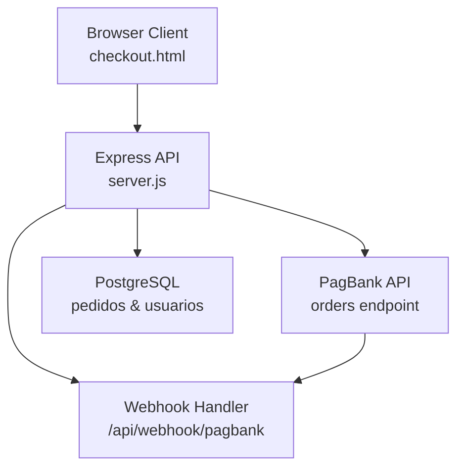
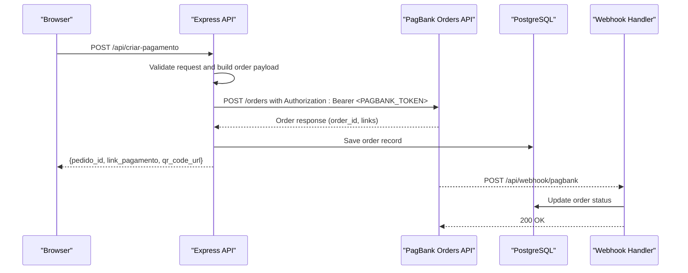
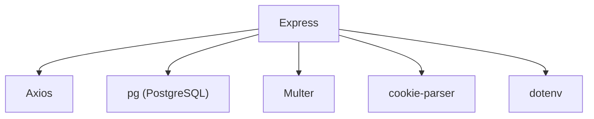

# PagBank API Integration

<cite>
**Referenced Files in This Document**
- [server.js](file://server.js)
- [package.json](file://package.json)
- [checkout.html](file://checkout.html)
- [database.sql](file://database.sql)
- [init-db.sql](file://init-db.sql)
- [PAGAMENTO-README.md](file://PAGAMENTO-README.md)
</cite>

## Table of Contents
1. [Introduction](#introduction)
2. [Project Structure](#project-structure)
3. [Core Components](#core-components)
4. [Architecture Overview](#architecture-overview)
5. [Detailed Component Analysis](#detailed-component-analysis)
6. [Dependency Analysis](#dependency-analysis)
7. [Performance Considerations](#performance-considerations)
8. [Troubleshooting Guide](#troubleshooting-guide)
9. [Conclusion](#conclusion)

## Introduction
This document provides comprehensive documentation for integrating with the PagBank API to process payments via PIX. It explains the authentication mechanism using Bearer token authorization, the order creation request format, response handling, error management, and security considerations for API credentials. The system supports multiple payment methods including à vista (full PIX payment), entrada (initial PIX payment with subsequent card payment), and a combined manual flow where clients pay part via PIX and the remainder via a card link sent by administrators.

## Project Structure
The payment integration is implemented in a Node.js backend using Express, with PostgreSQL for persistence and HTML pages for the checkout flow. Key components include:
- Payment endpoint that creates orders with PagBank
- Webhook handler for payment notifications
- Database schema for storing order and user data
- Frontend checkout page that collects customer information and initiates payment

**Diagram sources**
- [server.js:82-280](file://server.js#L82-L280)
- [server.js:285-345](file://server.js#L285-L345)
- [database.sql:13-36](file://database.sql#L13-L36)

**Section sources**
- [server.js:12-27](file://server.js#L12-L27)
- [package.json:11-19](file://package.json#L11-L19)

## Core Components
- Authentication: Uses Bearer token authorization via the `PAGBANK_TOKEN` environment variable
- Order Creation: Builds a structured request containing customer data, items, notification URLs, redirect URLs, and PIX payment method configuration
- Response Handling: Extracts order ID, payment link, and QR code URL; persists order data in PostgreSQL
- Error Handling: Provides detailed error messages for invalid tokens, connection failures, and validation errors
- Environment Variables: Requires `PAGBANK_TOKEN`, optional `DATABASE_URL`, and administrative credentials

**Section sources**
- [server.js:48-50](file://server.js#L48-L50)
- [server.js:82-280](file://server.js#L82-L280)
- [server.js:285-345](file://server.js#L285-L345)
- [PAGAMENTO-README.md:99-105](file://PAGAMENTO-README.md#L99-L105)

## Architecture Overview
The payment flow integrates the frontend checkout page with the backend API, which communicates with PagBank to create orders and receive payment notifications via webhooks. Orders are persisted in PostgreSQL for status tracking and administrative oversight.

**Diagram sources**
- [server.js:82-280](file://server.js#L82-L280)
- [server.js:285-345](file://server.js#L285-L345)
- [database.sql:13-36](file://database.sql#L13-L36)

## Detailed Component Analysis

### Authentication Mechanism
- The backend reads the `PAGBANK_TOKEN` from environment variables and uses it in the Authorization header for all requests to the PagBank API.
- The base URL for PagBank is configured as `https://api.pagbank.com`.

Security considerations:
- Store the token securely and never commit it to version control.
- Use HTTPS in production environments.
- Restrict access to the webhook endpoint and administrative routes.

**Section sources**
- [server.js:48-50](file://server.js#L48-L50)
- [server.js:177-186](file://server.js#L177-L186)
- [PAGAMENTO-README.md:102-104](file://PAGAMENTO-README.md#L102-L104)

### Order Creation Request Format
The order payload includes:
- Reference ID: Unique identifier for the order
- Customer: Name, email, tax ID (CPF), and phone number
- Items: Product reference, name, quantity, and unit amount
- Notification URLs: Webhook endpoint for payment updates
- Redirect URLs: Success, failure, and pending URLs for the checkout flow
- Charges: Payment method configuration with PIX details, including expiration time

The frontend collects customer data and selects a payment method, then sends a POST request to `/api/criar-pagamento`. The backend validates the request, constructs the order payload, and forwards it to PagBank.

**Section sources**
- [server.js:87-113](file://server.js#L87-L113)
- [server.js:132-173](file://server.js#L132-L173)
- [checkout.html:626-684](file://checkout.html#L626-L684)

### Response Handling
On successful order creation:
- The backend saves the order to PostgreSQL with status `PENDING`
- It extracts the payment link (`checkout` or `pay`) and QR code URL from the response
- It returns a JSON response containing the order ID, payment link, QR code URL, and PIX code

If the response does not include a payment link, the frontend falls back to displaying the QR code and periodically checks the order status.

**Section sources**
- [server.js:190-237](file://server.js#L190-L237)
- [server.js:220-235](file://server.js#L220-L235)
- [checkout.html:688-710](file://checkout.html#L688-L710)

### Webhook Integration
PagBank sends payment notifications to the webhook endpoint. The backend:
- Receives the webhook payload
- Updates the order status in PostgreSQL
- For à vista payments, immediately marks as paid and grants access
- For parcelado (entrance + card) payments, transitions through stages and grants access upon completion

Administrative actions:
- Admin can send a card payment link for manual flows
- Admin can confirm PIX payments and mark the order as paid
- Admin can cancel orders if needed

**Section sources**
- [server.js:285-345](file://server.js#L285-L345)
- [server.js:801-847](file://server.js#L801-L847)

### Database Schema
The system uses two primary tables:
- `pedidos`: Stores order information, payment amounts, status, and administrative metadata
- `usuarios`: Manages user accounts and access permissions

Indexes are created for efficient querying by email, status, and access token.

**Section sources**
- [database.sql:13-36](file://database.sql#L13-L36)
- [database.sql:48-58](file://database.sql#L48-L58)

## Dependency Analysis
The backend depends on several libraries:
- Express for HTTP routing
- Axios for making outbound API calls to PagBank
- PostgreSQL client for database operations
- Multer for file uploads (PIX receipts)
- Cookie parser for admin session management

**Diagram sources**
- [package.json:11-19](file://package.json#L11-L19)

**Section sources**
- [package.json:11-19](file://package.json#L11-L19)

## Performance Considerations
- Use HTTPS in production to protect sensitive data and webhook communications
- Implement rate limiting for API endpoints to prevent abuse
- Optimize database queries with appropriate indexes
- Monitor PagBank API response times and implement retries with exponential backoff for transient failures
- Cache frequently accessed order statuses to reduce database load

## Troubleshooting Guide

Common error scenarios and resolutions:
- Invalid token: Ensure `PAGBANK_TOKEN` is set correctly and has not expired
- Connection failures: Verify network connectivity and PagBank service availability
- Validation errors: Check that required fields (customer, email, phone, CPF) are present and formatted correctly
- Database errors: Confirm PostgreSQL is reachable and the schema is initialized

Debugging tips:
- Enable verbose logging in development mode
- Inspect the webhook logs for payment notifications
- Use the admin panel to review order statuses and administrative actions
- Validate environment variables and webhook URL configuration

**Section sources**
- [server.js:239-279](file://server.js#L239-L279)
- [PAGAMENTO-README.md:88-98](file://PAGAMENTO-README.md#L88-L98)

## Conclusion
The PagBank integration provides a robust payment solution with multiple payment methods, automated webhook handling, and administrative controls. By following the documented authentication, request format, and error handling procedures, developers can reliably integrate PIX payments into their applications while maintaining strong security practices and operational visibility.