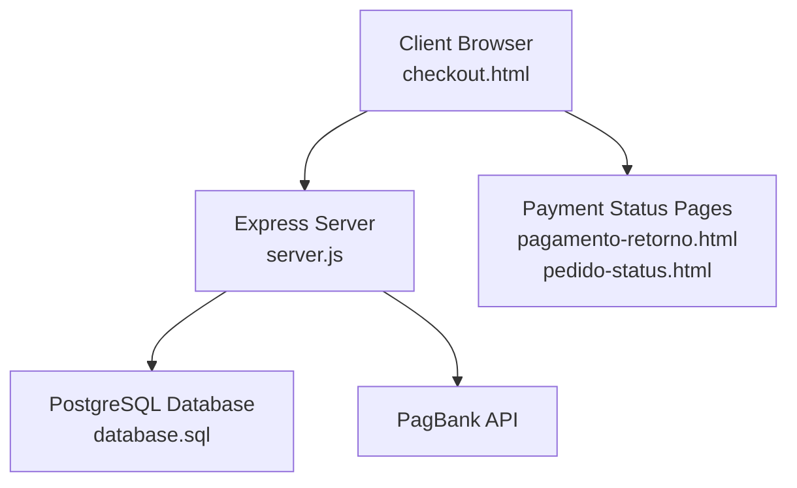
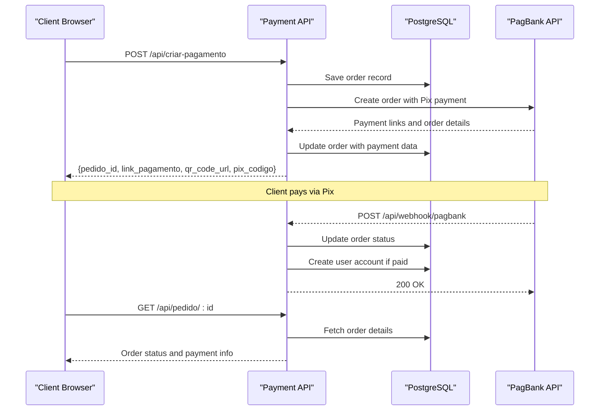
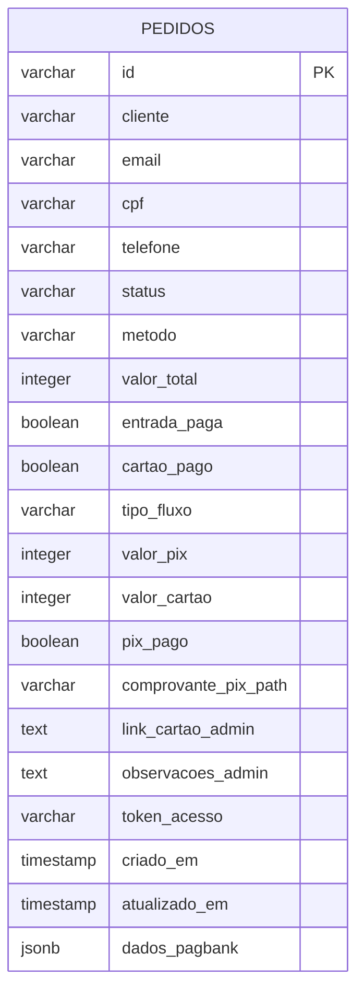
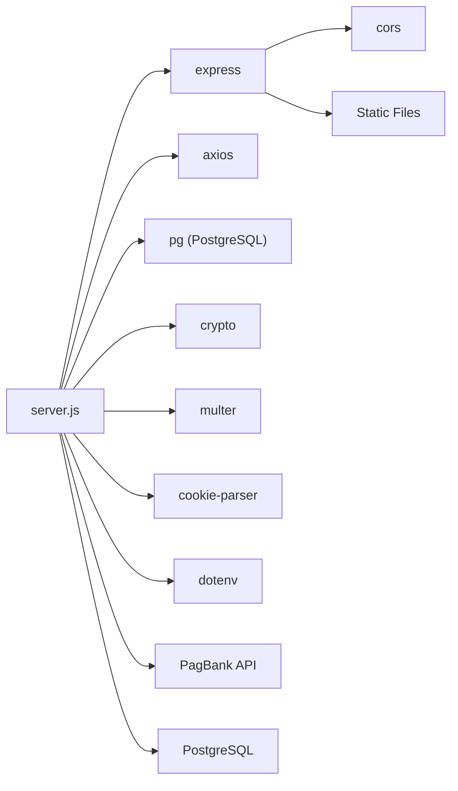

# Payment API Endpoints

<cite>
**Referenced Files in This Document**
- [server.js](file://server.js)
- [PAGAMENTO-README.md](file://PAGAMENTO-README.md)
- [database.sql](file://database.sql)
- [checkout.html](file://checkout.html)
- [package.json](file://package.json)
- [render.yaml](file://render.yaml)
</cite>

## Table of Contents
1. [Introduction](#introduction)
2. [Project Structure](#project-structure)
3. [Core Components](#core-components)
4. [Architecture Overview](#architecture-overview)
5. [Detailed Component Analysis](#detailed-component-analysis)
6. [Dependency Analysis](#dependency-analysis)
7. [Performance Considerations](#performance-considerations)
8. [Troubleshooting Guide](#troubleshooting-guide)
9. [Conclusion](#conclusion)

## Introduction
This document provides comprehensive API documentation for the payment endpoints used by the Alimentares QR label system. It covers the creation of payments via Pix, real-time payment notifications through webhooks, and order status checking. The system integrates with PagBank for payment processing and uses PostgreSQL for persistent order storage.

## Project Structure
The payment system consists of:
- A Node.js/Express backend that exposes REST endpoints
- A PostgreSQL database for storing orders and user access
- Frontend pages for checkout and payment status
- Environment configuration for external services

**Diagram sources**
- [server.js:82-280](file://server.js#L82-L280)
- [database.sql:13-36](file://database.sql#L13-L36)

**Section sources**
- [server.js:12-27](file://server.js#L12-L27)
- [database.sql:1-92](file://database.sql#L1-L92)

## Core Components
The payment system comprises three primary endpoints:
- POST /api/criar-pagamento: Creates a new payment order and returns payment links
- POST /api/webhook/pagbank: Receives real-time payment notifications from PagBank
- GET /api/pedido/:id: Checks the status of a specific order

Additionally, the system includes:
- Order persistence in PostgreSQL with comprehensive status tracking
- Automatic user access provisioning upon payment confirmation
- Manual payment flow support for PIX plus card payments

**Section sources**
- [server.js:82-280](file://server.js#L82-L280)
- [server.js:347-370](file://server.js#L347-L370)
- [server.js:282-345](file://server.js#L282-L345)

## Architecture Overview
The payment flow follows a standard e-commerce pattern with real-time webhook notifications:

**Diagram sources**
- [server.js:82-280](file://server.js#L82-L280)
- [server.js:282-345](file://server.js#L282-L345)
- [server.js:347-370](file://server.js#L347-L370)

## Detailed Component Analysis

### POST /api/criar-pagamento
Creates a new payment order with the following request schema:

**Request Body Schema**
- cliente: string (required) - Customer full name
- email: string (required) - Customer email address
- telefone: string (required) - Customer phone number
- cpf: string (required) - Customer CPF
- metodo: string (optional) - Payment method ('avista', 'entrada', or 'cartao')

**Response Format**
- sucesso: boolean - Operation success indicator
- pedido_id: string - Unique order identifier
- metodo: string - Selected payment method
- valor_total: number - Total amount in BRL
- link_pagamento: string|null - Direct payment link
- qr_code_url: string|null - QR code image URL
- pix_codigo: string|null - Raw Pix code text

**Implementation Details**
The endpoint validates required fields, constructs a PagBank order with:
- Customer information with formatted phone number
- Single item representing the QR label system
- Pix payment method with 24-hour expiration
- Webhook notification URLs configured
- Redirect URLs for success/failure/pending states

Order data is persisted to PostgreSQL with initial status 'PENDING'.

**Section sources**
- [server.js:82-280](file://server.js#L82-L280)
- [server.js:132-173](file://server.js#L132-L173)
- [server.js:190-204](file://server.js#L190-L204)

### GET /api/pedido/:id
Retrieves order status and payment information:

**Path Parameter**
- id: string (required) - Order identifier from payment creation

**Response Fields**
- id: string - Order identifier
- status: string - Current order status
- metodo: string - Payment method
- cliente: string - Customer name
- email: string - Customer email
- valor_total: number - Total amount in BRL
- valor_pix: number - Amount paid via Pix (manual flow)
- valor_restante: number - Remaining amount (manual flow)
- entrada_paga: boolean - Entry payment status (manual flow)
- cartao_pago: boolean - Card payment status (manual flow)
- criado_em: string - Creation timestamp

**Validation**
Returns 404 if order is not found.

**Section sources**
- [server.js:347-370](file://server.js#L347-L370)

### POST /api/webhook/pagbank
Real-time payment notification endpoint:

**Request Payload Structure**
- id: string - Order identifier
- status: string - Payment status (e.g., 'PAID', 'PENDING')
- reference_id: string - Reference identifier

**Processing Logic**
The webhook handles two payment flows:

**À Vista Method (avista)**
- Any 'PAID' status immediately releases customer access
- Updates order status to 'PAID'

**Parcelado Method (entrada/cartao)**
- First 'PAID' status sets 'ENTRADA_PAID' and marks entry payment
- Second 'PAID' status sets 'PAID' and releases access
- Other statuses update order without access changes

**Response**
Always returns HTTP 200 to acknowledge receipt.

**Section sources**
- [server.js:282-345](file://server.js#L282-L345)
- [server.js:294-337](file://server.js#L294-L337)

### Database Schema
Orders are stored in PostgreSQL with comprehensive payment tracking:

**Diagram sources**
- [database.sql:13-36](file://database.sql#L13-L36)

**Section sources**
- [database.sql:13-36](file://database.sql#L13-L36)

## Dependency Analysis
The payment system relies on several external dependencies:

**Diagram sources**
- [package.json:11-19](file://package.json#L11-L19)
- [server.js:1-10](file://server.js#L1-L10)

**Section sources**
- [package.json:11-19](file://package.json#L11-L19)
- [server.js:1-10](file://server.js#L1-L10)

## Performance Considerations
- Payment creation performs synchronous HTTP requests to PagBank and database operations
- Webhook processing updates order status and may create user accounts
- Database operations use prepared statements and connection pooling
- No caching layer is implemented; consider Redis for frequently accessed order data
- Consider implementing rate limiting for webhook endpoints

## Troubleshooting Guide

### Common Error Scenarios

**Payment Creation Errors**
- 400 Bad Request: Missing required fields (cliente, email, telefone, cpf)
- 500 Internal Server Error: PagBank token not configured or invalid
- 500 Internal Server Error: Database connectivity issues

**Webhook Processing Issues**
- 500 Internal Server Error: Database errors during order updates
- Unexpected status transitions: Verify order exists before processing

**Order Status Checking**
- 404 Not Found: Order ID does not exist in database

### Status Mapping
The system maintains the following status states:

**Standard Flow (à vista)**
- PENDING → PAID (when payment confirmed)

**Installment Flow (entrada + cartão)**
- PENDING → ENTRADA_PAID → PAID

**Manual Flow (PIX + Card)**
- PENDING_PIX → PIX_ENVIADO → PIX_CONFIRMADO_AGUARDA_CARTAO → LINK_CARTAO_ENVIADO → PAID

**Section sources**
- [server.js:302-337](file://server.js#L302-L337)
- [database.sql:38-43](file://database.sql#L38-L43)

## Conclusion
The payment API provides a robust foundation for processing QR label system payments through PagBank. It offers real-time payment notifications, comprehensive order tracking, and automated user access provisioning. The system supports both straightforward Pix payments and complex installment arrangements while maintaining detailed audit trails in PostgreSQL.

Key strengths include:
- Real-time webhook integration for immediate payment confirmation
- Comprehensive order status tracking with multiple payment methods
- Automated user provisioning upon payment completion
- Clear separation between payment processing and order management

Areas for potential enhancement include:
- Implementing webhook signature verification for security
- Adding request validation middleware
- Introducing caching for frequently accessed order data
- Implementing retry mechanisms for external service failures