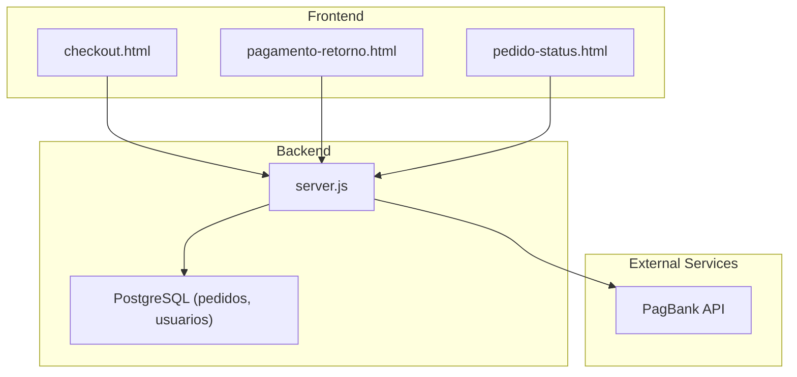
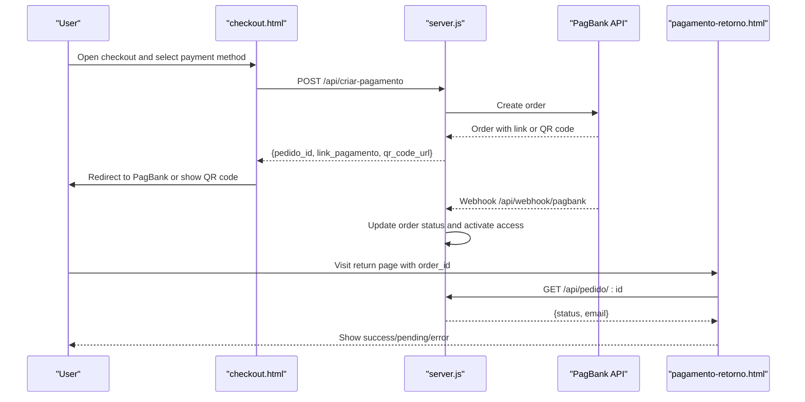
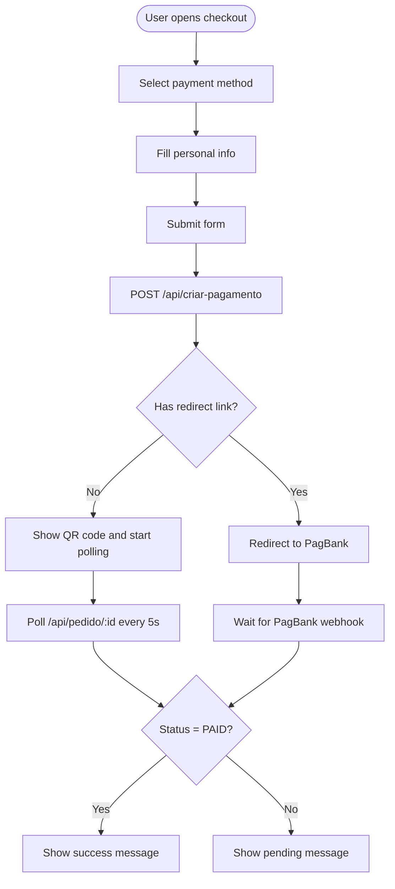
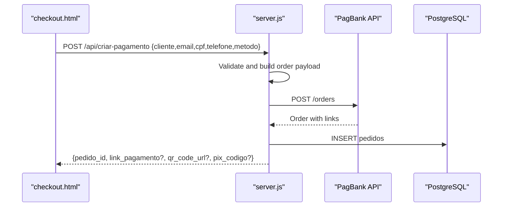
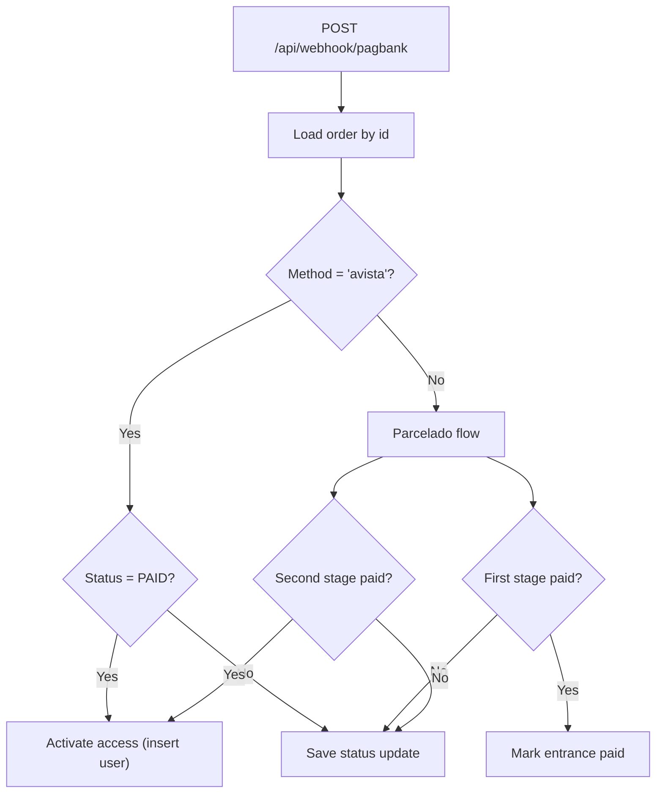
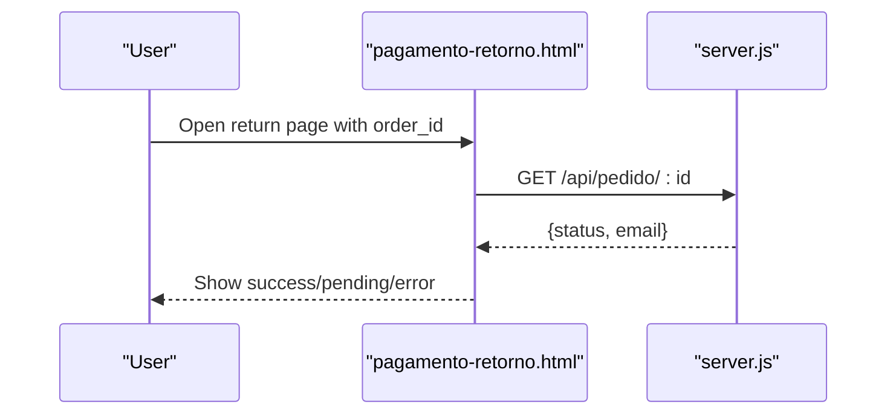
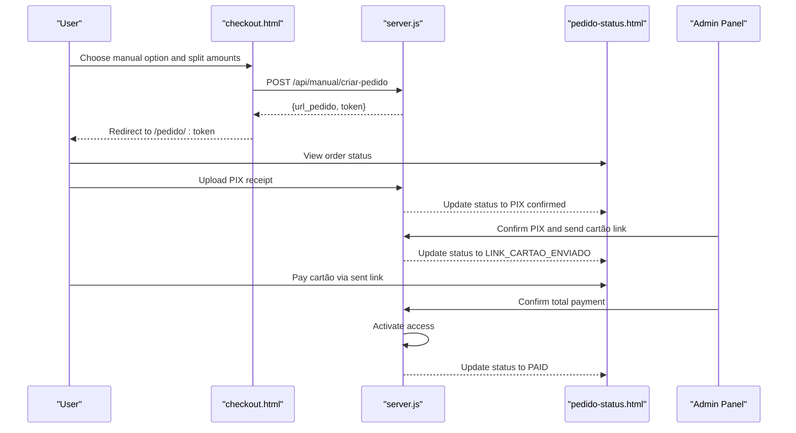
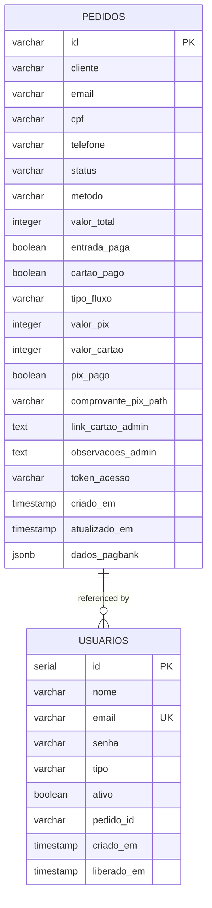
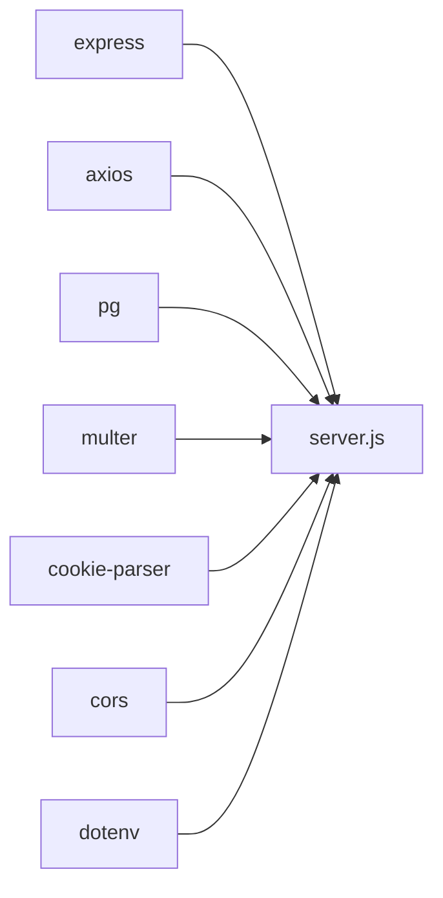

# Payment Flow & User Experience

<cite>
**Referenced Files in This Document**
- [checkout.html](file://checkout.html)
- [pagamento-retorno.html](file://pagamento-retorno.html)
- [pedido-status.html](file://pedido-status.html)
- [server.js](file://server.js)
- [database.sql](file://database.sql)
- [package.json](file://package.json)
- [PAGAMENTO-README.md](file://PAGAMENTO-README.md)
</cite>

## Table of Contents
1. [Introduction](#introduction)
2. [Project Structure](#project-structure)
3. [Core Components](#core-components)
4. [Architecture Overview](#architecture-overview)
5. [Detailed Component Analysis](#detailed-component-analysis)
6. [Dependency Analysis](#dependency-analysis)
7. [Performance Considerations](#performance-considerations)
8. [Troubleshooting Guide](#troubleshooting-guide)
9. [Conclusion](#conclusion)

## Introduction
This document explains the complete payment flow from the user's perspective, covering checkout, payment creation, redirection to PagBank, status handling, and access activation. It documents the user experience across payment method selection (à vista, entrada, cartão, manual), payment confirmation, and access activation. It also details frontend integration patterns and backend endpoint communication, along with troubleshooting guidance for common payment flow issues.

## Project Structure
The payment system consists of:
- Frontend pages: checkout, payment return, and manual order status
- Backend service: Express server exposing REST endpoints and handling PagBank integration
- Database: PostgreSQL schema for orders and users
- Dependencies: Express, Axios, PostgreSQL driver, Multer for uploads, dotenv for environment variables

**Diagram sources**
- [checkout.html](file://checkout.html)
- [pagamento-retorno.html](file://pagamento-retorno.html)
- [pedido-status.html](file://pedido-status.html)
- [server.js](file://server.js)
- [database.sql](file://database.sql)

**Section sources**
- [package.json:11-19](file://package.json#L11-L19)
- [PAGAMENTO-README.md:1-119](file://PAGAMENTO-README.md#L1-L119)

## Core Components
- Payment creation endpoint: creates a PagBank order, persists the order, and returns either a redirect link or fallback QR code
- Webhook handler: receives PagBank notifications and updates order status and user access
- Status polling: frontend checks order status periodically until completion
- Manual payment flow: separate flow for PIX + Cartão combinations with admin coordination
- Access activation: user account creation upon successful payment

Key responsibilities:
- Validate and sanitize user input
- Build PagBank order payload with redirect URLs
- Persist order state and handle multi-stage payments
- Provide public order status for manual flow
- Manage admin actions for manual orders

**Section sources**
- [server.js:82-280](file://server.js#L82-L280)
- [server.js:285-345](file://server.js#L285-L345)
- [server.js:350-370](file://server.js#L350-L370)
- [server.js:540-671](file://server.js#L540-L671)
- [server.js:805-890](file://server.js#L805-L890)

## Architecture Overview
The payment flow integrates the frontend checkout with the backend server and PagBank. The server handles order creation, webhook notifications, and order status queries. The frontend manages user interactions, redirects, and status polling.

**Diagram sources**
- [checkout.html:626-718](file://checkout.html#L626-L718)
- [server.js:82-280](file://server.js#L82-L280)
- [server.js:285-345](file://server.js#L285-L345)
- [pagamento-retorno.html:121-152](file://pagamento-retorno.html#L121-L152)

## Detailed Component Analysis

### Checkout Page (User Experience)
The checkout page presents four payment options:
- À Vista: immediate access after payment
- Entrada (PIX): partial payment via PagBank, followed by card installment
- Cartão: full payment via PagBank card
- Manual (PIX + Cartão): user-defined split, admin-managed card link

User journey:
1. Select payment method and review details
2. Fill personal information (name, email, CPF, phone)
3. Submit form to create payment
4. Redirect to PagBank or display QR code
5. Poll order status until completion
6. Receive success/pending/error feedback

**Diagram sources**
- [checkout.html:515-534](file://checkout.html#L515-L534)
- [checkout.html:626-718](file://checkout.html#L626-L718)
- [checkout.html:727-764](file://checkout.html#L727-L764)

**Section sources**
- [checkout.html:351-376](file://checkout.html#L351-L376)
- [checkout.html:431-455](file://checkout.html#L431-L455)
- [checkout.html:626-718](file://checkout.html#L626-L718)
- [checkout.html:727-764](file://checkout.html#L727-L764)

### Payment Creation Endpoint
The backend endpoint validates input, constructs a PagBank order with redirect URLs, persists the order, and returns either a redirect link or fallback QR code. It sets up success/failure/pending callbacks to the return page.

**Diagram sources**
- [server.js:82-280](file://server.js#L82-L280)
- [database.sql:13-36](file://database.sql#L13-L36)

**Section sources**
- [server.js:82-280](file://server.js#L82-L280)
- [database.sql:13-36](file://database.sql#L13-L36)

### Webhook Handling and Access Activation
When PagBank notifies the webhook, the backend updates the order status. For à vista payments, access is granted immediately upon confirmation. For the parcelado flow, the system tracks entrance and card stages separately.

**Diagram sources**
- [server.js:285-345](file://server.js#L285-L345)
- [server.js:458-487](file://server.js#L458-L487)

**Section sources**
- [server.js:285-345](file://server.js#L285-L345)
- [server.js:458-487](file://server.js#L458-L487)

### Payment Return Page (User Feedback)
The return page accepts an order identifier, queries the backend for status, and displays success, pending, or error states. It supports multiple query parameter names for flexibility.

**Diagram sources**
- [pagamento-retorno.html:121-152](file://pagamento-retorno.html#L121-L152)
- [server.js:350-370](file://server.js#L350-L370)

**Section sources**
- [pagamento-retorno.html:108-152](file://pagamento-retorno.html#L108-L152)
- [server.js:350-370](file://server.js#L350-L370)

### Manual Payment Flow (PIX + Cartão)
For the manual option, users define the split between PIX and cartão. The system generates a unique token and link for the user to manage their order independently. Admin confirms PIX receipt, sends the cartão link, and finally marks the order complete.

**Diagram sources**
- [checkout.html:646-672](file://checkout.html#L646-L672)
- [server.js:540-671](file://server.js#L540-L671)
- [pedido-status.html:172-338](file://pedido-status.html#L172-L338)
- [server.js:805-890](file://server.js#L805-L890)

**Section sources**
- [checkout.html:400-429](file://checkout.html#L400-L429)
- [checkout.html:646-672](file://checkout.html#L646-L672)
- [server.js:540-671](file://server.js#L540-L671)
- [pedido-status.html:172-338](file://pedido-status.html#L172-L338)
- [server.js:805-890](file://server.js#L805-L890)

### Database Schema
The system stores orders and users in PostgreSQL. Orders track payment stages, amounts, and admin notes. Users represent activated clients.

**Diagram sources**
- [database.sql:13-58](file://database.sql#L13-L58)

**Section sources**
- [database.sql:13-58](file://database.sql#L13-L58)

## Dependency Analysis
The backend depends on:
- Express for routing and middleware
- Axios for external API calls to PagBank
- PostgreSQL driver for database operations
- Multer for manual order receipt uploads
- Dotenv for environment configuration

**Diagram sources**
- [package.json:11-19](file://package.json#L11-L19)
- [server.js:1-10](file://server.js#L1-L10)

**Section sources**
- [package.json:11-19](file://package.json#L11-L19)
- [server.js:1-10](file://server.js#L1-L10)

## Performance Considerations
- Status polling interval: 5 seconds for standard flow; 10 seconds for manual flow
- QR code fallback reduces reliance on external services
- Database indexing on email/status improves order queries
- Webhook-driven updates minimize polling overhead

## Troubleshooting Guide
Common issues and resolutions:
- No redirect link from PagBank: fallback to QR code display and polling
- Invalid or missing PagBank token: configure PAGBANK_TOKEN in environment
- Payment pending: return page shows pending state; check webhook delivery
- Manual flow delays: admin must confirm PIX and send cartão link
- Upload errors (manual): ensure file type and size limits are met

User-facing error messages:
- Payment creation failures: "Erro ao criar pagamento" with optional debug details
- Missing fields: "Dados incompletos"
- Manual split validation: sum must equal total and each part ≥ R$ 1,00
- Upload failures: "Falha no upload" with specific error text

Operational checks:
- Verify webhook URL configured in PagBank dashboard
- Confirm HTTPS for production deployments
- Ensure database connectivity and migrations applied
- Validate environment variables (PAGBANK_TOKEN, DB credentials)

**Section sources**
- [server.js:239-280](file://server.js#L239-L280)
- [server.js:544-565](file://server.js#L544-L565)
- [server.js:620-659](file://server.js#L620-L659)
- [PAGAMENTO-README.md:88-98](file://PAGAMENTO-README.md#L88-L98)

## Conclusion
The payment system provides a robust, user-friendly checkout experience with multiple payment methods, clear status feedback, and admin-managed flows for complex arrangements. The frontend integrates seamlessly with backend endpoints, while the backend ensures reliable order management and access activation through webhook-driven updates.