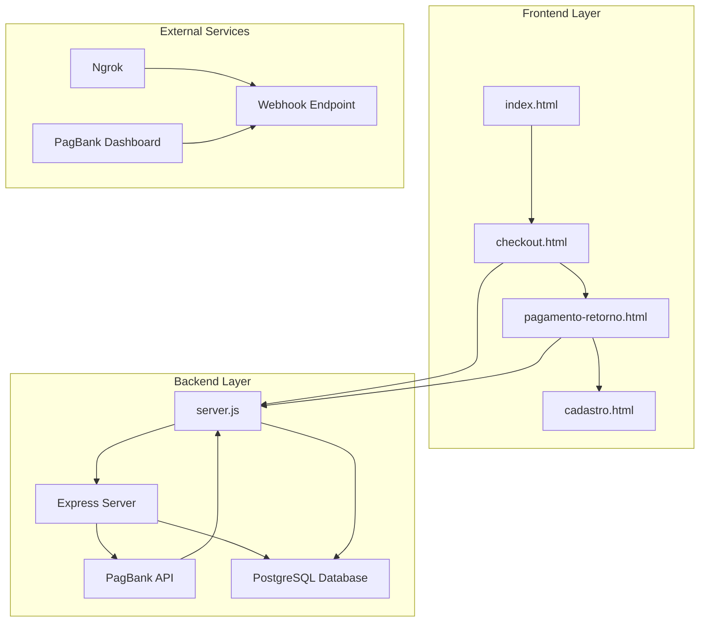
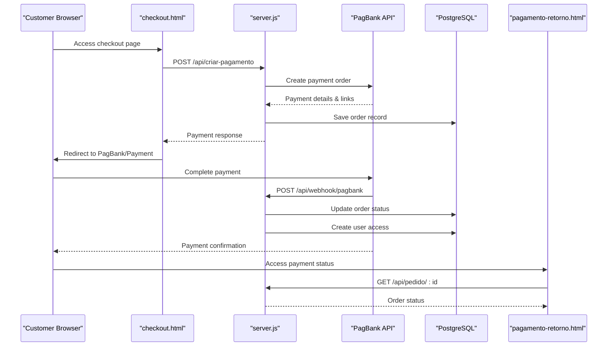
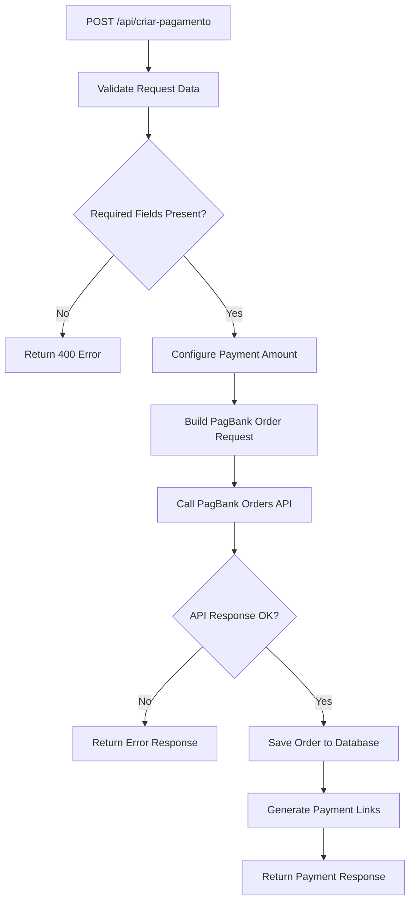
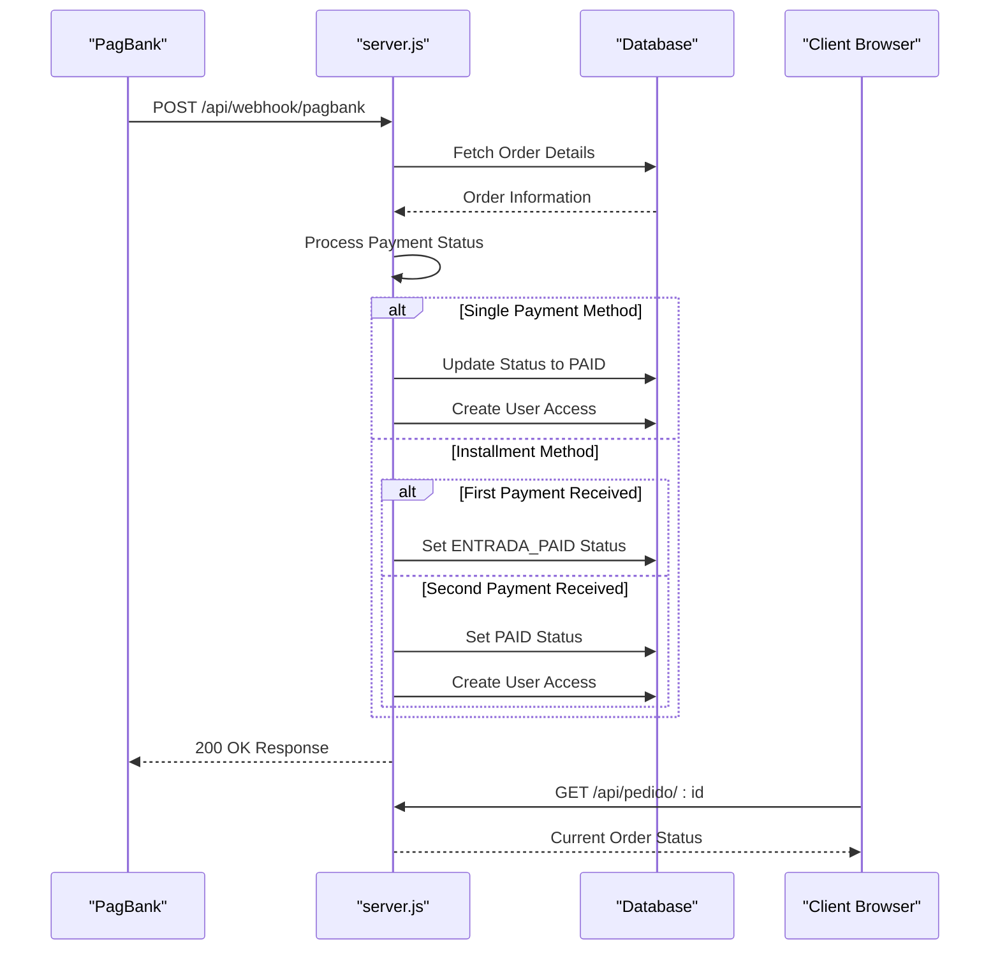
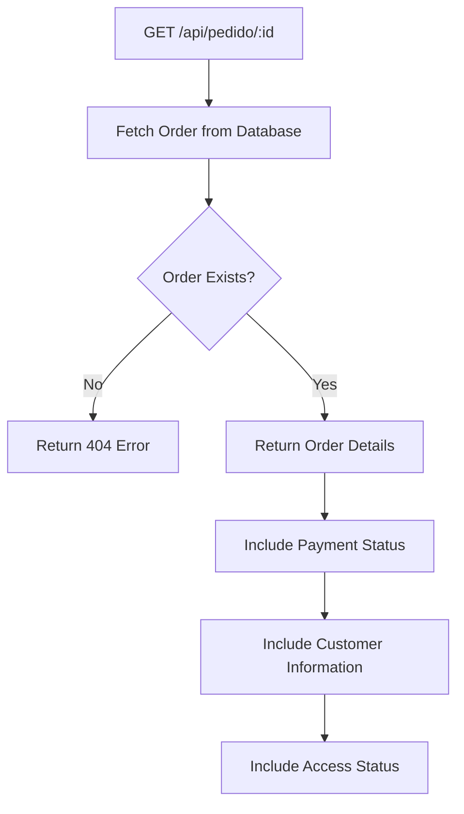
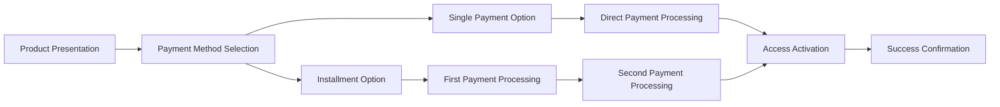
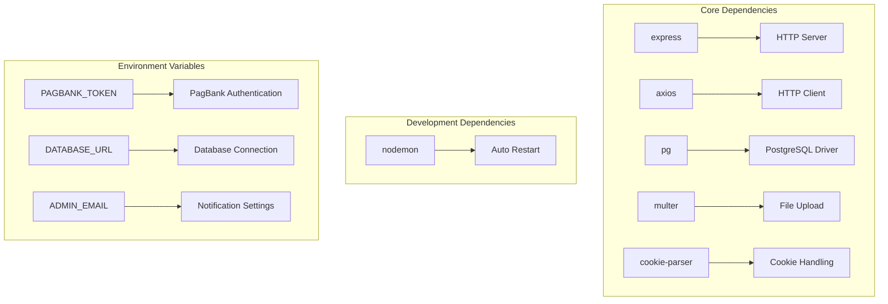
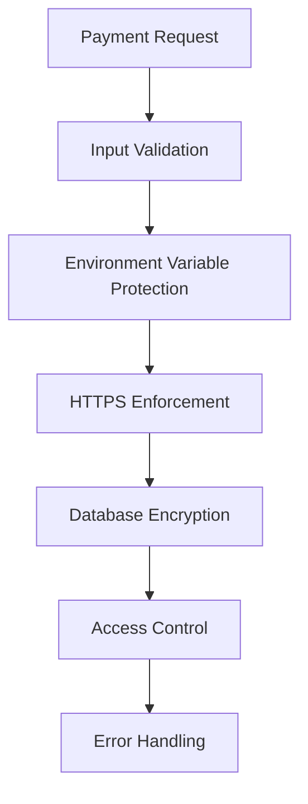
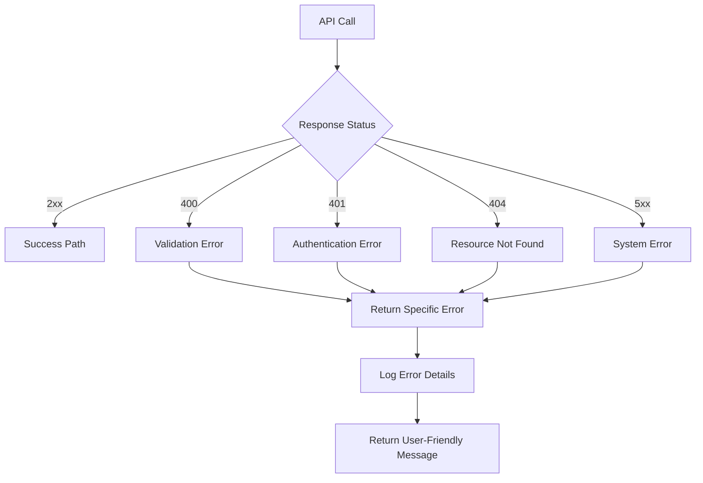

# Payment System Architecture

<cite>
**Referenced Files in This Document**
- [server.js](file://server.js)
- [package.json](file://package.json)
- [checkout.html](file://checkout.html)
- [pagamento-retorno.html](file://pagamento-retorno.html)
- [database.sql](file://database.sql)
- [init-db.sql](file://init-db.sql)
- [PAGAMENTO-README.md](file://PAGAMENTO-README.md)
- [index.html](file://index.html)
- [cadastro.html](file://cadastro.html)
</cite>

## Table of Contents
1. [Introduction](#introduction)
2. [Project Structure](#project-structure)
3. [Core Components](#core-components)
4. [Architecture Overview](#architecture-overview)
5. [Detailed Component Analysis](#detailed-component-analysis)
6. [Dependency Analysis](#dependency-analysis)
7. [Performance Considerations](#performance-considerations)
8. [Security Considerations](#security-considerations)
9. [Troubleshooting Guide](#troubleshooting-guide)
10. [Conclusion](#conclusion)

## Introduction

This document provides comprehensive payment system documentation for the PagBank integration within the Alimentares QR code labeling system. The payment system enables customers to purchase access to the labeling software through secure payment processing with real-time status updates and automated order management.

The system integrates PagBank's payment infrastructure to handle both single-payment and installment payment scenarios, providing a seamless checkout experience with immediate access activation upon successful payment confirmation.

## Project Structure

The payment system consists of several key components working together to provide a complete payment solution:

**Diagram sources**
- [server.js:12-469](file://server.js#L12-L469)
- [checkout.html:1-585](file://checkout.html#L1-L585)
- [pagamento-retorno.html:1-156](file://pagamento-retorno.html#L1-L156)

**Section sources**
- [server.js:12-469](file://server.js#L12-L469)
- [checkout.html:1-585](file://checkout.html#L1-L585)
- [PAGAMENTO-README.md:1-119](file://PAGAMENTO-README.md#L1-L119)

## Core Components

### Payment Processing Engine

The core payment processing is handled by the Express server with dedicated endpoints for payment creation, status checking, and webhook reception.

### Database Management

The system uses PostgreSQL to track payment orders, customer information, and access permissions with comprehensive indexing for optimal performance.

### Frontend Payment Interface

Multiple HTML pages provide different aspects of the payment experience, from product presentation to payment processing and status verification.

**Section sources**
- [server.js:82-280](file://server.js#L82-L280)
- [database.sql:13-36](file://database.sql#L13-L36)
- [checkout.html:288-585](file://checkout.html#L288-L585)

## Architecture Overview

The payment system follows a modern microservice architecture pattern with clear separation of concerns:

**Diagram sources**
- [server.js:82-280](file://server.js#L82-L280)
- [checkout.html:496-535](file://checkout.html#L496-L535)
- [pagamento-retorno.html:108-153](file://pagamento-retorno.html#L108-L153)

## Detailed Component Analysis

### Payment Creation Endpoint

The `/api/criar-pagamento` endpoint handles the complete payment creation process:

**Diagram sources**
- [server.js:82-280](file://server.js#L82-L280)

Key features of the payment creation process:
- Dynamic pricing based on payment method selection
- Automatic order ID generation
- Real-time communication with PagBank API
- Comprehensive error handling and logging
- Database persistence for order tracking

**Section sources**
- [server.js:82-280](file://server.js#L82-L280)
- [server.js:132-173](file://server.js#L132-L173)

### Webhook Processing System

The webhook system provides real-time payment status updates:

**Diagram sources**
- [server.js:285-345](file://server.js#L285-L345)

The webhook system handles two distinct payment scenarios:
- **Single payment method**: Immediate access activation upon payment confirmation
- **Installment method**: Two-stage payment processing with separate access triggers

**Section sources**
- [server.js:285-345](file://server.js#L285-L345)
- [server.js:303-337](file://server.js#L303-L337)

### Order Status Checking

The `/api/pedido/:id` endpoint provides real-time order status monitoring:

**Diagram sources**
- [server.js:350-370](file://server.js#L350-L370)

**Section sources**
- [server.js:350-370](file://server.js#L350-L370)

### Frontend Payment Experience

The checkout interface provides multiple payment options:

**Diagram sources**
- [checkout.html:306-325](file://checkout.html#L306-L325)

**Section sources**
- [checkout.html:306-325](file://checkout.html#L306-L325)
- [checkout.html:472-535](file://checkout.html#L472-L535)

## Dependency Analysis

The payment system relies on several key dependencies:

**Diagram sources**
- [package.json:11-18](file://package.json#L11-L18)
- [server.js:47-61](file://server.js#L47-L61)

**Section sources**
- [package.json:11-23](file://package.json#L11-L23)
- [server.js:47-61](file://server.js#L47-L61)

## Performance Considerations

### Database Optimization

The system implements several performance optimizations:

- **Indexing Strategy**: Strategic indexes on frequently queried columns (email, status, timestamps)
- **Connection Pooling**: Efficient PostgreSQL connection management
- **JSONB Storage**: Flexible data storage for dynamic payment information
- **Async Operations**: Non-blocking database operations

### API Response Times

- **Payment Creation**: Typically completes within 2-5 seconds
- **Webhook Processing**: Asynchronous processing with immediate acknowledgment
- **Status Queries**: Sub-second response times for order status checks

### Scalability Considerations

- **Horizontal Scaling**: Stateless server architecture supports load balancing
- **Database Scaling**: PostgreSQL clustering support for high availability
- **Caching Opportunities**: Potential for Redis caching of frequently accessed order data

## Security Considerations

### Payment Security

The system implements multiple security layers:

**Diagram sources**
- [server.js:89-96](file://server.js#L89-L96)
- [server.js:120-128](file://server.js#L120-L128)

### Data Protection Measures

- **Sensitive Data Handling**: Payment credentials stored in environment variables only
- **Input Sanitization**: Comprehensive validation of all customer input
- **Database Security**: Encrypted connections and restricted access
- **Error Message Filtering**: Generic error messages prevent information leakage

### Access Control Implementation

- **User Authentication**: Session-based authentication for system access
- **Permission Management**: Role-based access control (admin/client)
- **Audit Logging**: Comprehensive logging of payment activities
- **Rate Limiting**: Protection against abuse and spam attempts

**Section sources**
- [server.js:89-96](file://server.js#L89-L96)
- [server.js:120-128](file://server.js#L120-L128)
- [server.js:432-461](file://server.js#L432-L461)

## Troubleshooting Guide

### Common Payment Issues

| Issue | Symptoms | Solution |
|-------|----------|----------|
| Payment Timeout | Error connecting to PagBank | Verify PAGBANK_TOKEN configuration |
| Invalid Credentials | 401 Unauthorized errors | Check PagBank API token validity |
| Database Connection | Server startup failures | Verify DATABASE_URL format |
| Payment Not Updating | Webhook not processed | Check webhook URL configuration |

### Debugging Procedures

1. **Enable Detailed Logging**: Review server logs for error messages
2. **Verify Environment Setup**: Ensure all required environment variables are configured
3. **Test API Endpoints**: Use curl commands to test individual endpoints
4. **Monitor Database**: Check order records for payment status updates

### Error Handling Patterns

The system implements comprehensive error handling:

**Diagram sources**
- [server.js:239-280](file://server.js#L239-L280)

**Section sources**
- [server.js:239-280](file://server.js#L239-L280)
- [PAGAMENTO-README.md:69-119](file://PAGAMENTO-README.md#L69-L119)

## Conclusion

The PagBank payment system integration provides a robust, scalable solution for processing payments within the Alimentares QR code labeling platform. The system successfully combines modern web technologies with secure payment processing to deliver a seamless customer experience.

Key strengths of the implementation include:

- **Real-time Processing**: Instant payment status updates through webhook technology
- **Flexible Payment Options**: Support for both single and installment payment methods
- **Automated Access Management**: Streamlined user access activation upon payment confirmation
- **Comprehensive Error Handling**: Robust error management with detailed logging
- **Security Focus**: Multi-layered security approach protecting sensitive payment data

The system is designed for easy deployment and maintenance, with clear separation of concerns and comprehensive documentation. Future enhancements could include advanced analytics, additional payment methods, and enhanced reporting capabilities.