# Payment System Architecture

<cite>
**Referenced Files in This Document**
- [server.js](file://server.js)
- [package.json](file://package.json)
- [checkout.html](file://checkout.html)
- [pagamento-retorno.html](file://pagamento-retorno.html)
- [database.sql](file://database.sql)
- [init-db.sql](file://init-db.sql)
- [PAGAMENTO-README.md](file://PAGAMENTO-README.md)
- [index.html](file://index.html)
- [cadastro.html](file://cadastro.html)
- [admin.html](file://admin.html)
- [admin-login.html](file://admin-login.html)
- [pedido-status.html](file://pedido-status.html)
</cite>

## Update Summary
**Changes Made**
- Added comprehensive documentation for the new dual payment flow system
- Documented the manual payment flow with PIX + Cartão combination
- Added documentation for new payment states (PENDING_PIX, PIX_ENVIADO, PIX_CONFIRMADO_AGUARDA_CARTAO, LINK_CARTAO_ENVIADO, PAID, CANCELADO)
- Updated architecture diagrams to reflect the new administrative oversight features
- Enhanced webhook processing documentation with manual flow integration
- Added administrative panel documentation with real-time order management capabilities

## Table of Contents
1. [Introduction](#introduction)
2. [Project Structure](#project-structure)
3. [Core Components](#core-components)
4. [Architecture Overview](#architecture-overview)
5. [Detailed Component Analysis](#detailed-component-analysis)
6. [Dual Payment Flow System](#dual-payment-flow-system)
7. [Administrative Oversight Features](#administrative-oversight-features)
8. [Dependency Analysis](#dependency-analysis)
9. [Performance Considerations](#performance-considerations)
10. [Security Considerations](#security-considerations)
11. [Troubleshooting Guide](#troubleshooting-guide)
12. [Conclusion](#conclusion)

## Introduction

This document provides comprehensive payment system documentation for the PagBank integration within the Alimentares QR code labeling system. The payment system enables customers to purchase access to the labeling software through secure payment processing with real-time status updates and automated order management.

**Updated** The system now supports a dual payment flow system with both automated PagBank processing and manual payment handling, featuring administrative oversight for complex payment arrangements including PIX + Cartão combinations.

The system integrates PagBank's payment infrastructure to handle both single-payment and installment payment scenarios, providing a seamless checkout experience with immediate access activation upon successful payment confirmation. The new dual flow system supports flexible payment arrangements where customers can split payments between PIX and credit card with administrative approval.

## Project Structure

The payment system consists of several key components working together to provide a complete payment solution with dual processing capabilities:

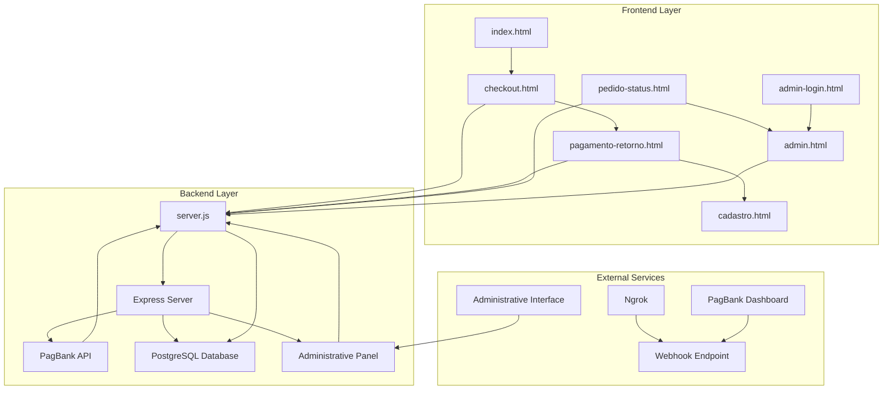

**Diagram sources**
- [server.js:12-914](file://server.js#L12-L914)
- [checkout.html:1-768](file://checkout.html#L1-L768)
- [pagamento-retorno.html:1-156](file://pagamento-retorno.html#L1-L156)
- [admin.html:1-304](file://admin.html#L1-L304)
- [pedido-status.html:1-341](file://pedido-status.html#L1-L341)

**Section sources**
- [server.js:12-914](file://server.js#L12-L914)
- [checkout.html:1-768](file://checkout.html#L1-L768)
- [PAGAMENTO-README.md:1-119](file://PAGAMENTO-README.md#L1-L119)

## Core Components

### Payment Processing Engine

The core payment processing is handled by the Express server with dedicated endpoints for payment creation, status checking, and webhook reception. The system now supports two distinct payment flows:

**Automated PagBank Flow**: Traditional single-payment processing through PagBank with automatic access activation
**Manual Dual Flow**: Complex payment arrangements with administrative oversight for PIX + Cartão combinations

### Database Management

The system uses PostgreSQL to track payment orders, customer information, and access permissions with comprehensive indexing for optimal performance. The database schema has been enhanced to support both payment flows with additional fields for administrative oversight.

### Frontend Payment Interface

Multiple HTML pages provide different aspects of the payment experience, from product presentation to payment processing and status verification. The checkout interface now offers four payment options including the new manual dual flow.

**Section sources**
- [server.js:82-280](file://server.js#L82-L280)
- [database.sql:13-36](file://database.sql#L13-L36)
- [checkout.html:350-376](file://checkout.html#L350-L376)

## Architecture Overview

The payment system follows a modern microservice architecture pattern with clear separation of concerns and dual payment flow capabilities:

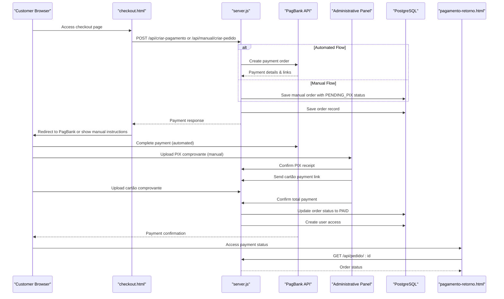

**Diagram sources**
- [server.js:82-280](file://server.js#L82-L280)
- [checkout.html:496-535](file://checkout.html#L496-L535)
- [pagamento-retorno.html:108-153](file://pagamento-retorno.html#L108-L153)
- [server.js:540-617](file://server.js#L540-L617)
- [server.js:805-890](file://server.js#L805-L890)

## Detailed Component Analysis

### Payment Creation Endpoint

The `/api/criar-pagamento` endpoint handles the complete automated payment creation process:

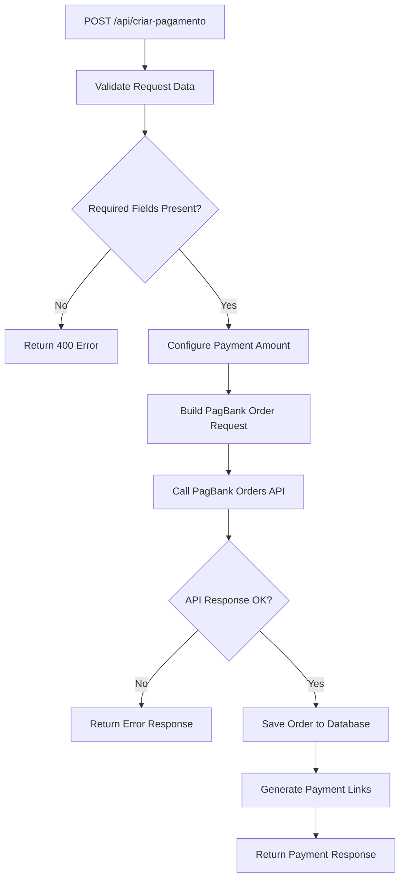

**Diagram sources**
- [server.js:82-280](file://server.js#L82-L280)

Key features of the automated payment creation process:
- Dynamic pricing based on payment method selection
- Automatic order ID generation
- Real-time communication with PagBank API
- Comprehensive error handling and logging
- Database persistence for order tracking

**Section sources**
- [server.js:82-280](file://server.js#L82-L280)
- [server.js:132-173](file://server.js#L132-L173)

### Manual Payment Creation Endpoint

The `/api/manual/criar-pedido` endpoint creates orders for the dual payment flow:

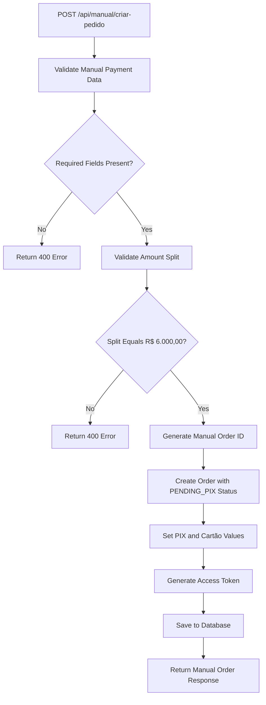

**Diagram sources**
- [server.js:540-617](file://server.js#L540-L617)

**Section sources**
- [server.js:540-617](file://server.js#L540-L617)

### Webhook Processing System

The webhook system provides real-time payment status updates for both payment flows:

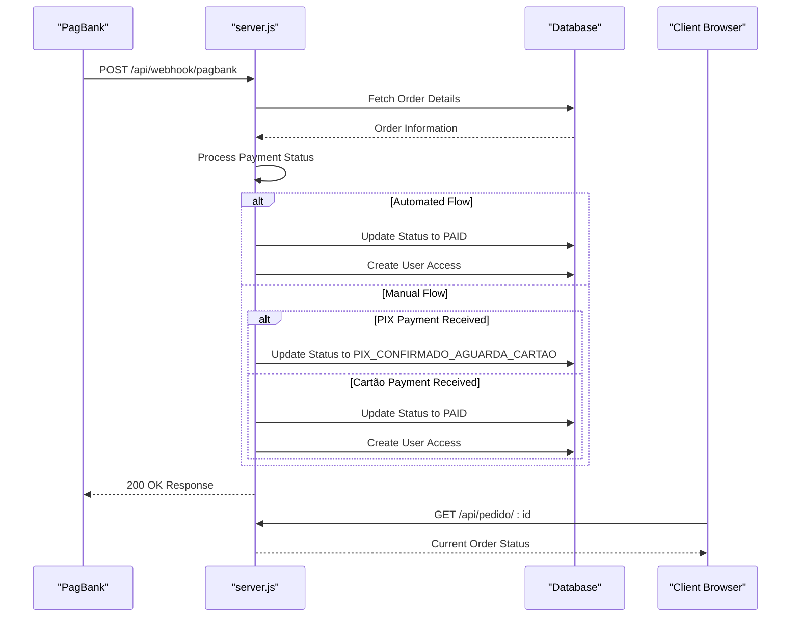

**Diagram sources**
- [server.js:285-345](file://server.js#L285-L345)

**Section sources**
- [server.js:285-345](file://server.js#L285-L345)
- [server.js:303-337](file://server.js#L303-L337)

### Administrative Oversight System

The administrative panel provides comprehensive oversight for manual payment orders:

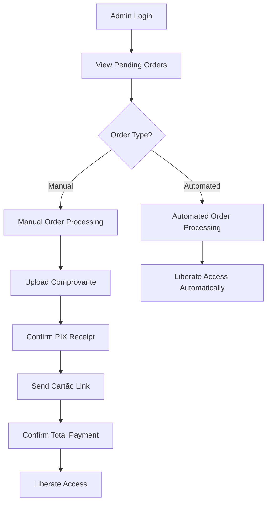

**Diagram sources**
- [server.js:805-890](file://server.js#L805-L890)
- [admin.html:110-304](file://admin.html#L110-L304)

**Section sources**
- [server.js:805-890](file://server.js#L805-L890)
- [admin.html:110-304](file://admin.html#L110-L304)

### Order Status Checking

The `/api/pedido/:id` endpoint provides real-time order status monitoring for both payment flows:

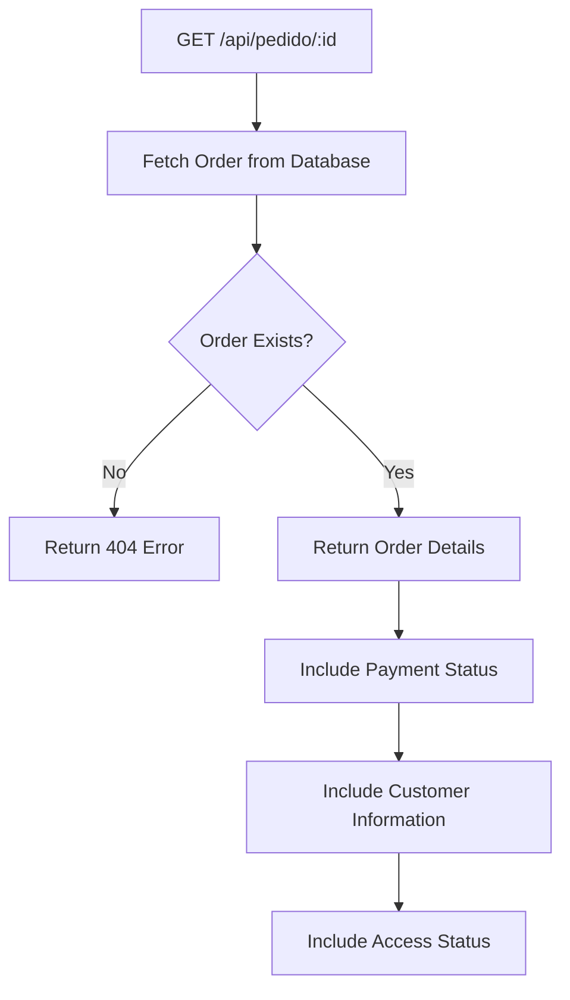

**Diagram sources**
- [server.js:350-370](file://server.js#L350-L370)

**Section sources**
- [server.js:350-370](file://server.js#L350-L370)

### Frontend Payment Experience

The checkout interface provides multiple payment options including the new manual dual flow:

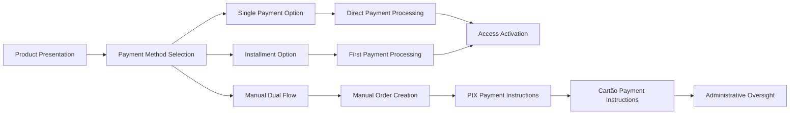

**Diagram sources**
- [checkout.html:350-376](file://checkout.html#L350-L376)

**Section sources**
- [checkout.html:350-376](file://checkout.html#L350-L376)
- [checkout.html:472-535](file://checkout.html#L472-L535)

## Dual Payment Flow System

### Payment States and Transitions

The manual payment flow operates through six distinct payment states with clear administrative oversight:

| State | Description | Administrative Actions | Client Actions |
|-------|-------------|----------------------|----------------|
| PENDING_PIX | Order created, awaiting PIX payment | None | View PIX instructions |
| PIX_ENVIADO | Client uploaded PIX comprovante | Review comprovante | Wait for confirmation |
| PIX_CONFIRMADO_AGUARDA_CARTAO | Admin confirmed PIX, awaiting cartão link | Confirm PIX receipt | Wait for cartão link |
| LINK_CARTAO_ENVIADO | Admin sent cartão payment link | Send cartão link | Pay cartão portion |
| PAID | All payments received, access granted | Confirm total payment | Access system |
| CANCELADO | Order cancelled by admin | Cancel order | Create new order |

### Manual Payment Processing Logic

The manual payment flow requires administrative intervention at each critical step:

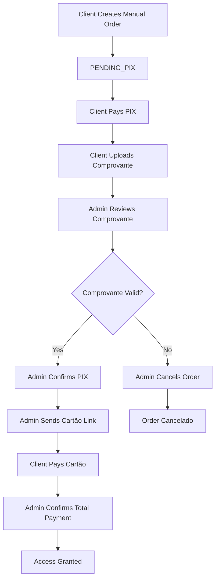

**Diagram sources**
- [server.js:540-617](file://server.js#L540-L617)
- [server.js:805-890](file://server.js#L805-L890)

**Section sources**
- [server.js:540-617](file://server.js#L540-L617)
- [server.js:805-890](file://server.js#L805-L890)

### Client-Side Manual Payment Interface

The client interface guides users through the manual payment process:

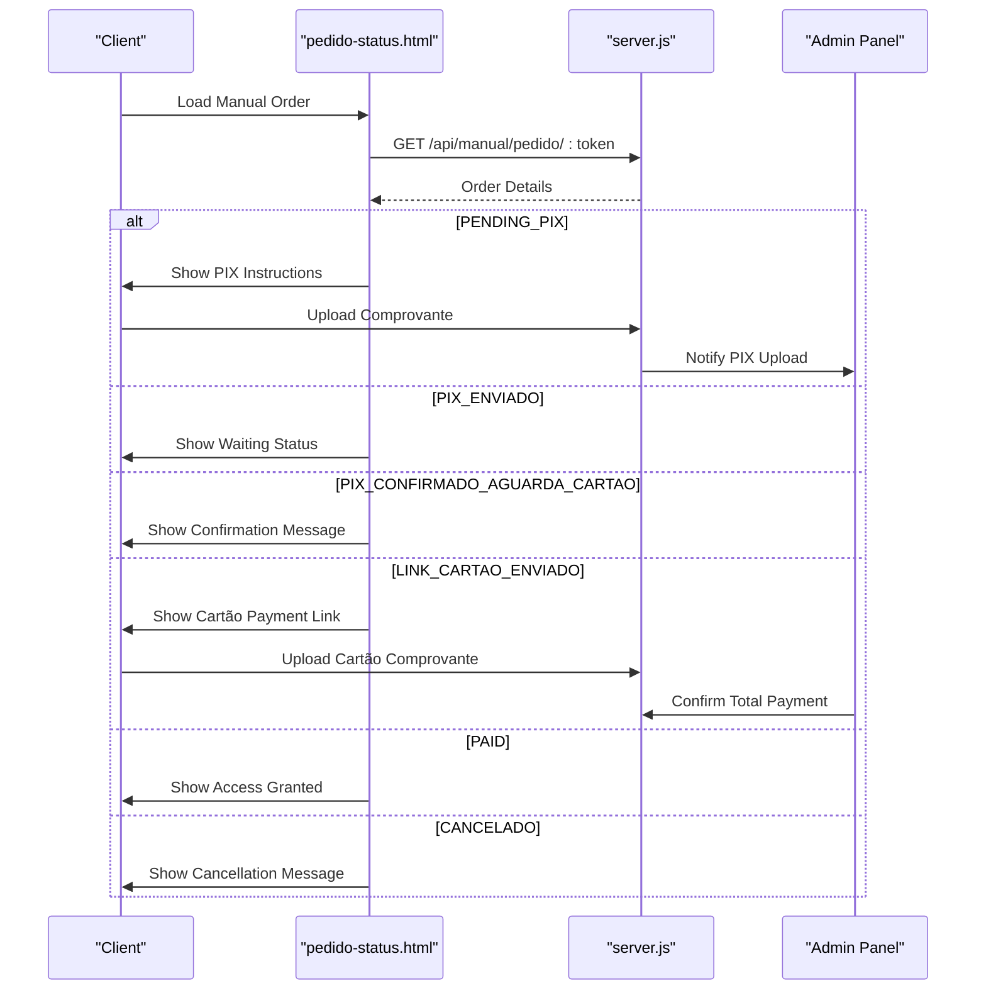

**Diagram sources**
- [pedido-status.html:172-338](file://pedido-status.html#L172-L338)
- [server.js:661-671](file://server.js#L661-L671)

**Section sources**
- [pedido-status.html:172-338](file://pedido-status.html#L172-L338)
- [server.js:661-671](file://server.js#L661-L671)

## Administrative Oversight Features

### Administrative Panel Capabilities

The administrative panel provides comprehensive oversight for manual payment orders:

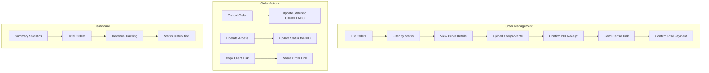

**Diagram sources**
- [admin.html:110-304](file://admin.html#L110-L304)
- [server.js:762-802](file://server.js#L762-L802)

### Administrative Workflows

Administrators can manage orders through several key workflows:

1. **PIX Comprovante Review**: Administrators review uploaded PIX receipts and confirm payment validity
2. **Cartão Payment Link Management**: Administrators send payment links for the remaining balance
3. **Total Payment Confirmation**: Administrators verify all payments are received and grant access
4. **Order Cancellation**: Administrators can cancel orders that don't meet requirements

**Section sources**
- [admin.html:110-304](file://admin.html#L110-L304)
- [server.js:805-890](file://server.js#L805-L890)

## Dependency Analysis

The payment system relies on several key dependencies:

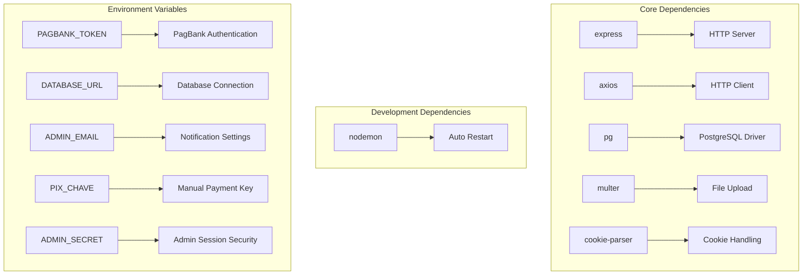

**Diagram sources**
- [package.json:11-18](file://package.json#L11-L18)
- [server.js:47-61](file://server.js#L47-L61)

**Section sources**
- [package.json:11-23](file://package.json#L11-L23)
- [server.js:47-61](file://server.js#L47-L61)

## Performance Considerations

### Database Optimization

The system implements several performance optimizations:

- **Indexing Strategy**: Strategic indexes on frequently queried columns (email, status, timestamps)
- **Connection Pooling**: Efficient PostgreSQL connection management
- **JSONB Storage**: Flexible data storage for dynamic payment information
- **Async Operations**: Non-blocking database operations
- **Unique Token Index**: Optimized access token lookups for manual orders

### API Response Times

- **Payment Creation**: Typically completes within 2-5 seconds
- **Webhook Processing**: Asynchronous processing with immediate acknowledgment
- **Status Queries**: Sub-second response times for order status checks
- **Manual Order Processing**: Optimized for administrative workflows with caching

### Scalability Considerations

- **Horizontal Scaling**: Stateless server architecture supports load balancing
- **Database Scaling**: PostgreSQL clustering support for high availability
- **Caching Opportunities**: Potential for Redis caching of frequently accessed order data
- **Administrative Panel**: Optimized for concurrent admin sessions

## Security Considerations

### Payment Security

The system implements multiple security layers:

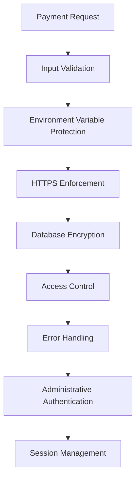

**Diagram sources**
- [server.js:89-96](file://server.js#L89-L96)
- [server.js:120-128](file://server.js#L120-L128)
- [server.js:727-734](file://server.js#L727-L734)

### Data Protection Measures

- **Sensitive Data Handling**: Payment credentials stored in environment variables only
- **Input Sanitization**: Comprehensive validation of all customer input
- **Database Security**: Encrypted connections and restricted access
- **Error Message Filtering**: Generic error messages prevent information leakage
- **Administrative Authentication**: Secure session management with HMAC signatures
- **File Upload Security**: Restricted file types and size limits for comprovante uploads

### Access Control Implementation

- **User Authentication**: Session-based authentication for system access
- **Permission Management**: Role-based access control (admin/client)
- **Audit Logging**: Comprehensive logging of payment activities
- **Rate Limiting**: Protection against abuse and spam attempts
- **Administrative Session Security**: HMAC-signed cookies with expiration

**Section sources**
- [server.js:89-96](file://server.js#L89-L96)
- [server.js:120-128](file://server.js#L120-L128)
- [server.js:727-734](file://server.js#L727-L734)
- [server.js:409-417](file://server.js#L409-L417)

## Troubleshooting Guide

### Common Payment Issues

| Issue | Symptoms | Solution |
|-------|----------|----------|
| Payment Timeout | Error connecting to PagBank | Verify PAGBANK_TOKEN configuration |
| Invalid Credentials | 401 Unauthorized errors | Check PagBank API token validity |
| Database Connection | Server startup failures | Verify DATABASE_URL format |
| Payment Not Updating | Webhook not processed | Check webhook URL configuration |
| Manual Order Stuck | Order not progressing | Check administrative actions |
| File Upload Errors | Comprovante upload failures | Verify file type and size limits |

### Debugging Procedures

1. **Enable Detailed Logging**: Review server logs for error messages
2. **Verify Environment Setup**: Ensure all required environment variables are configured
3. **Test API Endpoints**: Use curl commands to test individual endpoints
4. **Monitor Database**: Check order records for payment status updates
5. **Check Administrative Panel**: Verify order state transitions

### Error Handling Patterns

The system implements comprehensive error handling:

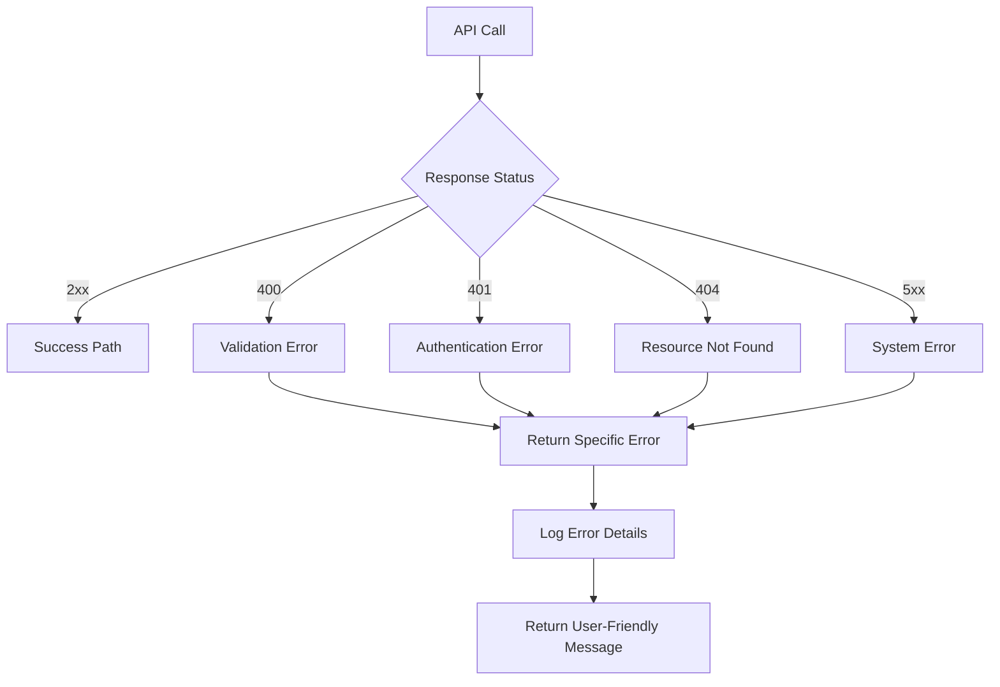

**Diagram sources**
- [server.js:239-280](file://server.js#L239-L280)

**Section sources**
- [server.js:239-280](file://server.js#L239-L280)
- [PAGAMENTO-README.md:69-119](file://PAGAMENTO-README.md#L69-L119)

## Conclusion

The PagBank payment system integration provides a robust, scalable solution for processing payments within the Alimentares QR code labeling platform. The system successfully combines modern web technologies with secure payment processing to deliver a seamless customer experience.

**Updated** The addition of the dual payment flow system significantly enhances the platform's flexibility and capability to handle complex payment arrangements. The new manual payment flow with administrative oversight enables sophisticated payment structures including PIX + Cartão combinations, providing customers with greater payment flexibility while maintaining administrative control over the payment process.

Key strengths of the implementation include:

- **Real-time Processing**: Instant payment status updates through webhook technology
- **Flexible Payment Options**: Support for both single and installment payment methods
- **Dual Payment Flows**: Comprehensive support for automated and manual payment processing
- **Administrative Oversight**: Complete control over manual payment orders with real-time status updates
- **Automated Access Management**: Streamlined user access activation upon payment confirmation
- **Comprehensive Error Handling**: Robust error management with detailed logging
- **Security Focus**: Multi-layered security approach protecting sensitive payment data
- **Scalable Architecture**: Designed for horizontal scaling and high availability

The system is designed for easy deployment and maintenance, with clear separation of concerns and comprehensive documentation. Future enhancements could include advanced analytics, additional payment methods, and enhanced reporting capabilities for the administrative panel.