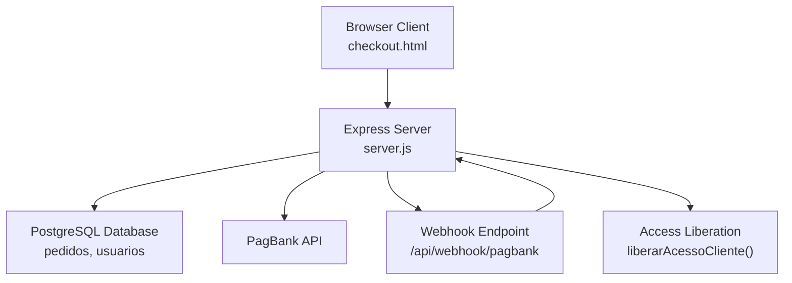
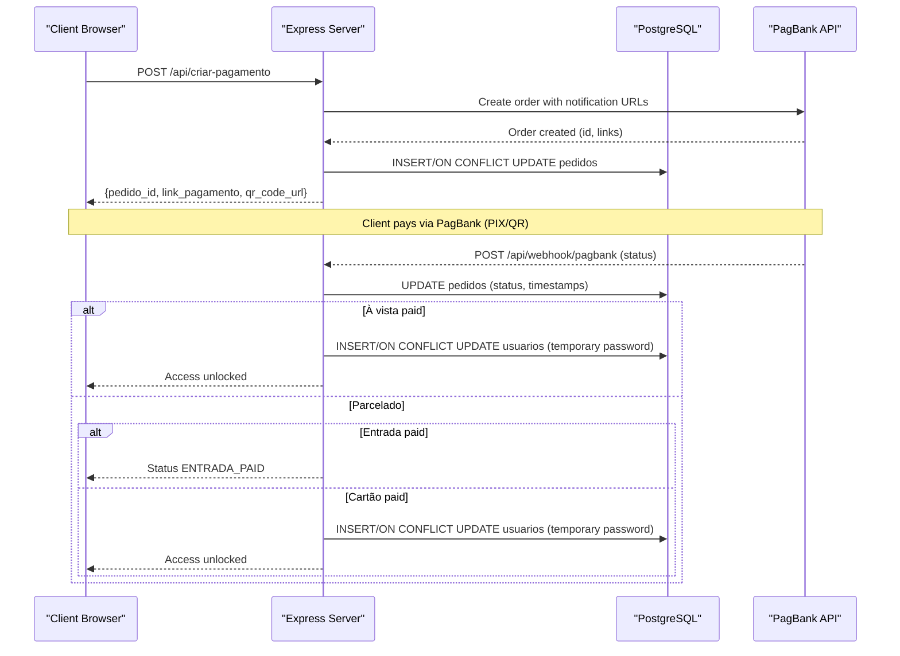
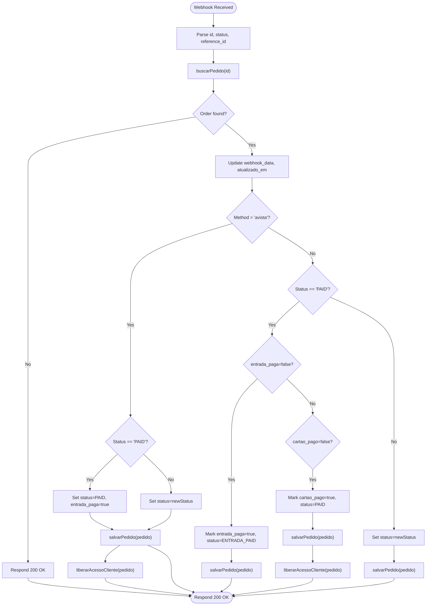
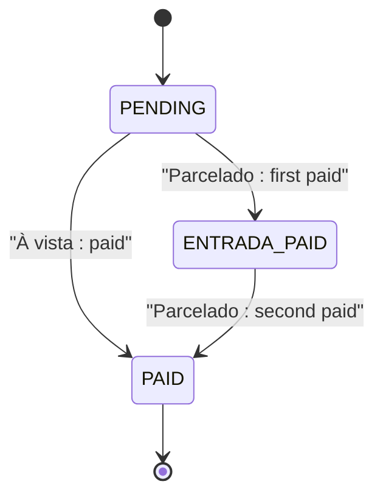
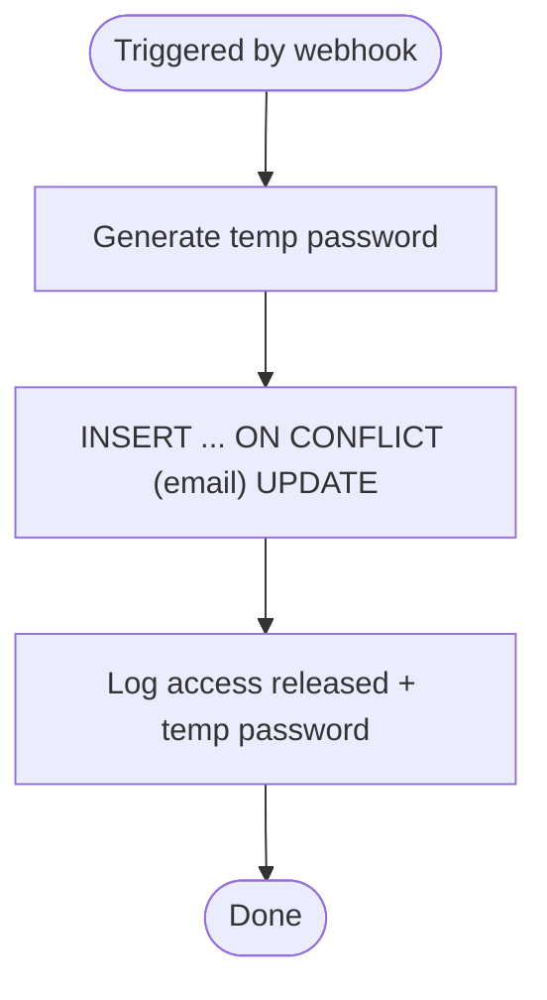
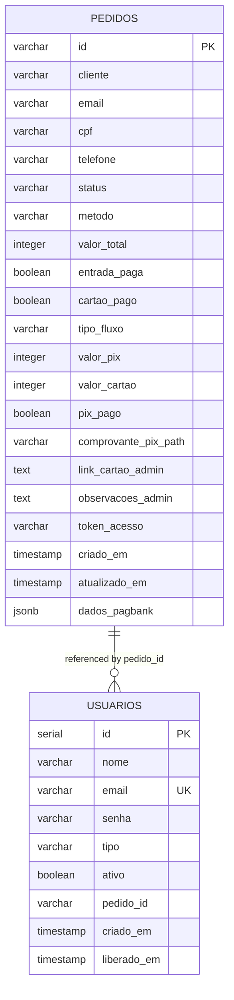
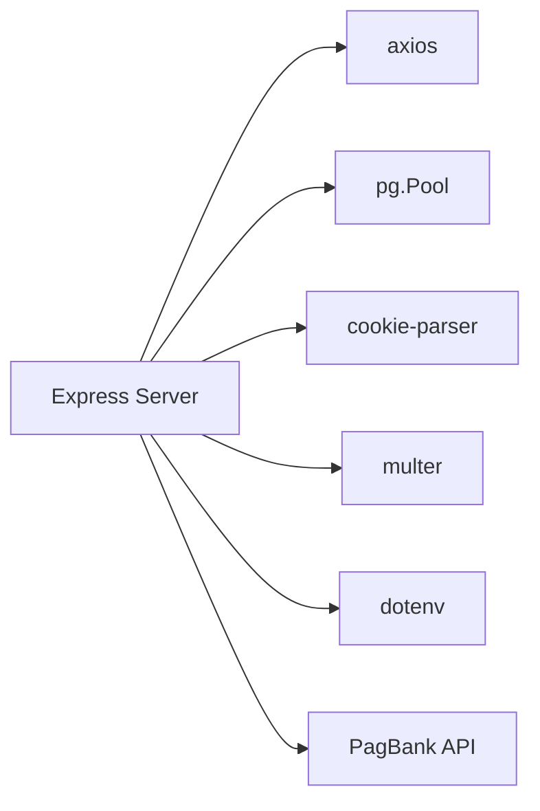

# Webhook Processing & Order Management

<cite>
**Referenced Files in This Document**
- [server.js](file://server.js)
- [database.sql](file://database.sql)
- [init-db.sql](file://init-db.sql)
- [checkout.html](file://checkout.html)
- [PAGAMENTO-README.md](file://PAGAMENTO-README.md)
- [package.json](file://package.json)
</cite>

## Table of Contents
1. [Introduction](#introduction)
2. [Project Structure](#project-structure)
3. [Core Components](#core-components)
4. [Architecture Overview](#architecture-overview)
5. [Detailed Component Analysis](#detailed-component-analysis)
6. [Dependency Analysis](#dependency-analysis)
7. [Performance Considerations](#performance-considerations)
8. [Troubleshooting Guide](#troubleshooting-guide)
9. [Conclusion](#conclusion)

## Introduction
This document explains the webhook processing and order management system for the Alimentares payment platform. It focuses on the POST /api/webhook/pagbank endpoint, request validation, database operations, order status management across payment methods (à vista, entrada, cartão), automatic access liberation via the liberarAcessoCliente function, PostgreSQL integration patterns, and webhook verification/retry strategies.

## Project Structure
The system is a Node.js/Express backend with PostgreSQL persistence and a checkout frontend that integrates with PagBank for payment orchestration.

**Diagram sources**
- [server.js:285-345](file://server.js#L285-L345)
- [server.js:458-487](file://server.js#L458-L487)
- [database.sql:13-58](file://database.sql#L13-L58)

**Section sources**
- [server.js:12-27](file://server.js#L12-L27)
- [package.json:11-18](file://package.json#L11-L18)

## Core Components
- Express server with middleware for CORS, JSON parsing, cookies, and static assets.
- PostgreSQL connection pool configured via DATABASE_URL or environment variables.
- Payment orchestration endpoints:
  - POST /api/criar-pagamento: Creates a PagBank order and persists the order record.
  - POST /api/webhook/pagbank: Processes PagBank webhooks and updates order status.
  - GET /api/pedido/:id: Retrieves order status for client polling.
  - GET /api/pedidos: Lists orders (admin).
- Database helpers:
  - salvarPedido: Upserts order records with JSONB storage for PagBank data.
  - buscarPedido: Fetches order by ID.
  - listarPedidos: Lists orders with ordering and pagination-friendly limit.
- Access management:
  - liberarAcessoCliente: Creates or updates a client user with a generated temporary password.

**Section sources**
- [server.js:82-280](file://server.js#L82-L280)
- [server.js:285-345](file://server.js#L285-L345)
- [server.js:350-378](file://server.js#L350-L378)
- [server.js:388-456](file://server.js#L388-L456)
- [server.js:458-487](file://server.js#L458-L487)

## Architecture Overview
The system integrates the frontend checkout with PagBank to generate orders and QR codes, then receives asynchronous webhooks to update order state and unlock access.

**Diagram sources**
- [server.js:82-280](file://server.js#L82-L280)
- [server.js:285-345](file://server.js#L285-L345)
- [server.js:388-456](file://server.js#L388-L456)
- [server.js:458-487](file://server.js#L458-L487)

## Detailed Component Analysis

### POST /api/webhook/pagbank Implementation
- Request validation:
  - Extracts id, status, and reference_id from the webhook body.
- Order lookup:
  - Uses buscarPedido to retrieve the order by PagBank order ID.
- Status update logic:
  - Updates webhook_data and updated timestamp.
  - For à vista: sets status to PAID and marks entrada_paga when paid.
  - For parcelado (entrada + cartão):
    - First paid event: marks entrada_paga and sets ENTRADA_PAID.
    - Second paid event: marks cartao_pago, sets PAID, and triggers access liberation.
- Access liberation:
  - Calls liberarAcessoCliente to create/update a client user with a temporary password and activation flag.

**Diagram sources**
- [server.js:285-345](file://server.js#L285-L345)
- [server.js:458-487](file://server.js#L458-L487)

**Section sources**
- [server.js:285-345](file://server.js#L285-L345)

### Order Status Management by Payment Method
- À vista (à vista):
  - On first paid webhook, mark order as PAID and release access immediately.
- Parcelado (entrada + cartão):
  - First paid webhook: mark entrada_paga=true, set ENTRADA_PAID; do not release access yet.
  - Second paid webhook: mark cartao_pago=true, set PAID, then release access.

**Diagram sources**
- [server.js:303-337](file://server.js#L303-L337)

**Section sources**
- [server.js:303-337](file://server.js#L303-L337)

### Automatic Access Liberation (liberarAcessoCliente)
- Generates a random 6-character alphanumeric temporary password.
- Inserts or updates a user record in the usuarios table with:
  - nome, email, senha (temporary), tipo='cliente', ativo=true, pedido_id, liberado_em.
- Logs the access release and the temporary password.

**Diagram sources**
- [server.js:458-487](file://server.js#L458-L487)

**Section sources**
- [server.js:458-487](file://server.js#L458-L487)

### Database Integration Patterns (PostgreSQL)
- Connection:
  - Uses pg.Pool configured from DATABASE_URL or environment variables.
  - Connect test logs success or error.
- Tables:
  - pedidos: stores order metadata, totals, flags, timestamps, and PagBank JSONB data.
  - usuarios: stores client credentials and activation status.
- Upsert pattern:
  - salvarPedido uses ON CONFLICT UPDATE to merge incoming webhook data with existing records.
- Indexes:
  - Pedidos: email, status, unique token_acesso when present.
  - Usuarios: email, tipo, ativo.

**Diagram sources**
- [database.sql:13-58](file://database.sql#L13-L58)

**Section sources**
- [server.js:64-77](file://server.js#L64-L77)
- [database.sql:13-58](file://database.sql#L13-L58)
- [init-db.sql:4-30](file://init-db.sql#L4-L30)

### Frontend Integration (checkout.html)
- Supports four payment methods:
  - À vista: direct PIX via PagBank.
  - Entrada: partial PIX via PagBank, followed by card payment.
  - Cartão: full card payment via PagBank.
  - Manual: client-defined split (PIX + Cartão), validated client-side and persisted server-side.
- Redirects to PagBank checkout or displays QR code and polls /api/pedido/:id for status updates.

**Section sources**
- [checkout.html:351-376](file://checkout.html#L351-L376)
- [checkout.html:626-718](file://checkout.html#L626-L718)
- [checkout.html:727-764](file://checkout.html#L727-L764)

## Dependency Analysis
- External libraries:
  - express, cors, axios, pg, cookie-parser, multer, dotenv.
- Environment variables:
  - PAGBANK_TOKEN, DATABASE_URL, DB_* for PostgreSQL, ADMIN_* for admin session, PIX_* for manual flow.
- PagBank integration:
  - Orders created with notification_urls pointing to /api/webhook/pagbank.
  - Webhook payload processed to update order status and trigger access release.

**Diagram sources**
- [package.json:11-18](file://package.json#L11-L18)
- [server.js:16-19](file://server.js#L16-L19)
- [server.js:47-50](file://server.js#L47-L50)

**Section sources**
- [package.json:11-18](file://package.json#L11-L18)
- [server.js:47-50](file://server.js#L47-L50)

## Performance Considerations
- Database:
  - Use indexes on frequently queried columns (email, status) to speed up lookups.
  - Prefer UPSERT with ON CONFLICT to minimize write operations during webhook updates.
- Webhooks:
  - Keep webhook handlers fast and synchronous; offload heavy tasks to background jobs if needed.
- Client polling:
  - The frontend polls every 5 seconds; consider exponential backoff or WebSocket for production.

## Troubleshooting Guide
- Webhook verification strategies:
  - Configure PagBank notification URLs to point to /api/webhook/pagbank.
  - Use HTTPS in production; PagBank requires HTTPS for webhooks.
  - For local development, expose your server using a tunnel (e.g., ngrok) and update PagBank notification URLs accordingly.
- Retry mechanisms:
  - PagBank retries failed webhook deliveries; ensure your endpoint responds with 200 OK on successful processing.
  - If webhook delivery fails, PagBank will retry according to its policy; monitor logs for repeated failures.
- Common errors:
  - Missing or invalid PAGBANK_TOKEN leads to 500 responses when creating orders.
  - Database connectivity errors are logged during pool connect; verify DATABASE_URL and credentials.
  - Webhook handler errors return 500; check server logs for stack traces.
- Order status discrepancies:
  - Verify that the webhook payload contains the expected id and status.
  - Use GET /api/pedido/:id to inspect current order state and timestamps.

**Section sources**
- [PAGAMENTO-README.md:88-98](file://PAGAMENTO-README.md#L88-L98)
- [server.js:239-280](file://server.js#L239-L280)
- [server.js:341-344](file://server.js#L341-L344)

## Conclusion
The system provides a robust webhook-driven order management pipeline with clear status transitions for different payment methods and automatic access liberation upon payment confirmation. PostgreSQL integration is straightforward with UPSERT patterns and indexing. For production, ensure HTTPS for webhooks, implement monitoring and retry strategies, and consider scaling database writes and client polling for better performance.