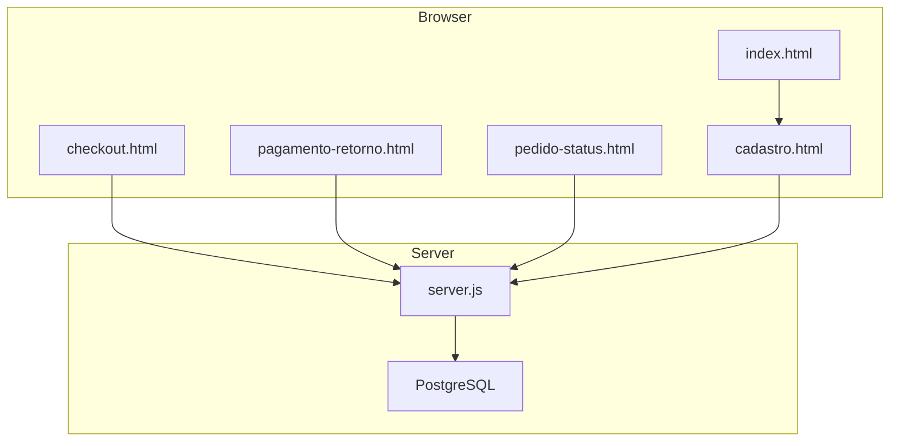
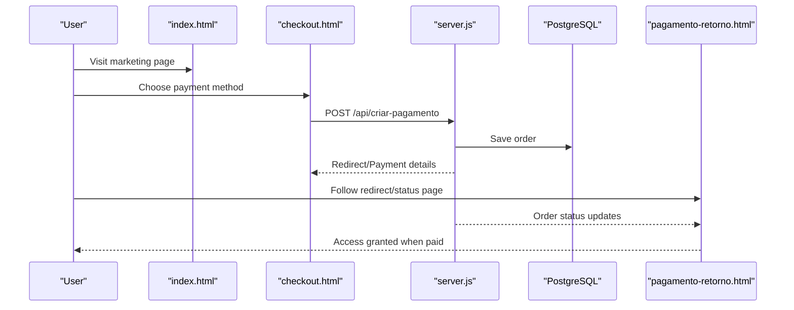
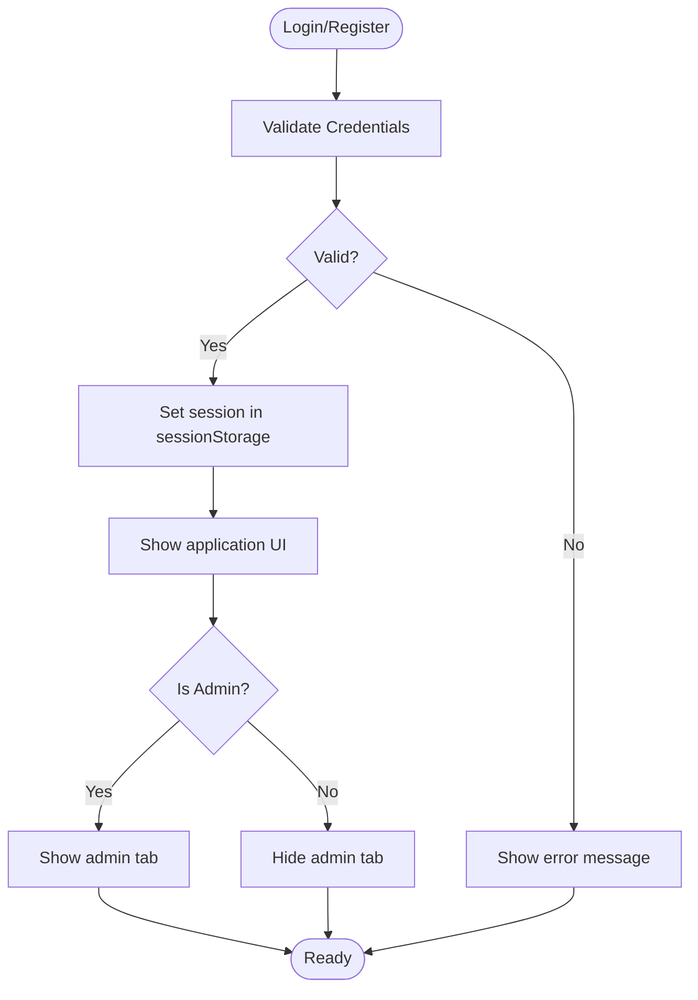
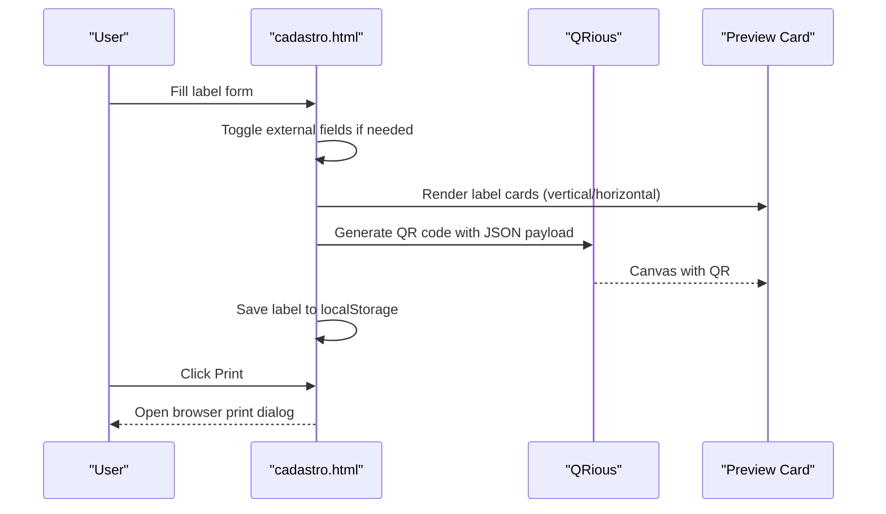
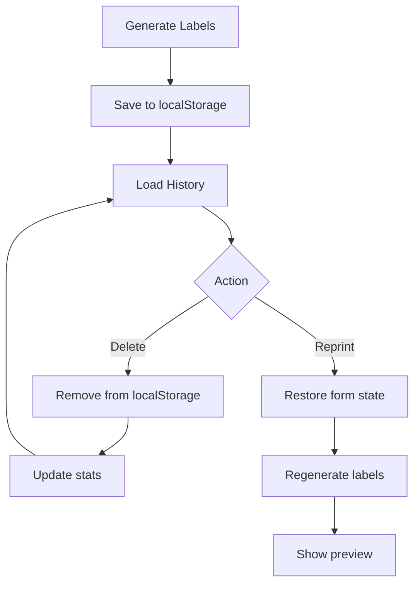
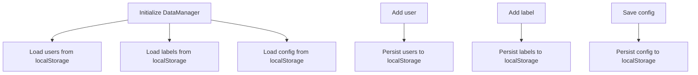
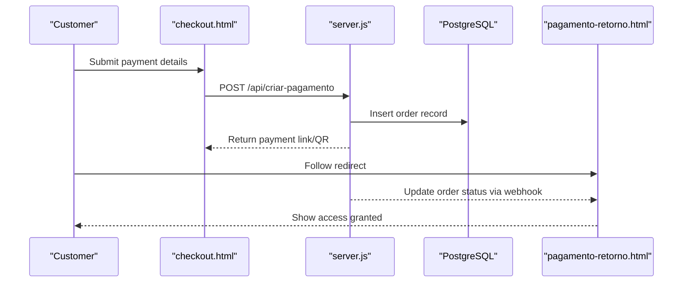
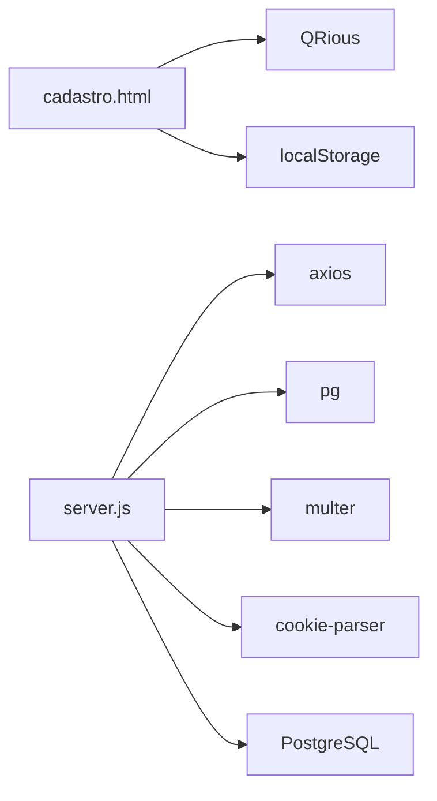

# Core Features & Capabilities

<cite>
**Referenced Files in This Document**
- [index.html](file://index.html)
- [checkout.html](file://checkout.html)
- [pagamento-retorno.html](file://pagamento-retorno.html)
- [pedido-status.html](file://pedido-status.html)
- [cadastro.html](file://cadastro.html)
- [server.js](file://server.js)
- [database.sql](file://database.sql)
- [init-db.sql](file://init-db.sql)
- [package.json](file://package.json)
- [dados/etiquetas.json](file://dados/etiquetas.json)
- [dados/usuarios.json](file://dados/usuarios.json)
</cite>

## Table of Contents
1. [Introduction](#introduction)
2. [Project Structure](#project-structure)
3. [Core Components](#core-components)
4. [Architecture Overview](#architecture-overview)
5. [Detailed Component Analysis](#detailed-component-analysis)
6. [Dependency Analysis](#dependency-analysis)
7. [Performance Considerations](#performance-considerations)
8. [Troubleshooting Guide](#troubleshooting-guide)
9. [Conclusion](#conclusion)

## Introduction
This document describes the core features and capabilities of the Alimentares system, focusing on user registration and authentication, role-based access control (administrator/client), QR code label generation with customizable templates, label history management, offline functionality, print and reprint workflows, statistics dashboard, and data persistence through browser localStorage. It also documents the two label types (internal/external) and their QR code data structures, including additional fields for external labels.

## Project Structure
The system consists of:
- Frontend pages for marketing, checkout, payment verification, and the main application
- Backend server integrating with PagBank for payment processing and managing PostgreSQL data
- Local data persistence via browser localStorage for labels and users during development/demo mode
- Static assets and QR generation libraries

**Diagram sources**
- [index.html](file://index.html)
- [checkout.html](file://checkout.html)
- [pagamento-retorno.html](file://pagamento-retorno.html)
- [pedido-status.html](file://pedido-status.html)
- [cadastro.html](file://cadastro.html)
- [server.js](file://server.js)
- [database.sql](file://database.sql)

**Section sources**
- [index.html](file://index.html)
- [checkout.html](file://checkout.html)
- [pagamento-retorno.html](file://pagamento-retorno.html)
- [pedido-status.html](file://pedido-status.html)
- [cadastro.html](file://cadastro.html)
- [server.js](file://server.js)
- [database.sql](file://database.sql)

## Core Components
- User Registration and Authentication
  - Login and registration forms with session persistence via sessionStorage
  - Role-based access control: admin and client roles
- Label Generation and Templates
  - Internal and external label types with QR code data structures
  - Customizable QR position (vertical/horizontal) and label color
  - External label fields: price, weight, company, CNPJ, ingredients, manufacturer
- Label History Management
  - Browser localStorage-backed history with delete and reprint actions
  - Statistics dashboard counts for total, internal, and external labels
- Print and Reprint Workflows
  - Print preview and browser print integration
  - Reprint action restores previous label form state
- Offline Functionality
  - Client-side data persistence via localStorage for labels and users
  - Admin-only features remain functional offline (local data)
- Payment Integration
  - Checkout with multiple payment methods (à vista, entrada, cartão, manual)
  - PagBank integration for à vista and cartão flows
  - Manual flow with PIX + Cartão split and admin confirmation steps

**Section sources**
- [cadastro.html](file://cadastro.html)
- [server.js](file://server.js)
- [checkout.html](file://checkout.html)
- [pagamento-retorno.html](file://pagamento-retorno.html)
- [pedido-status.html](file://pedido-status.html)

## Architecture Overview
The system integrates frontend and backend components:
- Frontend pages handle user interactions, QR generation, and local data management
- Backend server manages payments, admin sessions, and PostgreSQL persistence
- Local data is used for demonstration and offline scenarios

**Diagram sources**
- [checkout.html](file://checkout.html)
- [server.js](file://server.js)
- [database.sql](file://database.sql)
- [pagamento-retorno.html](file://pagamento-retorno.html)

## Detailed Component Analysis

### User Registration and Authentication
- Login and Registration
  - Login validates credentials against stored users
  - Registration creates a new client user with default role
  - Session stored in sessionStorage for current browser session
- Role-Based Access Control
  - Admin users gain access to administrative tabs and features
  - Client users can generate labels, view history, and manage prints
- Data Persistence
  - Users persisted in localStorage during development/demo mode
  - Admin-only features are hidden for non-admin users

**Diagram sources**
- [cadastro.html](file://cadastro.html)

**Section sources**
- [cadastro.html](file://cadastro.html)

### Role-Based Access Control (Client/Admin)
- Admin privileges
  - Create users, manage permissions, configure QR position
  - View and manage orders (via admin endpoints)
- Client privileges
  - Generate labels, print, manage history, view stats
- Session management
  - Admin session validated via signed cookie with HMAC signature

**Section sources**
- [cadastro.html](file://cadastro.html)
- [server.js](file://server.js)

### QR Code Label Generation and Templates
- Label Types
  - Internal: stock control with ID, product, lot, expiry, type
  - External: commercial labels with price, weight, company, CNPJ, ingredients, manufacturer
- QR Code Data Structure
  - Internal: id, product, lot, expiry, type
  - External: same as internal plus price, weight, company, CNPJ, ingredients, manufacturer
- Template Rendering
  - Two layouts: vertical (QR on top) and horizontal (QR to the side)
  - Color customization per label
  - Dynamic content rendering based on QR position and label type
- QR Generation
  - Uses QRious library to generate QR codes sized according to layout
- Print Preview
  - Preview card displays generated labels before printing
  - Print integration triggers browser print dialog

**Diagram sources**
- [cadastro.html](file://cadastro.html)

**Section sources**
- [cadastro.html](file://cadastro.html)

### Label History Management and Reprint
- History Storage
  - Labels stored in localStorage with metadata (createdBy, createdAt)
  - Limited to last 50 entries in history view
- Operations
  - Delete individual labels
  - Reprint labels by restoring form state and regenerating labels
- Statistics Dashboard
  - Counts for total, internal, and external labels
  - Updated after each operation

**Diagram sources**
- [cadastro.html](file://cadastro.html)

**Section sources**
- [cadastro.html](file://cadastro.html)

### Print Functionality and Reprint Capabilities
- Print Preview
  - Dynamically generated label cards with QR codes
  - Responsive layout adapts to print media
- Browser Print Integration
  - Uses window.print() to trigger native print dialog
  - Print styles optimize label appearance for thermal printers
- Reprint Workflow
  - Select reprint from history
  - Auto-fill form with previous label data
  - Generate and print immediately

**Section sources**
- [cadastro.html](file://cadastro.html)

### Statistics Dashboard
- Metrics
  - Total labels count
  - Internal labels count
  - External labels count
- Updates
  - Automatically updated after label generation, deletion, and reprint

**Section sources**
- [cadastro.html](file://cadastro.html)

### Data Persistence Through Browser localStorage
- Labels
  - Stored under key "alimentares_labels"
  - Supports add, delete, and list operations
- Users
  - Stored under key "alimentares_users"
  - Supports add, delete, and list operations
- Configuration
  - Stored under key "alimentares_config"
  - Stores QR position preference

**Diagram sources**
- [cadastro.html](file://cadastro.html)

**Section sources**
- [cadastro.html](file://cadastro.html)

### Payment Integration and Access Control
- Payment Methods
  - À vista: R$ 5,400 with instant access
  - Entrada: R$ 1,000 via PIX, remainder via cartão
  - Cartão: Full amount via cartão
  - Manual: Split between PIX and cartão with admin confirmation
- PagBank Integration
  - Creates orders, handles redirects, and webhooks
  - Saves order data to PostgreSQL
  - Releases access to clients upon payment confirmation
- Manual Flow
  - Generates unique token for customer link
  - Customer pays PIX and uploads proof
  - Admin confirms PIX, sends cartão link, confirms completion

**Diagram sources**
- [checkout.html](file://checkout.html)
- [server.js](file://server.js)
- [database.sql](file://database.sql)
- [pagamento-retorno.html](file://pagamento-retorno.html)

**Section sources**
- [checkout.html](file://checkout.html)
- [server.js](file://server.js)
- [database.sql](file://database.sql)
- [pagamento-retorno.html](file://pagamento-retorno.html)
- [pedido-status.html](file://pedido-status.html)

### Offline Functionality
- Client-side persistence
  - Labels and users stored in localStorage for offline use
  - Admin features remain functional with local data
- Limitations
  - Payment flows require server connectivity
  - Admin-only features depend on server-side admin session

**Section sources**
- [cadastro.html](file://cadastro.html)
- [server.js](file://server.js)

## Dependency Analysis
- Frontend dependencies
  - QRious for QR code generation
  - Font Awesome and Google Fonts for UI
- Backend dependencies
  - Express for HTTP server
  - Axios for PagBank API calls
  - PostgreSQL driver for database operations
  - Multer for file uploads (comprovantes)
  - Cookie parser for admin session handling
- Environment configuration
  - Database connection via DATABASE_URL or individual variables
  - PagBank token and admin credentials via environment variables

**Diagram sources**
- [cadastro.html](file://cadastro.html)
- [server.js](file://server.js)
- [package.json](file://package.json)

**Section sources**
- [package.json](file://package.json)
- [server.js](file://server.js)

## Performance Considerations
- QR generation
  - Batch generation deferred with setTimeout to avoid blocking UI
- Print optimization
  - Print styles minimize layout overhead for thermal printers
- Data operations
  - History limited to recent entries to reduce DOM and memory usage
- Network requests
  - Polling intervals for manual flow status updates configurable

## Troubleshooting Guide
- Login issues
  - Verify username and password match stored records
  - Ensure session is not expired (sessionStorage cleared on logout)
- Label generation errors
  - Ensure required fields (product, lot, expiry) are filled
  - Check QR position configuration persists across sessions
- Print problems
  - Confirm browser print dialog opens and printer is selected
  - Adjust label color for contrast on thermal paper
- Payment issues
  - Verify PagBank token is configured
  - Check order status via webhook and database
  - For manual flow, ensure comprovante uploaded and admin confirmed

**Section sources**
- [cadastro.html](file://cadastro.html)
- [server.js](file://server.js)

## Conclusion
The Alimentares system provides a comprehensive solution for generating professional QR code labels with robust user management, role-based access control, and flexible payment options. Its modular design enables easy extension and maintenance, while client-side data persistence ensures usability in offline scenarios. The integration with PagBank streamlines payment processing, and the admin features support efficient order and user management.