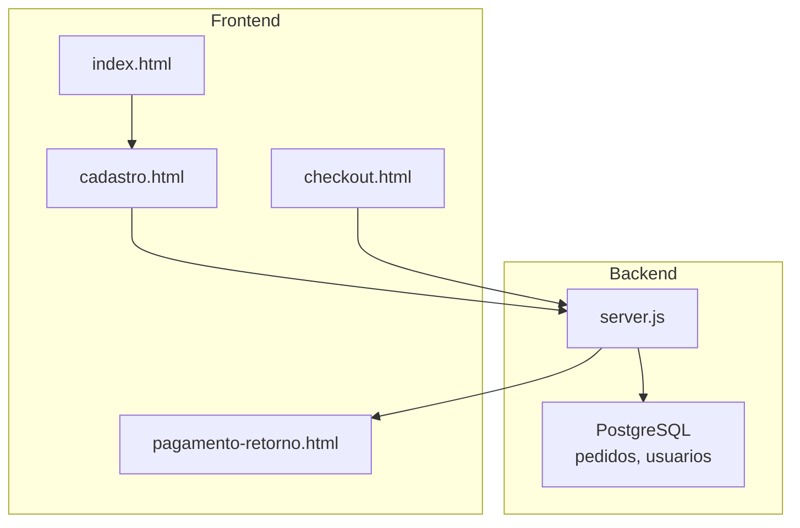
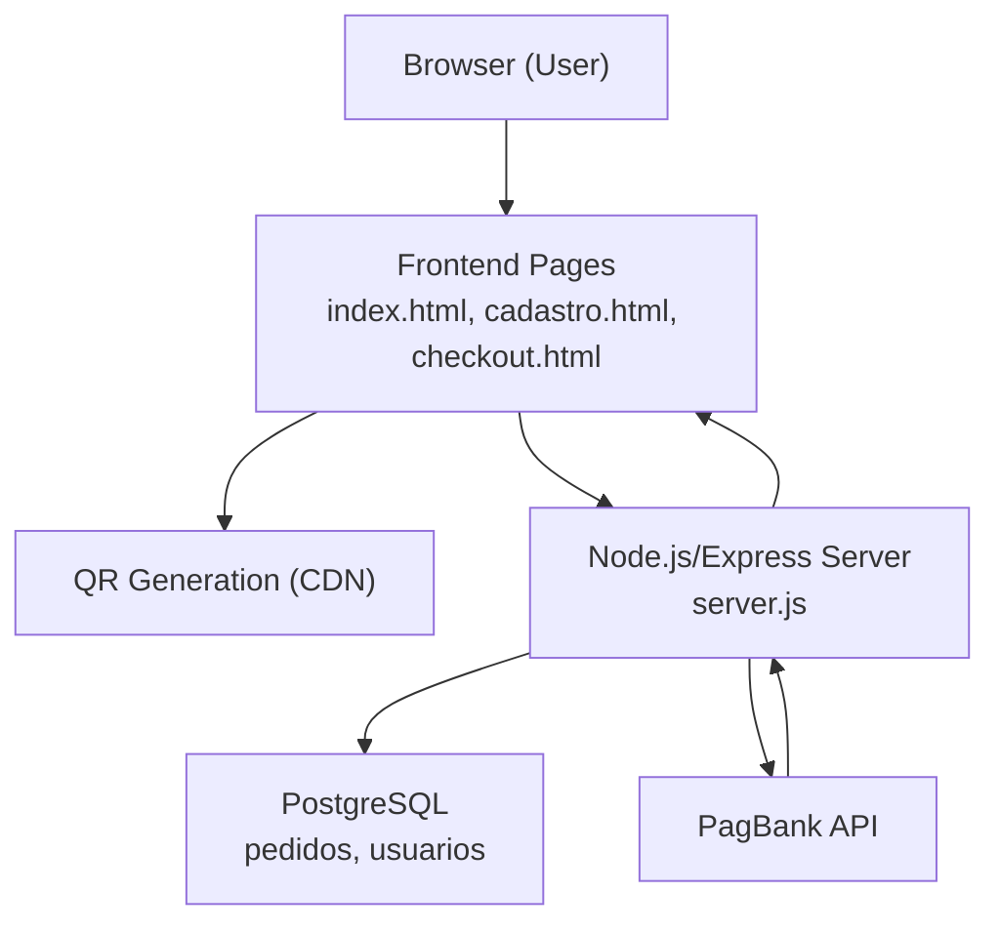
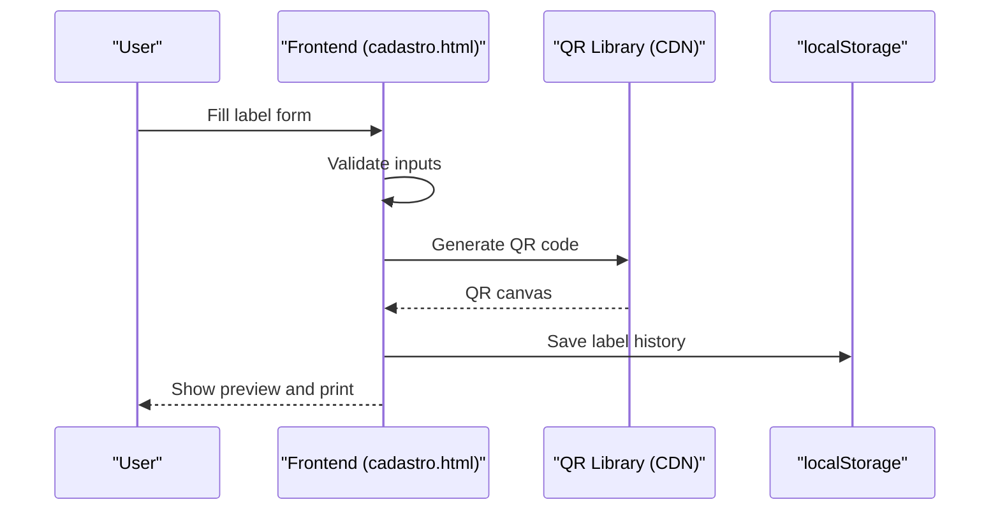
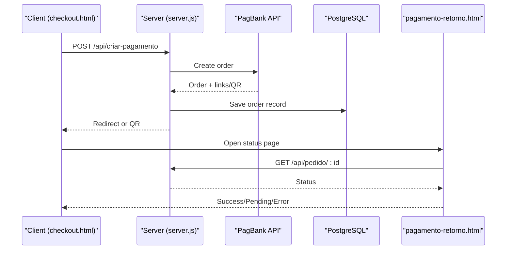
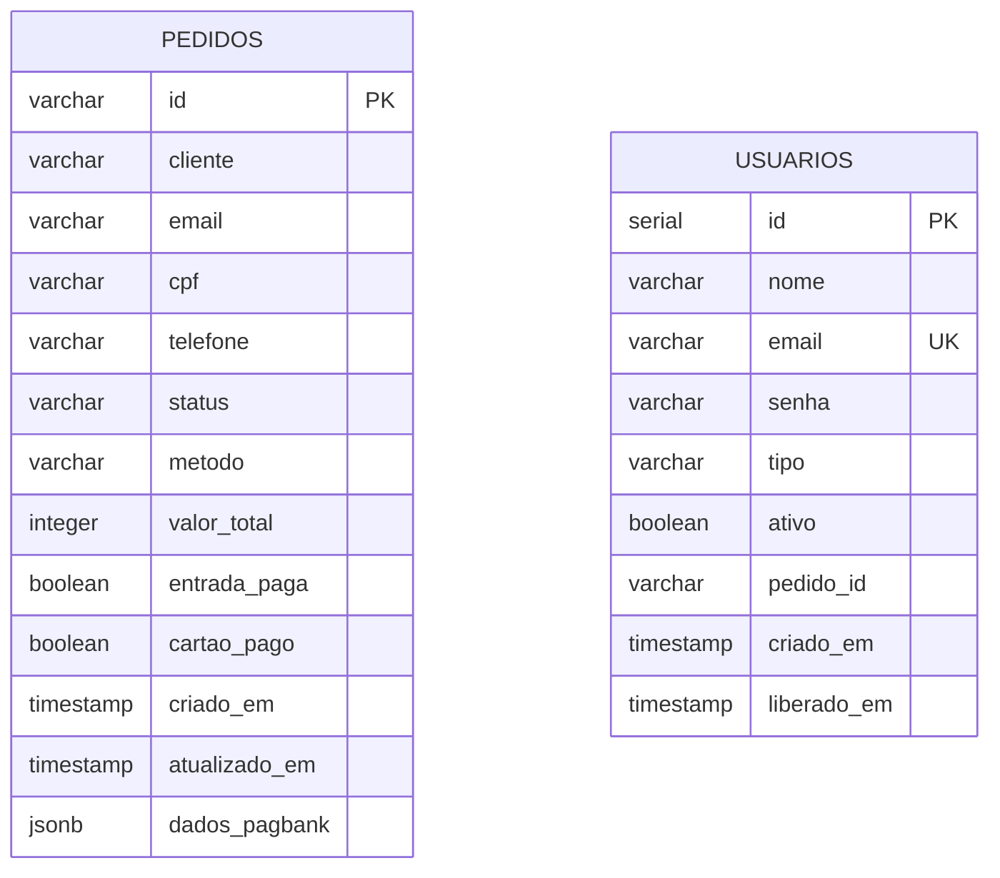
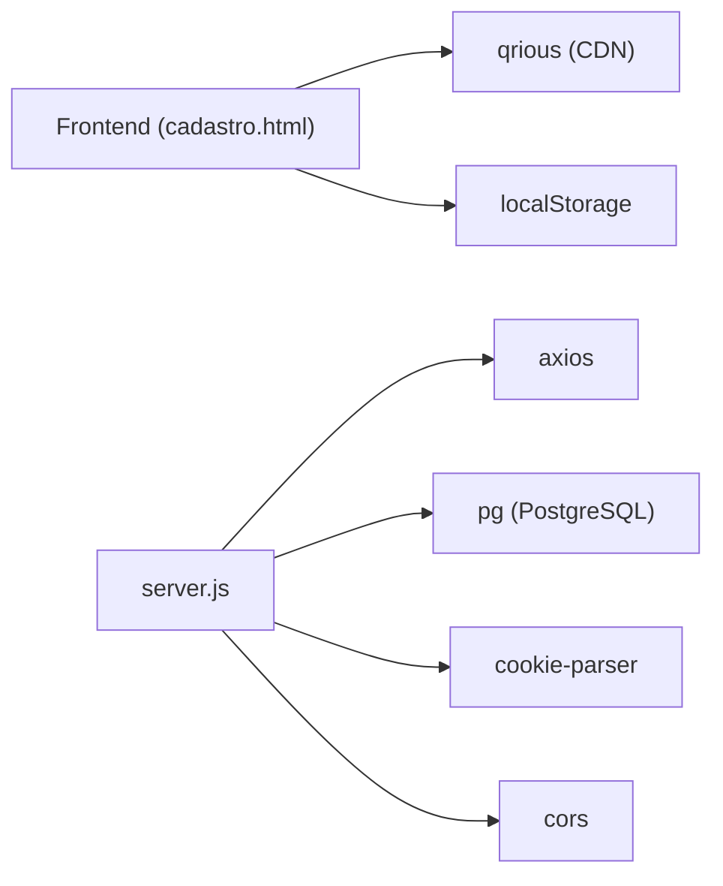

# Project Overview

<cite>
**Referenced Files in This Document**
- [README.md](file://README.md)
- [index.html](file://index.html)
- [cadastro.html](file://cadastro.html)
- [checkout.html](file://checkout.html)
- [pagamento-retorno.html](file://pagamento-retorno.html)
- [server.js](file://server.js)
- [database.sql](file://database.sql)
- [init-db.sql](file://init-db.sql)
- [PAGAMENTO-README.md](file://PAGAMENTO-README.md)
- [package.json](file://package.json)
- [dados/etiquetas.json](file://dados/etiquetas.json)
</cite>

## Table of Contents
1. [Introduction](#introduction)
2. [Project Structure](#project-structure)
3. [Core Components](#core-components)
4. [Architecture Overview](#architecture-overview)
5. [Detailed Component Analysis](#detailed-component-analysis)
6. [Dependency Analysis](#dependency-analysis)
7. [Performance Considerations](#performance-considerations)
8. [Troubleshooting Guide](#troubleshooting-guide)
9. [Conclusion](#conclusion)
10. [Appendices](#appendices)

## Introduction
QrEtiquetas.com is a QR code-based labeling solution designed for internal inventory control and external product labeling in food and commercial environments. It integrates a frontend built with HTML, CSS, and JavaScript to generate printable labels with embedded QR codes, and a backend powered by Node.js and PostgreSQL to manage access control and payment workflows. The system is tailored for offline-first operation on Alimentares/Kali machines while leveraging cloud services for payment processing and optional data persistence.

Key goals:
- Provide a streamlined labeling workflow from user registration to label printing.
- Support two label types: internal (stock control) and external (commercial with pricing and ingredients).
- Offer secure, permission-based access with admin controls.
- Enable flexible payment options via Pix and card payments integrated with PagBank, including a single-payment and a two-phase installment flow.

## Project Structure
The repository is organized into:
- Frontend pages: index.html (landing), cadastro.html (main app), checkout.html (payment), pagamento-retorno.html (payment status).
- Backend: server.js (Node.js/Express), database.sql/init-db.sql (PostgreSQL schema), PAGAMENTO-README.md (payment setup guide).
- Data persistence: dados/etiquetas.json (placeholder), plus localStorage for runtime data in the frontend.
- Dependencies: package.json for backend modules.

**Diagram sources**
- [index.html](file://index.html)
- [cadastro.html](file://cadastro.html)
- [checkout.html](file://checkout.html)
- [pagamento-retorno.html](file://pagamento-retorno.html)
- [server.js](file://server.js)
- [database.sql](file://database.sql)

**Section sources**
- [README.md](file://README.md)
- [index.html](file://index.html)
- [cadastro.html](file://cadastro.html)
- [checkout.html](file://checkout.html)
- [pagamento-retorno.html](file://pagamento-retorno.html)
- [server.js](file://server.js)
- [database.sql](file://database.sql)
- [init-db.sql](file://init-db.sql)
- [PAGAMENTO-README.md](file://PAGAMENTO-README.md)
- [package.json](file://package.json)

## Core Components
- Label generation engine: Creates QR codes and printable label layouts for internal and external labels, with configurable QR position and color themes.
- Payment workflow: Integrates with PagBank for Pix and card payments, supporting a single-payment option and a two-phase installment flow.
- Access control: Manages user roles (admin/client) and session persistence, enabling label creation and administrative tasks.
- Data persistence: Uses localStorage for frontend runtime data and PostgreSQL for persistent records of orders and users.

Implementation highlights:
- QR libraries via CDN for label generation.
- Offline-first frontend with localStorage-backed state.
- Backend APIs for payment initiation, status polling, and webhook handling.

**Section sources**
- [README.md](file://README.md)
- [cadastro.html](file://cadastro.html)
- [checkout.html](file://checkout.html)
- [server.js](file://server.js)
- [database.sql](file://database.sql)

## Architecture Overview
The system follows a client-server architecture:
- Frontend (HTML/CSS/JS) handles user interactions, label rendering, and QR generation.
- Backend (Node.js/Express) exposes REST endpoints for payment processing and manages PostgreSQL data.
- Payment flow integrates with PagBank for Pix and card transactions, with webhooks updating order statuses.

**Diagram sources**
- [index.html](file://index.html)
- [cadastro.html](file://cadastro.html)
- [checkout.html](file://checkout.html)
- [server.js](file://server.js)
- [database.sql](file://database.sql)

## Detailed Component Analysis

### Labeling Workflow (Beginner-Friendly)
- Registration and login: Users register or log in to access the labeling interface.
- Label creation: Enter product, batch, expiry, quantity, color, and choose label type (internal vs external).
- QR generation: The system generates a QR code embedding essential product data.
- Preview and print: Labels are previewed and printed directly from the browser.

**Diagram sources**
- [cadastro.html](file://cadastro.html)

**Section sources**
- [README.md](file://README.md)
- [cadastro.html](file://cadastro.html)

### Payment Workflow (Beginner-Friendly)
- Choose payment method: Single payment (Pix discount) or two-phase installment (Pix entry + card).
- Submit buyer details: Name, email, CPF, phone.
- Create payment: Backend calls PagBank to initiate the order and returns either a redirect link or a QR code.
- Scan and pay: User scans the QR code or clicks the redirect link.
- Status verification: The system polls the order status and updates access accordingly.

**Diagram sources**
- [checkout.html](file://checkout.html)
- [server.js](file://server.js)
- [database.sql](file://database.sql)
- [pagamento-retorno.html](file://pagamento-retorno.html)

**Section sources**
- [checkout.html](file://checkout.html)
- [server.js](file://server.js)
- [database.sql](file://database.sql)
- [PAGAMENTO-README.md](file://PAGAMENTO-README.md)

### Technical Details: Data Persistence and Storage
- Frontend runtime data:
  - Users: alimentares_users
  - Labels history: alimentares_labels
  - Current session: alimentares_currentUser
- Backend persistent data:
  - Orders: pedidos (with status, payment stages, totals)
  - Users: usuarios (with role and activation)

**Diagram sources**
- [database.sql](file://database.sql)

**Section sources**
- [README.md](file://README.md)
- [cadastro.html](file://cadastro.html)
- [database.sql](file://database.sql)
- [init-db.sql](file://init-db.sql)

### Implementation Approach: CDNs and localStorage
- QR generation: qrious CDN is used to generate QR codes client-side.
- Data persistence: localStorage stores user accounts, label history, and current session during offline operation.
- Offline capability: After initial load, the system remains functional without network connectivity for label generation and printing.

**Section sources**
- [README.md](file://README.md)
- [cadastro.html](file://cadastro.html)

### Browser Compatibility and Offline Behavior
- Supported browsers: Chrome/Edge, Firefox, Safari, mobile browsers.
- Offline-first: Fully usable offline after first load; QR generation and printing work locally.

**Section sources**
- [README.md](file://README.md)

## Dependency Analysis
- Frontend depends on:
  - qrious CDN for QR generation.
  - localStorage for state management.
- Backend depends on:
  - Express for HTTP routing.
  - Axios for PagBank API calls.
  - pg for PostgreSQL connectivity.
  - Cookie parser and CORS for cross-origin handling.

**Diagram sources**
- [cadastro.html](file://cadastro.html)
- [server.js](file://server.js)
- [package.json](file://package.json)

**Section sources**
- [package.json](file://package.json)
- [server.js](file://server.js)

## Performance Considerations
- QR generation: Client-side QR creation is efficient for small batches; consider batching or virtualization for very large print runs.
- Printing: CSS media queries optimize label layout for thermal printers; ensure printer drivers support the configured sizes.
- Backend scalability: PostgreSQL indexing supports fast lookups by email/status; consider connection pooling and caching for high concurrency.

## Troubleshooting Guide
Common issues and resolutions:
- Payment errors:
  - Missing or invalid PagBank token: Verify PAGBANK_TOKEN in environment variables.
  - Network connectivity: Ensure outbound access to PagBank endpoints and HTTPS for webhooks.
  - Status mismatch: Poll /api/pedido/:id periodically until status transitions to paid.
- Database setup:
  - Create pedidos and usuarios tables using database.sql or init-db.sql.
  - Configure DATABASE_URL or DB_* variables in environment.
- Frontend issues:
  - QR not appearing: Confirm qrious CDN availability and that QR canvas IDs match generated elements.
  - Labels not printing: Check print styles and paper size settings.

**Section sources**
- [PAGAMENTO-README.md](file://PAGAMENTO-README.md)
- [server.js](file://server.js)
- [database.sql](file://database.sql)
- [checkout.html](file://checkout.html)

## Conclusion
QrEtiquetas.com delivers a practical, offline-capable labeling solution with robust QR-based product identification. Its hybrid architecture—frontend HTML/CSS/JS with backend Node.js/PostgreSQL—enables seamless label generation and flexible payment processing through PagBank. Administrators gain granular control over users and permissions, while end users benefit from an intuitive workflow from registration to label printing.

## Appendices

### Practical Example: Complete Labeling Process
1. First-time access:
   - Open index.html and click “Quero Comprar Agora”.
   - Choose payment method and enter buyer details on checkout.html.
   - Pay via Pix or card; scan QR code or follow redirect.
   - On success, visit cadastro.html to log in and create labels.
2. Generate labels:
   - Enter product, batch, expiry, quantity, and color.
   - Select label type (internal or external).
   - For external labels, add price, weight, company, CNPJ, ingredients, and manufacturer.
   - Click “Generate Labels”, review preview, then “Print”.
3. Manage history:
   - View previously generated labels in the history tab.
   - Reprint or delete entries as needed.

**Section sources**
- [README.md](file://README.md)
- [index.html](file://index.html)
- [checkout.html](file://checkout.html)
- [cadastro.html](file://cadastro.html)