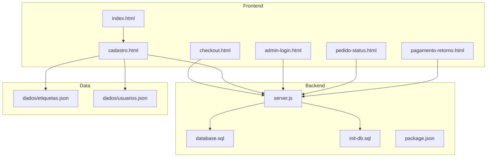
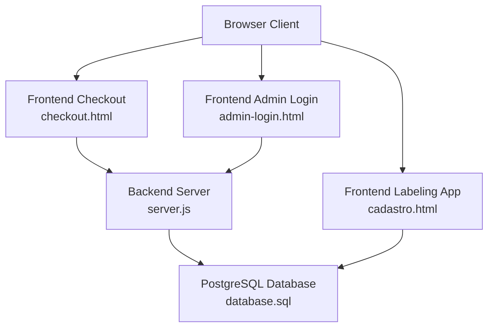
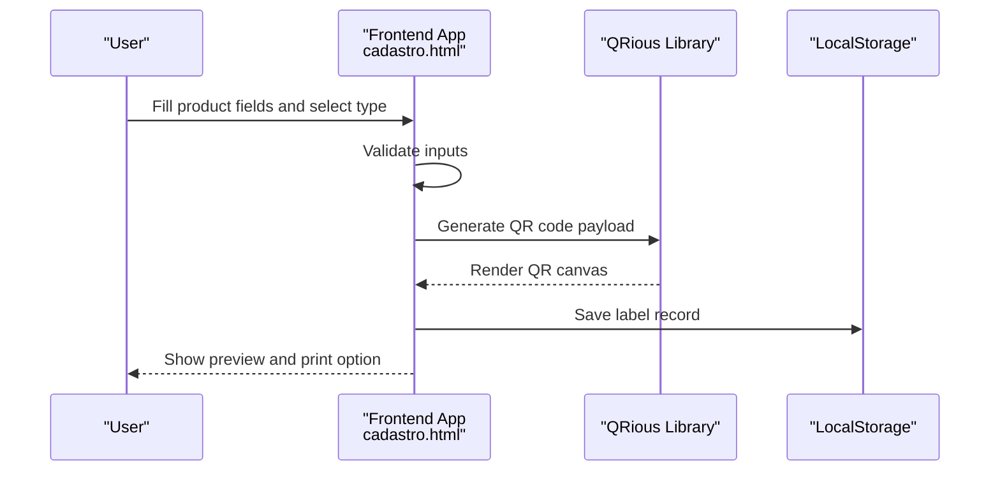
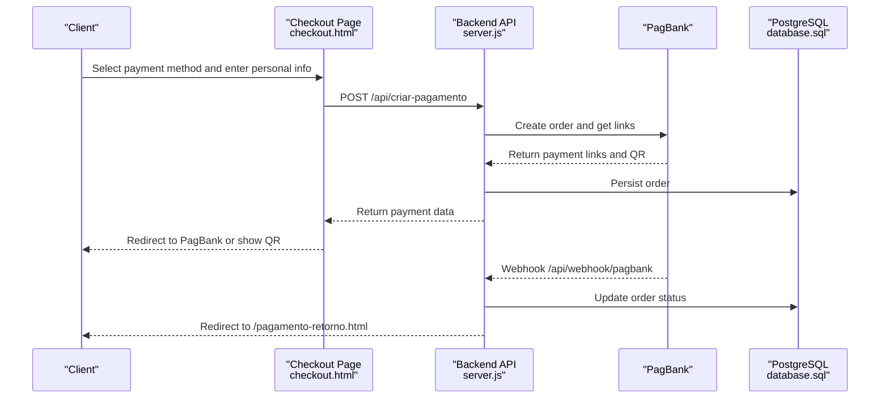
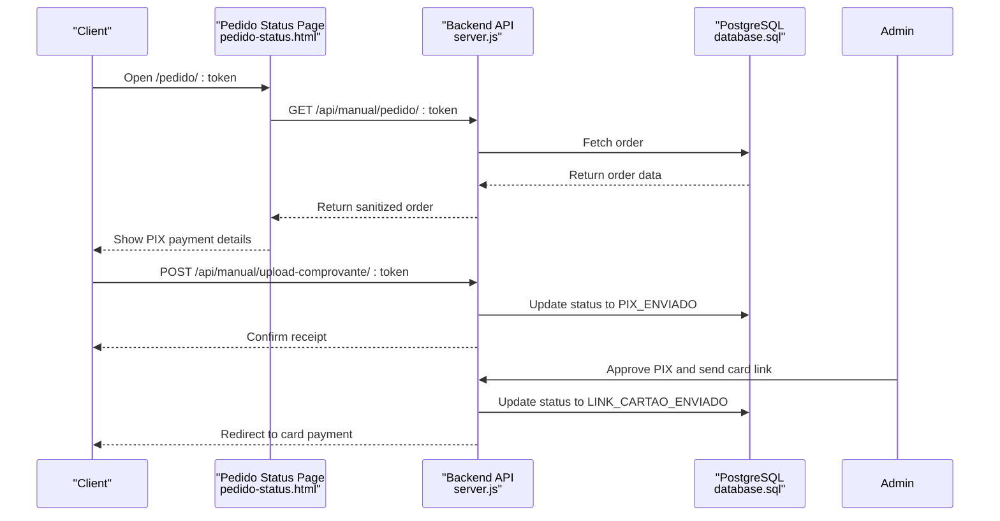
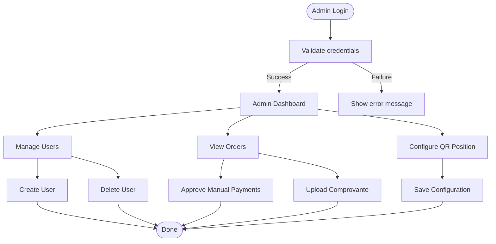
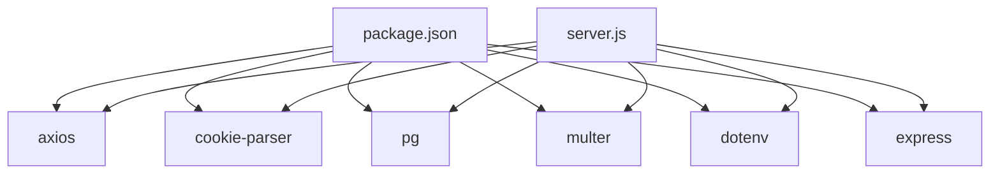

# System Purpose & Scope

<cite>
**Referenced Files in This Document**
- [README.md](file://README.md)
- [index.html](file://index.html)
- [checkout.html](file://checkout.html)
- [cadastro.html](file://cadastro.html)
- [admin-login.html](file://admin-login.html)
- [pedido-status.html](file://pedido-status.html)
- [pagamento-retorno.html](file://pagamento-retorno.html)
- [server.js](file://server.js)
- [database.sql](file://database.sql)
- [init-db.sql](file://init-db.sql)
- [package.json](file://package.json)
- [dados/etiquetas.json](file://dados/etiquetas.json)
- [dados/usuarios.json](file://dados/usuarios.json)
</cite>

## Table of Contents
1. [Introduction](#introduction)
2. [Project Structure](#project-structure)
3. [Core Components](#core-components)
4. [Architecture Overview](#architecture-overview)
5. [Detailed Component Analysis](#detailed-component-analysis)
6. [Dependency Analysis](#dependency-analysis)
7. [Performance Considerations](#performance-considerations)
8. [Troubleshooting Guide](#troubleshooting-guide)
9. [Conclusion](#conclusion)

## Introduction
QrEtiquetas.com is a QR code-based labeling solution tailored for food and commercial product labeling. It supports internal stock control and external commercial labeling, designed to operate offline on point-of-sale terminals. The system generates QR codes embedded with product metadata to enable quick scanning, verification, and traceability. It integrates a payment and access control flow to unlock the labeling application after purchase, while maintaining a clean separation between the frontend labeling application and the backend payment processing.

Key goals:
- Provide a streamlined labeling workflow for food processors and retail environments.
- Enable internal and external labeling with distinct visual styles and data sets.
- Support offline operation for POS devices and reliable QR code generation.
- Offer a secure, auditable history of generated labels and user access.

## Project Structure
The repository is organized into:
- Frontend application files for labeling, checkout, and administration.
- Backend server for payment processing, order management, and admin controls.
- Database schema and initialization scripts for persistent state.
- Static assets and documentation.

**Diagram sources**
- [index.html](file://index.html)
- [checkout.html](file://checkout.html)
- [cadastro.html](file://cadastro.html)
- [admin-login.html](file://admin-login.html)
- [pedido-status.html](file://pedido-status.html)
- [pagamento-retorno.html](file://pagamento-retorno.html)
- [server.js](file://server.js)
- [database.sql](file://database.sql)
- [init-db.sql](file://init-db.sql)
- [package.json](file://package.json)
- [dados/etiquetas.json](file://dados/etiquetas.json)
- [dados/usuarios.json](file://dados/usuarios.json)

**Section sources**
- [README.md](file://README.md)
- [index.html](file://index.html)
- [checkout.html](file://checkout.html)
- [cadastro.html](file://cadastro.html)
- [admin-login.html](file://admin-login.html)
- [pedido-status.html](file://pedido-status.html)
- [pagamento-retorno.html](file://pagamento-retorno.html)
- [server.js](file://server.js)
- [database.sql](file://database.sql)
- [init-db.sql](file://init-db.sql)
- [package.json](file://package.json)
- [dados/etiquetas.json](file://dados/etiquetas.json)
- [dados/usuarios.json](file://dados/usuarios.json)

## Core Components
- Labeling Application (Offline-capable)
  - Generates internal (blue) and external (green) labels with QR codes.
  - Supports configurable QR code orientation for thermal printer layouts.
  - Stores label history and user sessions in browser storage.
- Payment and Access Control
  - Checkout with multiple payment methods (à vista, entrada, cartão, manual).
  - Integration with PagBank for PIX and card payments.
  - Admin panel to approve manual payments and manage users.
- Admin Panel
  - Login, user creation/deletion, and configuration management.
  - Order monitoring and status updates.

Target use cases:
- Food processing facilities needing internal stock control labels.
- Retailers requiring commercial labels with pricing, weight, ingredients, and manufacturer data.
- Point-of-sale environments operating offline or with intermittent connectivity.

Benefits:
- Rapid label generation and printing.
- Traceability via QR codes containing product identifiers.
- Reduced administrative overhead with centralized history and reprints.
- Secure access control and audit trail.

**Section sources**
- [README.md](file://README.md)
- [index.html](file://index.html)
- [checkout.html](file://checkout.html)
- [cadastro.html](file://cadastro.html)
- [admin-login.html](file://admin-login.html)
- [pedido-status.html](file://pedido-status.html)
- [pagamento-retorno.html](file://pagamento-retorno.html)
- [server.js](file://server.js)

## Architecture Overview
The system follows a frontend-first architecture with optional backend services:
- Frontend-only labeling app (offline-capable) with QR generation and history.
- Optional backend for payment processing, order management, and admin controls.
- PostgreSQL database for persistent order and user records.

**Diagram sources**
- [cadastro.html](file://cadastro.html)
- [checkout.html](file://checkout.html)
- [admin-login.html](file://admin-login.html)
- [server.js](file://server.js)
- [database.sql](file://database.sql)

## Detailed Component Analysis

### Labeling Application (Offline-first)
The labeling application runs entirely in the browser, storing user credentials and label history in LocalStorage. It supports:
- Internal labels (blue) for stock control.
- External labels (green) for commercial sales with pricing, weight, ingredients, and manufacturer.
- QR code generation with configurable orientation (vertical/horizontal) optimized for thermal printers.

**Diagram sources**
- [cadastro.html](file://cadastro.html)

**Section sources**
- [README.md](file://README.md)
- [cadastro.html](file://cadastro.html)
- [dados/etiquetas.json](file://dados/etiquetas.json)
- [dados/usuarios.json](file://dados/usuarios.json)

### Payment and Access Control Flow
The checkout flow supports multiple payment methods and integrates with PagBank for PIX and card payments. Manual payments (PIX + Cartão) are supported with admin approval and comprobante upload.

**Diagram sources**
- [checkout.html](file://checkout.html)
- [server.js](file://server.js)
- [database.sql](file://database.sql)

**Section sources**
- [checkout.html](file://checkout.html)
- [pagamento-retorno.html](file://pagamento-retorno.html)
- [server.js](file://server.js)
- [database.sql](file://database.sql)

### Manual Payment Flow (PIX + Cartão)
Manual payments allow clients to split the total cost between PIX and card. The client pays the PIX portion, uploads a comprobante, and the admin confirms and sends the card payment link.

**Diagram sources**
- [pedido-status.html](file://pedido-status.html)
- [server.js](file://server.js)
- [database.sql](file://database.sql)

**Section sources**
- [pedido-status.html](file://pedido-status.html)
- [server.js](file://server.js)
- [database.sql](file://database.sql)

### Admin Panel
The admin panel allows authorized users to:
- Log in securely.
- Create and delete users.
- Monitor orders and approve manual payments.
- Configure QR code orientation.

**Diagram sources**
- [admin-login.html](file://admin-login.html)
- [server.js](file://server.js)
- [database.sql](file://database.sql)

**Section sources**
- [admin-login.html](file://admin-login.html)
- [server.js](file://server.js)
- [database.sql](file://database.sql)

## Dependency Analysis
- Frontend dependencies
  - QRious library for QR code generation.
  - Font Awesome and Google Fonts for UI.
- Backend dependencies
  - Express for HTTP server.
  - Axios for external API calls (PagBank).
  - PostgreSQL driver (pg) and cookie-parser for session handling.
  - Multer for file uploads (comprobantes).
  - Dotenv for environment configuration.

**Diagram sources**
- [package.json](file://package.json)
- [server.js](file://server.js)

**Section sources**
- [package.json](file://package.json)
- [server.js](file://server.js)

## Performance Considerations
- Offline-first design minimizes server reliance for label generation, improving responsiveness on POS devices.
- QR code rendering occurs after DOM updates to avoid blocking UI.
- LocalStorage usage keeps label history fast and accessible locally.
- Backend endpoints batch updates and use efficient queries with indexes on frequently filtered columns.

## Troubleshooting Guide
Common issues and resolutions:
- Payment failures
  - Verify PagBank token and endpoint configuration.
  - Check webhook URL and HTTPS requirements for production.
- Manual payment not progressing
  - Ensure comprobante upload meets size/type constraints.
  - Confirm admin approved PIX and sent card payment link.
- Label preview not appearing
  - Confirm QR code orientation setting matches printer layout.
  - Clear browser cache and retry.
- Admin login errors
  - Validate admin credentials and session cookie settings.

**Section sources**
- [server.js](file://server.js)
- [checkout.html](file://checkout.html)
- [pedido-status.html](file://pedido-status.html)
- [admin-login.html](file://admin-login.html)

## Conclusion
QrEtiquetas.com delivers a practical, offline-first labeling solution for food and commercial products. By combining internal and external labeling with robust QR code traceability and a flexible payment/access control system, it streamlines operations for food processing facilities and retailers. The modular architecture supports both standalone frontend usage and backend-powered payment workflows, enabling scalable deployment across diverse environments.