# Technical Architecture Overview

<cite>
**Referenced Files in This Document**
- [server.js](file://server.js)
- [package.json](file://package.json)
- [index.html](file://index.html)
- [checkout.html](file://checkout.html)
- [cadastro.html](file://cadastro.html)
- [pagamento-retorno.html](file://pagamento-retorno.html)
- [README.md](file://README.md)
- [PAGAMENTO-README.md](file://PAGAMENTO-README.md)
- [database.sql](file://database.sql)
- [init-db.sql](file://init-db.sql)
</cite>

## Table of Contents
1. [Introduction](#introduction)
2. [System Architecture Overview](#system-architecture-overview)
3. [Hybrid Architecture Design](#hybrid-architecture-design)
4. [Frontend Architecture](#frontend-architecture)
5. [Backend Architecture](#backend-architecture)
6. [Data Flow Patterns](#data-flow-patterns)
7. [Security Model](#security-model)
8. [Browser Compatibility](#browser-compatibility)
9. [Integration Points](#integration-points)
10. [Offline Operation](#offline-operation)
11. [Performance Considerations](#performance-considerations)
12. [Troubleshooting Guide](#troubleshooting-guide)
13. [Conclusion](#conclusion)

## Introduction

The qretiquetas.com system is a hybrid architecture solution designed for the Alimentares/Kali point-of-sale environment, combining a pure frontend labeling system with a Node.js/Express backend payment processing system. This architecture enables offline operation after initial load while maintaining robust payment processing capabilities through external payment providers.

The system serves two distinct but integrated domains: the labeling system (purely frontend) and the payment system (backend API), each with specific responsibilities and security considerations tailored for the retail POS environment.

## System Architecture Overview

The system follows a hybrid architecture pattern that separates concerns between labeling functionality and payment processing:

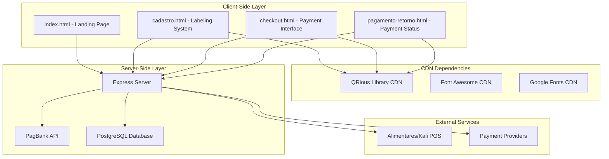

**Diagram sources**
- [server.js:1-890](file://server.js#L1-L890)
- [checkout.html:1-768](file://checkout.html#L1-L768)
- [cadastro.html:1-1277](file://cadastro.html#L1-L1277)

The architecture consists of four primary layers:

1. **Static Frontend Layer**: Pure HTML/CSS/JavaScript applications served statically
2. **CDN Dependencies Layer**: External libraries loaded via Content Delivery Networks
3. **Node.js Backend Layer**: Express server handling payment processing and data persistence
4. **External Integration Layer**: Payment providers and POS system integrations

## Hybrid Architecture Design

The system employs a strategic separation between labeling and payment functionalities:

### Labeling System (Pure Frontend)
- **Location**: [cadastro.html](file://cadastro.html)
- **Technology**: Static HTML with localStorage persistence
- **Operation**: 100% offline capable after initial load
- **Purpose**: Product labeling, QR code generation, and inventory management

### Payment System (Backend API)
- **Location**: [server.js](file://server.js)
- **Technology**: Node.js/Express with PostgreSQL
- **Operation**: Online payment processing with webhook support
- **Purpose**: Payment orchestration, order management, and access control

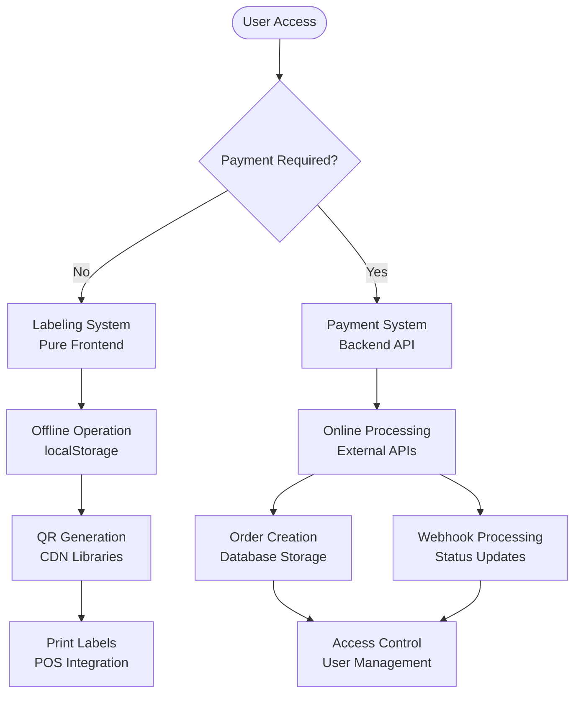

**Diagram sources**
- [cadastro.html:754-1277](file://cadastro.html#L754-L1277)
- [server.js:82-280](file://server.js#L82-L280)

## Frontend Architecture

### Static HTML/CSS/JavaScript Structure

The frontend architecture utilizes pure static files with minimal dependencies:

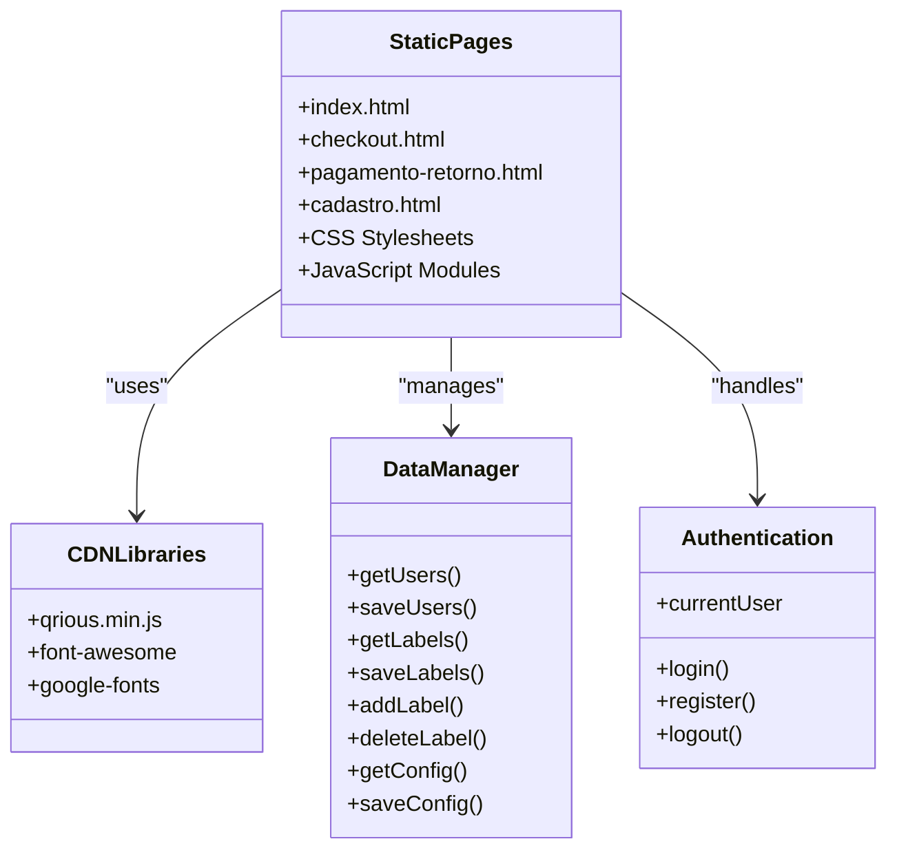

**Diagram sources**
- [cadastro.html:759-815](file://cadastro.html#L759-L815)
- [checkout.html:510-768](file://checkout.html#L510-L768)

### Client-Side Data Persistence

The system implements a dual-storage strategy:

| Storage Type | Purpose | Data Examples | Persistence |
|--------------|---------|---------------|-------------|
| **localStorage** | Application state and user data | `alimentares_users`, `alimentares_labels`, `alimentares_config` | Browser session |
| **sessionStorage** | Current user session | `alimentares_currentUser` | Session duration |

### CDN Integration Strategy

External libraries are loaded via CDN for optimal performance and reliability:

- **QRious Library**: [https://cdnjs.cloudflare.com/ajax/libs/qrious/4.0.2/qrious.min.js](https://cdnjs.cloudflare.com/ajax/libs/qrious/4.0.2/qrious.min.js)
- **Font Awesome**: [https://cdnjs.cloudflare.com/ajax/libs/font-awesome/6.4.0/css/all.min.css](https://cdnjs.cloudflare.com/ajax/libs/font-awesome/6.4.0/css/all.min.css)
- **Google Fonts**: [https://fonts.googleapis.com/css2?family=Poppins:wght@300;400;500;600;700&display=swap](https://fonts.googleapis.com/css2?family=Poppins:wght@300;400;500;600;700&display=swap)

**Section sources**
- [cadastro.html:759-815](file://cadastro.html#L759-L815)
- [checkout.html:510-768](file://checkout.html#L510-L768)
- [README.md:95-122](file://README.md#L95-L122)

## Backend Architecture

### Express Server Configuration

The backend server provides RESTful APIs for payment processing and administrative functions:

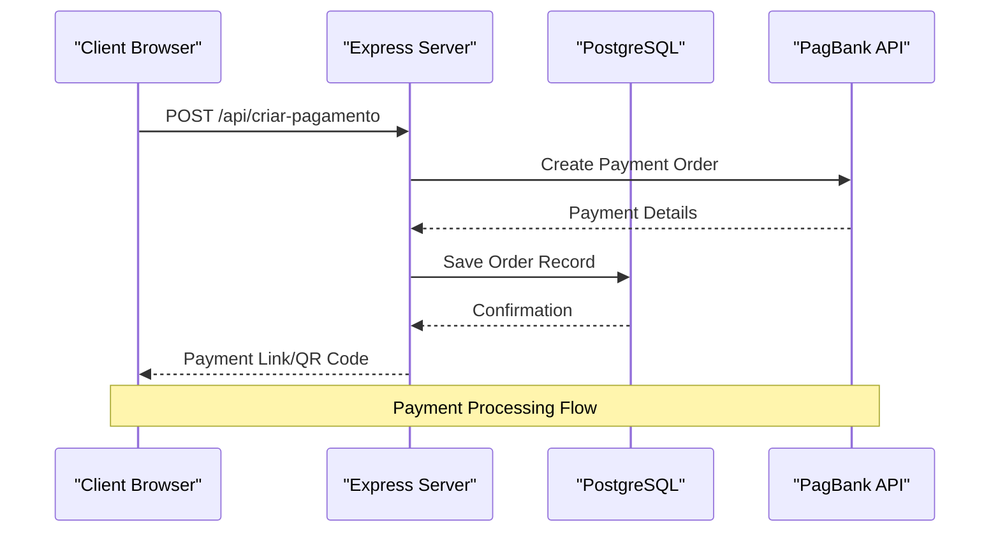

**Diagram sources**
- [server.js:82-280](file://server.js#L82-L280)

### Payment Processing Endpoints

The backend exposes several key endpoints:

| Endpoint | Method | Description | Authentication |
|----------|--------|-------------|----------------|
| `/api/criar-pagamento` | POST | Create payment order with PagBank | None |
| `/api/webhook/pagbank` | POST | Receive payment notifications | None |
| `/api/pedido/:id` | GET | Check payment status | None |
| `/api/pedidos` | GET | List all orders | Admin Required |
| `/api/admin/login` | POST | Admin authentication | None |
| `/api/admin/pedidos` | GET | Admin order management | Admin Required |

### Database Schema

The PostgreSQL database maintains two primary tables:

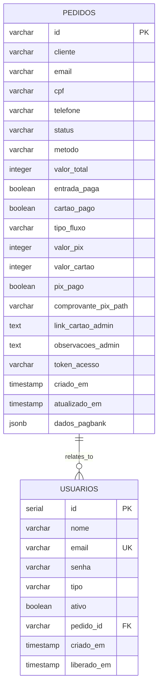

**Diagram sources**
- [database.sql:13-58](file://database.sql#L13-L58)

**Section sources**
- [server.js:82-800](file://server.js#L82-L800)
- [database.sql:13-58](file://database.sql#L13-L58)

## Data Flow Patterns

### Payment Processing Workflow

The system implements a sophisticated payment flow supporting multiple payment methods:

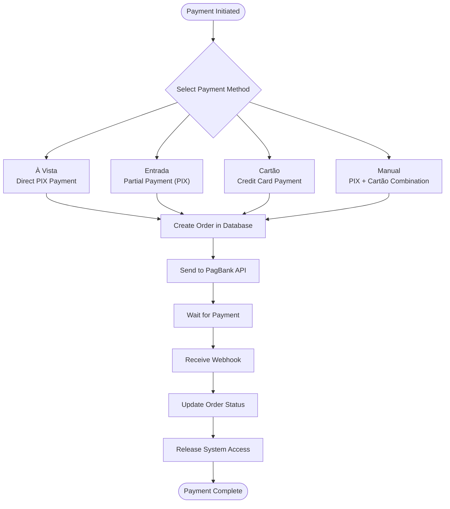

**Diagram sources**
- [server.js:82-345](file://server.js#L82-L345)
- [checkout.html:626-718](file://checkout.html#L626-L718)

### Label Generation Process

The labeling system operates independently with its own data flow:

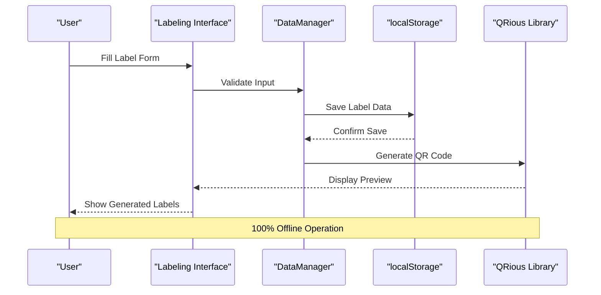

**Diagram sources**
- [cadastro.html:947-1055](file://cadastro.html#L947-L1055)

**Section sources**
- [checkout.html:626-768](file://checkout.html#L626-L768)
- [server.js:82-345](file://server.js#L82-L345)

## Security Model

### Client-Side Security

The frontend implements several security measures:

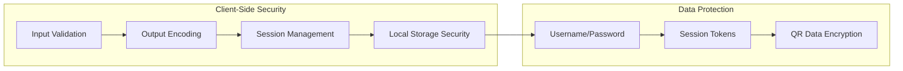

**Security Measures:**
- **Input Validation**: All user inputs are validated before processing
- **Output Encoding**: Prevents XSS attacks through HTML escaping
- **Session Management**: Uses sessionStorage for temporary user sessions
- **Local Storage Security**: Data stored locally with basic protection

### Server-Side Security

The backend implements comprehensive security controls:

| Security Aspect | Implementation | Purpose |
|----------------|----------------|---------|
| **CORS Policy** | Enabled for cross-origin requests | API accessibility |
| **Cookie Security** | HttpOnly, SameSite, Secure flags | Admin session protection |
| **Database Security** | Connection pooling, prepared statements | SQL injection prevention |
| **API Security** | Environment variable configuration | Sensitive data protection |

### Authentication Flow

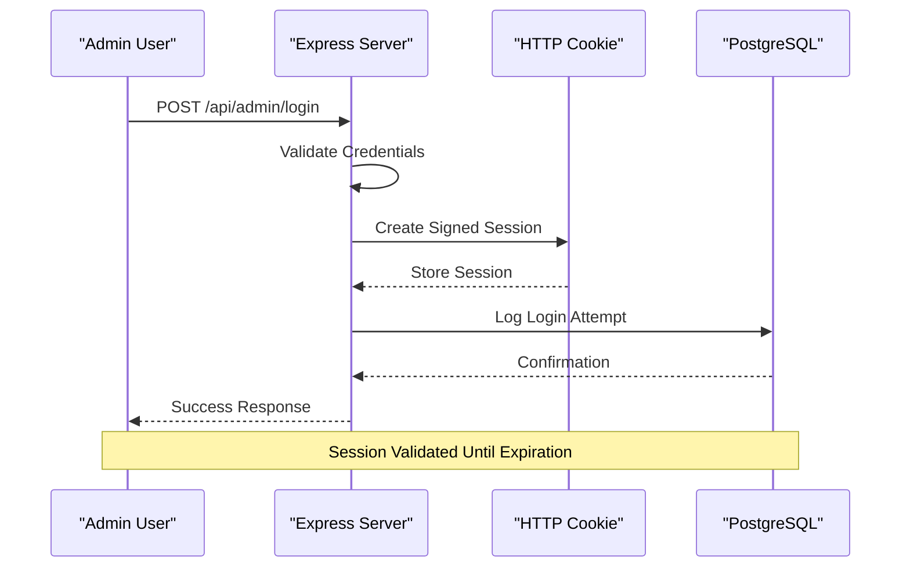

**Diagram sources**
- [server.js:713-730](file://server.js#L713-L730)

**Section sources**
- [server.js:15-27](file://server.js#L15-L27)
- [server.js:713-730](file://server.js#L713-L730)
- [README.md:117-122](file://README.md#L117-L122)

## Browser Compatibility

The system maintains broad browser compatibility while optimizing for modern environments:

### Supported Browsers

| Browser | Version | Status | Notes |
|---------|---------|--------|-------|
| **Chrome** | Latest | ✅ Fully Compatible | Recommended |
| **Firefox** | Latest | ✅ Fully Compatible | Excellent |
| **Safari** | Latest | ✅ Fully Compatible | Good |
| **Edge** | Latest | ✅ Fully Compatible | Recommended |
| **Mobile Browsers** | Latest | ✅ Compatible | Responsive design |

### Offline Capability

The system achieves 100% offline operation after initial load:

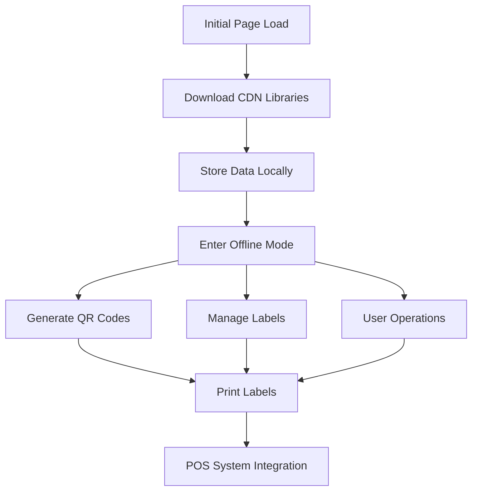

**Diagram sources**
- [README.md:107-114](file://README.md#L107-L114)

**Section sources**
- [README.md:107-114](file://README.md#L107-L114)

## Integration Points

### Alimentares/Kali POS Integration

The system integrates seamlessly with the Alimentares/Kali point-of-sale environment:

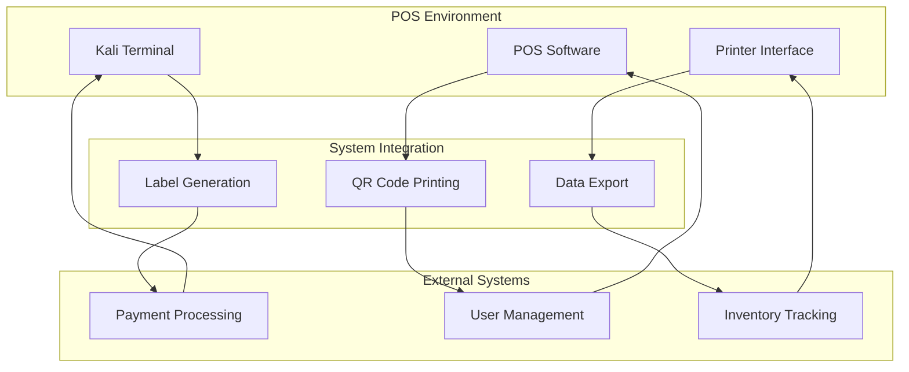

### Payment Provider Integration

The system integrates with multiple payment providers through PagBank:

- **PagBank API**: Primary payment processor
- **PIX Integration**: Instant payment processing
- **Credit Card Processing**: Installment payment options
- **Webhook Notifications**: Real-time payment status updates

### External Service Dependencies

| Service | Purpose | Integration Method |
|---------|---------|-------------------|
| **CDN Libraries** | QR Code generation, icons, fonts | Static asset loading |
| **PagBank API** | Payment processing | RESTful API calls |
| **PostgreSQL** | Data persistence | Connection pooling |
| **Render Platform** | Hosting | Platform-as-a-Service |

**Section sources**
- [PAGAMENTO-README.md:69-97](file://PAGAMENTO-README.md#L69-L97)
- [README.md:3](file://README.md#L3)

## Offline Operation

### Architecture for Offline Capability

The system achieves offline functionality through strategic design decisions:

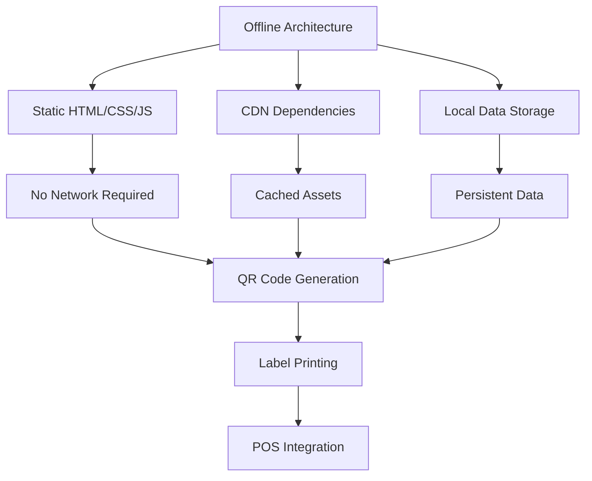

### Data Persistence Strategy

The system implements a comprehensive data persistence strategy:

| Data Category | Storage Method | Purpose | Recovery |
|---------------|----------------|---------|----------|
| **User Accounts** | localStorage | User credentials and profiles | Browser reset |
| **Label History** | localStorage | Generated label records | Browser reset |
| **Application Config** | localStorage | System preferences | Browser reset |
| **Active Sessions** | sessionStorage | Current user session | Tab close |
| **Payment Records** | PostgreSQL | Payment history and status | Server backup |

### Offline Features

The labeling system operates completely offline:

- **QR Code Generation**: Utilizes CDN-hosted QRious library
- **Label Management**: All operations performed locally
- **Print Functionality**: Direct browser printing interface
- **Data Export**: Local storage export capabilities

**Section sources**
- [README.md:49](file://README.md#L49)
- [README.md:107-114](file://README.md#L107-L114)

## Performance Considerations

### Frontend Performance

The client-side architecture prioritizes performance through:

- **Static Asset Loading**: CDN delivery for external libraries
- **Minimal Dependencies**: Only essential libraries loaded
- **Efficient DOM Manipulation**: Optimized for label generation
- **Responsive Design**: Mobile-first approach

### Backend Performance

The server-side implementation focuses on:

- **Connection Pooling**: Efficient database connections
- **Caching Strategies**: Response caching for static content
- **Error Handling**: Graceful degradation and recovery
- **Resource Management**: Proper cleanup and memory management

### Scalability Considerations

The system is designed for horizontal scaling:

- **Stateless Design**: Minimal server-side state
- **Database Optimization**: Indexes and query optimization
- **CDN Distribution**: Global content delivery
- **Microservice Ready**: Modular architecture for future expansion

## Troubleshooting Guide

### Common Issues and Solutions

| Issue | Symptoms | Solution |
|-------|----------|----------|
| **Payment Failures** | Error messages, failed webhook | Check PagBank credentials, verify webhook URL |
| **QR Code Generation** | Blank QR codes, errors | Verify CDN connectivity, check browser console |
| **Offline Mode Problems** | Labels not generating, data loss | Clear browser cache, check localStorage quota |
| **Admin Login Issues** | Cannot access admin panel | Verify credentials, check cookie settings |
| **Database Connection** | Server errors, connection timeouts | Verify PostgreSQL configuration, check network |

### Debugging Tools

The system includes built-in debugging capabilities:

- **Console Logging**: Extensive logging for payment processing
- **Error Handling**: Comprehensive error reporting
- **Status Monitoring**: Real-time payment status checking
- **Development Mode**: Enhanced logging for development

### Maintenance Procedures

Regular maintenance tasks include:

- **Database Cleanup**: Regular pruning of old records
- **Library Updates**: Periodic CDN library updates
- **Security Audits**: Regular credential rotation
- **Performance Monitoring**: System health checks

**Section sources**
- [server.js:239-280](file://server.js#L239-L280)
- [checkout.html:711-718](file://checkout.html#L711-L718)

## Conclusion

The qretiquetas.com system represents a sophisticated hybrid architecture that successfully balances offline functionality with robust payment processing capabilities. The separation between the labeling system (pure frontend) and payment system (backend API) creates a clean architectural boundary that enhances maintainability and scalability.

Key architectural strengths include:

- **Modular Design**: Clear separation of concerns between labeling and payment systems
- **Offline Capability**: 100% offline operation for labeling functionality
- **Scalable Backend**: Express server with PostgreSQL for payment processing
- **POS Integration**: Seamless integration with Alimentares/Kali point-of-sale environment
- **Security Model**: Multi-layered security approach for both client and server sides

The system's architecture provides an excellent foundation for future enhancements while maintaining reliability and performance in the demanding retail POS environment. The hybrid approach ensures that critical labeling functionality remains available even during network outages, while payment processing continues to leverage external payment providers for secure transaction handling.