# Technical Architecture Overview

<cite>
**Referenced Files in This Document**
- [server.js](file://server.js)
- [package.json](file://package.json)
- [index.html](file://index.html)
- [checkout.html](file://checkout.html)
- [cadastro.html](file://cadastro.html)
- [pagamento-retorno.html](file://pagamento-retorno.html)
- [admin.html](file://admin.html)
- [admin-login.html](file://admin-login.html)
- [pedido-status.html](file://pedido-status.html)
- [README.md](file://README.md)
- [PAGAMENTO-README.md](file://PAGAMENTO-README.md)
- [database.sql](file://database.sql)
- [init-db.sql](file://init-db.sql)
- [migration-manual.sql](file://migration-manual.sql)
</cite>

## Update Summary
**Changes Made**
- Added comprehensive documentation for the dual payment processing architecture
- Documented the new administrative panel system with real-time order monitoring
- Updated payment flow orchestration to support both PagBank integration and manual payment handling
- Enhanced database schema documentation with manual payment flow support
- Added administrative endpoints and real-time monitoring capabilities

## Table of Contents
1. [Introduction](#introduction)
2. [System Architecture Overview](#system-architecture-overview)
3. [Hybrid Architecture Design](#hybrid-architecture-design)
4. [Frontend Architecture](#frontend-architecture)
5. [Backend Architecture](#backend-architecture)
6. [Dual Payment Processing System](#dual-payment-processing-system)
7. [Administrative Panel System](#administrative-panel-system)
8. [Data Flow Patterns](#data-flow-patterns)
9. [Security Model](#security-model)
10. [Browser Compatibility](#browser-compatibility)
11. [Integration Points](#integration-points)
12. [Offline Operation](#offline-operation)
13. [Performance Considerations](#performance-considerations)
14. [Troubleshooting Guide](#troubleshooting-guide)
15. [Conclusion](#conclusion)

## Introduction

The qretiquetas.com system is a sophisticated hybrid architecture solution designed for the Alimentares/Kali point-of-sale environment, combining a pure frontend labeling system with a Node.js/Express backend payment processing system. This architecture enables offline operation after initial load while maintaining robust dual payment processing capabilities through both automated PagBank integration and manual payment handling.

The system serves two distinct but integrated domains: the labeling system (purely frontend) and the payment system (backend API), each with specific responsibilities and security considerations tailored for the retail POS environment. The recent enhancement introduces a comprehensive administrative panel system with real-time order monitoring capabilities, enabling seamless management of both automated and manual payment flows.

## System Architecture Overview

The system follows a hybrid architecture pattern that separates concerns between labeling functionality and dual payment processing systems:

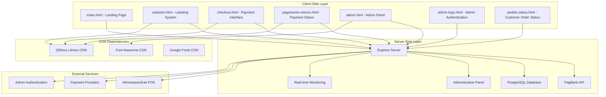

**Diagram sources**
- [server.js:1-914](file://server.js#L1-L914)
- [checkout.html:1-768](file://checkout.html#L1-L768)
- [admin.html:1-304](file://admin.html#L1-L304)
- [pedido-status.html:1-341](file://pedido-status.html#L1-L341)

The architecture consists of five primary layers:

1. **Static Frontend Layer**: Pure HTML/CSS/JavaScript applications served statically
2. **CDN Dependencies Layer**: External libraries loaded via Content Delivery Networks
3. **Node.js Backend Layer**: Express server handling dual payment processing and data persistence
4. **Administrative Panel Layer**: Real-time order monitoring and management system
5. **External Integration Layer**: Payment providers and POS system integrations

## Hybrid Architecture Design

The system employs a strategic separation between labeling and dual payment functionalities:

### Labeling System (Pure Frontend)
- **Location**: [cadastro.html](file://cadastro.html)
- **Technology**: Static HTML with localStorage persistence
- **Operation**: 100% offline capable after initial load
- **Purpose**: Product labeling, QR code generation, and inventory management

### Dual Payment System (Backend API)
- **Location**: [server.js](file://server.js)
- **Technology**: Node.js/Express with PostgreSQL
- **Operation**: Online payment processing with webhook support and administrative oversight
- **Purpose**: Dual payment orchestration, order management, and access control

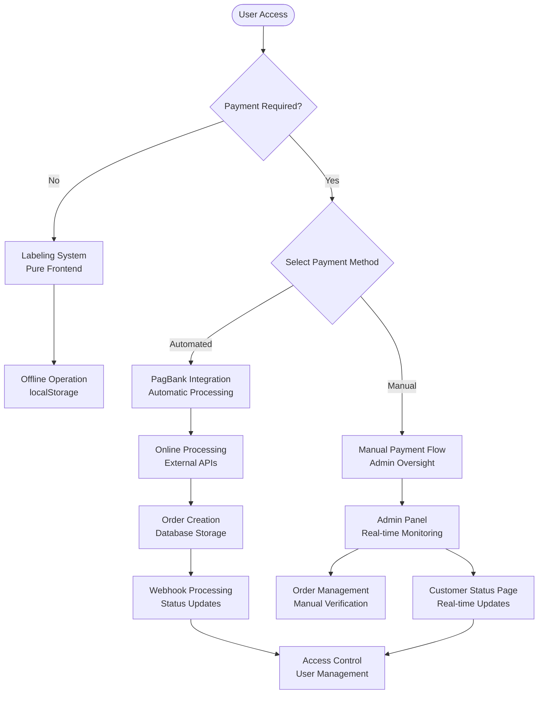

**Diagram sources**
- [cadastro.html:750-1277](file://cadastro.html#L750-L1277)
- [server.js:82-914](file://server.js#L82-L914)
- [checkout.html:626-768](file://checkout.html#L626-L768)

## Frontend Architecture

### Static HTML/CSS/JavaScript Structure

The frontend architecture utilizes pure static files with minimal dependencies:

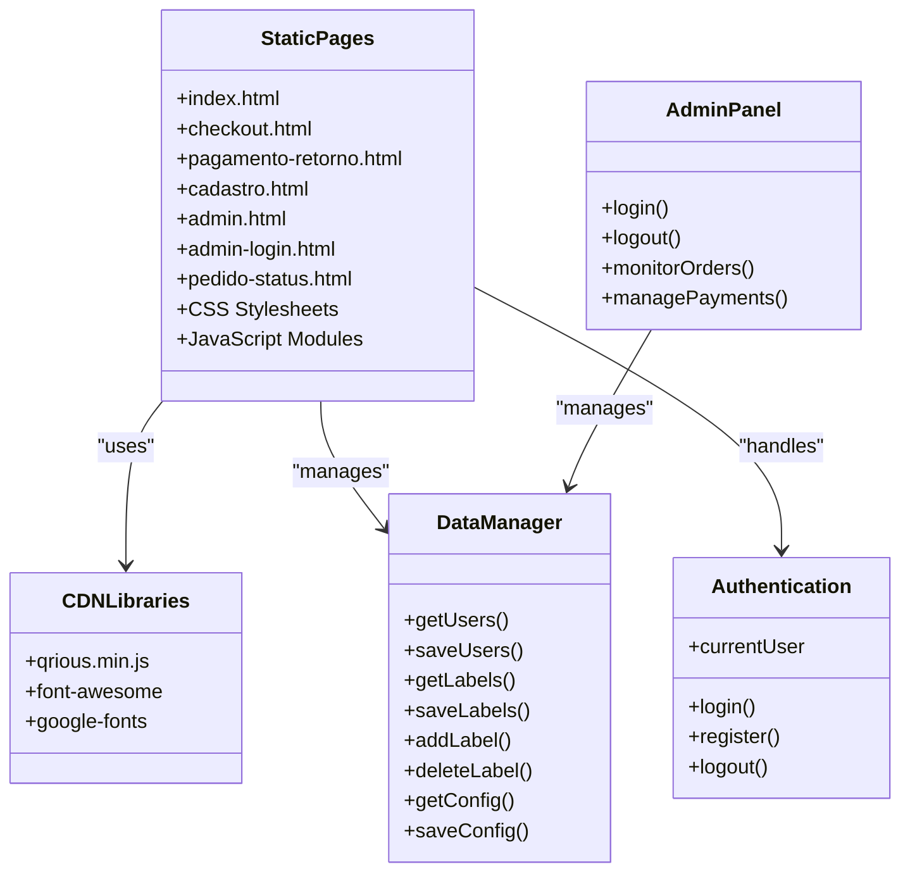

**Diagram sources**
- [cadastro.html:808-873](file://cadastro.html#L808-L873)
- [checkout.html:626-768](file://checkout.html#L626-L768)
- [admin.html:110-304](file://admin.html#L110-L304)

### Client-Side Data Persistence

The system implements a dual-storage strategy:

| Storage Type | Purpose | Data Examples | Persistence |
|--------------|---------|---------------|-------------|
| **localStorage** | Application state and user data | `alimentares_users`, `alimentares_labels`, `alimentares_config` | Browser session |
| **sessionStorage** | Current user session | `alimentares_currentUser` | Session duration |

### CDN Integration Strategy

External libraries are loaded via CDN for optimal performance and reliability:

- **QRious Library**: [https://cdnjs.cloudflare.com/ajax/libs/qrious/4.0.2/qrious.min.js](https://cdnjs.cloudflare.com/ajax/libs/qrious/4.0.2/qrious.min.js)
- **Font Awesome**: [https://cdnjs.cloudflare.com/ajax/libs/font-awesome/6.4.0/css/all.min.css](https://cdnjs.cloudflare.com/ajax/libs/font-awesome/6.4.0/css/all.min.css)
- **Google Fonts**: [https://fonts.googleapis.com/css2?family=Poppins:wght@300;400;500;600;700&display=swap](https://fonts.googleapis.com/css2?family=Poppins:wght@300;400;500;600;700&display=swap)

**Section sources**
- [cadastro.html:808-873](file://cadastro.html#L808-L873)
- [checkout.html:626-768](file://checkout.html#L626-L768)
- [README.md:95-122](file://README.md#L95-L122)

## Backend Architecture

### Express Server Configuration

The backend server provides RESTful APIs for dual payment processing and administrative functions:

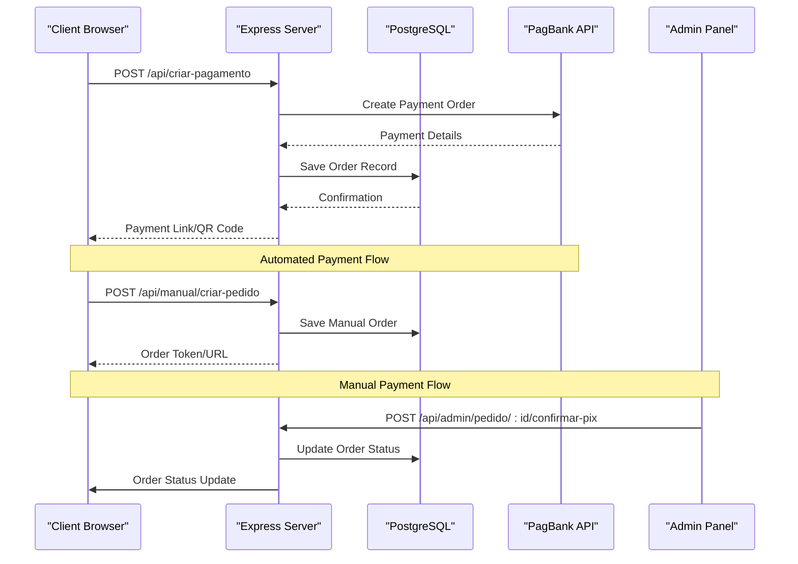

**Diagram sources**
- [server.js:82-280](file://server.js#L82-L280)
- [server.js:540-617](file://server.js#L540-L617)
- [server.js:805-890](file://server.js#L805-L890)

### Dual Payment Processing Endpoints

The backend exposes comprehensive endpoints for both payment methods:

#### Automated Payment Endpoints
| Endpoint | Method | Description | Authentication |
|----------|--------|-------------|----------------|
| `/api/criar-pagamento` | POST | Create payment order with PagBank | None |
| `/api/webhook/pagbank` | POST | Receive payment notifications | None |
| `/api/pedido/:id` | GET | Check payment status | None |
| `/api/pedidos` | GET | List all orders | Admin Required |

#### Manual Payment Endpoints
| Endpoint | Method | Description | Authentication |
|----------|--------|-------------|----------------|
| `/api/manual/criar-pedido` | POST | Create manual payment order | None |
| `/api/manual/upload-comprovante/:token` | POST | Upload PIX receipt | None |
| `/api/manual/pedido/:token` | GET | Get order details for customer | None |
| `/pedido/:token` | GET | Customer order status page | None |

#### Administrative Endpoints
| Endpoint | Method | Description | Authentication |
|----------|--------|-------------|----------------|
| `/api/admin/login` | POST | Admin authentication | None |
| `/api/admin/logout` | POST | Admin logout | None |
| `/api/admin/pedidos` | GET | Admin order management | Admin Required |
| `/api/admin/pedido/:id/confirmar-pix` | POST | Confirm PIX received | Admin Required |
| `/api/admin/pedido/:id/enviar-link-cartao` | POST | Send credit card link | Admin Required |
| `/api/admin/pedido/:id/confirmar-pagamento` | POST | Confirm total payment | Admin Required |
| `/api/admin/pedido/:id/cancelar` | POST | Cancel order | Admin Required |

### Database Schema

The PostgreSQL database maintains comprehensive tables with enhanced support for manual payment flows:

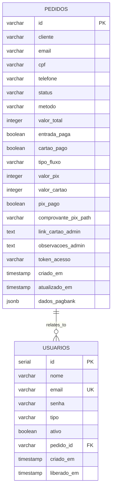

**Manual Payment Flow Enhancements:**
- **tipo_fluxo**: 'pagbank' or 'manual' - distinguishes payment methods
- **valor_pix**: Separate PIX amount allocation
- **valor_cartao**: Separate credit card amount allocation
- **pix_pago**: PIX payment confirmation flag
- **comprovante_pix_path**: Uploaded receipt storage
- **link_cartao_admin**: Admin-generated credit card payment link
- **observacoes_admin**: Admin notes for customer visibility
- **token_acesso**: Unique token for customer order tracking

**Diagram sources**
- [database.sql:13-58](file://database.sql#L13-L58)
- [migration-manual.sql:9-39](file://migration-manual.sql#L9-L39)

**Section sources**
- [server.js:82-914](file://server.js#L82-L914)
- [database.sql:13-58](file://database.sql#L13-L58)
- [migration-manual.sql:9-39](file://migration-manual.sql#L9-L39)

## Dual Payment Processing System

### Automated Payment Flow (PagBank Integration)

The automated payment system handles direct integration with PagBank for seamless payment processing:

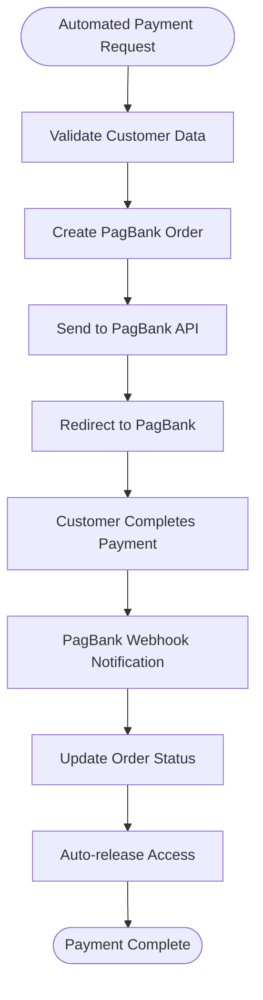

**Diagram sources**
- [server.js:82-280](file://server.js#L82-L280)
- [checkout.html:674-718](file://checkout.html#L674-L718)

### Manual Payment Flow (Admin Oversight)

The manual payment system provides comprehensive admin oversight for complex payment arrangements:

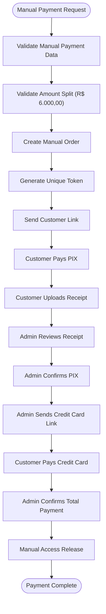

**Diagram sources**
- [server.js:540-617](file://server.js#L540-L617)
- [server.js:805-890](file://server.js#L805-L890)
- [pedido-status.html:172-338](file://pedido-status.html#L172-L338)

### Payment Method Orchestration

The system intelligently orchestrates between payment methods based on customer selection:

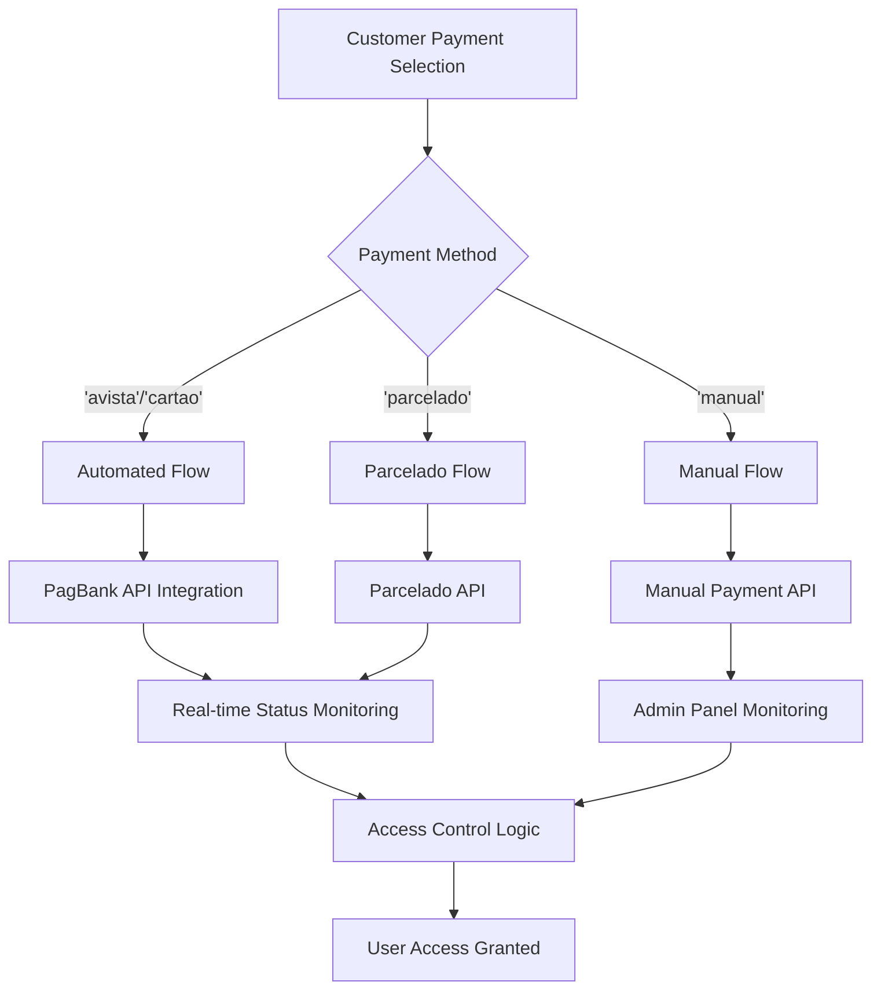

**Diagram sources**
- [checkout.html:645-672](file://checkout.html#L645-L672)
- [server.js:98-113](file://server.js#L98-L113)

**Section sources**
- [checkout.html:626-768](file://checkout.html#L626-L768)
- [server.js:82-345](file://server.js#L82-L345)
- [server.js:540-617](file://server.js#L540-L617)

## Administrative Panel System

### Admin Panel Architecture

The administrative panel provides comprehensive real-time monitoring and management capabilities:

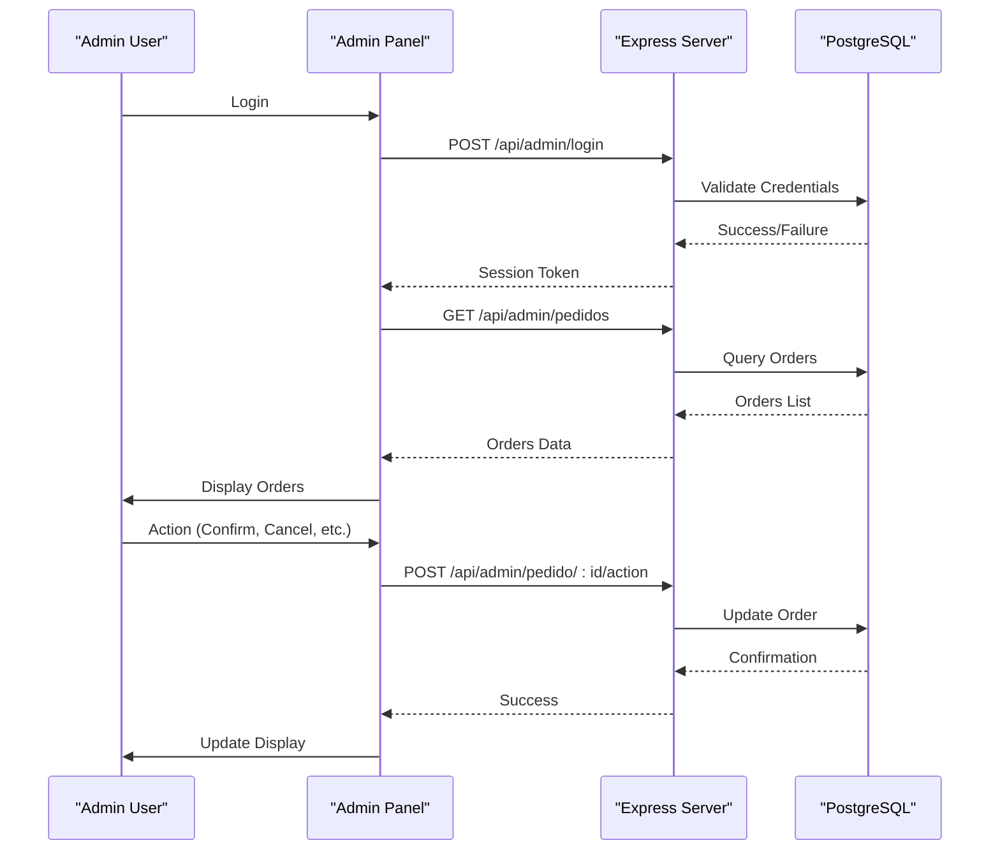

**Diagram sources**
- [admin.html:137-304](file://admin.html#L137-L304)
- [server.js:737-760](file://server.js#L737-L760)
- [server.js:763-802](file://server.js#L763-L802)

### Real-time Order Monitoring

The admin panel features sophisticated real-time monitoring capabilities:

| Feature | Description | Implementation |
|---------|-------------|----------------|
| **Live Updates** | Automatic order status refresh every 30 seconds | JavaScript setInterval |
| **Status Filtering** | Filter orders by status (Pending, Paid, Cancelled) | Dynamic filtering buttons |
| **Real-time Alerts** | Visual indicators for urgent orders | Color-coded badges |
| **Bulk Actions** | Mass operations on multiple orders | Checkbox selection |
| **Order Analytics** | Summary statistics and revenue tracking | Dynamic calculations |

### Administrative Functions

The admin panel provides comprehensive order management capabilities:

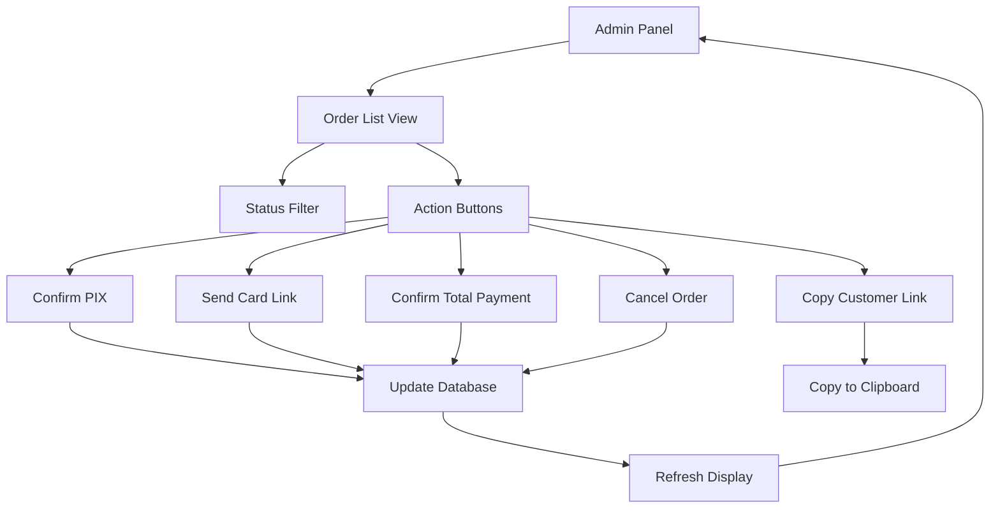

**Diagram sources**
- [admin.html:181-250](file://admin.html#L181-L250)
- [server.js:805-890](file://server.js#L805-L890)

**Section sources**
- [admin.html:1-304](file://admin.html#L1-L304)
- [admin-login.html:1-81](file://admin-login.html#L1-L81)
- [server.js:703-914](file://server.js#L703-L914)

## Data Flow Patterns

### Enhanced Payment Processing Workflow

The system implements sophisticated dual payment flow supporting multiple payment methods:

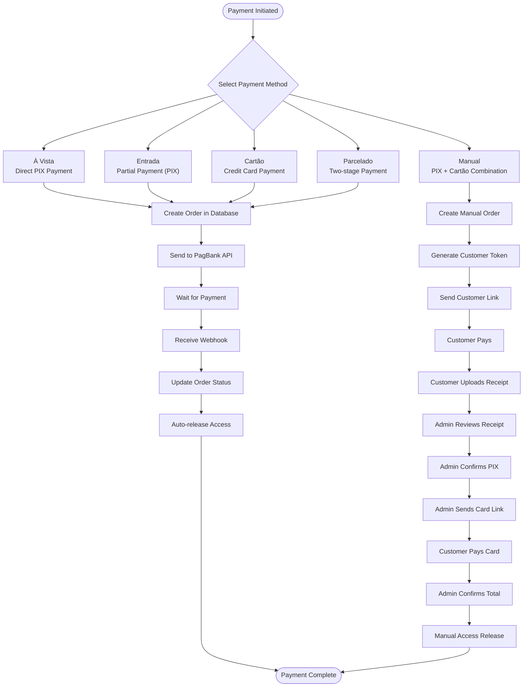

**Diagram sources**
- [server.js:82-345](file://server.js#L82-L345)
- [server.js:540-617](file://server.js#L540-L617)
- [checkout.html:626-768](file://checkout.html#L626-L768)

### Label Generation Process

The labeling system operates independently with its own data flow:

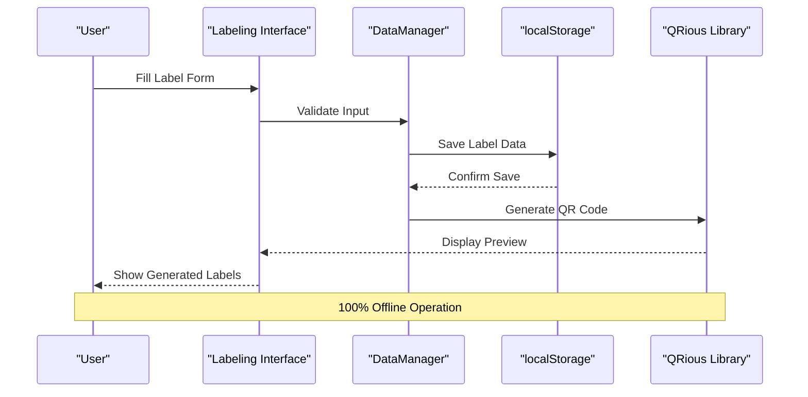

**Diagram sources**
- [cadastro.html:1136-1244](file://cadastro.html#L1136-L1244)

**Section sources**
- [checkout.html:626-768](file://checkout.html#L626-L768)
- [server.js:82-345](file://server.js#L82-L345)
- [cadastro.html:1136-1244](file://cadastro.html#L1136-L1244)

## Security Model

### Client-Side Security

The frontend implements several security measures:

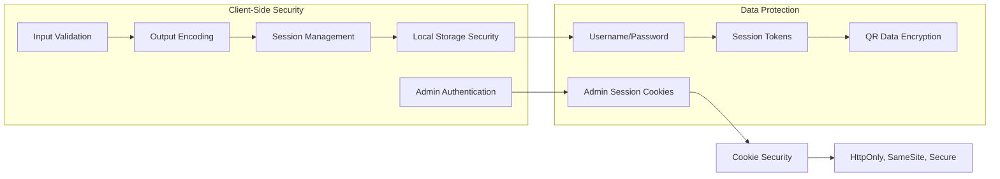

**Security Measures:**
- **Input Validation**: All user inputs are validated before processing
- **Output Encoding**: Prevents XSS attacks through HTML escaping
- **Session Management**: Uses sessionStorage for temporary user sessions
- **Local Storage Security**: Data stored locally with basic protection
- **Admin Session Security**: HttpOnly cookies with HMAC signature verification

### Server-Side Security

The backend implements comprehensive security controls:

| Security Aspect | Implementation | Purpose |
|----------------|----------------|---------|
| **CORS Policy** | Enabled for cross-origin requests | API accessibility |
| **Cookie Security** | HttpOnly, SameSite, Secure flags | Admin session protection |
| **Database Security** | Connection pooling, prepared statements | SQL injection prevention |
| **API Security** | Environment variable configuration | Sensitive data protection |
| **Admin Authentication** | HMAC-signed session tokens | Session integrity |
| **File Upload Security** | MIME type validation, size limits | Malicious file prevention |

### Authentication Flow

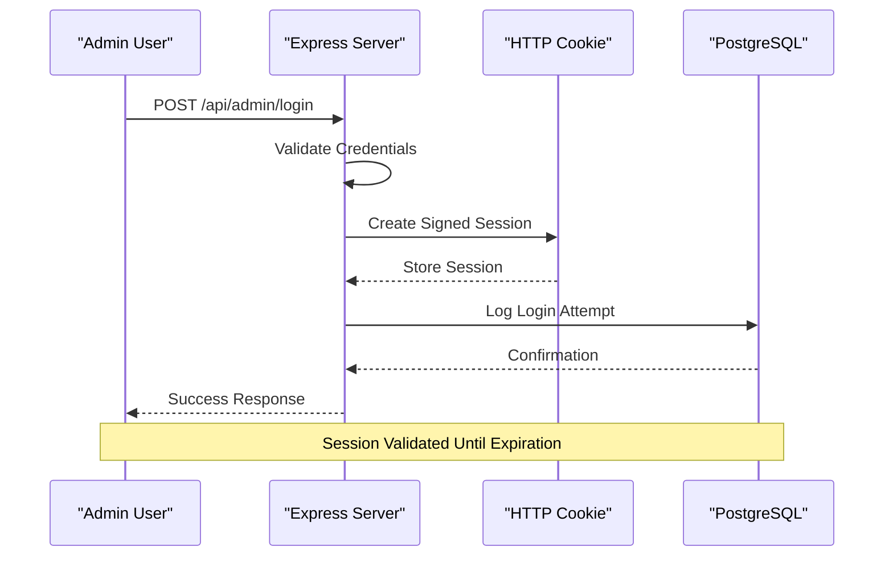

**Diagram sources**
- [server.js:737-760](file://server.js#L737-L760)

**Section sources**
- [server.js:15-27](file://server.js#L15-L27)
- [server.js:737-760](file://server.js#L737-L760)
- [README.md:117-122](file://README.md#L117-L122)

## Browser Compatibility

The system maintains broad browser compatibility while optimizing for modern environments:

### Supported Browsers

| Browser | Version | Status | Notes |
|---------|---------|--------|-------|
| **Chrome** | Latest | ✅ Fully Compatible | Recommended |
| **Firefox** | Latest | ✅ Fully Compatible | Excellent |
| **Safari** | Latest | ✅ Fully Compatible | Good |
| **Edge** | Latest | ✅ Fully Compatible | Recommended |
| **Mobile Browsers** | Latest | ✅ Compatible | Responsive design |

### Offline Capability

The system achieves 100% offline operation after initial load:

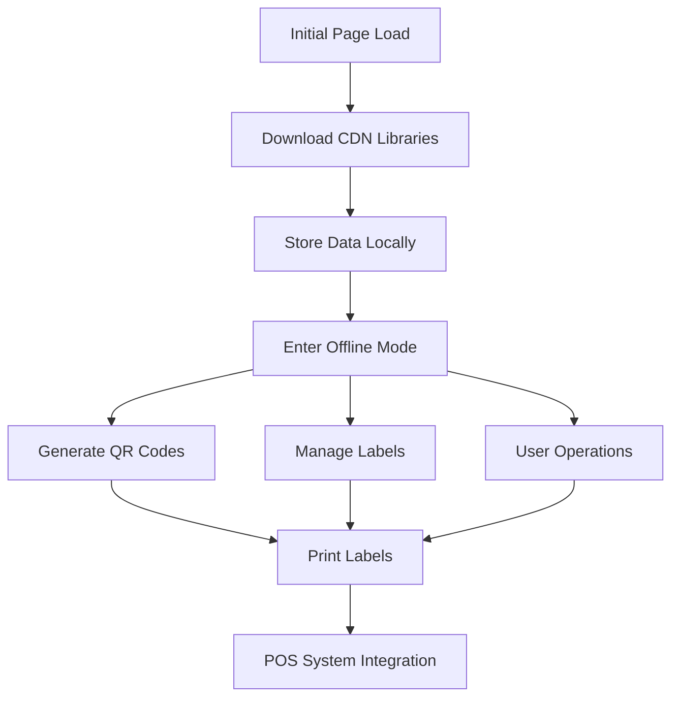

**Diagram sources**
- [README.md:107-114](file://README.md#L107-L114)

**Section sources**
- [README.md:107-114](file://README.md#L107-L114)

## Integration Points

### Alimentares/Kali POS Integration

The system integrates seamlessly with the Alimentares/Kali point-of-sale environment:

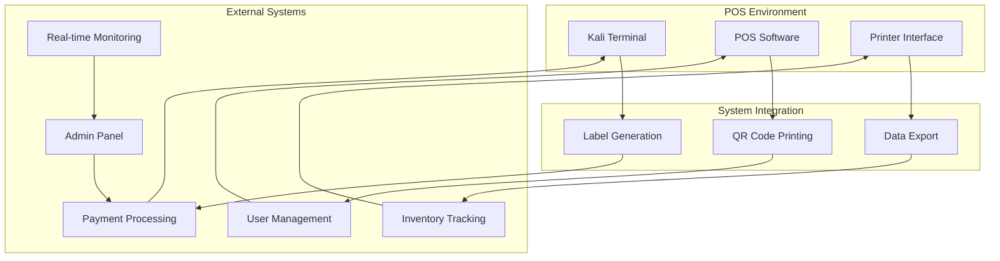

### Payment Provider Integration

The system integrates with multiple payment providers through dual architecture:

- **PagBank API**: Primary automated payment processor
- **PIX Integration**: Instant payment processing with webhook notifications
- **Credit Card Processing**: Installment payment options with admin oversight
- **Manual Payment Flow**: Admin-controlled payment coordination
- **Webhook Notifications**: Real-time payment status updates for both methods

### External Service Dependencies

| Service | Purpose | Integration Method |
|---------|---------|-------------------|
| **CDN Libraries** | QR Code generation, icons, fonts | Static asset loading |
| **PagBank API** | Automated payment processing | RESTful API calls |
| **PostgreSQL** | Data persistence | Connection pooling |
| **Render Platform** | Hosting | Platform-as-a-Service |
| **Admin Panel** | Order monitoring | Real-time WebSocket |

**Section sources**
- [PAGAMENTO-README.md:69-97](file://PAGAMENTO-README.md#L69-L97)
- [README.md:3](file://README.md#L3)

## Offline Operation

### Architecture for Offline Capability

The system achieves offline functionality through strategic design decisions:

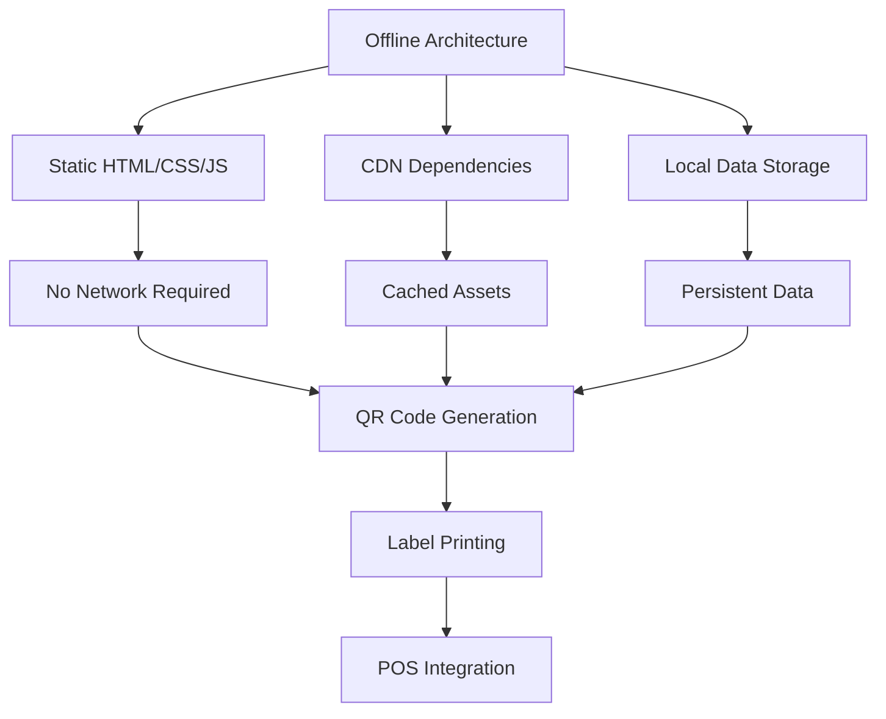

### Data Persistence Strategy

The system implements a comprehensive data persistence strategy:

| Data Category | Storage Method | Purpose | Recovery |
|---------------|----------------|---------|----------|
| **User Accounts** | localStorage | User credentials and profiles | Browser reset |
| **Label History** | localStorage | Generated label records | Browser reset |
| **Application Config** | localStorage | System preferences | Browser reset |
| **Active Sessions** | sessionStorage | Current user session | Tab close |
| **Payment Records** | PostgreSQL | Payment history and status | Server backup |
| **Manual Payment Data** | PostgreSQL | Manual payment flows | Server backup |

### Offline Features

The labeling system operates completely offline:

- **QR Code Generation**: Utilizes CDN-hosted QRious library
- **Label Management**: All operations performed locally
- **Print Functionality**: Direct browser printing interface
- **Data Export**: Local storage export capabilities

**Section sources**
- [README.md:49](file://README.md#L49)
- [README.md:107-114](file://README.md#L107-L114)

## Performance Considerations

### Frontend Performance

The client-side architecture prioritizes performance through:

- **Static Asset Loading**: CDN delivery for external libraries
- **Minimal Dependencies**: Only essential libraries loaded
- **Efficient DOM Manipulation**: Optimized for label generation
- **Responsive Design**: Mobile-first approach
- **Real-time Updates**: Efficient polling for admin panel

### Backend Performance

The server-side implementation focuses on:

- **Connection Pooling**: Efficient database connections
- **Caching Strategies**: Response caching for static content
- **Error Handling**: Graceful degradation and recovery
- **Resource Management**: Proper cleanup and memory management
- **Admin Panel Optimization**: Efficient order querying and filtering

### Scalability Considerations

The system is designed for horizontal scaling:

- **Stateless Design**: Minimal server-side state
- **Database Optimization**: Indexes and query optimization
- **CDN Distribution**: Global content delivery
- **Microservice Ready**: Modular architecture for future expansion
- **Real-time Monitoring**: Efficient admin panel updates

## Troubleshooting Guide

### Common Issues and Solutions

| Issue | Symptoms | Solution |
|-------|----------|----------|
| **Payment Failures** | Error messages, failed webhook | Check PagBank credentials, verify webhook URL |
| **QR Code Generation** | Blank QR codes, errors | Verify CDN connectivity, check browser console |
| **Offline Mode Problems** | Labels not generating, data loss | Clear browser cache, check localStorage quota |
| **Admin Login Issues** | Cannot access admin panel | Verify credentials, check cookie settings |
| **Database Connection** | Server errors, connection timeouts | Verify PostgreSQL configuration, check network |
| **Manual Payment Issues** | Orders stuck in PENDING_PIX | Check admin panel for receipt uploads |
| **Admin Panel Not Updating** | Stale order information | Check browser console for JavaScript errors |

### Debugging Tools

The system includes built-in debugging capabilities:

- **Console Logging**: Extensive logging for payment processing
- **Error Handling**: Comprehensive error reporting
- **Status Monitoring**: Real-time payment status checking
- **Development Mode**: Enhanced logging for development
- **Admin Panel Logs**: Order action audit trails

### Maintenance Procedures

Regular maintenance tasks include:

- **Database Cleanup**: Regular pruning of old records
- **Library Updates**: Periodic CDN library updates
- **Security Audits**: Regular credential rotation
- **Performance Monitoring**: System health checks
- **Admin Panel Updates**: Real-time monitoring optimization

**Section sources**
- [server.js:239-280](file://server.js#L239-L280)
- [checkout.html:711-718](file://checkout.html#L711-L718)

## Conclusion

The qretiquetas.com system represents a sophisticated hybrid architecture that successfully balances offline functionality with robust dual payment processing capabilities. The recent enhancement introduces comprehensive administrative oversight with real-time order monitoring, creating a complete payment ecosystem that serves both automated and manual payment scenarios.

Key architectural strengths include:

- **Modular Design**: Clear separation of concerns between labeling and dual payment systems
- **Offline Capability**: 100% offline operation for labeling functionality
- **Dual Payment Architecture**: Seamless integration of automated PagBank and manual payment flows
- **Administrative Excellence**: Real-time order monitoring and comprehensive admin panel
- **Scalable Backend**: Express server with PostgreSQL for payment processing
- **POS Integration**: Seamless integration with Alimentares/Kali point-of-sale environment
- **Security Model**: Multi-layered security approach for both client and server sides

The system's architecture provides an excellent foundation for future enhancements while maintaining reliability and performance in the demanding retail POS environment. The dual payment processing approach ensures that critical labeling functionality remains available even during network outages, while payment processing continues to leverage external payment providers for secure transaction handling. The administrative panel system adds crucial business intelligence and operational control, making the system suitable for enterprise-level deployment in the Alimentares/Kali POS environment.