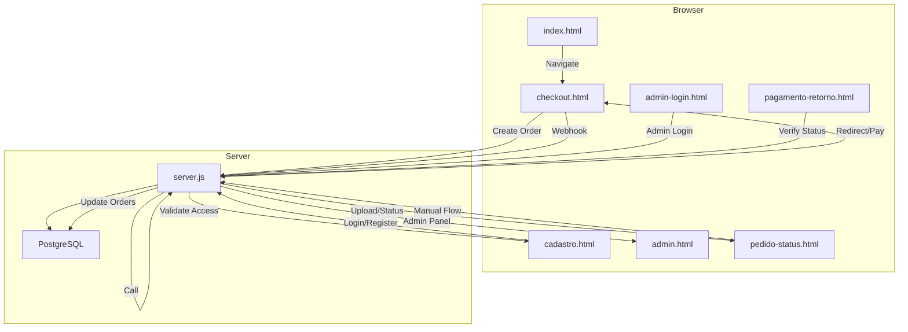
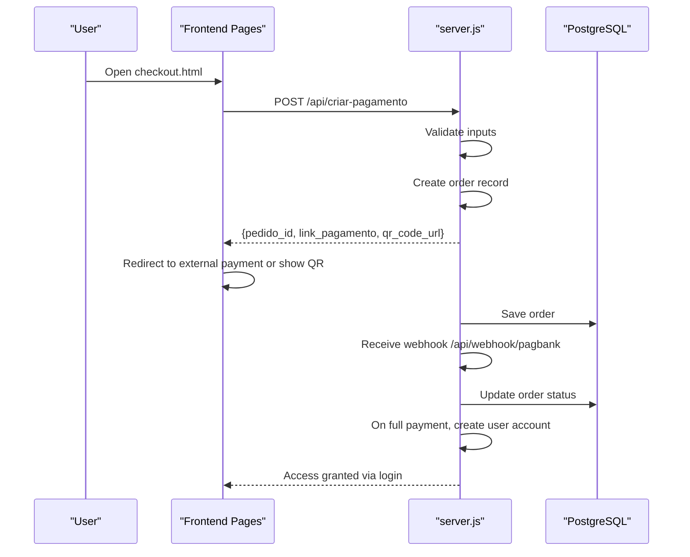
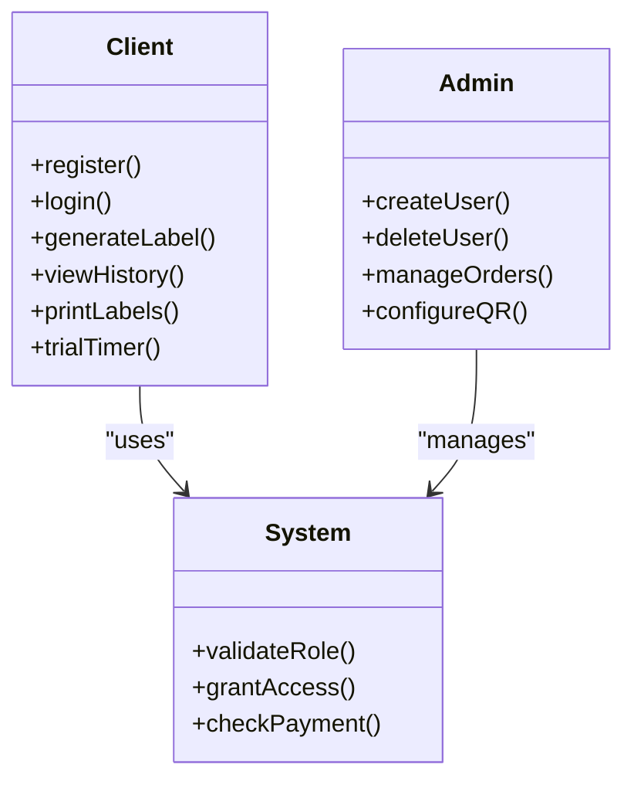
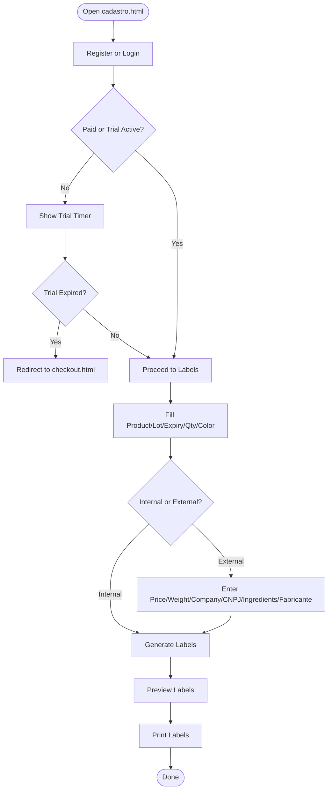
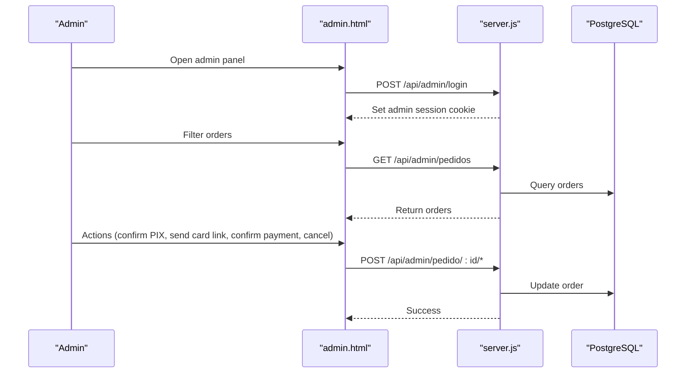
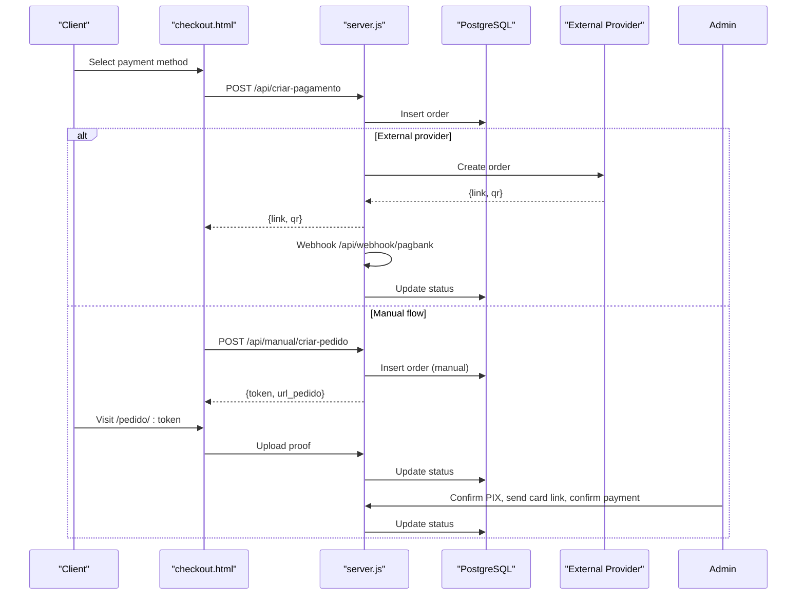
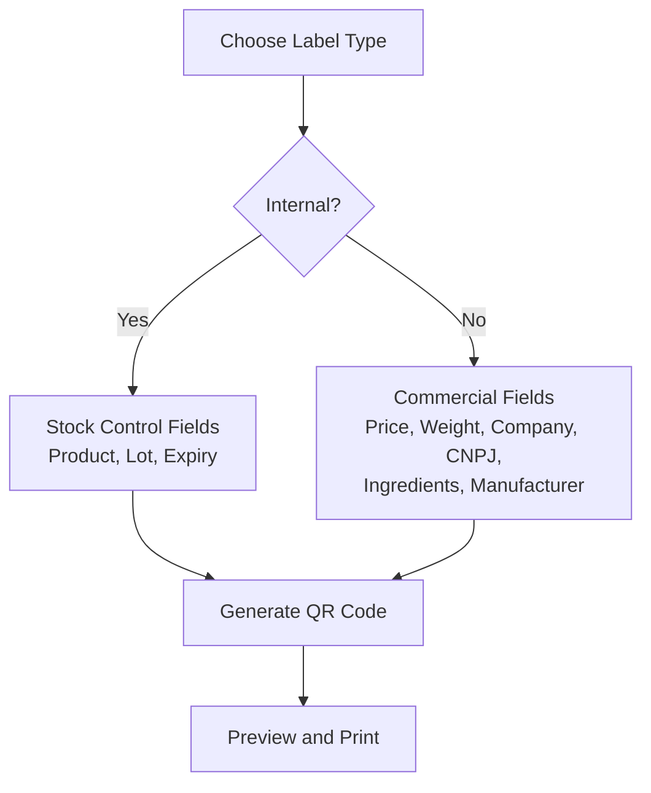
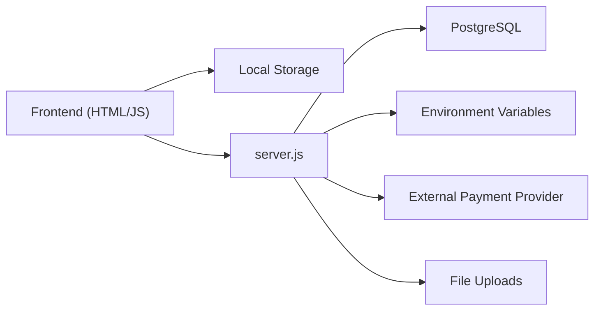

# User Roles & System Benefits

<cite>
**Referenced Files in This Document**
- [README.md](file://README.md)
- [server.js](file://server.js)
- [database.sql](file://database.sql)
- [init-db.sql](file://init-db.sql)
- [checkout.html](file://checkout.html)
- [pagamento-retorno.html](file://pagamento-retorno.html)
- [pedido-status.html](file://pedido-status.html)
- [admin-login.html](file://admin-login.html)
- [admin.html](file://admin.html)
- [cadastro.html](file://cadastro.html)
</cite>

## Table of Contents
1. [Introduction](#introduction)
2. [Project Structure](#project-structure)
3. [Core Components](#core-components)
4. [Architecture Overview](#architecture-overview)
5. [Detailed Component Analysis](#detailed-component-analysis)
6. [Dependency Analysis](#dependency-analysis)
7. [Performance Considerations](#performance-considerations)
8. [Troubleshooting Guide](#troubleshooting-guide)
9. [Conclusion](#conclusion)
10. [Appendices](#appendices)

## Introduction
This document explains the two user roles (clients and administrators), their permissions and capabilities, and the end-to-end client workflow for registration and label generation. It also outlines administrator responsibilities, system benefits, and security considerations appropriate for a local/enclosed environment.

## Project Structure
The system comprises:
- Frontend pages for client onboarding, checkout, label creation, and admin management
- Backend service exposing REST endpoints for payments, order lifecycle, and admin operations
- PostgreSQL database storing orders and users
- Static assets and local storage for client-side data persistence

**Diagram sources**
- [checkout.html](file://checkout.html)
- [server.js](file://server.js)
- [database.sql](file://database.sql)
- [admin.html](file://admin.html)
- [pedido-status.html](file://pedido-status.html)
- [pagamento-retorno.html](file://pagamento-retorno.html)

**Section sources**
- [README.md](file://README.md)
- [server.js](file://server.js)
- [database.sql](file://database.sql)

## Core Components
- Client role
  - Can register, log in, generate labels, view history, and print
  - Has a 7-minute trial period unless paid
- Administrator role
  - Manages users, views orders, updates statuses, and controls access
- Payment and order lifecycle
  - Supports multiple payment methods and a manual flow with PIX and card steps
- Data persistence
  - Client-side: Local storage for users, labels, and configuration
  - Server-side: PostgreSQL for orders and users

**Section sources**
- [README.md](file://README.md)
- [cadastro.html](file://cadastro.html)
- [server.js](file://server.js)
- [database.sql](file://database.sql)

## Architecture Overview
The system integrates browser-based UI with a backend service and a database. Payments integrate with an external provider for some flows, while a manual flow stores order metadata and requires admin intervention.

**Diagram sources**
- [checkout.html](file://checkout.html)
- [server.js](file://server.js)
- [database.sql](file://database.sql)

**Section sources**
- [server.js](file://server.js)
- [checkout.html](file://checkout.html)
- [pagamento-retorno.html](file://pagamento-retorno.html)

## Detailed Component Analysis

### User Roles and Permissions
- Clients
  - Registration and login
  - Generate internal and external labels
  - View and print label history
  - Reimpression and deletion of own labels
  - Trial timer until purchase confirmation
- Administrators
  - Create and delete users
  - Manage order statuses and access
  - Configure QR code orientation
  - Monitor and approve manual payments

**Diagram sources**
- [cadastro.html](file://cadastro.html)
- [admin.html](file://admin.html)
- [server.js](file://server.js)

**Section sources**
- [README.md](file://README.md)
- [cadastro.html](file://cadastro.html)
- [admin.html](file://admin.html)

### Client Workflow: Registration to Label Printing
1. Registration
   - Navigate to the registration tab and submit credentials
   - System validates uniqueness and creates a temporary user
2. Login and trial
   - Log in; clients receive a 7-minute trial unless marked paid
   - Online check verifies purchase status
3. Label creation
   - Choose product, lot, expiry, quantity, color, and label type
   - For external labels, enter price, weight, company, CNPJ, ingredients, manufacturer
   - Generate labels and preview
4. Printing
   - Print directly from the browser using the built-in print dialog

**Diagram sources**
- [cadastro.html](file://cadastro.html)
- [checkout.html](file://checkout.html)

**Section sources**
- [cadastro.html](file://cadastro.html)
- [checkout.html](file://checkout.html)

### Administrator Responsibilities
- User management
  - Create and delete users
  - Assign roles
- System oversight
  - Approve manual payments (PIX receipt, card link, final confirmation)
  - Update order statuses and observations
  - Copy shareable links for clients
- Access control
  - Validate admin sessions via signed cookies
  - Restrict admin endpoints to authorized users

**Diagram sources**
- [admin.html](file://admin.html)
- [admin-login.html](file://admin-login.html)
- [server.js](file://server.js)
- [database.sql](file://database.sql)

**Section sources**
- [admin.html](file://admin.html)
- [admin-login.html](file://admin-login.html)
- [server.js](file://server.js)

### Payment Flows and Label Generation

#### Payment Methods and Order Lifecycle
- Standard payment via external provider
  - Choose payment option (à vista, entrada, cartão)
  - Redirected to external provider or shown QR
  - Webhook updates order status; full payment grants access
- Manual payment (PIX + Card)
  - Client defines PIX and card amounts summing to total
  - Client pays PIX and uploads proof
  - Admin confirms PIX, sends card link, confirms card payment, then grants access

**Diagram sources**
- [checkout.html](file://checkout.html)
- [server.js](file://server.js)
- [pedido-status.html](file://pedido-status.html)
- [database.sql](file://database.sql)

**Section sources**
- [server.js](file://server.js)
- [checkout.html](file://checkout.html)
- [pedido-status.html](file://pedido-status.html)
- [pagamento-retorno.html](file://pagamento-retorno.html)

#### Label Types: Internal vs External
- Internal labels (blue): stock control
- External labels (green): commercial sale with price, weight, company, CNPJ, ingredients, manufacturer
- QR code includes identifying fields for traceability

**Diagram sources**
- [cadastro.html](file://cadastro.html)

**Section sources**
- [README.md](file://README.md)
- [cadastro.html](file://cadastro.html)

## Dependency Analysis
- Frontend depends on:
  - Local storage for user and label data
  - QRious library for QR generation
- Backend depends on:
  - PostgreSQL for persistent state
  - Environment variables for provider credentials and admin secrets
- External integrations:
  - Payment provider for standard flow
  - File uploads for manual flow receipts

**Diagram sources**
- [server.js](file://server.js)
- [database.sql](file://database.sql)
- [checkout.html](file://checkout.html)

**Section sources**
- [server.js](file://server.js)
- [database.sql](file://database.sql)

## Performance Considerations
- Client-side rendering and printing minimize server load
- QR generation occurs after DOM insertion to avoid blocking
- Admin panel paginates recent orders and refreshes periodically
- Database queries use indexes on email, status, and token for efficient lookups

[No sources needed since this section provides general guidance]

## Troubleshooting Guide
- Payment issues
  - Verify provider token configuration and network connectivity
  - Check webhook delivery and order status updates
- Access not granted
  - Confirm payment status and that the user account was created
  - For manual flow, ensure PIX proof uploaded and admin confirmed card link sent
- Session problems
  - Admin session uses signed cookies; ensure secure flag matches environment
  - Clear cookies and re-authenticate if unauthorized

**Section sources**
- [server.js](file://server.js)
- [admin.html](file://admin.html)

## Conclusion
The system provides a streamlined solution for label generation with robust role-based access, flexible payment options, and practical admin controls. Clients benefit from quick registration, immediate label generation, and print-ready outputs, while administrators gain oversight and control over access and workflows.

[No sources needed since this section summarizes without analyzing specific files]

## Appendices

### Security Considerations
- Admin session management
  - Signed cookies with expiration and HMAC validation
  - Secure cookie flags in production
- Data protection
  - Client passwords stored in plaintext locally (acceptable for closed environments)
  - Sensitive configuration via environment variables
- Access control
  - Admin endpoints require valid session
  - Client access gated by trial/purchase checks

**Section sources**
- [server.js](file://server.js)
- [admin.html](file://admin.html)
- [README.md](file://README.md)

### System Benefits
- Improved inventory tracking via internal labels
- Product traceability with QR codes containing identifiers
- Reduced manual paperwork with digital labels
- Streamlined label production with print-ready layouts

**Section sources**
- [README.md](file://README.md)
- [cadastro.html](file://cadastro.html)