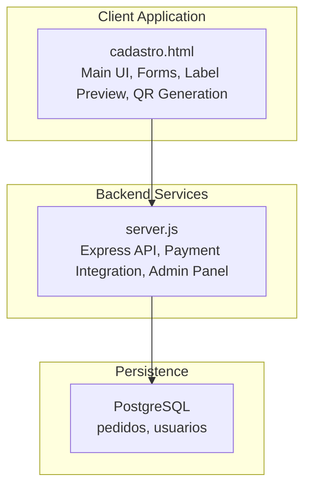
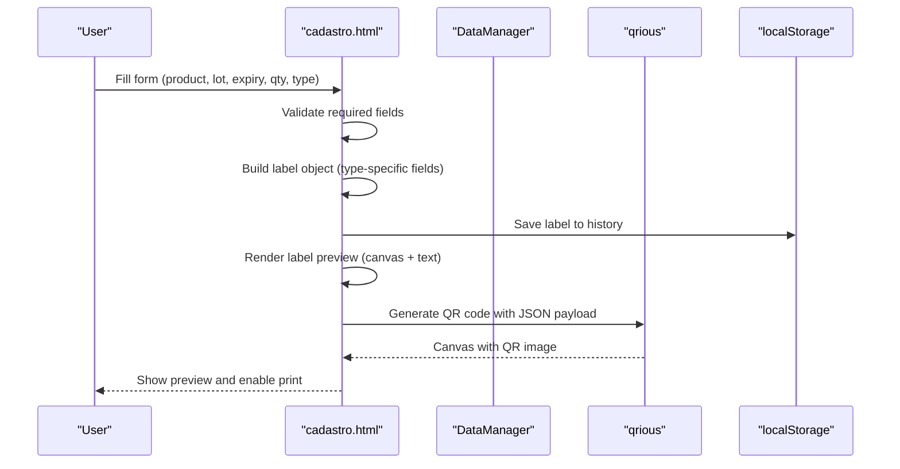
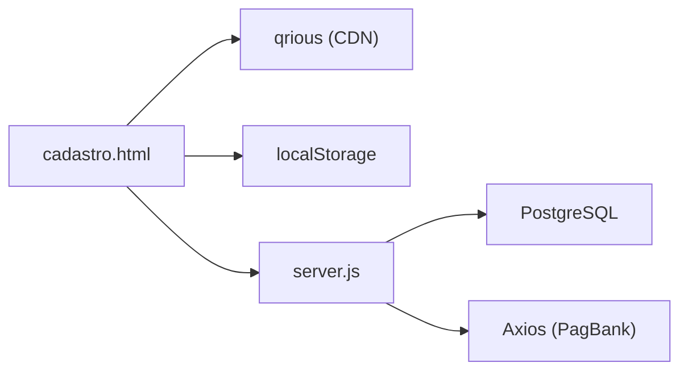

# Label Generation Process

<cite>
**Referenced Files in This Document**
- [cadastro.html](file://cadastro.html)
- [server.js](file://server.js)
- [package.json](file://package.json)
- [database.sql](file://database.sql)
- [init-db.sql](file://init-db.sql)
- [admin.html](file://admin.html)
- [admin-login.html](file://admin-login.html)
- [pedido-status.html](file://pedido-status.html)
- [checkout.html](file://checkout.html)
</cite>

## Table of Contents
1. [Introduction](#introduction)
2. [Project Structure](#project-structure)
3. [Core Components](#core-components)
4. [Architecture Overview](#architecture-overview)
5. [Detailed Component Analysis](#detailed-component-analysis)
6. [Dependency Analysis](#dependency-analysis)
7. [Performance Considerations](#performance-considerations)
8. [Troubleshooting Guide](#troubleshooting-guide)
9. [Conclusion](#conclusion)

## Introduction
This document explains the label generation process end-to-end, from form input to QR code creation and printing. It covers data validation, field processing, template rendering, JavaScript implementation using the qrious library for QR code generation, canvas manipulation for label rendering, and localStorage integration for data persistence. It also documents form validation logic, error handling mechanisms, user feedback systems, and the relationship between form inputs and generated label properties such as product information, batch numbers, expiration dates, and pricing details.

## Project Structure
The label generation feature is implemented in a single-page application built around a central HTML file that manages authentication, form handling, label preview, QR code generation, and history. Supporting backend services handle payment flows and administrative controls.

**Diagram sources**
- [cadastro.html](file://cadastro.html)
- [server.js](file://server.js)
- [database.sql](file://database.sql)

**Section sources**
- [cadastro.html](file://cadastro.html)
- [server.js](file://server.js)
- [database.sql](file://database.sql)

## Core Components
- DataManager: Handles localStorage-backed CRUD for users, labels, and configuration.
- Authentication: Login/register flows and session management.
- Label Generation: Reads form inputs, validates, constructs label objects, renders previews, generates QR codes, and persists history.
- Printing: Uses browser print media queries to render printable label layouts.
- Admin Panel: Manages users and supports manual payment flows.

Key responsibilities:
- Data validation and sanitization for form inputs.
- Label object construction with product, batch, expiry, pricing, and branding fields.
- QR code generation via qrious with structured JSON payloads.
- Canvas rendering and layout switching between vertical/horizontal QR positions.
- Local persistence of labels and user preferences.

**Section sources**
- [cadastro.html](file://cadastro.html)
- [server.js](file://server.js)

## Architecture Overview
The label generation workflow spans the frontend and backend:

**Diagram sources**
- [cadastro.html](file://cadastro.html)

**Section sources**
- [cadastro.html](file://cadastro.html)

## Detailed Component Analysis

### Form Validation and Data Processing
- Required fields: Product, Lot, Expiry.
- Optional fields for external labels: Weight, Price, Price Color, Company, CNPJ, Ingredients, Manufacturer.
- Quantity determines how many labels are generated.
- Type selection toggles external fields visibility.
- Validation occurs before label generation; errors are surfaced via alerts.

Processing steps:
- Read inputs and trim whitespace.
- Construct label objects with computed metadata (createdBy, createdAt, printId).
- Persist each label to history via DataManager.
- Render preview cards with appropriate layout (vertical vs horizontal QR).

**Section sources**
- [cadastro.html](file://cadastro.html)

### Template Rendering and Layout
- Two layout modes controlled by configuration:
  - Vertical: QR code above textual content.
  - Horizontal: QR code on the left, text on the right.
- CSS grid and flexbox adapt label cards to print-friendly sizes.
- Print styles ensure proper scaling for thermal printers.

Rendering logic:
- Dynamically builds innerHTML for each label card.
- Applies background color and label type indicator.
- Conditionally includes company, CNPJ, price, weight, manufacturer depending on type and presence.

**Section sources**
- [cadastro.html](file://cadastro.html)

### QR Code Generation with qrious
- Library: qrious (loaded via CDN).
- Payload: JSON containing label identity and core attributes (id, product, lot, expiry, type).
- Size adapts to layout mode (70x70 for horizontal, 80x80 for vertical).
- Error correction level set to high (level: 'H').

Canvas integration:
- Each label card contains a canvas element with a unique id.
- QRious attaches the generated QR image to the canvas after a short timeout to ensure DOM readiness.

**Section sources**
- [cadastro.html](file://cadastro.html)

### Data Persistence with localStorage
- DataManager encapsulates:
  - Users: stored under a dedicated key.
  - Labels: array persisted with push semantics.
  - Config: current QR position preference.
- Methods:
  - getLabels(), saveLabels(), addLabel(), deleteLabel()
  - getUsers(), saveUsers(), addUser(), getConfig(), saveConfig()

Benefits:
- No server round-trip for label history.
- Immediate availability of previous labels for reprints.

**Section sources**
- [cadastro.html](file://cadastro.html)

### Reprint and History Management
- History list displays recent labels with product, lot, expiry, and timestamp.
- Reprint action populates the form with stored label values and regenerates labels.
- Delete removes entries from history and updates stats.

**Section sources**
- [cadastro.html](file://cadastro.html)

### Admin Controls and Manual Payment Flow
While not part of label generation itself, the admin panel integrates with the label system indirectly:
- Admin login and session management.
- Manual payment flow supporting PIX + Cartão split payments.
- Order status transitions and access provisioning.

These flows influence label access for clients who complete payments.

**Section sources**
- [admin.html](file://admin.html)
- [admin-login.html](file://admin-login.html)
- [pedido-status.html](file://pedido-status.html)
- [checkout.html](file://checkout.html)
- [server.js](file://server.js)

## Dependency Analysis
- Frontend dependencies:
  - qrious: QR code generation.
  - Font Awesome: Icons for UI.
  - Google Fonts: Typography.
- Backend dependencies:
  - Express, CORS, Axios, pg, dotenv, cookie-parser, multer.

**Diagram sources**
- [cadastro.html](file://cadastro.html)
- [server.js](file://server.js)
- [package.json](file://package.json)

**Section sources**
- [package.json](file://package.json)
- [server.js](file://server.js)

## Performance Considerations
- QR generation occurs after DOM insertion with a minimal delay to ensure canvases exist.
- Canvas sizing is optimized for print resolution (70x70 or 80x80).
- History retrieval capped to recent entries to keep UI responsive.
- CSS grid/flex layouts minimize heavy computations during rendering.

## Troubleshooting Guide
Common issues and resolutions:
- QR code not appearing:
  - Ensure canvas element exists and id matches the QRious element selector.
  - Verify the payload is valid JSON and not empty.
- Labels not printing:
  - Check browser print dialog and paper size.
  - Confirm print media queries are applied (grid sizes and canvas scaling).
- Form validation failures:
  - Required fields must be filled; alerts notify missing data.
  - External fields are only shown for external label type.
- History not persisting:
  - Confirm localStorage is enabled in the browser.
  - DataManager methods handle fallback defaults if keys are missing.

**Section sources**
- [cadastro.html](file://cadastro.html)

## Conclusion
The label generation process is a cohesive client-side workflow that validates inputs, constructs label objects, renders previews, and generates QR codes efficiently. It leverages localStorage for persistence and provides flexible layout options for printing. The admin and payment integrations support broader system access control and manual payment flows, ensuring a complete solution for label lifecycle management.