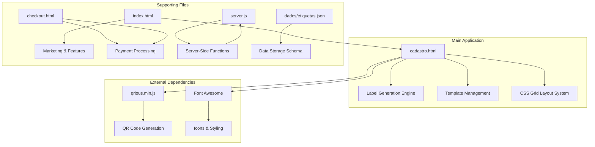
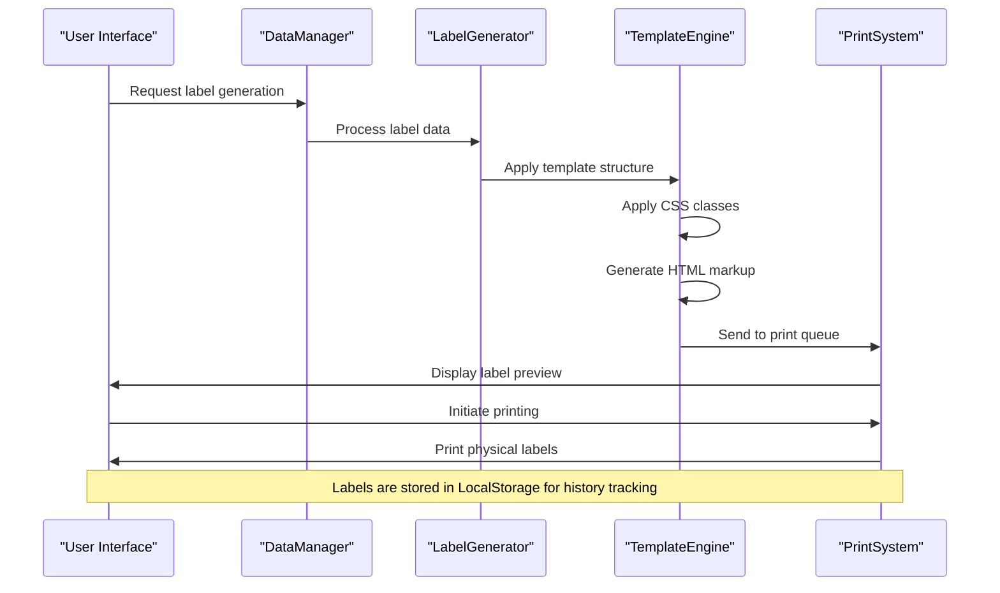
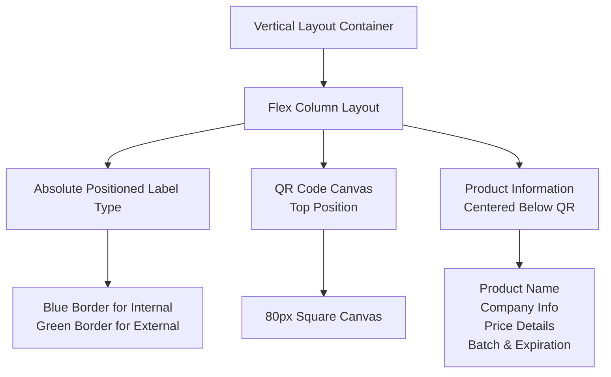
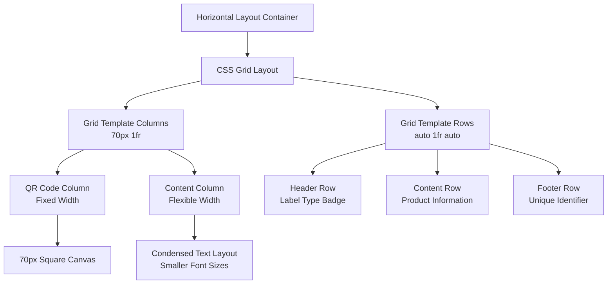
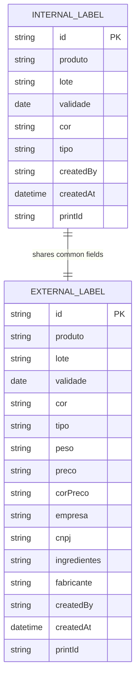
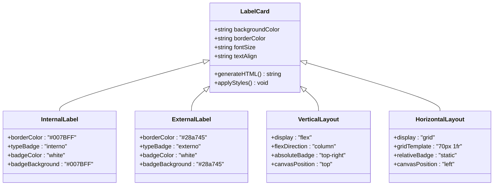
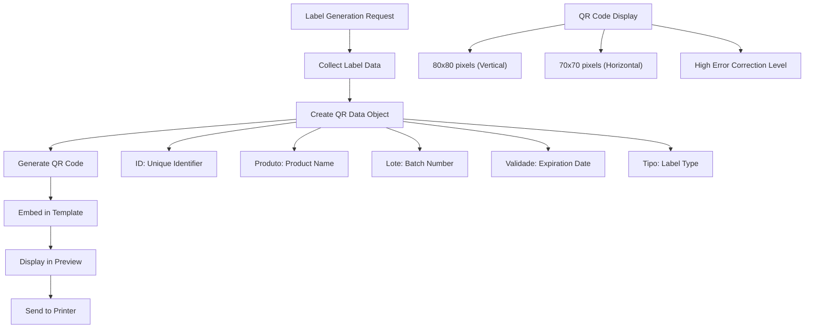
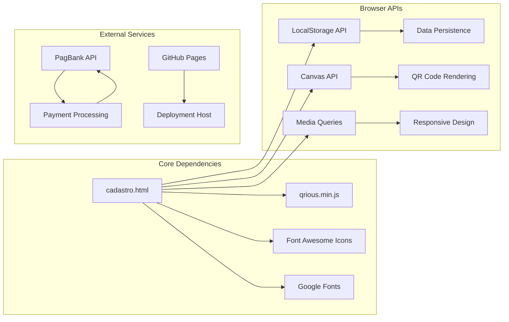
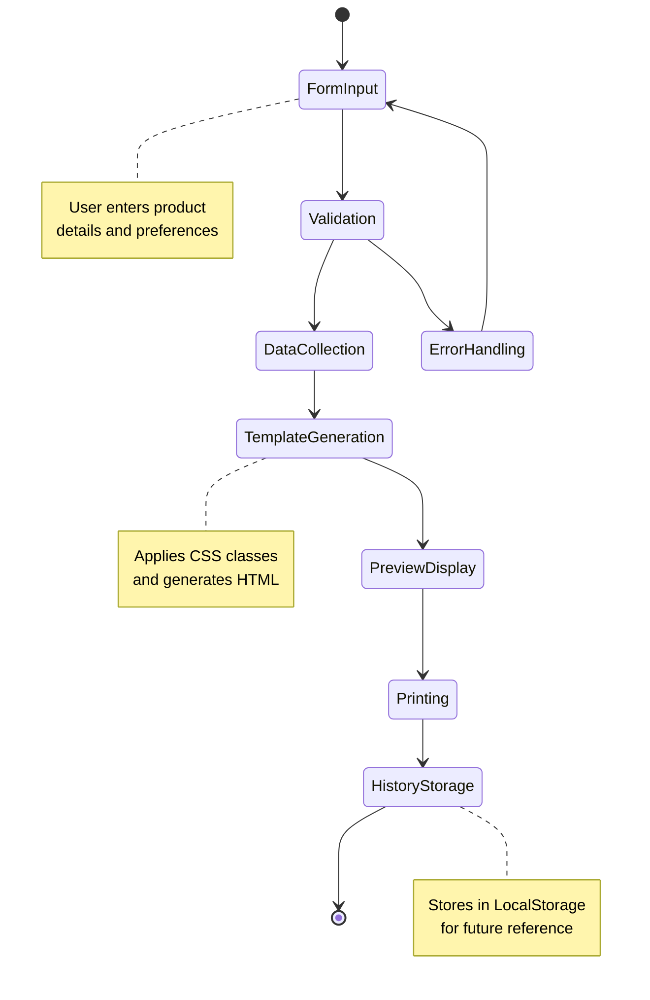

# Label Types and Templates

<cite>
**Referenced Files in This Document**
- [README.md](file://README.md)
- [index.html](file://index.html)
- [cadastro.html](file://cadastro.html)
- [checkout.html](file://checkout.html)
- [server.js](file://server.js)
- [dados/etiquetas.json](file://dados/etiquetas.json)
</cite>

## Table of Contents
1. [Introduction](#introduction)
2. [Project Structure](#project-structure)
3. [Core Components](#core-components)
4. [Architecture Overview](#architecture-overview)
5. [Detailed Component Analysis](#detailed-component-analysis)
6. [Dependency Analysis](#dependency-analysis)
7. [Performance Considerations](#performance-considerations)
8. [Troubleshooting Guide](#troubleshooting-guide)
9. [Conclusion](#conclusion)

## Introduction

The QRetiquetas.com system provides a comprehensive solution for generating product labels with QR codes for both internal inventory control and external commercial sales. This documentation focuses specifically on the label types and template management system, detailing the two primary label types, their CSS grid-based layouts, and the responsive design principles used for optimal printing and display.

The system operates completely offline after initial loading, utilizing browser LocalStorage for data persistence and CDN-hosted libraries for QR code generation. It's designed specifically for thermal printers commonly used in food processing environments.

## Project Structure

The label management system is primarily implemented in a single HTML file with embedded CSS and JavaScript, complemented by supporting files for data storage and payment processing.

**Diagram sources**
- [cadastro.html:1-1277](file://cadastro.html#L1-L1277)
- [index.html:1-284](file://index.html#L1-L284)
- [checkout.html:1-768](file://checkout.html#L1-L768)
- [server.js:1-890](file://server.js#L1-L890)

**Section sources**
- [README.md:40-47](file://README.md#L40-L47)
- [cadastro.html:1-1277](file://cadastro.html#L1-L1277)

## Core Components

The label system consists of several interconnected components that work together to provide flexible label generation and management capabilities.

### Label Type System

The system supports two distinct label types, each with specific styling and content requirements:

**Internal Labels (Blue)**
- Purpose: Inventory control and stock management
- Color scheme: Blue border (#007BFF) with white label type indicator
- Content focus: Product identification, batch tracking, and expiration dates
- Use case: Internal warehouse, storage, and inventory management

**External Labels (Green)**
- Purpose: Commercial sales and customer-facing products
- Color scheme: Green border (#28a745) with white label type indicator
- Content focus: Complete product information including pricing, weight, and manufacturer details
- Use case: Retail sales, packaging, and customer communication

### Template Architecture

The template system uses a hybrid approach combining CSS Grid for layout control and dynamic HTML generation for content assembly. Each label template is constructed using a base `.label-card` element with modifier classes that control appearance and layout.

**Template Structure Components:**
- Base container with border and padding
- QR code canvas element for unique identification
- Product information display areas
- Label type indicator badge
- Unique identifier display

**Section sources**
- [README.md:31-36](file://README.md#L31-L36)
- [cadastro.html:273-287](file://cadastro.html#L273-L287)
- [cadastro.html:1002-1033](file://cadastro.html#L1002-L1033)

## Architecture Overview

The label generation architecture follows a modular design pattern with clear separation of concerns between data management, template rendering, and presentation logic.

**Diagram sources**
- [cadastro.html:960-1047](file://cadastro.html#L960-L1047)
- [cadastro.html:1157-1186](file://cadastro.html#L1157-L1186)

The architecture ensures scalability while maintaining simplicity through the use of modern web technologies and minimal external dependencies.

## Detailed Component Analysis

### CSS Grid System Implementation

The label system employs a sophisticated CSS Grid layout system that adapts between vertical and horizontal QR code positioning based on user preferences and printer requirements.

#### Vertical Layout (Default)

The vertical layout positions the QR code above the product information, creating a compact, vertically-oriented label suitable for standard thermal printers.

**Diagram sources**
- [cadastro.html:201-215](file://cadastro.html#L201-L215)
- [cadastro.html:285-326](file://cadastro.html#L285-L326)

#### Horizontal Layout (Maquininha Optimized)

The horizontal layout positions the QR code to the left of the product information, optimizing scanning efficiency for point-of-sale systems and maquininhas.

**Diagram sources**
- [cadastro.html:216-273](file://cadastro.html#L216-L273)
- [cadastro.html:398-451](file://cadastro.html#L398-L451)

#### Responsive Design Principles

The system implements comprehensive responsive design principles to ensure optimal display across different screen sizes and printing contexts.

**Desktop Experience:**
- Flexible grid layout with automatic column sizing
- Hover effects and interactive elements
- Comprehensive form controls with validation

**Mobile Experience:**
- Adaptive grid that switches to single-column layout
- Touch-friendly button sizing and spacing
- Simplified navigation with tabbed interface

**Print Optimization:**
- Dedicated print media queries
- Fixed dimensions for thermal printers (80mm x 40mm)
- Optimized font sizes and spacing for print quality

**Section sources**
- [cadastro.html:374-452](file://cadastro.html#L374-L452)
- [cadastro.html:184-190](file://cadastro.html#L184-L190)

### Label Data Structure Management

The system maintains a structured approach to label data management with clear separation between internal and external label requirements.

#### Internal Label Data Structure

**Diagram sources**
- [cadastro.html:980-997](file://cadastro.html#L980-L997)
- [cadastro.html:960-966](file://cadastro.html#L960-L966)

#### Field Requirements Matrix

| Field Category | Internal Labels | External Labels | Required |
|----------------|----------------|-----------------|----------|
| **Basic Fields** | ✅ | ✅ | Mandatory |
| Product Name | ✅ | ✅ | Yes |
| Batch Number | ✅ | ✅ | Yes |
| Expiration Date | ✅ | ✅ | Yes |
| Label Color | ✅ | ✅ | Optional |
| Label Type | ✅ | ✅ | Automatic |
| **External Only Fields** | | | |
| Weight | ❌ | ✅ | Optional |
| Price | ❌ | ✅ | Optional |
| Price Color | ❌ | ✅ | Optional |
| Company Name | ❌ | ✅ | Optional |
| CNPJ | ❌ | ✅ | Optional |
| Ingredients | ❌ | ✅ | Optional |
| Manufacturer | ❌ | ✅ | Optional |

**Section sources**
- [cadastro.html:960-966](file://cadastro.html#L960-L966)
- [cadastro.html:1007-1030](file://cadastro.html#L1007-L1030)

### Template Customization Options

The system provides extensive customization options through CSS classes and dynamic styling:

#### CSS Class Architecture

**Diagram sources**
- [cadastro.html:191-200](file://cadastro.html#L191-L200)
- [cadastro.html:273-287](file://cadastro.html#L273-L287)
- [cadastro.html:201-273](file://cadastro.html#L201-L273)

#### Dynamic Styling System

The template system supports real-time styling modifications through JavaScript-driven CSS class application and inline style generation.

**Styling Features:**
- Dynamic background color assignment
- Conditional field display based on label type
- Responsive font sizing for different layouts
- Print-optimized styling with media queries

**Section sources**
- [cadastro.html:1003-1005](file://cadastro.html#L1003-L1005)
- [cadastro.html:374-452](file://cadastro.html#L374-L452)

### QR Code Integration and Generation

The system integrates QR code generation through the qrious library, creating scannable identifiers that contain essential product information.

#### QR Code Data Structure

**Diagram sources**
- [cadastro.html:1035-1047](file://cadastro.html#L1035-L1047)
- [cadastro.html:1039-1045](file://cadastro.html#L1039-L1045)

**Section sources**
- [cadastro.html:1035-1047](file://cadastro.html#L1035-L1047)
- [index.html:128-131](file://index.html#L128-L131)

## Dependency Analysis

The label system has minimal external dependencies, relying primarily on CDN-hosted libraries for core functionality.

**Diagram sources**
- [cadastro.html:7](file://cadastro.html#L7)
- [checkout.html:7](file://checkout.html#L7)
- [server.js:1-10](file://server.js#L1-L10)

### Data Flow Architecture

The system implements a unidirectional data flow pattern that ensures consistency and predictability in label generation and management.

**Diagram sources**
- [cadastro.html:960-1047](file://cadastro.html#L960-L1047)
- [cadastro.html:1157-1186](file://cadastro.html#L1157-L1186)

**Section sources**
- [cadastro.html:960-1047](file://cadastro.html#L960-L1047)
- [server.js:388-487](file://server.js#L388-L487)

## Performance Considerations

The label system is optimized for performance through several key strategies:

### Memory Management
- Efficient DOM manipulation through batch operations
- Minimal memory footprint for label previews
- Lazy loading of QR code generation until needed

### Rendering Optimization
- CSS Grid layout for efficient reflow calculations
- Hardware-accelerated animations and transitions
- Optimized print stylesheets to minimize rendering overhead

### Storage Efficiency
- LocalStorage-based persistence with JSON serialization
- Data compression for large label histories
- Cleanup mechanisms for expired or unused data

### Network Considerations
- CDN-hosted dependencies for global distribution
- Offline-first architecture with fallback resources
- Minimal bandwidth usage for label generation

## Troubleshooting Guide

### Common Issues and Solutions

**QR Code Not Displaying**
- Verify qrious library is loading correctly
- Check canvas element dimensions and positioning
- Ensure proper initialization timing

**Print Quality Issues**
- Adjust print margins and scaling settings
- Verify thermal printer compatibility
- Check paper orientation and size settings

**Label Layout Problems**
- Review CSS Grid property values
- Validate responsive breakpoint configurations
- Test across different screen sizes and orientations

**Data Persistence Failures**
- Check browser LocalStorage quota limits
- Verify JSON serialization/deserialization
- Monitor for cross-origin restrictions

**Section sources**
- [cadastro.html:1035-1047](file://cadastro.html#L1035-L1047)
- [cadastro.html:374-452](file://cadastro.html#L374-L452)

## Conclusion

The QRetiquetas.com label system provides a robust, flexible solution for both internal inventory management and external commercial labeling needs. Through its innovative use of CSS Grid technology, dynamic template generation, and comprehensive customization options, the system delivers professional-quality labels optimized for thermal printing environments.

The dual-label architecture effectively addresses the distinct requirements of inventory control versus commercial sales, while the responsive design ensures usability across diverse devices and contexts. The system's commitment to offline functionality and minimal external dependencies makes it particularly suitable for deployment in food processing environments where reliability and accessibility are paramount.

Future enhancements could include advanced barcode support, multi-language localization, and integration with enterprise resource planning systems. However, the current implementation successfully balances functionality, performance, and ease of use to meet the needs of small to medium-sized food processing operations.