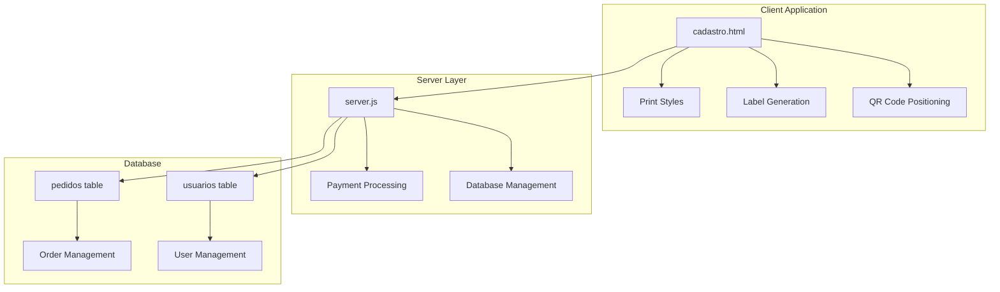
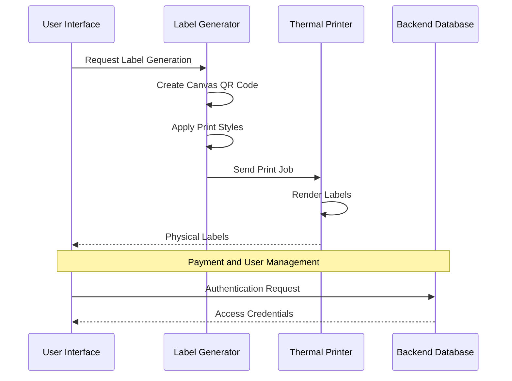
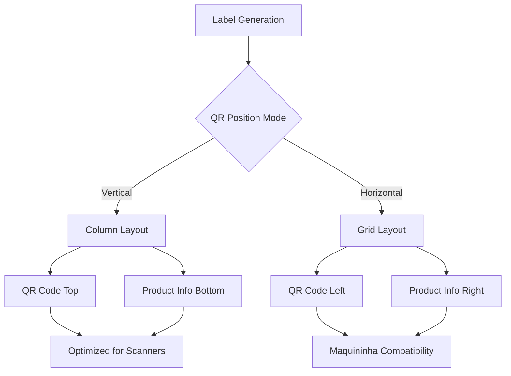
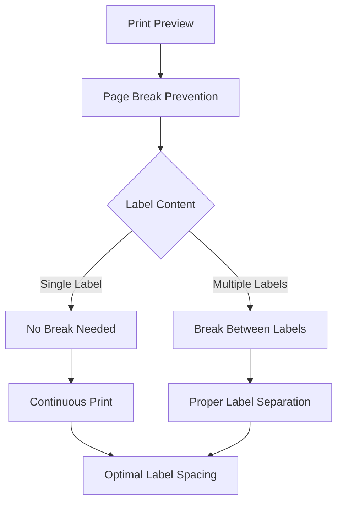
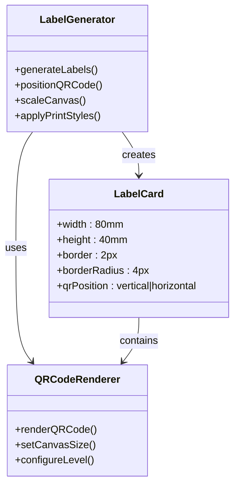
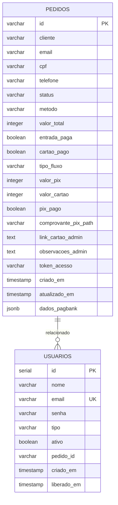
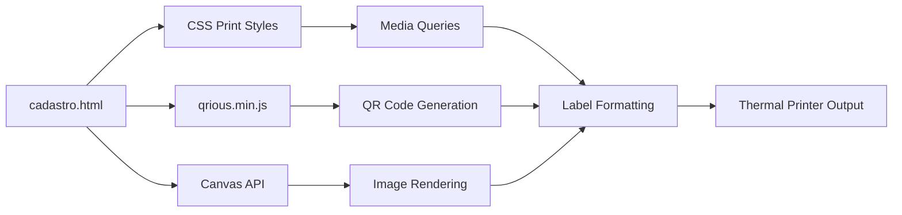

# Print Optimization and Layout

<cite>
**Referenced Files in This Document**
- [cadastro.html](file://cadastro.html)
- [server.js](file://server.js)
- [database.sql](file://database.sql)
- [init-db.sql](file://init-db.sql)
- [migration-manual.sql](file://migration-manual.sql)
</cite>

## Table of Contents
1. [Introduction](#introduction)
2. [Project Structure](#project-structure)
3. [Core Components](#core-components)
4. [Architecture Overview](#architecture-overview)
5. [Detailed Component Analysis](#detailed-component-analysis)
6. [Dependency Analysis](#dependency-analysis)
7. [Performance Considerations](#performance-considerations)
8. [Troubleshooting Guide](#troubleshooting-guide)
9. [Conclusion](#conclusion)

## Introduction

This document provides comprehensive guidance for print optimization and label layout design for the QRetiquetas.com system. It focuses on CSS media queries and print styles that ensure proper label formatting for physical printing, covering label dimensions, scaling factors, resolution requirements, responsive design principles, page break handling, and label spacing optimization.

The system generates printable labels with QR codes designed for thermal printers commonly used in retail environments. The implementation includes both vertical and horizontal QR code positioning options to accommodate different printer configurations and scanning requirements.

## Project Structure

The print optimization functionality is primarily implemented in the client-side HTML/CSS/JavaScript application:

**Diagram sources**
- [cadastro.html:409-487](file://cadastro.html#L409-L487)
- [server.js:12-27](file://server.js#L12-L27)
- [database.sql:13-58](file://database.sql#L13-L58)

**Section sources**
- [cadastro.html:1-1462](file://cadastro.html#L1-L1462)
- [server.js:1-914](file://server.js#L1-L914)
- [database.sql:1-92](file://database.sql#L1-L92)

## Core Components

### Print Media Queries and Styles

The system implements comprehensive print optimization through CSS media queries targeting the `@media print` directive. The print styles ensure labels are properly formatted for thermal printers with specific dimension requirements.

Key print style characteristics include:
- Fixed label dimensions (80mm × 40mm)
- Consistent spacing and margins
- Optimized typography for small print areas
- QR code scaling appropriate for thermal printing
- Page break prevention within labels

### Label Generation Engine

The label generation system creates printable content dynamically using Canvas APIs for QR code rendering. The engine supports two positioning modes:

1. **Vertical Positioning**: QR code positioned above product information
2. **Horizontal Positioning**: QR code positioned to the left of product information

### Database Integration

The backend supports payment processing and user management with database tables designed for order tracking and user authentication.

**Section sources**
- [cadastro.html:409-487](file://cadastro.html#L409-L487)
- [cadastro.html:1126-1240](file://cadastro.html#L1126-L1240)
- [server.js:82-280](file://server.js#L82-L280)
- [database.sql:13-58](file://database.sql#L13-L58)

## Architecture Overview

The print optimization system follows a client-server architecture with specialized print styling:

**Diagram sources**
- [cadastro.html:1126-1240](file://cadastro.html#L1126-L1240)
- [server.js:82-280](file://server.js#L82-L280)

## Detailed Component Analysis

### Print Styles Implementation

The print optimization relies on carefully crafted CSS media queries that override default browser styling for printing scenarios:

#### Label Dimensions and Scaling

The system defines precise label dimensions optimized for thermal printers:

| Property | Value | Units | Purpose |
|----------|-------|-------|---------|
| Width | 80 | mm | Standard thermal label width |
| Height | 40 | mm | Standard thermal label height |
| Border | 2 | px | Visible border for alignment |
| Border Radius | 4 | px | Rounded corners for professional appearance |

#### Responsive Design Principles

The print layout adapts to different label orientations:

**Diagram sources**
- [cadastro.html:236-308](file://cadastro.html#L236-L308)
- [cadastro.html:433-476](file://cadastro.html#L433-L476)

#### Typography Optimization

Font sizing is optimized for thermal printing with different scales for each orientation:

| Element | Vertical Size | Horizontal Size | Purpose |
|---------|---------------|-----------------|---------|
| Product Name | 14px | 10px | Primary identification |
| Lot Number | 24px | 16px | Batch identification |
| Expiration | 24px | 14px | Date compliance |
| Price | 24px | 18px | Commercial display |
| Additional Info | 11px | 9px | Supporting details |

#### Page Break Handling

The print system implements strategic page break controls:

**Diagram sources**
- [cadastro.html:232-235](file://cadastro.html#L232-L235)
- [cadastro.html:427-428](file://cadastro.html#L427-L428)

### Label Generation and Rendering

The label generation system creates dynamic content with embedded QR codes:

#### QR Code Positioning Options

The system supports two primary QR code positioning strategies:

1. **Vertical Positioning (Default)**: QR code appears above product information, ideal for standard thermal printers
2. **Horizontal Positioning**: QR code appears to the left of product information, optimized for maquininha (payment terminal) scanning

#### Automatic Label Sizing

The system automatically adjusts label dimensions based on content requirements while maintaining print compatibility:

**Diagram sources**
- [cadastro.html:1126-1240](file://cadastro.html#L1126-L1240)
- [cadastro.html:1220-1235](file://cadastro.html#L1220-L1235)

#### Resolution Requirements

For optimal thermal printing quality, the system maintains specific resolution targets:

| Component | Target Resolution | Quality Impact |
|-----------|-------------------|----------------|
| QR Code Canvas | 80×80 pixels | Standard thermal printing |
| Horizontal Layout | 70×70 pixels | Maquininha scanning |
| Text Rendering | 300 DPI | Readable labels |
| Graphics | 150 DPI | Clear branding |

**Section sources**
- [cadastro.html:409-487](file://cadastro.html#L409-L487)
- [cadastro.html:1126-1240](file://cadastro.html#L1126-L1240)
- [cadastro.html:1220-1235](file://cadastro.html#L1220-L1235)

### Database Schema for Print Management

The database schema supports order tracking and user management for the print system:

**Diagram sources**
- [database.sql:13-58](file://database.sql#L13-L58)
- [init-db.sql:4-30](file://init-db.sql#L4-L30)

**Section sources**
- [database.sql:13-58](file://database.sql#L13-L58)
- [init-db.sql:4-30](file://init-db.sql#L4-L30)
- [migration-manual.sql:9-28](file://migration-manual.sql#L9-L28)

## Dependency Analysis

The print optimization system has minimal external dependencies focused on QR code generation:

**Diagram sources**
- [cadastro.html:7](file://cadastro.html#L7)
- [cadastro.html:409-487](file://cadastro.html#L409-L487)

The system's dependencies are intentionally lightweight to ensure reliable printing across different environments and printer types.

**Section sources**
- [cadastro.html:7](file://cadastro.html#L7)
- [cadastro.html:409-487](file://cadastro.html#L409-L487)

## Performance Considerations

### Print Queue Optimization

The system minimizes print job complexity through:
- Static canvas sizing for predictable memory usage
- Efficient CSS media query application
- Minimal DOM manipulation during print operations

### Memory Management

Canvas-based QR code generation requires careful memory management:
- QR codes are generated asynchronously to prevent UI blocking
- Canvas elements are properly sized to match thermal printer capabilities
- Memory cleanup prevents accumulation during batch printing

### Browser Compatibility

The print optimization maintains compatibility across modern browsers through:
- Standard CSS media query support
- Cross-browser Canvas API compatibility
- Progressive enhancement for older browsers

## Troubleshooting Guide

### Common Printing Issues

#### Issue: Labels Too Small
**Symptoms**: Text and QR codes appear tiny on printed labels
**Solution**: Verify print scaling settings in browser print dialog
**Configuration**: Ensure "Shrink to Fit" is disabled in print options

#### Issue: QR Code Not Scanning
**Symptoms**: Payment terminals cannot read QR codes
**Solution**: Switch QR positioning to horizontal mode
**Configuration**: Update QR position preference in admin settings

#### Issue: Inconsistent Label Alignment
**Symptoms**: Labels misalign or overlap on print
**Solution**: Check printer paper settings and margins
**Configuration**: Verify label dimensions match printer specifications

#### Issue: Color Printing Problems
**Symptoms**: Labels print with unexpected colors
**Solution**: Use grayscale printing mode
**Configuration**: Disable color printing in printer settings

### Quality Assurance Measures

#### Print Testing Protocol
1. **Initial Test**: Print single label with known data
2. **Batch Test**: Print multiple labels in sequence
3. **Scanner Test**: Verify QR code readability with payment terminal
4. **Durability Test**: Check label adhesion and legibility after handling

#### Resolution Verification
- **Minimum Resolution**: 300 DPI for optimal QR code scanning
- **Text Clarity**: 10-point font minimum for readability
- **Color Contrast**: High contrast between text and background

#### Compatibility Testing
- **Printer Types**: Thermal printers, laser printers
- **Paper Sizes**: 1.57" × 1.18" (40mm × 80mm) standard
- **Operating Systems**: Windows, macOS, Linux
- **Browser Support**: Chrome, Firefox, Safari, Edge

**Section sources**
- [cadastro.html:1332-1340](file://cadastro.html#L1332-L1340)
- [server.js:82-280](file://server.js#L82-L280)

## Conclusion

The QRetiquetas.com print optimization system provides comprehensive label formatting solutions for thermal printing environments. Through carefully crafted CSS media queries, flexible QR code positioning, and robust database integration, the system ensures reliable, high-quality label production for retail and commercial applications.

Key strengths include:
- **Precision**: Fixed 80mm × 40mm label dimensions optimized for thermal printers
- **Flexibility**: Dual QR code positioning modes for different scanning requirements
- **Reliability**: Minimal dependencies and cross-platform compatibility
- **Scalability**: Efficient canvas-based QR code generation for batch processing

The system's architecture supports both standard thermal printers and specialized payment terminal scanners, making it suitable for diverse retail environments. Regular testing and maintenance ensure continued reliability in production environments.

Future enhancements could include customizable label templates, advanced print queue management, and expanded printer driver support for specialized thermal label printers.