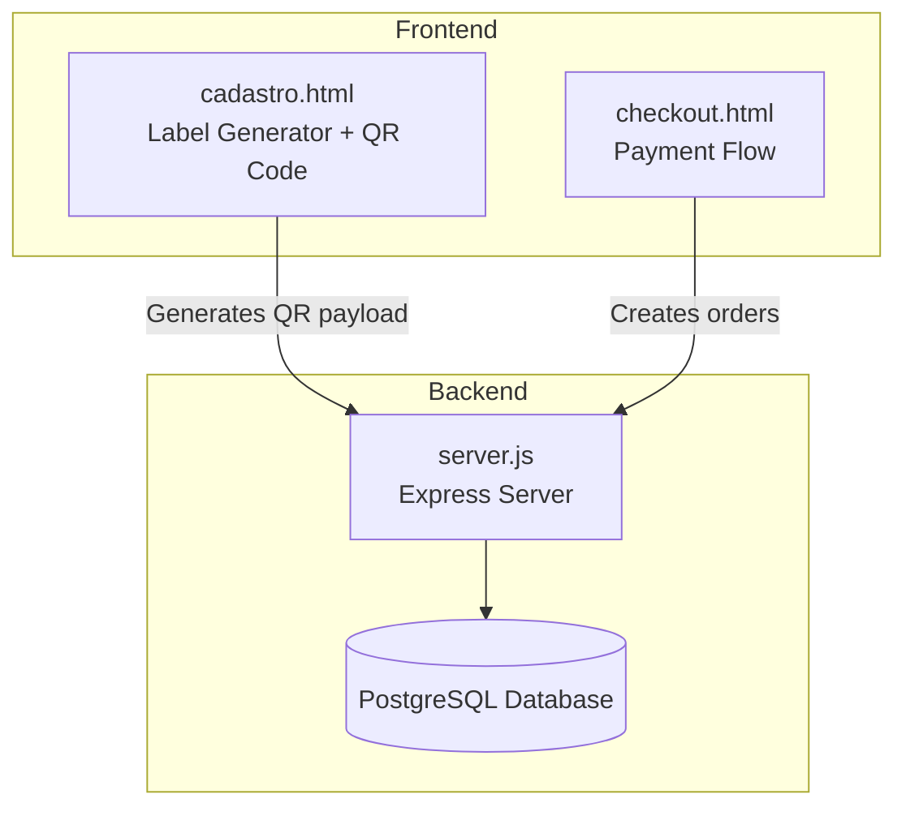
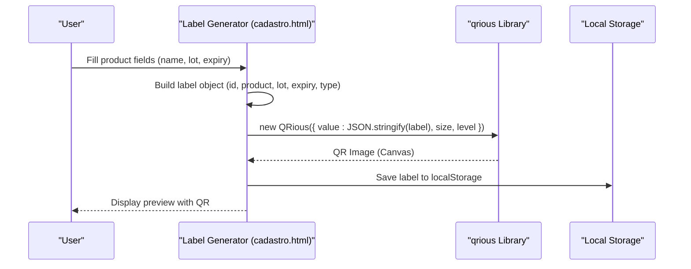
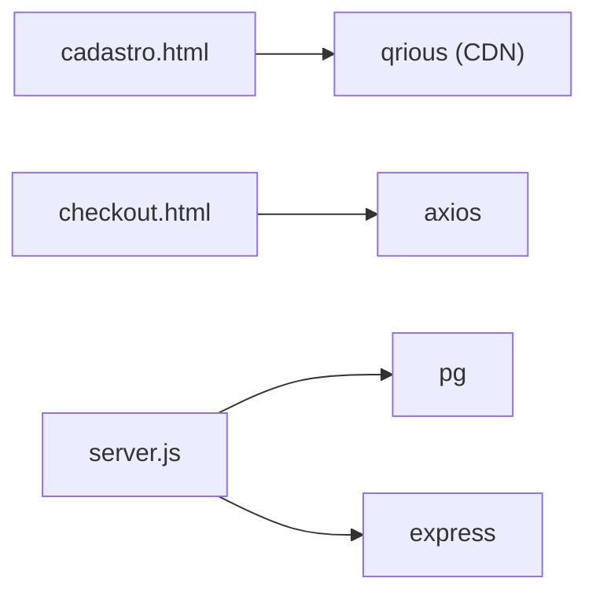

# QR Code Data Encoding

<cite>
**Referenced Files in This Document**
- [server.js](file://server.js)
- [cadastro.html](file://cadastro.html)
- [checkout.html](file://checkout.html)
- [database.sql](file://database.sql)
- [init-db.sql](file://init-db.sql)
- [package.json](file://package.json)
- [etiquetas.json](file://dados/etiquetas.json)
</cite>

## Table of Contents
1. [Introduction](#introduction)
2. [Project Structure](#project-structure)
3. [Core Components](#core-components)
4. [Architecture Overview](#architecture-overview)
5. [Detailed Component Analysis](#detailed-component-analysis)
6. [Dependency Analysis](#dependency-analysis)
7. [Performance Considerations](#performance-considerations)
8. [Troubleshooting Guide](#troubleshooting-guide)
9. [Conclusion](#conclusion)

## Introduction
This document explains how QR code data is encoded and structured for product labeling within the system. It covers the payload format, ID generation, product information encoding, batch numbers, expiration dates, and fields for external labels such as weight, ingredients, manufacturer, and pricing. It also documents the data serialization process, field mapping, encoding standards, examples of QR code content structure, validation rules, error correction capabilities, integration with the qrious library, QR generation parameters, and barcode scanning compatibility. Finally, it clarifies how the encoded data supports both internal inventory tracking and external commercial information retrieval.

## Project Structure
The QR code functionality is implemented in the frontend label generator and integrated with backend payment flows. The key components are:
- Frontend label generator (HTML + JavaScript) that creates QR codes using the qrious library
- Backend server that handles payment flows and exposes administrative endpoints
- Database schema supporting order and user data
- Static assets and configuration files

**Diagram sources**
- [cadastro.html](file://cadastro.html)
- [checkout.html](file://checkout.html)
- [server.js](file://server.js)
- [database.sql](file://database.sql)

**Section sources**
- [cadastro.html](file://cadastro.html)
- [checkout.html](file://checkout.html)
- [server.js](file://server.js)
- [database.sql](file://database.sql)

## Core Components
- QR payload generation: The frontend constructs a JSON payload containing label metadata and passes it to the qrious library for QR rendering.
- QR rendering: The qrious library encodes the JSON payload into a QR code image with configurable error correction.
- Data persistence: The backend persists order and user data to PostgreSQL for payment-related flows.
- Local storage: Labels are stored locally in the browser for preview and history.

Key implementation references:
- QR payload construction and qrious integration
- QR rendering parameters (size, error correction level)
- Local storage of labels and configuration

**Section sources**
- [cadastro.html](file://cadastro.html)
- [etiquetas.json](file://dados/etiquetas.json)

## Architecture Overview
The QR code generation pipeline integrates frontend label creation with QR rendering and local storage. Payment flows are handled by the backend, which interacts with external payment providers and stores order data.

**Diagram sources**
- [cadastro.html](file://cadastro.html)

**Section sources**
- [cadastro.html](file://cadastro.html)

## Detailed Component Analysis

### QR Payload Format and Field Mapping
The QR payload is a JSON object containing the minimal set of fields required for label identification and basic product information. The payload structure is designed to be compact and scannable while supporting both internal and external label types.

- Required fields for QR payload:
  - id: Unique label identifier
  - produto: Product name
  - lote: Batch/lot number
  - validade: Expiration date
  - tipo: Label type (internal or external)

- Optional fields present in the label object (not all are serialized to QR):
  - peso: Weight (external labels)
  - preco: Price (external labels)
  - empresa: Company name (external labels)
  - cnpj: Company tax ID (external labels)
  - ingredientes: Ingredients list (external labels)
  - fabricante: Manufacturer (external labels)
  - createdBy, createdAt, printId: UI metadata

Field mapping and serialization:
- The QR payload is constructed from the label object and serialized using JSON.stringify before being passed to qrious.
- Only the core fields (id, produto, lote, validade, tipo) are included in the QR payload to keep the QR compact and scannable.
- Additional fields (peso, preco, empresa, cnpj, ingredientes, fabricante) are used for UI display and printing but are not part of the QR payload.

Validation rules:
- id: Generated per label creation; must be unique within the local dataset.
- produto: Non-empty string.
- lote: Non-empty string.
- validade: Valid date string.
- tipo: Enumerated value (internal or external).
- Optional fields: Only used for display and printing; not validated for QR payload.

Example payload structure (paths only):
- [QR payload construction](file://cadastro.html)
- [Label object creation](file://cadastro.html)

**Section sources**
- [cadastro.html](file://cadastro.html)

### QR Code Generation Parameters and Error Correction
The qrious library is configured with:
- value: JSON string of the QR payload
- size: Pixel size of the QR canvas (70 or 80 depending on layout)
- level: Error correction level (set to "H")

Error correction capability:
- Level "H" provides high error recovery, allowing partial damage to the QR code while maintaining scannability.
- This is appropriate for printed labels that may experience wear during handling.

Integration details:
- The QR is rendered into a canvas element with id "qr-{labelId}".
- The canvas size is adjusted based on the label layout (horizontal vs vertical).

References:
- [QRious instantiation and parameters](file://cadastro.html)

**Section sources**
- [cadastro.html](file://cadastro.html)

### Data Serialization and Encoding Standards
- Serialization: The QR payload is serialized using JSON.stringify to produce a UTF-8 byte stream.
- Encoding: QR codes are inherently binary-capable; JSON serialization ensures consistent representation across devices and scanners.
- Character set: UTF-8 is widely supported by QR decoders, ensuring reliable decoding.

References:
- [JSON serialization in QR payload](file://cadastro.html)

**Section sources**
- [cadastro.html](file://cadastro.html)

### Barcode Scanning Compatibility
- QR code format: Standard QR code with UTF-8 payload.
- Scanners: Compatible with standard QR scanners and mobile apps.
- Error correction: Level "H" improves robustness against smudges and partial damage typical in printed environments.

References:
- [QRious configuration (level "H")](file://cadastro.html)

**Section sources**
- [cadastro.html](file://cadastro.html)

### Internal Inventory Tracking vs External Commercial Information
- Internal labels (tipo: internal):
  - Focus: Unique identification, batch tracking, expiration monitoring.
  - QR payload: id, produto, lote, validade, tipo.
  - UI: Minimal display; QR carries essential inventory data.

- External labels (tipo: external):
  - Focus: Commercial presentation with pricing and company information.
  - UI: Includes price, weight, company name, CNPJ, ingredients, manufacturer.
  - QR payload: Same core fields as internal labels to maintain traceability while keeping QR compact.

References:
- [Label type selection and QR payload](file://cadastro.html)

**Section sources**
- [cadastro.html](file://cadastro.html)

### Backend Integration and Data Persistence
While QR payload generation occurs in the frontend, the backend manages payment-related data and user access. The QR payload itself is not persisted by the backend; however, the system maintains order and user data for payment flows.

- Order creation and QR code URLs:
  - The backend communicates with a payment provider and returns QR code URLs and payment links.
  - These are used for payment initiation and verification.

- Administrative endpoints:
  - The backend exposes endpoints for order listing, status checking, and administrative sessions.

References:
- [Payment endpoint and QR code URL handling](file://server.js)
- [Order schema and indices](file://database.sql)
- [Initial database schema](file://init-db.sql)

**Section sources**
- [server.js](file://server.js)
- [database.sql](file://database.sql)
- [init-db.sql](file://init-db.sql)

### Local Storage and Label History
Labels generated in the frontend are stored in the browser's localStorage under keys:
- alimentares_labels: Stores the array of label objects
- alimentares_config: Stores UI configuration (e.g., QR position)
- alimentares_users: Stores user accounts

References:
- [LocalStorage usage for labels and config](file://cadastro.html)
- [Default labels configuration](file://dados/etiquetas.json)

**Section sources**
- [cadastro.html](file://cadastro.html)
- [etiquetas.json](file://dados/etiquetas.json)

## Dependency Analysis
External dependencies relevant to QR code functionality:
- qrious: QR code generation library loaded from CDN
- axios: HTTP client used by the checkout flow for payment requests
- pg: PostgreSQL client for database operations
- express: Web framework for backend endpoints

**Diagram sources**
- [cadastro.html](file://cadastro.html)
- [checkout.html](file://checkout.html)
- [server.js](file://server.js)
- [package.json](file://package.json)

**Section sources**
- [package.json](file://package.json)
- [server.js](file://server.js)

## Performance Considerations
- QR payload size: Keep the QR payload minimal (core fields only) to reduce scanning time and improve reliability.
- Canvas size: Adjust size based on label layout to balance readability and print space.
- Error correction: Level "H" provides good durability but slightly increases QR size; acceptable trade-off for printed labels.
- Local storage: Limit the number of stored labels to avoid bloating localStorage; consider pruning older entries.

## Troubleshooting Guide
Common issues and resolutions:
- QR not scanning:
  - Verify error correction level is set to "H".
  - Ensure the payload is a valid JSON string.
  - Check canvas size and contrast for print quality.

- Payload missing fields:
  - Confirm that only the core fields (id, produto, lote, validade, tipo) are included in the QR payload.
  - Optional fields (peso, preco, empresa, cnpj, ingredientes, fabricante) are for UI display only.

- Layout positioning:
  - Adjust QR position (vertical/horizontal) via configuration saved in localStorage.

- Payment QR code issues:
  - Backend returns fallback QR code URLs; ensure network connectivity and CORS configuration.

**Section sources**
- [cadastro.html](file://cadastro.html)
- [server.js](file://server.js)

## Conclusion
The QR code payload is intentionally minimal to ensure fast scanning and broad compatibility while preserving essential product and batch information. The system balances internal inventory needs with external commercial presentation by keeping the QR compact and using optional fields for UI display. Integration with qrious provides robust error correction and flexible rendering, while local storage enables efficient label preview and history. Backend integration supports payment flows and administrative controls, complementing the QR-based labeling system.