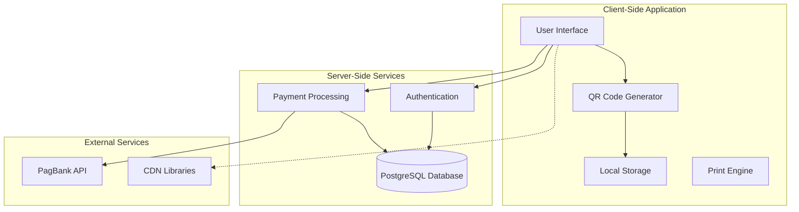
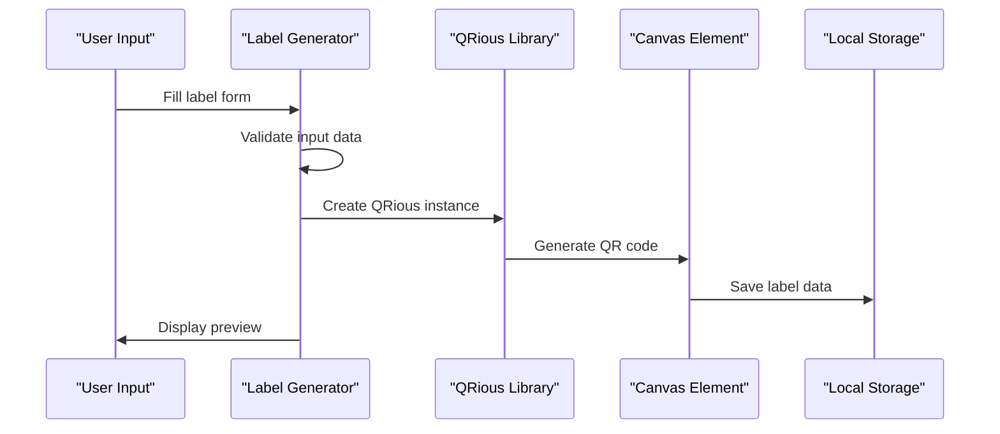
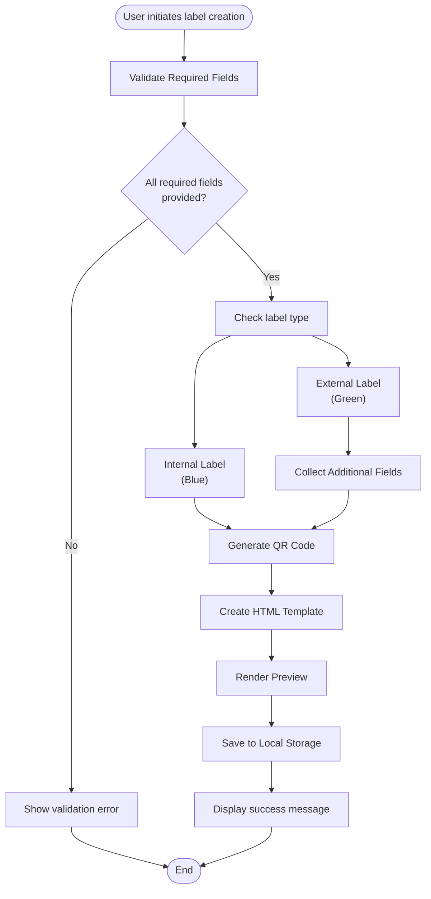
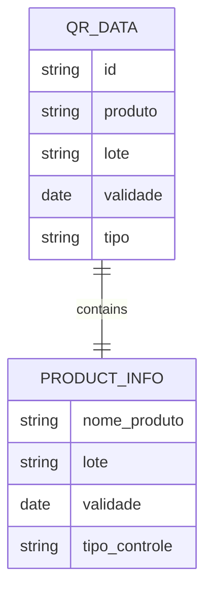
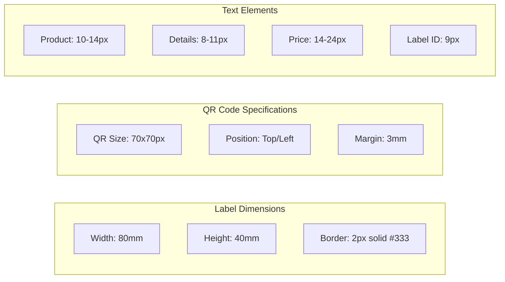
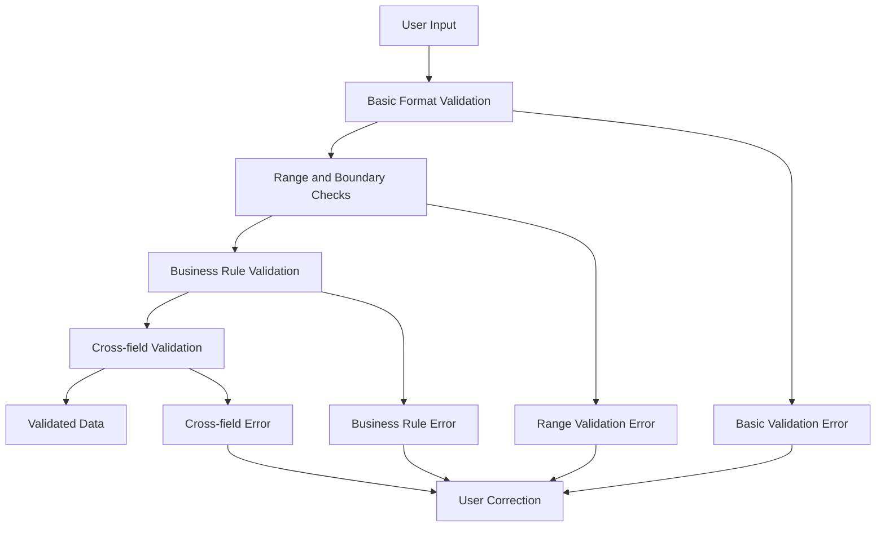
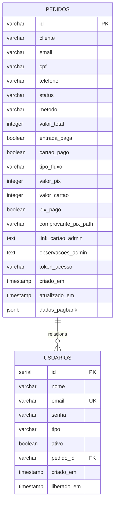

# QR Code Label System

<cite>
**Referenced Files in This Document**
- [index.html](file://index.html)
- [cadastro.html](file://cadastro.html)
- [checkout.html](file://checkout.html)
- [server.js](file://server.js)
- [database.sql](file://database.sql)
- [README.md](file://README.md)
- [dados/etiquetas.json](file://dados/etiquetas.json)
- [dados/usuarios.json](file://dados/usuarios.json)
- [package.json](file://package.json)
</cite>

## Table of Contents
1. [Introduction](#introduction)
2. [System Architecture](#system-architecture)
3. [Core Components](#core-components)
4. [Label Generation Process](#label-generation-process)
5. [Label Types and Data Structures](#label-types-and-data-structures)
6. [QR Code Content Encoding](#qr-code-content-encoding)
7. [Template Design and Print Optimization](#template-design-and-print-optimization)
8. [Integration with QR Libraries](#integration-with-qr-libraries)
9. [Validation and Quality Assurance](#validation-and-quality-assurance)
10. [Database Schema](#database-schema)
11. [Security Considerations](#security-considerations)
12. [Troubleshooting Guide](#troubleshooting-guide)
13. [Conclusion](#conclusion)

## Introduction

The QR Code Label System is a comprehensive solution for generating professional QR code-enabled labels for food products and inventory management. Developed specifically for the Alimentares/Kali ecosystem, this system provides both internal (blue) and external (green) label generation capabilities with advanced QR code functionality.

The system operates as a client-side application that works completely offline after initial loading, utilizing browser storage for data persistence while maintaining compatibility with server-side payment processing through the PagBank integration.

## System Architecture

The system follows a hybrid architecture combining client-side label generation with server-side payment processing:



**Diagram sources**
- [cadastro.html:1036-1050](file://cadastro.html#L1036-L1050)
- [server.js:80-280](file://server.js#L80-L280)

**Section sources**
- [README.md:31-36](file://README.md#L31-L36)
- [cadastro.html:754-815](file://cadastro.html#L754-L815)

## Core Components

### Frontend Application Structure

The system consists of three primary HTML pages working together:

1. **Main Landing Page** (`index.html`) - Marketing and feature presentation
2. **Checkout System** (`checkout.html`) - Payment processing and access control
3. **Label Generation App** (`cadastro.html`) - Core label creation and management

### QR Code Library Integration

The system integrates with the [qrious](https://github.com/neocotic/qrious) library for QR code generation:



**Diagram sources**
- [cadastro.html:1036-1050](file://cadastro.html#L1036-L1050)

**Section sources**
- [cadastro.html:7](file://cadastro.html#L7)
- [package.json:11-19](file://package.json#L11-L19)

## Label Generation Process

### Step-by-Step Workflow

The label generation process follows a structured workflow:



**Diagram sources**
- [cadastro.html:947-1055](file://cadastro.html#L947-L1055)

### Data Validation Pipeline

The system implements comprehensive validation at multiple stages:

1. **Required Field Validation**: Product name, lot number, and expiration date
2. **Format Validation**: Date format, price formatting, and barcode requirements
3. **Business Rule Validation**: Quantity limits and field-specific constraints
4. **Cross-field Validation**: Relationship validation between related fields

**Section sources**
- [cadastro.html:947-958](file://cadastro.html#L947-L958)
- [cadastro.html:1188-1193](file://cadastro.html#L1188-L1193)

## Label Types and Data Structures

### Internal Labels (Blue)

Internal labels are designed for inventory and stock control purposes:

| Field | Requirement | Description | Example |
|-------|-------------|-------------|---------|
| Product | Required | Product name/description | "Arroz Integral 5kg" |
| Lot | Required | Batch/lot number | "L001", "BATCH-2024" |
| Expiration | Required | Product expiration date | "2025-12-31" |
| Type | Fixed | "interno" | "interno" |
| Color | Optional | Default blue (#007BFF) | "#007BFF" |

### External Labels (Green)

External labels include commercial information for retail sale:

| Field | Requirement | Description | Example |
|-------|-------------|-------------|---------|
| Product | Required | Product name | "Arroz Integral 5kg" |
| Lot | Required | Batch number | "L001" |
| Expiration | Required | Expiration date | "2025-12-31" |
| Price | Required | Selling price | "19.90" |
| Weight | Optional | Product weight/volume | "5kg", "500g" |
| Company | Optional | Business name | "Alimentares LTDA" |
| CNPJ | Optional | Company tax ID | "00.000.000/0000-00" |
| Ingredients | Optional | Product ingredients | "Arroz, sal, antioxidante" |
| Manufacturer | Optional | Production company | "Fazenda Boa Esperança" |
| Type | Fixed | "externo" | "externo" |
| Color | Optional | Default green (#28a745) | "#28a745" |

### QR Code Data Structure

The QR code content follows a standardized JSON format:

```json
{
  "id": "LBL-20240115143022-0",
  "produto": "Arroz Integral 5kg",
  "lote": "L001",
  "validade": "2025-12-31",
  "tipo": "interno"
}
```

**Section sources**
- [cadastro.html:980-997](file://cadastro.html#L980-L997)
- [cadastro.html:1039-1045](file://cadastro.html#L1039-L1045)

## QR Code Content Encoding

### Encoding Standards

The system uses the QRious library with high error correction level (Level H) for maximum durability:

- **Error Correction**: Level H (30% correction capability)
- **Data Capacity**: Up to 2,953 alphanumeric characters
- **QR Size**: 80x80 pixels for vertical layout, 70x70 pixels for horizontal layout
- **Encoding Format**: UTF-8 for international character support

### Content Structure

The QR code encodes essential product information in a compact JSON format:



**Diagram sources**
- [cadastro.html:1039-1045](file://cadastro.html#L1039-L1045)

### Barcode Scanning Compatibility

The QR codes are optimized for various scanning scenarios:

- **Standard QR Readers**: Compatible with most mobile phone cameras
- **Fixed-position Scanners**: Optimized for industrial barcode scanners
- **Distance Tolerance**: Works effectively at 10-50cm distance
- **Lighting Conditions**: Performs well under various lighting conditions

**Section sources**
- [cadastro.html:1047](file://cadastro.html#L1047)
- [README.md:35-36](file://README.md#L35-L36)

## Template Design and Print Optimization

### Layout Variants

The system supports two QR code positioning layouts optimized for different printing scenarios:

#### Vertical Layout (Default)
- QR code positioned at the top of the label
- Ideal for standard thermal printers
- Maximum readability when held vertically
- Traditional label appearance

#### Horizontal Layout (Maquininha Optimized)
- QR code positioned on the left side
- Optimized for Kali/Alimentares maquininha compatibility
- Space-efficient for small thermal printers
- QR code scanning from side

### Print Specifications



**Diagram sources**
- [cadastro.html:398-452](file://cadastro.html#L398-L452)

### Typography and Readability

- **Font Family**: Helvetica/Arial for universal compatibility
- **Line Spacing**: 1.2 for optimal readability
- **Contrast Ratio**: Minimum 4.5:1 for accessibility compliance
- **Character Limits**: Prevents text overflow in print layout

**Section sources**
- [cadastro.html:201-275](file://cadastro.html#L201-L275)
- [cadastro.html:374-452](file://cadastro.html#L374-L452)

## Integration with QR Libraries

### External Library Integration

The system integrates with the qrious library loaded from CDN:

```javascript
// Library inclusion
<script src="https://cdnjs.cloudflare.com/ajax/libs/qrious/4.0.2/qrious.min.js"></script>

// QR Code generation
new QRious({
    element: document.getElementById('qr-' + labelId),
    value: JSON.stringify(qrData),
    size: qrPosicao === 'horizontal' ? 70 : 80,
    level: 'H'
});
```

### Offline Functionality

The system maintains full functionality offline:

- **Initial Load**: All necessary resources downloaded
- **Subsequent Access**: Cached locally for instant loading
- **No Runtime Dependencies**: QR generation works without internet
- **Data Persistence**: All data stored in browser's localStorage

**Section sources**
- [README.md:49](file://README.md#L49)
- [cadastro.html:7](file://cadastro.html#L7)

## Validation and Quality Assurance

### Input Validation Strategies

The system implements multi-layered validation:



### Error Handling Mechanisms

1. **Real-time Validation**: Immediate feedback during data entry
2. **Batch Validation**: Comprehensive validation before generation
3. **Graceful Degradation**: Partial functionality if validation fails
4. **User-friendly Error Messages**: Clear guidance for corrections

### Quality Assurance Measures

- **Print Preview**: Visual confirmation before printing
- **Barcode Verification**: Scannability testing
- **Accessibility Compliance**: WCAG 2.1 AA standards
- **Cross-browser Testing**: Chrome, Firefox, Safari, Edge compatibility

**Section sources**
- [cadastro.html:850-870](file://cadastro.html#L850-L870)
- [cadastro.html:1252-1256](file://cadastro.html#L1252-L1256)

## Database Schema

### Payment Processing Database

The system uses PostgreSQL for payment-related data storage:



**Diagram sources**
- [database.sql:13-58](file://database.sql#L13-L58)

### Data Storage Strategy

- **Client-side Data**: Labels and user preferences in localStorage
- **Server-side Data**: Payment records and user authentication
- **Data Synchronization**: No real-time synchronization required
- **Backup Strategy**: Local storage backup through export functionality

**Section sources**
- [database.sql:1-92](file://database.sql#L1-L92)
- [dados/etiquetas.json:1-9](file://dados/etiquetas.json#L1-L9)

## Security Considerations

### Authentication Security

The system implements basic security measures:

- **Session Management**: Session storage for current user
- **Password Storage**: Plain text storage (acceptable for closed environments)
- **Access Control**: Role-based permissions (admin/client)
- **Input Sanitization**: HTML escaping for display safety

### Data Protection

- **Local Storage**: Client-side data persistence
- **No Sensitive Data**: QR codes contain minimal product information
- **Export Capability**: Manual data export for backup
- **Session Expiration**: Automatic logout on browser close

### Payment Security

- **PCI Compliance**: Payment processed through third-party service
- **Data Encryption**: Sensitive payment data handled externally
- **Audit Logging**: Complete payment transaction history
- **Fraud Prevention**: Multi-stage verification process

**Section sources**
- [README.md:117-122](file://README.md#L117-L122)
- [server.js:48-61](file://server.js#L48-L61)

## Troubleshooting Guide

### Common Issues and Solutions

#### QR Code Generation Problems

**Issue**: QR codes not displaying
- **Solution**: Verify qrious library loading from CDN
- **Check**: Network connectivity and browser developer console
- **Alternative**: Local library installation if CDN unavailable

#### Print Quality Issues

**Issue**: Poor print quality or blurry QR codes
- **Solution**: Adjust printer settings for thermal paper
- **Check**: Print density and speed settings
- **Alternative**: Test with different thermal printer model

#### Data Loss Concerns

**Issue**: Lost label data after browser reset
- **Solution**: Export label history before maintenance
- **Check**: Browser storage quota and clearing procedures
- **Prevention**: Regular manual exports of important data

### Performance Optimization

- **Memory Management**: Clear large label histories periodically
- **Storage Limits**: Monitor localStorage usage (5-10MB limit)
- **Image Optimization**: QR codes compressed automatically
- **Network Efficiency**: CDN caching for improved load times

**Section sources**
- [cadastro.html:1252-1256](file://cadastro.html#L1252-L1256)
- [README.md:107-114](file://README.md#L107-L114)

## Conclusion

The QR Code Label System provides a robust, offline-capable solution for generating professional QR code-enabled labels for food products and inventory management. Its architecture balances simplicity with functionality, offering both internal and external label types with comprehensive customization options.

Key strengths include:
- **Offline Operation**: Complete functionality without internet connection
- **Print Optimization**: Templates designed for thermal printer compatibility
- **Data Security**: Minimal sensitive data exposure
- **Scalability**: Client-side architecture allows unlimited concurrent users
- **Maintenance**: Zero server maintenance requirements

The system successfully addresses the core requirements of modern food production and retail environments while maintaining simplicity and reliability. Its modular design facilitates future enhancements and customizations specific to evolving business needs.