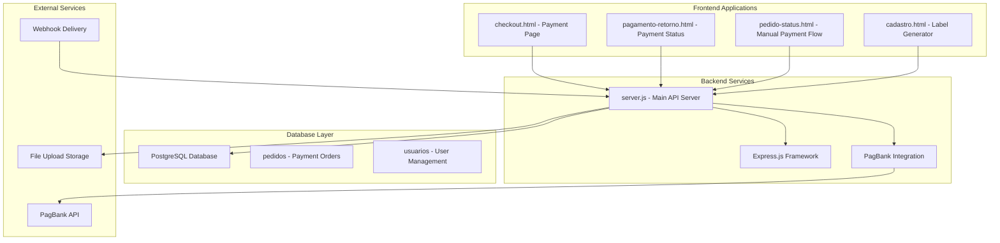
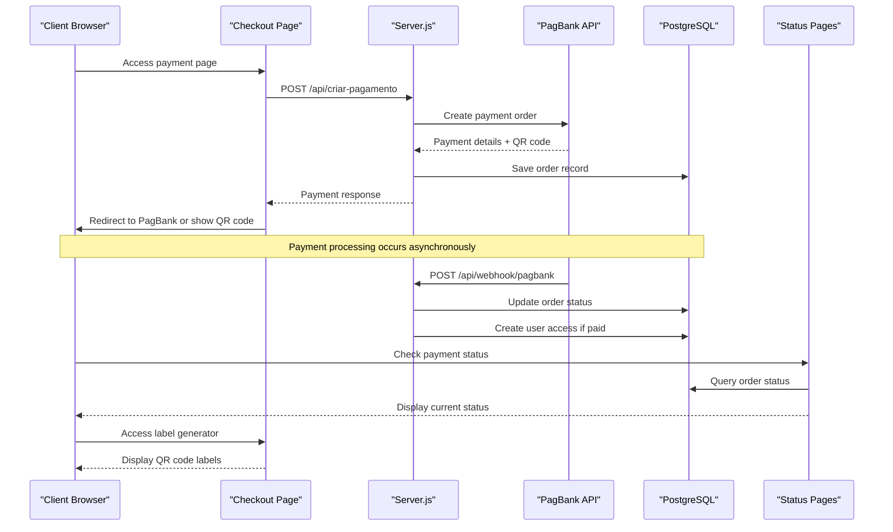
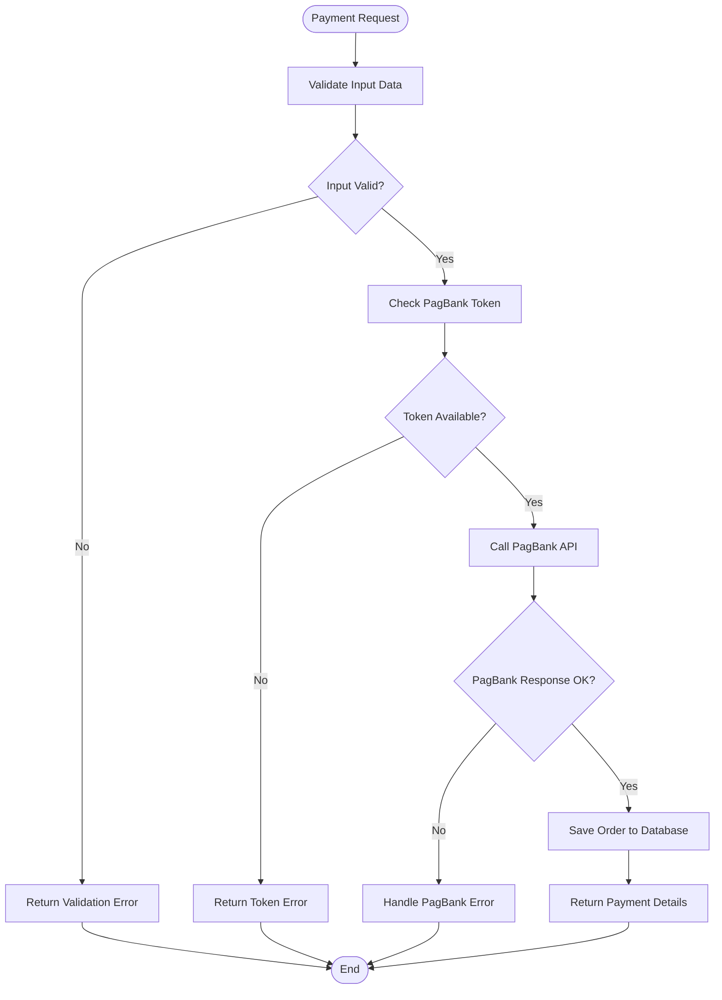
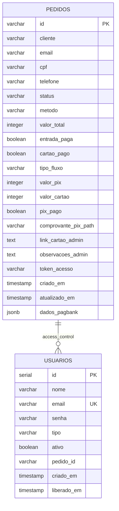
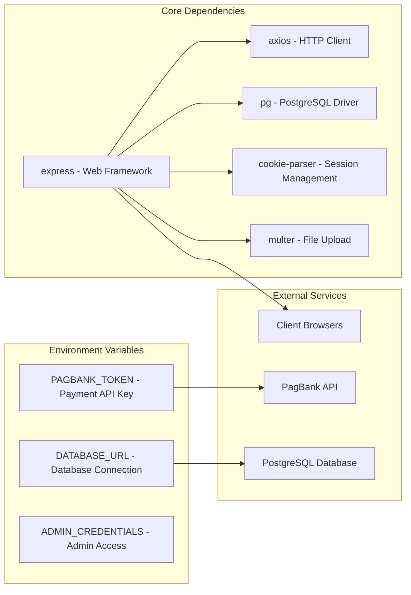

# Troubleshooting & Support

<cite>
**Referenced Files in This Document**
- [server.js](file://server.js)
- [package.json](file://package.json)
- [README.md](file://README.md)
- [PAGAMENTO-README.md](file://PAGAMENTO-README.md)
- [init-db.sql](file://init-db.sql)
- [database.sql](file://database.sql)
- [checkout.html](file://checkout.html)
- [pagamento-retorno.html](file://pagamento-retorno.html)
- [pedido-status.html](file://pedido-status.html)
- [cadastro.html](file://cadastro.html)
</cite>

## Table of Contents
1. [Introduction](#introduction)
2. [Project Structure](#project-structure)
3. [Core Components](#core-components)
4. [Architecture Overview](#architecture-overview)
5. [Detailed Component Analysis](#detailed-component-analysis)
6. [Dependency Analysis](#dependency-analysis)
7. [Performance Considerations](#performance-considerations)
8. [Troubleshooting Guide](#troubleshooting-guide)
9. [Security Incidents](#security-incidents)
10. [Escalation Procedures](#escalation-procedures)
11. [Conclusion](#conclusion)

## Introduction

This comprehensive troubleshooting guide addresses common issues across all system components of the QR Labels payment and management system. The system consists of a Node.js backend with PostgreSQL database, integrated with PagBank payment processing, and client-side applications for label generation and payment workflows.

The guide covers payment processing problems, database connectivity issues, frontend troubleshooting, server-side problems, debugging techniques, performance optimization, security incidents, and escalation procedures.

## Project Structure

The system follows a modular architecture with clear separation between payment processing, database management, and frontend applications:

**Diagram sources**
- [server.js:1-890](file://server.js#L1-L890)
- [checkout.html:1-768](file://checkout.html#L1-L768)
- [database.sql:1-92](file://database.sql#L1-L92)

**Section sources**
- [server.js:1-890](file://server.js#L1-L890)
- [package.json:1-24](file://package.json#L1-L24)

## Core Components

### Payment Processing Engine
The system integrates with PagBank for payment processing through two primary flows:
- **Automated Flow**: Direct PagBank integration with QR code generation
- **Manual Flow**: Customer-defined split between PIX and card payments

### Database Management
PostgreSQL serves as the central data store with two main tables:
- **pedidos**: Payment orders and transaction tracking
- **usuarios**: User authentication and access management

### Frontend Applications
Multiple client-side applications handle different aspects:
- **Checkout**: Payment initiation and processing
- **Status Pages**: Real-time payment status monitoring
- **Label Generator**: QR code label creation and printing

**Section sources**
- [server.js:47-67](file://server.js#L47-L67)
- [database.sql:13-36](file://database.sql#L13-L36)
- [checkout.html:510-768](file://checkout.html#L510-L768)

## Architecture Overview

The system operates on a client-server model with asynchronous payment processing:

**Diagram sources**
- [server.js:82-280](file://server.js#L82-L280)
- [server.js:285-345](file://server.js#L285-L345)
- [checkout.html:626-718](file://checkout.html#L626-L718)

## Detailed Component Analysis

### Payment Processing Component

The payment system handles three distinct payment methods with robust error handling:

#### Automated Payment Flow
- **Endpoint**: `/api/criar-pagamento`
- **Features**: Direct PagBank integration, automatic QR code generation
- **Error Handling**: Comprehensive logging with specific error messages

#### Manual Payment Flow
- **Endpoint**: `/api/manual/criar-pedido`
- **Features**: Customer-defined payment split between PIX and card
- **Upload Handling**: Secure file upload for PIX proof of payment

#### Webhook Processing
- **Endpoint**: `/api/webhook/pagbank`
- **Features**: Real-time payment status updates, automatic access provisioning

**Diagram sources**
- [server.js:82-280](file://server.js#L82-L280)
- [server.js:285-345](file://server.js#L285-L345)

**Section sources**
- [server.js:82-280](file://server.js#L82-L280)
- [server.js:285-345](file://server.js#L285-L345)

### Database Management Component

The database layer manages two critical tables with proper indexing and constraints:

#### Pedidos Table Structure
- **Primary Key**: Order ID (VARCHAR)
- **Status Tracking**: Comprehensive status field with multiple states
- **Payment Split**: Separate tracking for PIX and card portions
- **Access Control**: Token-based access provisioning

#### Usuarios Table Structure
- **User Authentication**: Email-based login with password storage
- **Role Management**: Admin/client role differentiation
- **Access Control**: Active status and access timestamps

**Diagram sources**
- [database.sql:13-36](file://database.sql#L13-L36)
- [database.sql:48-58](file://database.sql#L48-L58)

**Section sources**
- [database.sql:13-36](file://database.sql#L13-L36)
- [database.sql:48-58](file://database.sql#L48-L58)

### Frontend Application Component

The frontend consists of four distinct applications with specialized functionality:

#### Checkout Application
- **Features**: Payment method selection, form validation, real-time status checking
- **QR Code Generation**: Dynamic QR code display and copy functionality
- **Error Handling**: User-friendly error messages and retry mechanisms

#### Status Monitoring Applications
- **Automatic Flow**: Real-time payment status checking every 5 seconds
- **Manual Flow**: Step-by-step payment progress with upload capabilities
- **User Experience**: Clear status indicators and actionable next steps

#### Label Generator Application
- **Features**: QR code label creation, print optimization, history management
- **Security**: Client-side data storage with session-based authentication
- **Compatibility**: Cross-browser compatibility with print optimization

**Section sources**
- [checkout.html:510-768](file://checkout.html#L510-L768)
- [pedido-status.html:138-341](file://pedido-status.html#L138-L341)
- [cadastro.html:754-1277](file://cadastro.html#L754-L1277)

## Dependency Analysis

The system relies on several key dependencies for proper operation:

**Diagram sources**
- [package.json:11-18](file://package.json#L11-L18)
- [server.js:47-61](file://server.js#L47-L61)

**Section sources**
- [package.json:11-18](file://package.json#L11-L18)
- [server.js:47-61](file://server.js#L47-L61)

## Performance Considerations

### Database Performance Optimization
- **Index Usage**: Proper indexing on frequently queried columns (email, status, token)
- **Connection Pooling**: Efficient PostgreSQL connection management
- **Query Optimization**: Minimal data transfer and efficient status updates

### Frontend Performance
- **QR Code Generation**: Optimized canvas rendering with appropriate sizing
- **Print Optimization**: Media-specific CSS for efficient printing
- **Caching Strategy**: Client-side caching for user preferences and generated labels

### Server Performance
- **Memory Management**: Proper cleanup of temporary data and connections
- **Error Handling**: Preventive measures against memory leaks
- **Logging**: Structured logging for performance monitoring

## Troubleshooting Guide

### Payment Processing Issues

#### PagBank API Errors

**Common Error Scenarios:**
- **Token Configuration Issues**: Verify PAGBANK_TOKEN environment variable
- **Network Connectivity**: Check firewall and proxy configurations
- **Rate Limiting**: Implement retry logic with exponential backoff

**Diagnostic Steps:**
1. Verify PagBank credentials in environment variables
2. Check network connectivity to PagBank API endpoints
3. Review server logs for specific error codes
4. Validate payment request format and required fields

**Resolution Strategies:**
- Update environment variables with correct credentials
- Configure proper CORS and SSL settings
- Implement retry mechanisms for transient failures
- Monitor PagBank API status and service health

#### Webhook Failures

**Symptoms:**
- Payment status not updating in system
- Inconsistent order states
- Missing user access provisioning

**Troubleshooting Process:**
1. Verify webhook URL configuration in PagBank dashboard
2. Check server webhook endpoint accessibility
3. Review webhook delivery logs and retry attempts
4. Validate webhook signature verification

**Technical Solutions:**
- Ensure HTTPS endpoint for webhook delivery
- Implement proper webhook validation and signature verification
- Add retry logic for failed webhook deliveries
- Monitor webhook delivery status and implement alerts

#### Payment Status Inconsistencies

**Common Causes:**
- Race conditions between API calls and webhooks
- Database transaction isolation issues
- Client-side caching conflicts

**Resolution Approaches:**
- Implement idempotent webhook processing
- Add database transaction rollback mechanisms
- Clear client-side caches after payment completion
- Add explicit status synchronization checks

**Section sources**
- [server.js:239-280](file://server.js#L239-L280)
- [server.js:285-345](file://server.js#L285-L345)

### Database Connectivity Issues

#### Connection Problems

**Symptoms:**
- Database connection refused errors
- Timeout during payment processing
- User access not being granted

**Diagnostic Methods:**
1. Test database connection string format
2. Verify PostgreSQL service availability
3. Check connection pool limits and timeouts
4. Monitor database performance metrics

**Solutions:**
- Validate DATABASE_URL format and credentials
- Configure proper connection pooling settings
- Implement connection retry logic
- Monitor and optimize database queries

#### Schema Migration Problems

**Common Issues:**
- Missing tables or columns after deployment
- Index creation failures
- Data type mismatches

**Migration Strategy:**
1. Run database initialization scripts
2. Verify table creation and indexing
3. Check for existing data compatibility
4. Implement version-controlled migrations

**Section sources**
- [server.js:69-77](file://server.js#L69-L77)
- [init-db.sql:1-42](file://init-db.sql#L1-L42)

### Data Persistence Failures

#### Order Record Corruption

**Symptoms:**
- Incomplete order records
- Missing payment details
- Status field inconsistencies

**Prevention Measures:**
- Implement transaction-safe order creation
- Add validation before database writes
- Monitor for concurrent access conflicts
- Backup critical data regularly

**Recovery Procedures:**
1. Restore from database backups
2. Manually recreate corrupted records
3. Verify data integrity after restoration
4. Implement monitoring for future prevention

### Frontend Troubleshooting

#### QR Code Generation Issues

**Common Problems:**
- QR codes not displaying correctly
- Print quality issues
- Browser compatibility problems

**Diagnostic Steps:**
1. Check QRious library loading
2. Verify canvas element availability
3. Test print media queries
4. Validate browser compatibility

**Solutions:**
- Ensure proper QRious library initialization
- Adjust canvas sizing for different devices
- Test print functionality across browsers
- Implement fallback QR code generation methods

#### Print Functionality Problems

**Symptoms:**
- Labels not printing correctly
- Layout issues in printed output
- Browser-specific print problems

**Troubleshooting Approach:**
1. Test print preview functionality
2. Verify CSS media queries for print
3. Check browser print dialog settings
4. Validate printer driver compatibility

**Section sources**
- [checkout.html:1036-1050](file://checkout.html#L1036-L1050)
- [cadastro.html:374-452](file://cadastro.html#L374-L452)

### Server-Side Problems

#### API Endpoint Failures

**Common Issues:**
- 500 Internal Server Errors
- CORS policy violations
- Authentication failures

**Diagnostic Process:**
1. Check server logs for error stack traces
2. Verify endpoint accessibility and routing
3. Test authentication middleware
4. Monitor resource utilization

**Resolution Strategies:**
- Implement comprehensive error logging
- Add proper CORS configuration
- Validate authentication tokens
- Monitor server resource usage

#### Memory Leaks

**Detection Methods:**
- Monitor server memory usage over time
- Check for increasing memory consumption
- Review database connection management
- Analyze event listener cleanup

**Prevention Measures:**
- Implement proper resource cleanup
- Use connection pooling efficiently
- Monitor for circular references
- Regular memory profiling

### Debugging Techniques

#### Log Analysis Strategies

**Server-Specific Logging:**
- Enable detailed error logging for payment failures
- Monitor webhook processing logs
- Track database query performance
- Log authentication attempts

**Client-Side Debugging:**
- Use browser developer tools for network inspection
- Monitor console for JavaScript errors
- Check network tab for API response issues
- Validate local storage data integrity

#### Error Code Interpretation

**HTTP Status Codes:**
- **400 Bad Request**: Invalid payment data or missing fields
- **401 Unauthorized**: Invalid authentication or expired tokens
- **404 Not Found**: Non-existent orders or users
- **500 Internal Server Error**: Server-side processing failures

**System Error Categories:**
- **Payment Processing**: PagBank API communication failures
- **Database Operations**: Connection and query execution issues
- **Authentication**: Session and credential validation problems
- **File Upload**: Storage and validation failures

### Performance Troubleshooting

#### Slow Response Times

**Identification Methods:**
- Monitor server response times
- Analyze database query performance
- Check external API latency
- Review client-side rendering performance

**Optimization Strategies:**
- Implement caching for frequently accessed data
- Optimize database queries and indexing
- Reduce external API calls where possible
- Minimize client-side processing overhead

#### Memory Usage Optimization

**Monitoring Approaches:**
- Track memory allocation patterns
- Monitor garbage collection activity
- Check for memory leaks in long-running processes
- Analyze database connection usage

**Optimization Techniques:**
- Implement proper resource cleanup
- Use streaming for large data operations
- Optimize object lifecycle management
- Monitor and adjust connection pooling

## Security Incidents

### Unauthorized Access Attempts

**Detection Methods:**
- Monitor authentication failure logs
- Track suspicious IP addresses
- Monitor admin panel access patterns
- Review session management logs

**Response Procedures:**
1. Immediately revoke compromised credentials
2. Reset affected user passwords
3. Review and strengthen authentication policies
4. Implement additional security measures

### Data Corruption Recovery

**Incident Types:**
- Database corruption during payment processing
- Client-side data loss in browser storage
- File upload corruption in payment verification

**Recovery Strategy:**
1. Identify affected data and scope of corruption
2. Restore from latest backups
3. Implement data validation and integrity checks
4. Strengthen backup and recovery procedures

**Section sources**
- [server.js:712-730](file://server.js#L712-L730)
- [server.js:780-799](file://server.js#L780-L799)

## Escalation Procedures

### Support Contact Information

**Primary Support:**
- **Email**: santossilvac990@gmail.com
- **Development Team**: Celio Santos Silva

**Escalation Levels:**
1. **Level 1**: Basic troubleshooting and configuration issues
2. **Level 2**: Payment processing and database connectivity problems
3. **Level 3**: Security incidents and system-wide failures

### Incident Response Workflow

**Immediate Actions:**
1. Document the incident with detailed error information
2. Attempt basic troubleshooting steps
3. Check system logs for error patterns
4. Implement temporary workarounds if possible

**Communication Protocols:**
- Notify affected users about payment status
- Provide estimated resolution times
- Document all troubleshooting steps taken
- Communicate system maintenance windows

**Post-Incident Analysis:**
- Conduct root cause analysis
- Implement permanent fixes
- Update documentation and procedures
- Monitor for recurrence of similar issues

## Conclusion

This comprehensive troubleshooting guide provides systematic approaches to resolving common issues across all components of the QR Labels payment and management system. The key to successful troubleshooting lies in understanding the interconnected nature of the payment flow, database operations, and frontend applications.

Regular monitoring, proper logging, and systematic diagnostic approaches will minimize downtime and ensure reliable operation of the payment processing system. The modular architecture allows for targeted troubleshooting while maintaining system stability.

For complex issues requiring specialized assistance, the escalation procedures ensure timely resolution through appropriate support channels. Regular maintenance, security updates, and performance optimization will prevent most issues from occurring in the first place.