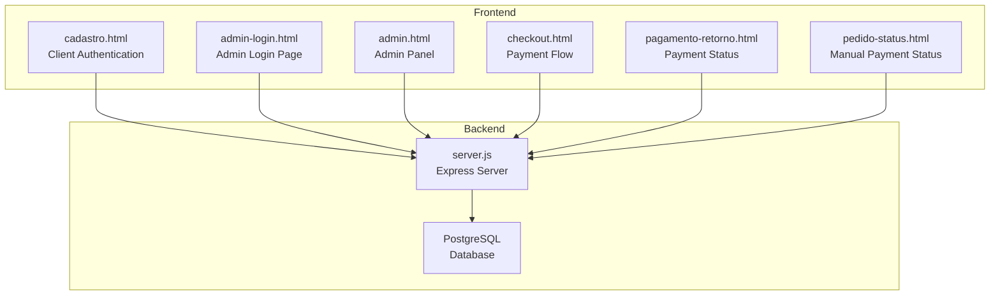
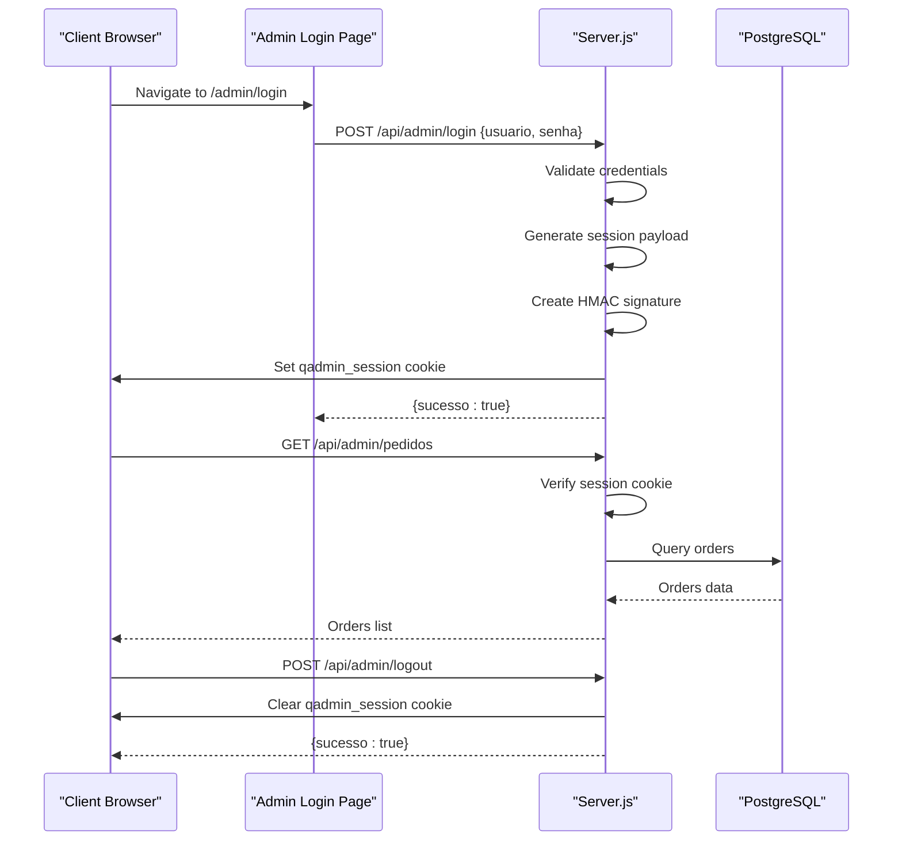
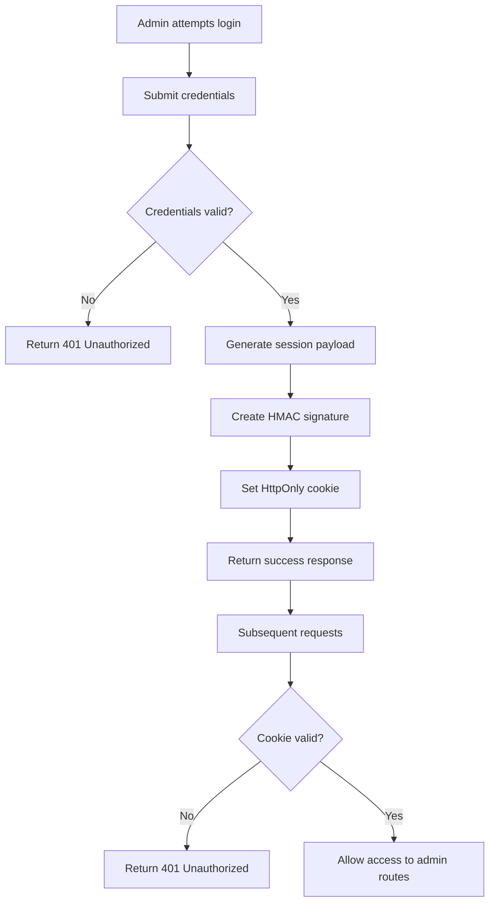
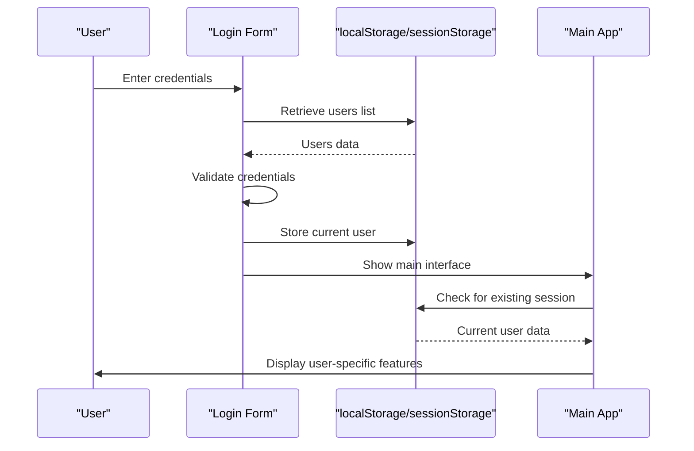
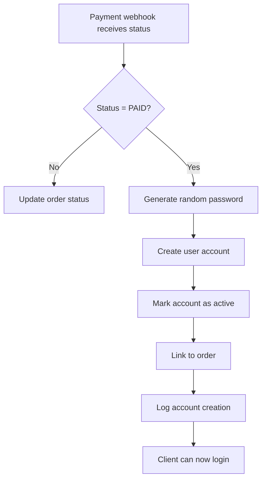
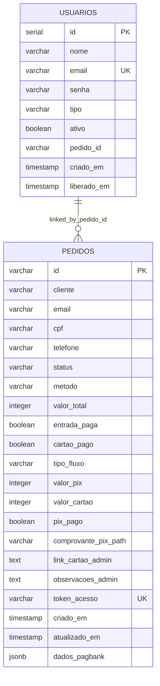
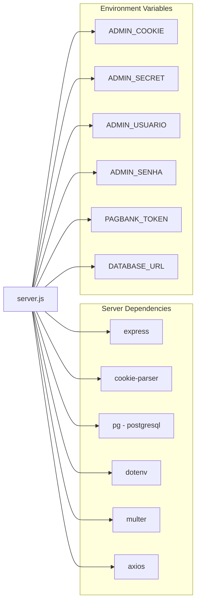

# Authentication System

<cite>
**Referenced Files in This Document**
- [server.js](file://server.js)
- [admin-login.html](file://admin-login.html)
- [admin.html](file://admin.html)
- [cadastro.html](file://cadastro.html)
- [checkout.html](file://checkout.html)
- [pedido-status.html](file://pedido-status.html)
- [database.sql](file://database.sql)
- [init-db.sql](file://init-db.sql)
- [package.json](file://package.json)
</cite>

## Table of Contents
1. [Introduction](#introduction)
2. [Project Structure](#project-structure)
3. [Core Components](#core-components)
4. [Architecture Overview](#architecture-overview)
5. [Detailed Component Analysis](#detailed-component-analysis)
6. [Dependency Analysis](#dependency-analysis)
7. [Performance Considerations](#performance-considerations)
8. [Troubleshooting Guide](#troubleshooting-guide)
9. [Conclusion](#conclusion)

## Introduction
This document provides comprehensive documentation for the authentication system, covering both client-side and server-side authentication flows. The system includes:
- Client-side user authentication for the labeling application (stored in browser localStorage/sessionStorage)
- Admin authentication for the backend management panel (cookie-based session)
- Temporary password generation for clients upon payment confirmation
- Session management with configurable cookie security settings

The authentication system integrates with payment processing workflows, automatically creating user accounts when payment status transitions to PAID.

## Project Structure
The authentication system spans both frontend and backend components:

**Diagram sources**
- [server.js:1-890](file://server.js#L1-L890)
- [cadastro.html:1-1277](file://cadastro.html#L1-L1277)
- [admin-login.html:1-81](file://admin-login.html#L1-L81)
- [admin.html:1-304](file://admin.html#L1-L304)
- [checkout.html:1-768](file://checkout.html#L1-L768)
- [pedido-status.html:1-341](file://pedido-status.html#L1-L341)

**Section sources**
- [server.js:1-890](file://server.js#L1-L890)
- [package.json:1-24](file://package.json#L1-L24)

## Core Components

### Client-Side Authentication (Labeling Application)
The client-side authentication operates entirely in the browser using localStorage and sessionStorage:
- User credentials stored in localStorage under the key `alimentares_users`
- Current user session stored in sessionStorage under the key `alimentares_currentUser`
- Passwords are stored as plain text in localStorage (adequate for local/controlled environments)
- Session persists until browser is closed

Key implementation points:
- User registration validates uniqueness against existing users
- Login compares provided credentials with stored users
- Session management uses sessionStorage for current user persistence

**Section sources**
- [cadastro.html:759-815](file://cadastro.html#L759-L815)
- [cadastro.html:850-911](file://cadastro.html#L850-L911)

### Admin Authentication (Backend Management)
The admin authentication system uses cookie-based sessions with cryptographic signing:
- Session cookie named `qadmin_session`
- HMAC-SHA256 signature using configurable secret key
- Session expiration after 12 hours
- HttpOnly, SameSite, and Secure cookie flags based on environment

Security features:
- Timing attack resistant signature verification
- Base64URL encoding for cookie payload
- Secret key configured via environment variable

**Section sources**
- [server.js:682-701](file://server.js#L682-L701)
- [server.js:712-730](file://server.js#L712-L730)
- [server.js:732-736](file://server.js#L732-L736)

### Temporary Password Generation
When payment status changes to PAID, the system automatically creates a user account with a temporary password:
- Random 6-character alphanumeric password generated
- User account created with type "cliente" and active status
- Account linked to the specific order
- Password stored in database (plain text)

**Section sources**
- [server.js:458-487](file://server.js#L458-L487)

### Session Management Configuration
The system supports configurable session security:
- Cookie name: `qadmin_session`
- Expiration: 12 hours
- Security flags: HttpOnly, SameSite=Lax
- Secure flag enabled in production environments
- Secret key for HMAC signature validation

**Section sources**
- [server.js:61-61](file://server.js#L61-L61)
- [server.js:723-728](file://server.js#L723-L728)

## Architecture Overview

**Diagram sources**
- [admin-login.html:52-77](file://admin-login.html#L52-L77)
- [server.js:712-730](file://server.js#L712-L730)
- [server.js:732-736](file://server.js#L732-L736)
- [admin.html:137-150](file://admin.html#L137-L150)

## Detailed Component Analysis

### Admin Authentication Flow

**Diagram sources**
- [server.js:712-730](file://server.js#L712-L730)
- [server.js:703-710](file://server.js#L703-L710)

### Client Authentication Flow

**Diagram sources**
- [cadastro.html:850-911](file://cadastro.html#L850-L911)
- [cadastro.html:823-835](file://cadastro.html#L823-L835)

### Payment-Based Account Creation

**Diagram sources**
- [server.js:285-345](file://server.js#L285-L345)
- [server.js:458-487](file://server.js#L458-L487)

### Database Schema for Authentication

**Diagram sources**
- [database.sql:13-58](file://database.sql#L13-L58)

**Section sources**
- [database.sql:1-92](file://database.sql#L1-L92)
- [init-db.sql:1-42](file://init-db.sql#L1-L42)

## Dependency Analysis

**Diagram sources**
- [server.js:1-10](file://server.js#L1-L10)
- [package.json:11-18](file://package.json#L11-L18)

**Section sources**
- [server.js:47-67](file://server.js#L47-L67)
- [package.json:1-24](file://package.json#L1-L24)

## Performance Considerations
- Client-side authentication uses localStorage operations which are synchronous and fast
- Admin session verification performs HMAC signature validation with timing-safe comparison
- Database queries for authentication use indexed columns (email, token)
- Session cookie size is minimal (base64URL encoded payload + signature)
- No password hashing is implemented, which reduces computational overhead but requires careful environment security

## Troubleshooting Guide

### Common Authentication Issues

**Invalid Credentials (Client-Side)**
- Verify user exists in localStorage
- Check that username and password match exactly
- Ensure no extra whitespace in form fields

**Session Timeout (Admin)**
- Sessions expire after 12 hours
- Re-login to obtain new session
- Check browser cookie settings allow third-party cookies if needed

**Payment Account Creation Failures**
- Verify webhook endpoint is reachable
- Check database connectivity
- Ensure order status transitions properly to PAID

**Cookie Security Issues**
- HttpOnly flag prevents JavaScript access
- Secure flag requires HTTPS in production
- SameSite=Lax prevents CSRF attacks

**Section sources**
- [server.js:703-710](file://server.js#L703-L710)
- [server.js:285-345](file://server.js#L285-L345)
- [server.js:458-487](file://server.js#L458-L487)

## Conclusion
The authentication system provides a robust dual-layer approach suitable for the application's use case:
- Client-side authentication for the labeling application with simple session management
- Admin authentication with secure cookie-based sessions and cryptographic signatures
- Automated account creation based on payment status changes
- Minimal dependencies and straightforward configuration

The system prioritizes simplicity and performance while maintaining adequate security for the described use case. The separation between client and admin authentication allows for independent scaling and security configurations.