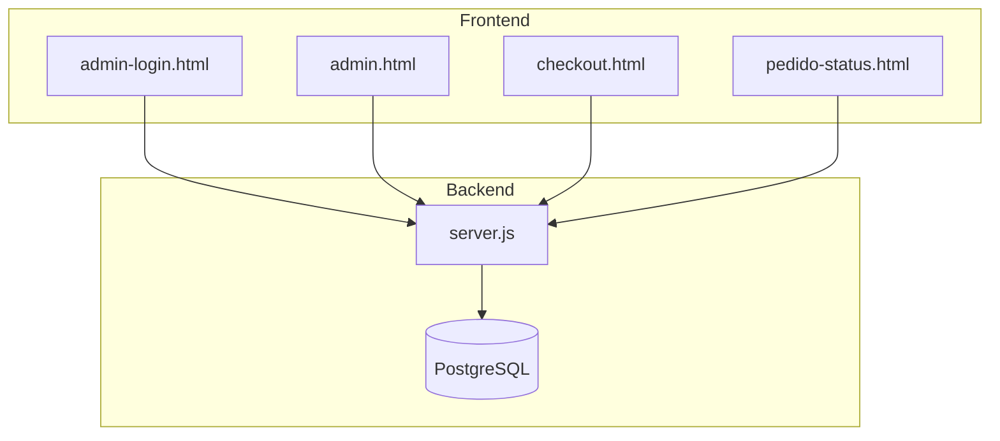
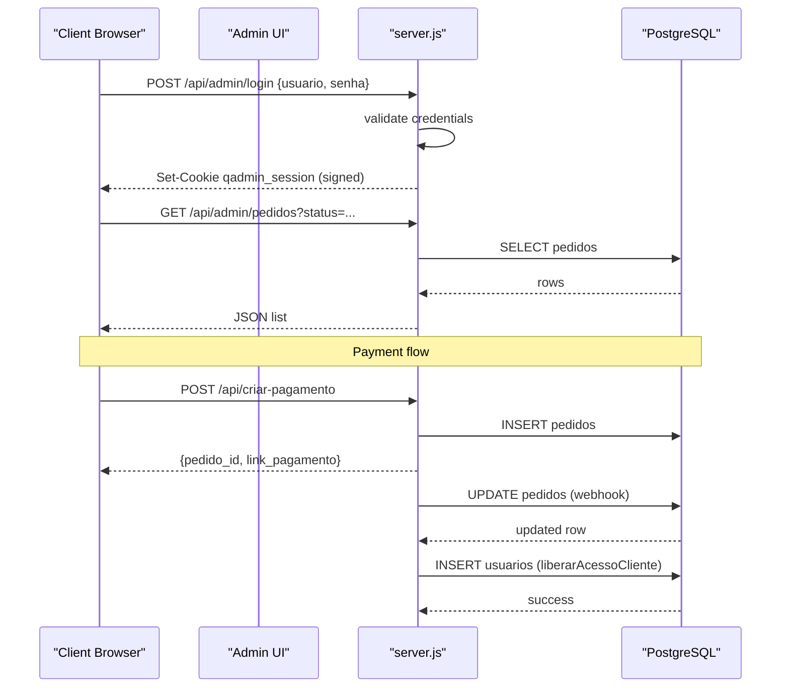
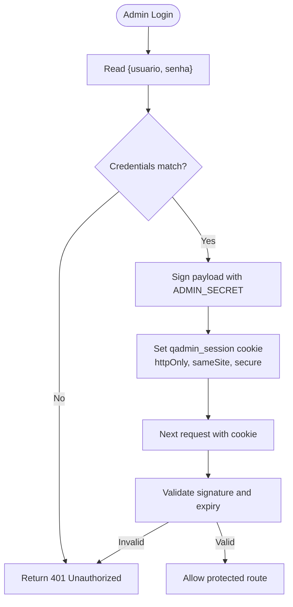
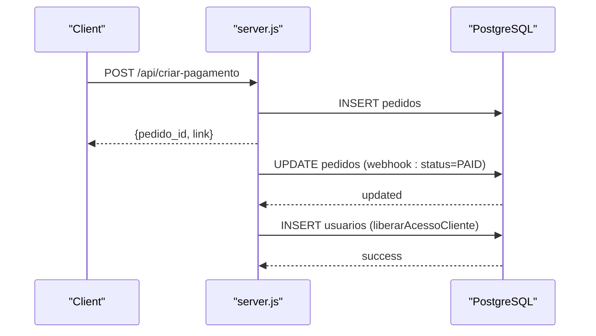
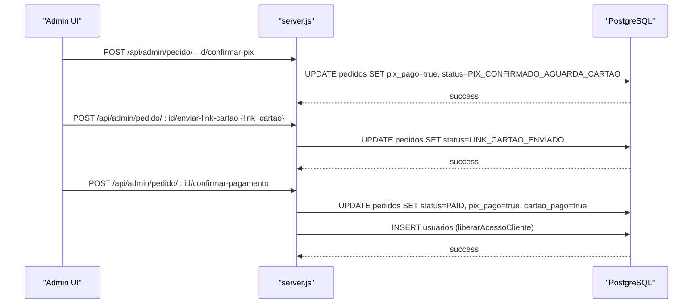
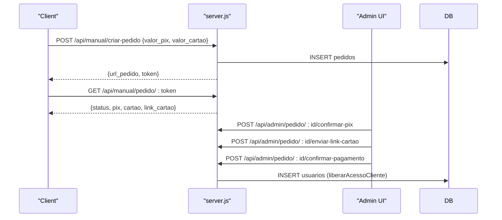
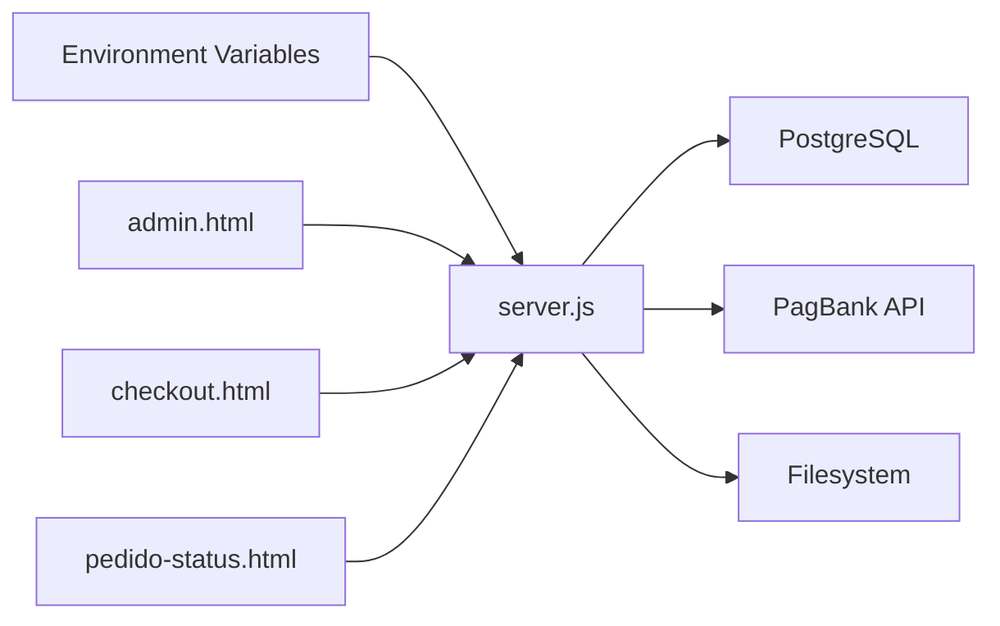

# Authorization and Roles

<cite>
**Referenced Files in This Document**
- [server.js](file://server.js)
- [admin.html](file://admin.html)
- [admin-login.html](file://admin-login.html)
- [checkout.html](file://checkout.html)
- [pedido-status.html](file://pedido-status.html)
- [README.md](file://README.md)
- [package.json](file://package.json)
- [dados/usuarios.json](file://dados/usuarios.json)
</cite>

## Table of Contents
1. [Introduction](#introduction)
2. [Project Structure](#project-structure)
3. [Core Components](#core-components)
4. [Architecture Overview](#architecture-overview)
5. [Detailed Component Analysis](#detailed-component-analysis)
6. [Dependency Analysis](#dependency-analysis)
7. [Performance Considerations](#performance-considerations)
8. [Troubleshooting Guide](#troubleshooting-guide)
9. [Conclusion](#conclusion)

## Introduction
This document explains the role-based access control (RBAC) system implemented in the qretiquetas.com application. It covers:
- Two user roles: cliente (client users with label generation access) and admin (administrative users with order management capabilities)
- Role assignment during user creation via the liberarAcessoCliente function and automatic promotion when payment status reaches PAID
- Admin authentication system including ADMIN_USUARIO, ADMIN_SENHA, and ADMIN_SECRET configurations
- Admin-only endpoints for order listing and administrative controls
- Role-based permission matrices
- Security considerations for admin access, session protection, and role validation

## Project Structure
The authorization system spans backend endpoints and frontend pages:
- Backend: Express server with admin middleware, session signing/validation, and order management endpoints
- Frontend: Admin login page, admin dashboard, checkout flow, and client order status page

**Diagram sources**
- [server.js:713-730](file://server.js#L713-L730)
- [admin-login.html:52-77](file://admin-login.html#L52-L77)
- [admin.html:137-150](file://admin.html#L137-L150)
- [checkout.html:626-718](file://checkout.html#L626-L718)
- [pedido-status.html:172-191](file://pedido-status.html#L172-L191)

**Section sources**
- [server.js:12-26](file://server.js#L12-L26)
- [package.json:11-19](file://package.json#L11-L19)

## Core Components
- Admin authentication and session management:
  - Credentials: ADMIN_USUARIO, ADMIN_SENHA, ADMIN_SECRET
  - Session cookie: qadmin_session with httpOnly, sameSite, and secure flags
  - Session validation middleware: requireAdmin
- Role assignment:
  - Automatic promotion to cliente role via liberarAcessoCliente when payment status becomes PAID
  - Manual user creation endpoint for admin-only use
- Admin-only endpoints:
  - GET /api/admin/pedidos (filtered by status)
  - POST /api/admin/pedido/:id/confirmar-pix
  - POST /api/admin/pedido/:id/enviar-link-cartao
  - POST /api/admin/pedido/:id/confirmar-pagamento
  - POST /api/admin/pedido/:id/cancelar
- Client-side flows:
  - Admin login redirects to admin dashboard
  - Client checkout creates orders and triggers role promotion
  - Client order status page displays payment progress

**Section sources**
- [server.js:57-61](file://server.js#L57-L61)
- [server.js:682-701](file://server.js#L682-L701)
- [server.js:703-710](file://server.js#L703-L710)
- [server.js:458-487](file://server.js#L458-L487)
- [server.js:738-778](file://server.js#L738-L778)
- [server.js:780-847](file://server.js#L780-L847)

## Architecture Overview
The RBAC architecture consists of:
- Admin session lifecycle: login validates credentials, sets signed session cookie, and subsequent requests are protected by requireAdmin
- Payment lifecycle: checkout creates orders; webhook updates statuses; automatic role promotion occurs when status becomes PAID
- Admin controls: dashboard lists orders, allows confirming PIX, sending card links, confirming full payment, and canceling orders

**Diagram sources**
- [server.js:713-730](file://server.js#L713-L730)
- [server.js:738-778](file://server.js#L738-L778)
- [server.js:82-280](file://server.js#L82-L280)
- [server.js:285-345](file://server.js#L285-L345)
- [server.js:458-487](file://server.js#L458-L487)

## Detailed Component Analysis

### Admin Authentication and Session Management
- Configuration:
  - ADMIN_USUARIO, ADMIN_SENHA, ADMIN_SECRET loaded from environment variables
  - Cookie name: qadmin_session
- Session signing and validation:
  - Signed JWT-like structure: base64url(JSON) + "." + HMAC-SHA256(base64url(JSON), ADMIN_SECRET)
  - Validation checks signature length, timing-safe comparison, and expiration
- Middleware:
  - requireAdmin extracts and validates session cookie; rejects unauthorized requests with 401

**Diagram sources**
- [server.js:57-61](file://server.js#L57-L61)
- [server.js:682-701](file://server.js#L682-L701)
- [server.js:703-710](file://server.js#L703-L710)

**Section sources**
- [server.js:57-61](file://server.js#L57-L61)
- [server.js:682-701](file://server.js#L682-L701)
- [server.js:703-710](file://server.js#L703-L710)

### Role Assignment and Promotion
- Automatic promotion:
  - When payment status becomes PAID, the webhook invokes liberarAcessoCliente
  - This inserts a new user record with tipo = 'cliente' and ativo = true
- Manual creation:
  - Admin-only endpoint GET /api/admin/pedidos returns order list for admin dashboard
  - The admin UI performs actions that update order statuses and trigger promotions

**Diagram sources**
- [server.js:82-280](file://server.js#L82-L280)
- [server.js:285-345](file://server.js#L285-L345)
- [server.js:458-487](file://server.js#L458-L487)

**Section sources**
- [server.js:285-345](file://server.js#L285-L345)
- [server.js:458-487](file://server.js#L458-L487)

### Admin-Only Endpoints and Controls
- GET /api/admin/pedidos: Lists orders with optional status filter
- POST /api/admin/pedido/:id/confirmar-pix: Confirms PIX received for manual orders
- POST /api/admin/pedido/:id/enviar-link-cartao: Sends card payment link to client
- POST /api/admin/pedido/:id/confirmar-pagamento: Marks order as PAID and promotes user
- POST /api/admin/pedido/:id/cancelar: Cancels an order

**Diagram sources**
- [server.js:780-847](file://server.js#L780-L847)
- [server.js:458-487](file://server.js#L458-L487)

**Section sources**
- [server.js:738-778](file://server.js#L738-L778)
- [server.js:780-847](file://server.js#L780-L847)

### Client Checkout and Order Status
- Checkout flow:
  - Collects customer info and payment method
  - Creates order via /api/criar-pagamento or /api/manual/criar-pedido
  - Redirects to PagBank or displays QR code
- Order status page:
  - Publicly accessible via /pedido/:token
  - Shows payment progress and manual order steps

**Diagram sources**
- [checkout.html:626-718](file://checkout.html#L626-L718)
- [server.js:540-617](file://server.js#L540-L617)
- [server.js:662-671](file://server.js#L662-L671)
- [server.js:780-847](file://server.js#L780-L847)
- [server.js:458-487](file://server.js#L458-L487)

**Section sources**
- [checkout.html:626-718](file://checkout.html#L626-L718)
- [pedido-status.html:172-191](file://pedido-status.html#L172-L191)

## Dependency Analysis
- Environment configuration:
  - ADMIN_USUARIO, ADMIN_SENHA, ADMIN_SECRET, ADMIN_COOKIE
  - Database connection via DATABASE_URL or individual DB_* variables
- External integrations:
  - PagBank API for payment creation and webhooks
  - Local filesystem for uploaded proof-of-payment images
- Internal dependencies:
  - requireAdmin middleware protects admin routes
  - liberarAcessoCliente inserts cliente users upon PAID status

**Diagram sources**
- [server.js:57-61](file://server.js#L57-L61)
- [server.js:64-67](file://server.js#L64-L67)
- [server.js:82-280](file://server.js#L82-L280)

**Section sources**
- [server.js:57-61](file://server.js#L57-L61)
- [server.js:64-67](file://server.js#L64-L67)

## Performance Considerations
- Session validation uses constant-time comparison to prevent timing attacks
- Admin endpoints limit result sets and use filtered queries
- Webhook processing updates orders asynchronously; avoid long-running operations in production deployments

## Troubleshooting Guide
- Admin login fails:
  - Verify ADMIN_USUARIO and ADMIN_SENHA match the configured values
  - Ensure cookies are accepted and secure flag is appropriate for deployment environment
- Unauthorized access errors (401):
  - Confirm qadmin_session cookie is present and unmodified
  - Check that the signature matches ADMIN_SECRET and expiration is valid
- Orders not promoting to cliente:
  - Confirm webhook receives PAID status and executes liberarAcessoCliente
  - Verify database insert succeeds and no exceptions occur
- Admin dashboard shows unauthorized:
  - The frontend checks 401 responses and redirects to login automatically

**Section sources**
- [server.js:713-730](file://server.js#L713-L730)
- [server.js:682-701](file://server.js#L682-L701)
- [server.js:285-345](file://server.js#L285-L345)
- [admin.html:137-150](file://admin.html#L137-L150)

## Conclusion
The qretiquetas.com RBAC system provides clear separation between cliente and admin roles:
- Admins manage orders and promote clients to cliente upon payment completion
- Clientes gain access automatically when payment status reaches PAID
- Admin authentication relies on a signed session with secure cookie attributes and middleware protection
- The system integrates with PagBank for payment processing and supports manual payment flows with admin oversight