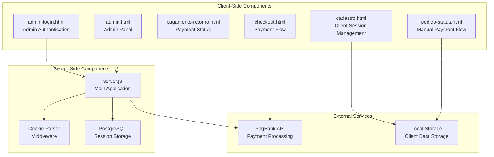
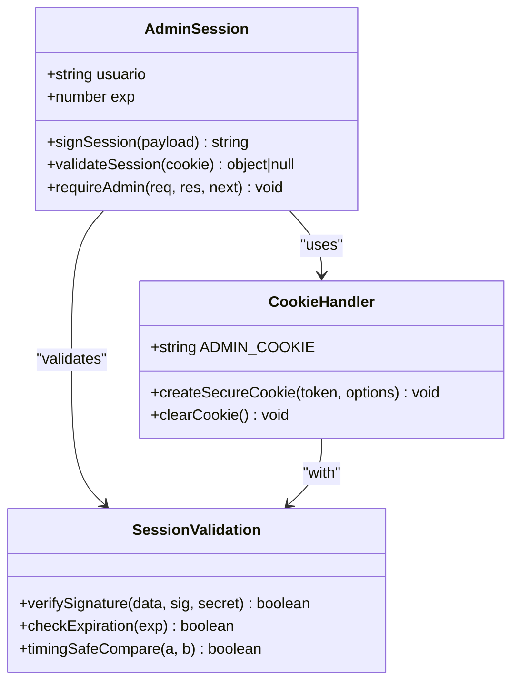
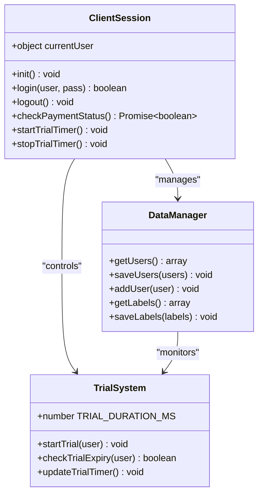
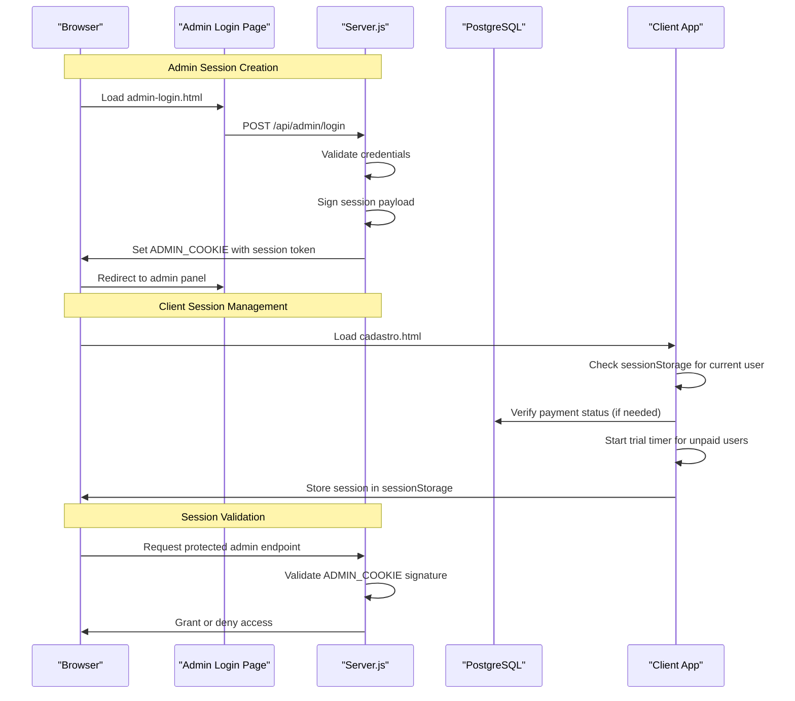
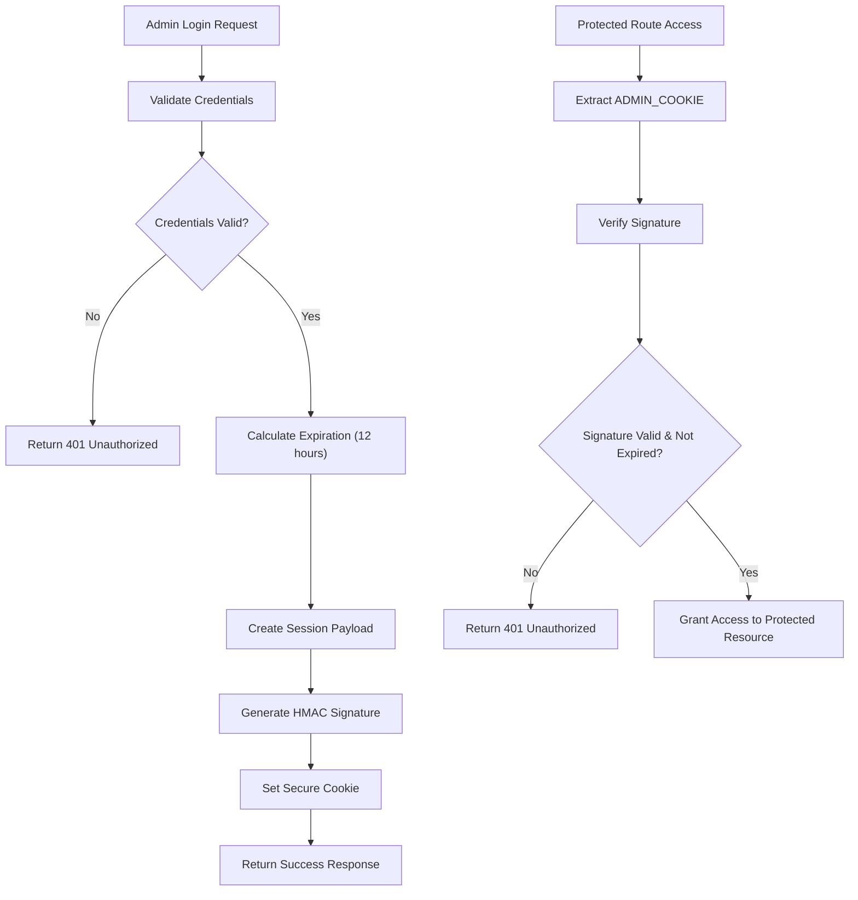
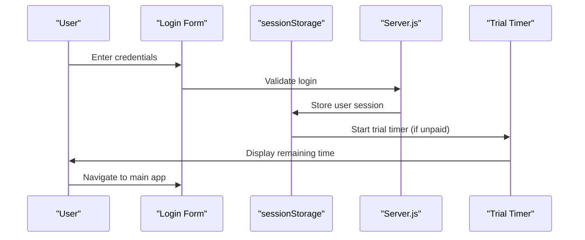
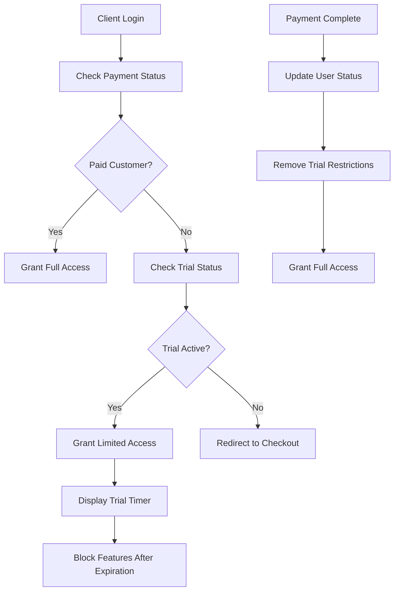
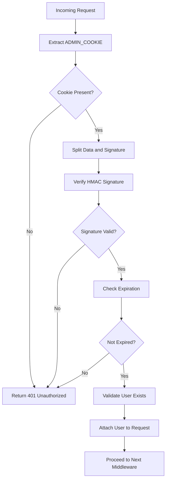

# Session Management

<cite>
**Referenced Files in This Document**
- [server.js](file://server.js)
- [package.json](file://package.json)
- [README.md](file://README.md)
- [admin-login.html](file://admin-login.html)
- [admin.html](file://admin.html)
- [cadastro.html](file://cadastro.html)
- [checkout.html](file://checkout.html)
- [pedido-status.html](file://pedido-status.html)
- [pagamento-retorno.html](file://pagamento-retorno.html)
</cite>

## Table of Contents
1. [Introduction](#introduction)
2. [Project Structure](#project-structure)
3. [Core Components](#core-components)
4. [Architecture Overview](#architecture-overview)
5. [Detailed Component Analysis](#detailed-component-analysis)
6. [Dependency Analysis](#dependency-analysis)
7. [Performance Considerations](#performance-considerations)
8. [Troubleshooting Guide](#troubleshooting-guide)
9. [Conclusion](#conclusion)

## Introduction

This document provides comprehensive coverage of the session management system in the qretiquetas.com application. The system implements a dual-session architecture with distinct handling for administrative users and client users, featuring cookie-based authentication for administrators and browser-based session management for clients.

The application operates as a hybrid system where administrative sessions are managed server-side using signed cookies, while client sessions leverage browser storage mechanisms. This design ensures both security for administrative access and seamless user experience for client interactions.

## Project Structure

The session management system spans across multiple components:



**Diagram sources**
- [server.js:12-27](file://server.js#L12-L27)
- [cadastro.html:875-893](file://cadastro.html#L875-L893)
- [admin-login.html:52-77](file://admin-login.html#L52-L77)

**Section sources**
- [server.js:12-27](file://server.js#L12-L27)
- [package.json:11-18](file://package.json#L11-L18)

## Core Components

### Admin Session Management

The administrative session system utilizes a custom-signed cookie approach with HMAC-based signature verification:



**Diagram sources**
- [server.js:706-760](file://server.js#L706-L760)

### Client Session Management

Client sessions utilize browser storage with trial-based access control:



**Diagram sources**
- [cadastro.html:804-869](file://cadastro.html#L804-L869)
- [cadastro.html:1037-1120](file://cadastro.html#L1037-L1120)

**Section sources**
- [server.js:706-760](file://server.js#L706-L760)
- [cadastro.html:875-1032](file://cadastro.html#L875-L1032)

## Architecture Overview

The session management architecture implements a layered approach with clear separation between administrative and client sessions:



**Diagram sources**
- [admin-login.html:52-77](file://admin-login.html#L52-L77)
- [server.js:737-760](file://server.js#L737-L760)
- [cadastro.html:908-944](file://cadastro.html#L908-L944)

## Detailed Component Analysis

### Admin Authentication Flow

The administrative authentication system implements a robust cookie-based session management:

#### Session Creation Process



**Diagram sources**
- [server.js:737-760](file://server.js#L737-L760)
- [server.js:706-734](file://server.js#L706-L734)

#### Security Implementation Details

The admin session system incorporates multiple security layers:

1. **HMAC-Based Signing**: Uses SHA-256 HMAC with a configurable secret key
2. **Timing Attack Prevention**: Implements constant-time comparison for signature verification
3. **Expiration Handling**: Automatic session expiration after 12 hours
4. **Secure Cookie Flags**: HttpOnly, SameSite, and Secure flags for production environments

**Section sources**
- [server.js:706-760](file://server.js#L706-L760)

### Client Session Lifecycle

Client session management operates entirely on the client side with server-side validation for payment status:

#### Session Establishment



**Diagram sources**
- [cadastro.html:908-950](file://cadastro.html#L908-L950)
- [cadastro.html:1058-1092](file://cadastro.html#L1058-L1092)

#### Payment Integration

The client session system integrates with the payment processing pipeline:



**Diagram sources**
- [cadastro.html:926-938](file://cadastro.html#L926-L938)
- [cadastro.html:1046-1056](file://cadastro.html#L1046-L1056)

**Section sources**
- [cadastro.html:908-1032](file://cadastro.html#L908-L1032)
- [cadastro.html:1037-1120](file://cadastro.html#L1037-L1120)

### Session Data Structures

#### Admin Session Payload

| Field | Type | Description | Example |
|-------|------|-------------|---------|
| `u` | string | Username | `"admin"` |
| `exp` | number | Unix timestamp (milliseconds) | `1700000000000` |

#### Client Session Object

| Property | Type | Description | Example |
|----------|------|-------------|---------|
| `id` | number | Unique user identifier | `12345` |
| `nome` | string | Full name | `"João Silva"` |
| `user` | string | Username | `"joaosilva"` |
| `pass` | string | Password hash | `"hashed_password"` |
| `tipo` | string | User type (`admin` or `cliente`) | `"cliente"` |
| `pago` | boolean | Payment status flag | `true` |
| `trialStart` | number | Trial start timestamp | `1700000000000` |

**Section sources**
- [server.js:745-746](file://server.js#L745-L746)
- [cadastro.html:875-876](file://cadastro.html#L875-L876)

### Session Validation and Cleanup

#### Admin Session Validation



**Diagram sources**
- [server.js:712-734](file://server.js#L712-L734)

#### Client Session Cleanup

Client sessions are automatically cleaned up through several mechanisms:

1. **Logout Process**: Removes user data from sessionStorage
2. **Trial Expiration**: Automatically logs out expired trial users
3. **Browser Close**: Natural cleanup when browser tab closes

**Section sources**
- [server.js:757-760](file://server.js#L757-L760)
- [cadastro.html:997-1005](file://cadastro.html#L997-L1005)

## Dependency Analysis

The session management system has minimal external dependencies:

```mermaid
graph LR
subgraph "Internal Dependencies"
A[server.js] --> B[cookie-parser]
A --> C[express]
A --> D[pg (PostgreSQL)]
end
subgraph "Client Dependencies"
E[cadastro.html] --> F[Local Storage API]
E --> G[sessionStorage API]
E --> H[Fetch API]
end
subgraph "External Dependencies"
I[PagBank API] --> J[Payment Processing]
K[QRious Library] --> L[QR Code Generation]
end
A --> I
E --> K
```

**Diagram sources**
- [package.json:11-18](file://package.json#L11-L18)
- [cadastro.html:7](file://cadastro.html#L7)

**Section sources**
- [package.json:11-18](file://package.json#L11-L18)

## Performance Considerations

### Session Storage Optimization

1. **Client-Side Storage**: Uses sessionStorage for immediate access without server round-trips
2. **Cookie Size**: Admin session cookies are minimal (only base64url encoded payload + signature)
3. **Database Queries**: Payment status checks are cached and validated server-side

### Memory Management

- Admin sessions are stored in memory (cookie-based)
- Client sessions use browser storage with automatic cleanup
- Trial timers are properly disposed when users logout or expire

## Troubleshooting Guide

### Common Session Issues

#### Admin Session Problems

**Issue**: Admin login fails with 401 error
- **Cause**: Incorrect credentials or expired session
- **Solution**: Verify admin credentials match configured values

**Issue**: Admin session expires unexpectedly
- **Cause**: Session timeout after 12 hours
- **Solution**: Re-authenticate with admin account

#### Client Session Problems

**Issue**: Client cannot access paid features
- **Cause**: Trial period expired or payment not processed
- **Solution**: Complete payment process or wait for payment verification

**Issue**: Session not persisting between browser restarts
- **Cause**: Using sessionStorage instead of localStorage
- **Solution**: Check browser storage permissions

**Section sources**
- [server.js:727-734](file://server.js#L727-L734)
- [cadastro.html:926-938](file://cadastro.html#L926-L938)

## Conclusion

The qretiquetas.com session management system provides a robust, layered approach to user authentication and authorization. The dual-session architecture effectively balances security requirements for administrative access with user-friendly client session management.

Key strengths of the implementation include:

- **Security**: HMAC-based admin session signing with timing attack prevention
- **Scalability**: Client-side session management reduces server overhead
- **User Experience**: Seamless trial system with clear expiration handling
- **Integration**: Tight coupling between payment processing and session activation

The system successfully handles the complex requirements of a hybrid payment and access control system while maintaining security and performance standards appropriate for the application's use case.