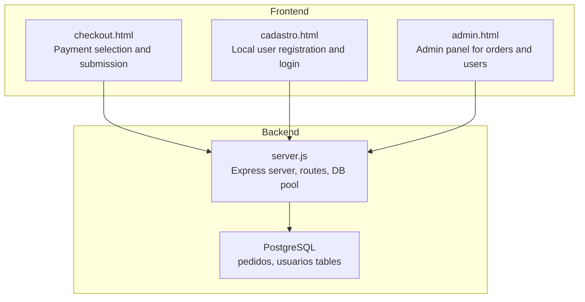
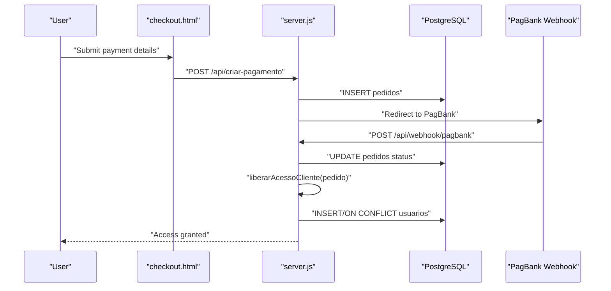
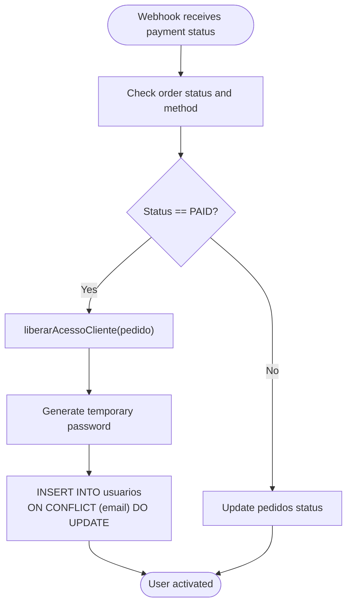
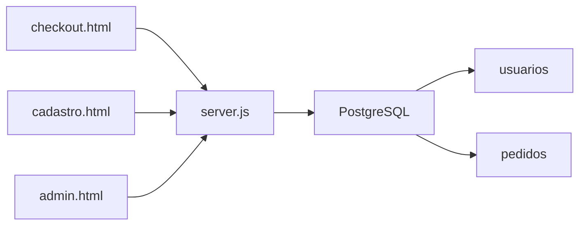

# User Data Management

<cite>
**Referenced Files in This Document**
- [server.js](file://server.js)
- [init-db.sql](file://init-db.sql)
- [database.sql](file://database.sql)
- [checkout.html](file://checkout.html)
- [cadastro.html](file://cadastro.html)
- [admin.html](file://admin.html)
- [README.md](file://README.md)
</cite>

## Table of Contents
1. [Introduction](#introduction)
2. [Project Structure](#project-structure)
3. [Core Components](#core-components)
4. [Architecture Overview](#architecture-overview)
5. [Detailed Component Analysis](#detailed-component-analysis)
6. [Dependency Analysis](#dependency-analysis)
7. [Performance Considerations](#performance-considerations)
8. [Troubleshooting Guide](#troubleshooting-guide)
9. [Conclusion](#conclusion)

## Introduction
This document describes the user data management system for the qretiquetas.com project, focusing on the user account lifecycle and data persistence. It explains how user accounts are automatically created upon successful payment completion, how user data is stored and validated, and how the system prevents duplicate users. It also documents the integration with PostgreSQL for persistent storage, user search and retrieval capabilities, and the administrative controls for managing users.

## Project Structure
The project is a hybrid system:
- Frontend pages handle user registration, login, and label generation locally using browser storage.
- Backend server integrates with PostgreSQL for persistent user data and payment processing.
- Payment flows trigger automatic user creation and activation.

**Diagram sources**
- [checkout.html](file://checkout.html)
- [cadastro.html](file://cadastro.html)
- [admin.html](file://admin.html)
- [server.js](file://server.js)
- [database.sql](file://database.sql)

**Section sources**
- [README.md](file://README.md)
- [server.js](file://server.js)
- [database.sql](file://database.sql)

## Core Components
- PostgreSQL database with two primary tables:
  - usuarios: stores user credentials and access status.
  - pedidos: stores payment orders and links to user access.
- Express server with:
  - Payment creation and webhook endpoints.
  - Automatic user creation and activation via the liberarAcessoCliente function.
  - Duplicate prevention using email-based conflict resolution.
- Frontend pages:
  - checkout.html: initiates payment and redirects to PagBank.
  - cadastro.html: local user registration and login (browser storage).
  - admin.html: admin panel for order management and user creation.

Key user data fields:
- usuarios: id, nome, email, senha, tipo, ativo, pedido_id, criado_em, liberado_em.
- pedidos: id, cliente, email, cpf, telefone, status, metodo, valor_total, entrada_paga, cartao_pago, criado_em, atualizado_em, dados_pagbank, tipo_fluxo, valor_pix, valor_cartao, pix_pago, comprovante_pix_path, link_cartao_admin, observacoes_admin, token_acesso.

**Section sources**
- [database.sql](file://database.sql)
- [init-db.sql](file://init-db.sql)
- [server.js](file://server.js)

## Architecture Overview
The user lifecycle spans payment completion to automatic user creation and activation:

**Diagram sources**
- [checkout.html](file://checkout.html)
- [server.js](file://server.js)
- [database.sql](file://database.sql)

## Detailed Component Analysis

### Automatic User Creation on Payment Completion
When a payment is confirmed by the PagBank webhook, the backend updates the order status and triggers automatic user creation and activation:
- The liberarAcessoCliente function generates a temporary password and inserts/updates a user record in the usuarios table.
- The ON CONFLICT clause ensures duplicate users are prevented by email, updating existing records instead of creating duplicates.
- The user’s ativo flag is set to true and liberado_em is recorded.

**Diagram sources**
- [server.js](file://server.js)
- [database.sql](file://database.sql)

**Section sources**
- [server.js](file://server.js)
- [database.sql](file://database.sql)

### User Data Fields and Validation
- usuarios table fields:
  - id: serial primary key.
  - nome: non-null varchar.
  - email: unique non-null varchar.
  - senha: non-null varchar (temporary password generated during creation).
  - tipo: role (default 'cliente').
  - ativo: boolean (activation status).
  - pedido_id: foreign key to pedidos.id.
  - criado_em: timestamp.
  - liberado_em: timestamp when access was granted.

Validation and constraints:
- Unique constraint on email prevents duplicate users.
- Default values ensure consistent initialization.
- pedidos table includes complementary fields for payment tracking and manual flow support.

**Section sources**
- [database.sql](file://database.sql)
- [init-db.sql](file://init-db.sql)

### User Account Update Mechanisms
- Duplicate prevention:
  - ON CONFLICT (email) DO UPDATE in liberarAcessoCliente ensures that if a user with the same email already exists, their ativo and liberado_em fields are refreshed while preserving other attributes.
- Order-to-user linkage:
  - The pedido_id field in usuarios connects a user to their payment order, enabling auditability and linking access to purchase events.

**Section sources**
- [server.js](file://server.js)
- [database.sql](file://database.sql)

### Payment Integration and Access Control
- Payment creation:
  - checkout.html submits customer details to /api/criar-pagamento, which creates a PedBank order and persists a pedidos record.
- Webhook handling:
  - /api/webhook/pagbank updates pedidos status and triggers liberarAcessoCliente when appropriate.
- Manual flow:
  - Admin can confirm PIX receipt and send a card payment link, then confirm total payment to activate users.

**Section sources**
- [checkout.html](file://checkout.html)
- [server.js](file://server.js)
- [admin.html](file://admin.html)

### Frontend User Registration and Login (Local Storage)
- cadastro.html manages users locally using browser storage:
  - Users can register with nome, email, user, and pass.
  - Login validates credentials against stored users.
  - Trial timer enforces a 7-minute free trial for unpaid users.
  - Online payment verification endpoint (/api/cliente/check-pago) allows immediate activation if a paid order exists.

Note: This frontend registration does not integrate with the backend usuarios table; it is separate from the automatic user creation triggered by payments.

**Section sources**
- [cadastro.html](file://cadastro.html)
- [server.js](file://server.js)

### Administrative Controls
- Admin panel (admin.html):
  - Lists orders and supports actions like confirming PIX, sending card links, and confirming total payment.
  - These actions ultimately lead to user activation via the backend’s liberarAcessoCliente mechanism.

**Section sources**
- [admin.html](file://admin.html)
- [server.js](file://server.js)

## Dependency Analysis
- server.js depends on:
  - pg.Pool for PostgreSQL connectivity.
  - Environment variables for database connection and payment provider configuration.
- Database schema defines:
  - usuarios and pedidos tables with appropriate constraints and indexes.
- Frontend pages depend on:
  - server.js endpoints for payment initiation, status checks, and admin actions.

**Diagram sources**
- [server.js](file://server.js)
- [database.sql](file://database.sql)

**Section sources**
- [server.js](file://server.js)
- [database.sql](file://database.sql)

## Performance Considerations
- Database indexing:
  - Indexes on pedidos (email, status, token_acesso) and usuarios (email, tipo, ativo) improve query performance for order and user lookups.
- Conflict resolution:
  - ON CONFLICT avoids extra SELECT/INSERT cycles, reducing contention and improving throughput for concurrent payments.
- Connection pooling:
  - pg.Pool manages connections efficiently, minimizing overhead.

[No sources needed since this section provides general guidance]

## Troubleshooting Guide
Common issues and resolutions:
- Payment webhook not activating user:
  - Verify webhook URL and endpoint reachability.
  - Check order status transitions and ensure status equals PAID.
  - Confirm liberarAcessoCliente is invoked and database writes succeed.
- Duplicate user creation attempts:
  - The ON CONFLICT (email) DO UPDATE prevents duplicates; ensure emails are normalized (lowercase) before insertion.
- Email-based conflict resolution:
  - If a user registers via cadastro.html with an email already linked to a paid order, the online check endpoint (/api/cliente/check-pago) should reflect paid status and allow immediate access.
- Admin actions failing:
  - Ensure admin authentication cookies are present and valid.
  - Confirm order status allows the requested action (e.g., confirm total payment only after link sent).

**Section sources**
- [server.js](file://server.js)
- [admin.html](file://admin.html)
- [checkout.html](file://checkout.html)

## Conclusion
The qretiquetas.com user data management system integrates frontend and backend components to provide a seamless user experience. Payments trigger automatic user creation and activation, with robust duplicate prevention and order-to-user linkage. PostgreSQL serves as the central persistence layer, while the admin panel enables oversight and intervention. The system balances simplicity with reliability, ensuring users gain access promptly upon payment confirmation.