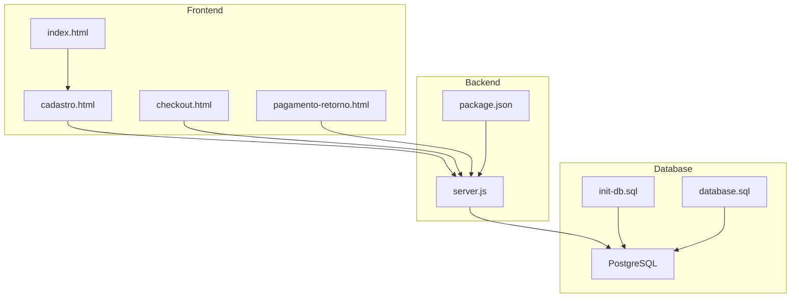
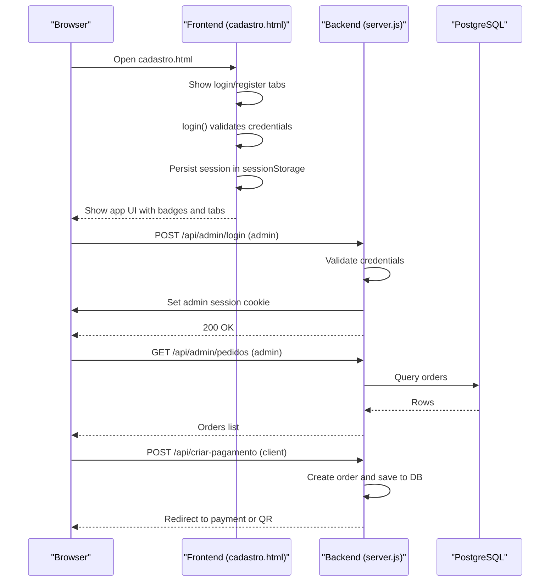
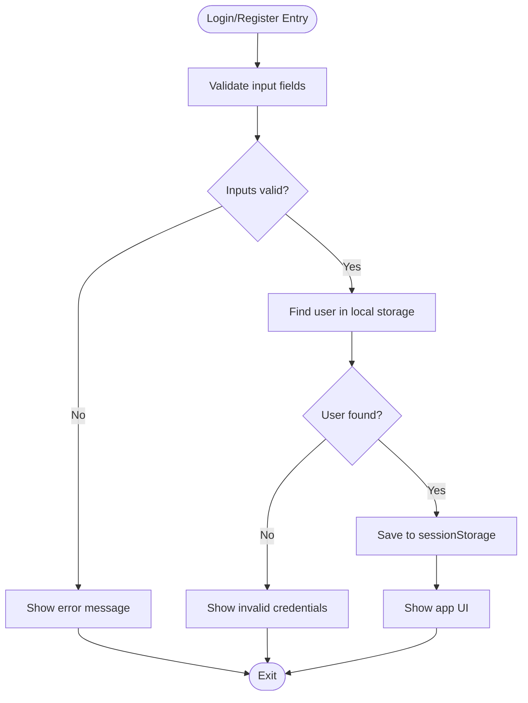
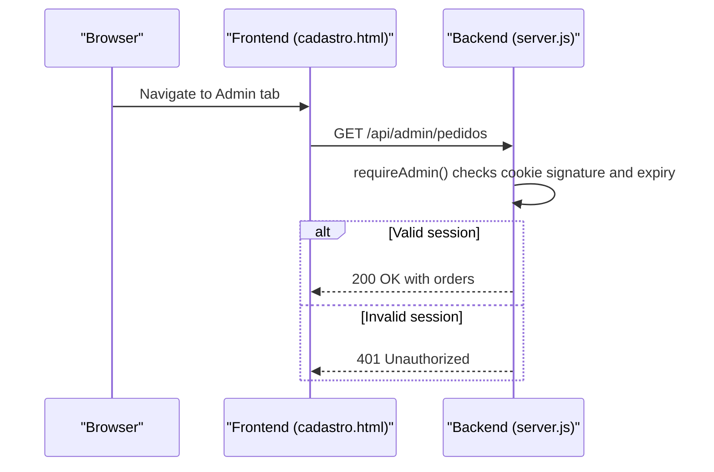
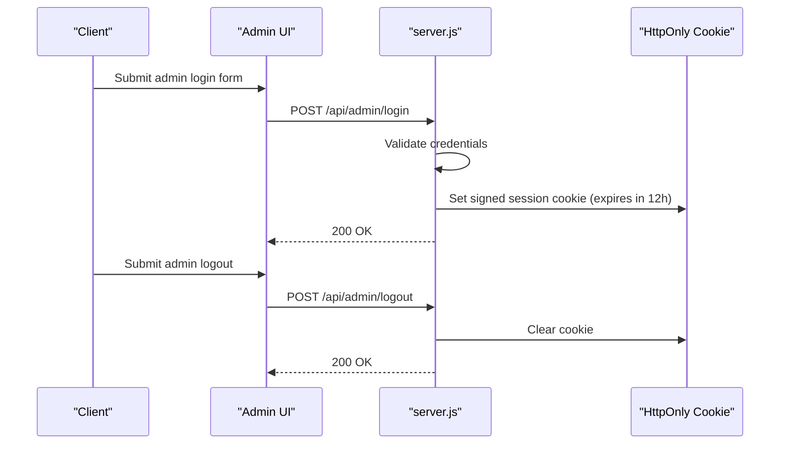
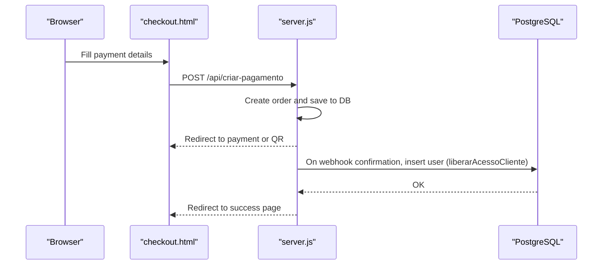
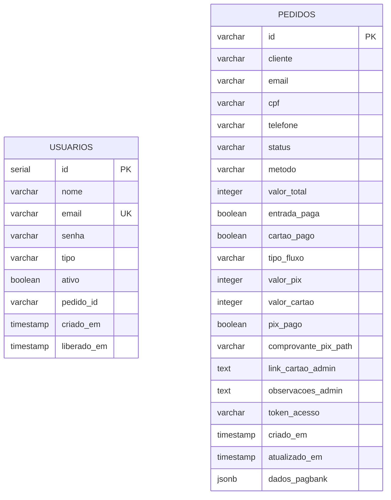
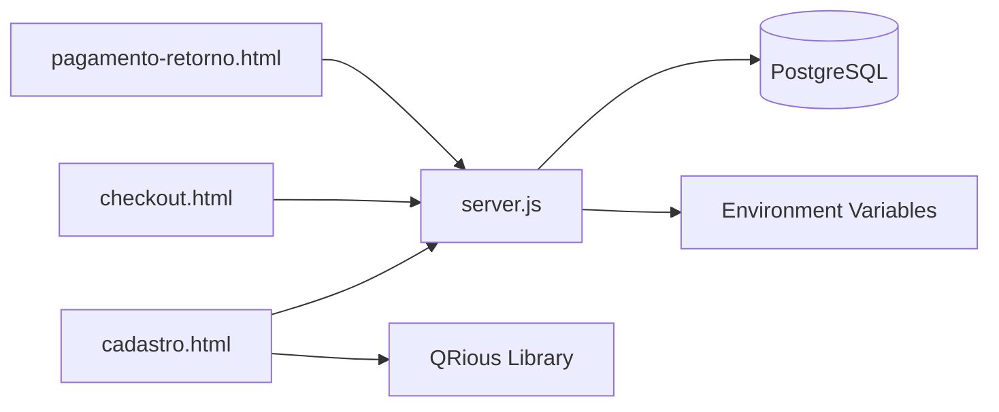

# User Management

<cite>
**Referenced Files in This Document**
- [server.js](file://server.js)
- [package.json](file://package.json)
- [README.md](file://README.md)
- [index.html](file://index.html)
- [cadastro.html](file://cadastro.html)
- [checkout.html](file://checkout.html)
- [pagamento-retorno.html](file://pagamento-retorno.html)
- [init-db.sql](file://init-db.sql)
- [database.sql](file://database.sql)
</cite>

## Table of Contents
1. [Introduction](#introduction)
2. [Project Structure](#project-structure)
3. [Core Components](#core-components)
4. [Architecture Overview](#architecture-overview)
5. [Detailed Component Analysis](#detailed-component-analysis)
6. [Dependency Analysis](#dependency-analysis)
7. [Performance Considerations](#performance-considerations)
8. [Troubleshooting Guide](#troubleshooting-guide)
9. [Conclusion](#conclusion)
10. [Appendices](#appendices)

## Introduction
This document describes the user management system for the “Alimentares” QR label generation platform. It covers authentication, authorization, session handling, role-based access control (RBAC), user registration, duplicate user validation, password handling, UI badges and administrative controls, security considerations, and integration between frontend and backend.

The system distinguishes two user roles:
- Client: Can generate labels and view history.
- Administrator: Full access including user creation/deletion and configuration.

## Project Structure
The project is a hybrid frontend-first application with a Node.js/Express backend that integrates with external payment services and a PostgreSQL database.

**Diagram sources**
- [server.js:1-890](file://server.js#L1-L890)
- [package.json:1-24](file://package.json#L1-L24)
- [index.html:1-284](file://index.html#L1-L284)
- [cadastro.html:1-1277](file://cadastro.html#L1-L1277)
- [checkout.html:1-667](file://checkout.html#L1-L667)
- [pagamento-retorno.html:1-156](file://pagamento-retorno.html#L1-L156)
- [init-db.sql:1-42](file://init-db.sql#L1-L42)
- [database.sql:1-92](file://database.sql#L1-L92)

**Section sources**
- [server.js:1-890](file://server.js#L1-L890)
- [package.json:1-24](file://package.json#L1-L24)
- [index.html:1-284](file://index.html#L1-L284)
- [cadastro.html:1-1277](file://cadastro.html#L1-L1277)
- [checkout.html:1-667](file://checkout.html#L1-L667)
- [pagamento-retorno.html:1-156](file://pagamento-retorno.html#L1-L156)
- [init-db.sql:1-42](file://init-db.sql#L1-L42)
- [database.sql:1-92](file://database.sql#L1-L92)

## Core Components
- Frontend authentication and UI:
  - Login and registration forms in the client-side application.
  - Session persistence using browser storage.
  - Role-based UI elements and navigation tabs.
- Backend authentication and authorization:
  - Admin login/logout with signed session cookies.
  - Admin-only endpoints protected by middleware.
  - User management for internal labeling system stored in local storage.
- Payment-driven user activation:
  - Payment flows create client users upon successful payment.
  - Access is granted via backend-triggered user creation.

Key implementation references:
- Authentication and session handling in frontend: [cadastro.html:850-911](file://cadastro.html#L850-L911)
- Admin login/logout and session middleware: [server.js:713-736](file://server.js#L713-L736), [server.js:703-710](file://server.js#L703-L710)
- Admin-only endpoint: [server.js:739-778](file://server.js#L739-L778)
- Payment-triggered user creation: [server.js:458-487](file://server.js#L458-L487)
- Database schema for users and orders: [database.sql:48-58](file://database.sql#L48-L58), [database.sql:13-36](file://database.sql#L13-L36)

**Section sources**
- [cadastro.html:850-911](file://cadastro.html#L850-L911)
- [server.js:703-736](file://server.js#L703-L736)
- [server.js:739-778](file://server.js#L739-L778)
- [server.js:458-487](file://server.js#L458-L487)
- [database.sql:48-58](file://database.sql#L48-L58)
- [database.sql:13-36](file://database.sql#L13-L36)

## Architecture Overview
The system separates concerns between frontend and backend:
- Frontend handles user registration, login, session persistence, and label generation.
- Backend manages admin authentication, admin-only operations, and payment-integrated user activation.

**Diagram sources**
- [cadastro.html:850-911](file://cadastro.html#L850-L911)
- [server.js:713-736](file://server.js#L713-L736)
- [server.js:739-778](file://server.js#L739-L778)
- [server.js:82-280](file://server.js#L82-L280)

## Detailed Component Analysis

### Authentication and Session Handling (Frontend)
- Login:
  - Validates presence of username and password.
  - Searches local users list for exact match.
  - Stores current user in sessionStorage and switches UI to app mode.
- Registration:
  - Validates presence of name, username, and password.
  - Checks for duplicate usernames in local users list.
  - Adds new client user with default type “cliente”.
- Logout:
  - Clears current user from sessionStorage and returns to login screen.

**Diagram sources**
- [cadastro.html:850-911](file://cadastro.html#L850-L911)

**Section sources**
- [cadastro.html:850-911](file://cadastro.html#L850-L911)

### Authorization and Role-Based Access Control (RBAC)
- Roles:
  - admin: Full access, including admin-only endpoints and user management UI.
  - cliente: Limited access to label generation and history.
- UI badges and navigation:
  - Header displays current user’s role badge.
  - Admin-only tabs are shown only to admin users.
- Admin-only endpoints:
  - Protected by middleware that validates admin session cookie.
  - Example: GET /api/admin/pedidos.

**Diagram sources**
- [server.js:703-710](file://server.js#L703-L710)
- [server.js:739-778](file://server.js#L739-L778)
- [cadastro.html:913-935](file://cadastro.html#L913-L935)

**Section sources**
- [server.js:703-710](file://server.js#L703-L710)
- [server.js:739-778](file://server.js#L739-L778)
- [cadastro.html:913-935](file://cadastro.html#L913-L935)

### Admin Authentication Flow (Backend)
- Login:
  - Validates username and password against configured admin credentials.
  - Creates signed session token with expiration and sets HttpOnly cookie.
- Logout:
  - Clears admin session cookie.

**Diagram sources**
- [server.js:713-736](file://server.js#L713-L736)

**Section sources**
- [server.js:713-736](file://server.js#L713-L736)

### Payment-Driven User Activation and Registration
- Client registration:
  - Clients can self-register in the client app; passwords are stored locally.
- Payment-triggered activation:
  - After successful payment, backend creates a client user record in the database.
  - Access is granted automatically upon payment confirmation.

**Diagram sources**
- [checkout.html:554-617](file://checkout.html#L554-L617)
- [server.js:82-280](file://server.js#L82-L280)
- [server.js:458-487](file://server.js#L458-L487)

**Section sources**
- [checkout.html:554-617](file://checkout.html#L554-L617)
- [server.js:82-280](file://server.js#L82-L280)
- [server.js:458-487](file://server.js#L458-L487)

### Duplicate User Validation
- During registration, the frontend checks for existing usernames in local storage.
- Prevents duplicate usernames before adding a new user.

**Section sources**
- [cadastro.html:872-902](file://cadastro.html#L872-L902)

### Password Handling
- Client app:
  - Passwords are stored in plaintext in local storage.
  - No hashing or encryption is performed in the client app.
- Admin app:
  - Admin credentials are validated against configured constants.
  - Sessions are managed via signed cookies with expiration.

Security note: Storing client passwords in plaintext is acceptable for local/offline environments but is not recommended for production. Consider migrating to server-side hashed passwords and secure session management.

**Section sources**
- [README.md:117-122](file://README.md#L117-L122)
- [server.js:713-736](file://server.js#L713-L736)

### User Interface Elements: Badges and Administrative Controls
- Header badge:
  - Displays “Administrador” or “Cliente” based on current user type.
- Admin-only tabs:
  - Visible only to administrators.
- Admin controls:
  - Create/delete users.
  - Configure QR code position.

**Section sources**
- [cadastro.html:913-935](file://cadastro.html#L913-L935)
- [cadastro.html:1084-1115](file://cadastro.html#L1084-L1115)
- [cadastro.html:1147-1155](file://cadastro.html#L1147-L1155)

### Database Schema and Data Model
- Users table:
  - Columns include id, nome, email, senha, tipo, ativo, pedido_id, timestamps.
- Orders table:
  - Columns include id, cliente, email, cpf, telefone, status, metodo, valor_total, flags for partial payments, timestamps, and JSONB for payment data.

**Diagram sources**
- [database.sql:48-58](file://database.sql#L48-L58)
- [database.sql:13-36](file://database.sql#L13-L36)

**Section sources**
- [database.sql:48-58](file://database.sql#L48-L58)
- [database.sql:13-36](file://database.sql#L13-L36)
- [init-db.sql:20-30](file://init-db.sql#L20-L30)
- [init-db.sql:4-18](file://init-db.sql#L4-L18)

## Dependency Analysis
- Frontend depends on:
  - Local storage for user data and session.
  - Backend for admin authentication and payment flows.
- Backend depends on:
  - PostgreSQL for persistent data.
  - Environment variables for admin credentials and external services.
- External integrations:
  - Payment service via PagBank (integration handled by backend).
  - QR code generation via CDN library in frontend.

**Diagram sources**
- [cadastro.html:1-1277](file://cadastro.html#L1-L1277)
- [checkout.html:1-667](file://checkout.html#L1-L667)
- [pagamento-retorno.html:1-156](file://pagamento-retorno.html#L1-L156)
- [server.js:1-890](file://server.js#L1-890)
- [database.sql:1-92](file://database.sql#L1-L92)

**Section sources**
- [server.js:1-890](file://server.js#L1-L890)
- [package.json:11-18](file://package.json#L11-L18)

## Performance Considerations
- Client-side:
  - All user data and sessions are stored in browser storage; no server round-trips for basic operations.
  - QR generation occurs in the browser; consider throttling heavy label generation.
- Backend:
  - PostgreSQL queries are straightforward; ensure proper indexing on frequently filtered columns (email, status).
  - Admin endpoints limit result sets to prevent large payloads.

[No sources needed since this section provides general guidance]

## Troubleshooting Guide
- Admin login fails:
  - Verify admin credentials match configured values.
  - Ensure cookies are enabled and not blocked by browser policies.
- Admin endpoint returns unauthorized:
  - Confirm admin session cookie is present and not expired.
  - Check server logs for validation errors.
- Client registration rejected:
  - Ensure username is unique in local storage.
  - Verify all required fields are filled.
- Payment not activating client:
  - Confirm webhook was received and processed.
  - Check order status transitions and user insertion logic.

**Section sources**
- [server.js:713-736](file://server.js#L713-L736)
- [server.js:703-710](file://server.js#L703-L710)
- [cadastro.html:872-902](file://cadastro.html#L872-L902)
- [server.js:285-345](file://server.js#L285-L345)

## Conclusion
The system provides a clear separation between client-side user management and backend admin controls. RBAC is enforced via UI and middleware, while payment flows drive client activation. Security considerations highlight the need to migrate client-side password storage to server-side hashing and improve session security.

[No sources needed since this section summarizes without analyzing specific files]

## Appendices

### Security Best Practices
- Client app:
  - Migrate client passwords to server-side hashed storage.
  - Use HTTPS and secure cookies for admin sessions.
  - Add CSRF protection and rate limiting for login attempts.
- Admin app:
  - Rotate admin secrets regularly.
  - Enforce strict cookie policies (Secure, SameSite, HttpOnly).
  - Monitor admin endpoints and audit logs.

**Section sources**
- [README.md:117-122](file://README.md#L117-L122)
- [server.js:713-736](file://server.js#L713-L736)